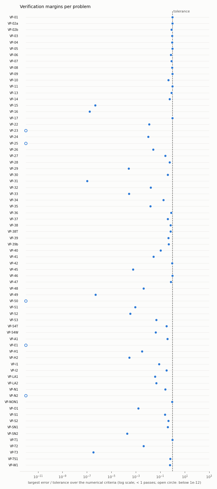

# SASSI-EDU Verification Manual

> Generated by `python -m sassi.verify.report --figures` on 2026-10-07 17:23 UTC. This file is produced by `sassi/verify/report.py` from the verification problems registered in `sassi.verify`; do not edit it by hand, run the generator again.

SASSI-EDU is an educational re-implementation of the SASSI flexible-volume method with the module and command nomenclature of the ACS SASSI V3 manual. It is not affiliated with, endorsed by, or a substitute for ACS SASSI, and it is not qualified for licensing or design work. This manual is the equivalent of the vendor's verification and validation (V&V) manual: it shows, problem by problem, what the program computes and how close that is to an independent reference.

## Contents

1. [How the verification works](#1-how-the-verification-works)
2. [Summary](#2-summary)
3. [Module coverage matrix](#3-module-coverage-matrix)
4. [Lead decisions and superseded references](#4-lead-decisions-and-superseded-references)
5. [Verification problems](#5-verification-problems)
6. [Reference sources](#6-reference-sources)
7. [Environment and run log](#7-environment-and-run-log)

## 1. How the verification works

Each **verification problem (VP)** is a Python function in `sassi/verify/problems/` registered with `@problem`. It builds a model (through the command language, the module decks or the element library), runs the modules it verifies and compares computed quantities with reference values. The reference values and tolerances come from [R2 benchmarks](../spec/R2_benchmarks.md) (published **P**, exact **E**, approximate **A** or derived **D** solutions), from the theory checks of [R1](../spec/R1_sassi_theory.md) section 9, and from the verification plan of [requirements section 6](../spec/00_requirements.md).

Every comparison is one row of the VP's table:

* **rel**: relative error `|computed - reference| / |reference|` against a relative tolerance;
* **abs**: absolute error `|computed - reference|` against an absolute tolerance;
* **condition**: a logical requirement (for example *symmetric*, *monotone*, *file written*);
* **informative** (`info`): a comparison with a published *approximate* reference that the lead decisions of requirements sections 7.16 to 7.20 have superseded by a rigorous one (section 4). It is printed with its deviation but is not a pass/fail criterion; the superseding comparison is always an ordinary criterion of the same VP.

A VP passes when every criterion passes. Tolerances are never relaxed to make a VP pass (requirements section 6.1, ARCHITECTURE section 10): a VP that cannot meet its tolerance is reported as FAIL with the observed numbers.

**Reproduce this report.** From the project root:

```bash
.venv/bin/python -m sassi.verify.report               # all VPs -> docs/verification/VERIFICATION_MANUAL.md
.venv/bin/python -m sassi.verify.report --skip-slow   # leave out the slow VPs
.venv/bin/python -m pytest -q tests/verification      # the same VPs as pytest cases
```

In the console or the GUI command line, `VERIFY,ALL` runs the VPs and prints the same rows, and `VERIFYREPORT` writes this report into the working directory.

## 2. Summary

| Item | Count |
|---|---:|
| verification problems in the report | 74 |
| passed | 74 |
| failed | 0 |
| errors (the problem raised an exception) | 0 |
| skipped | 0 |
| criteria checked (met) | 2311 (2311) |
| informative comparisons | 91 |
| total run time | 295 s |

| VP | Title | Tier | Modules | Criteria met | Info | Max err/tol | Time (s) | Status |
|---|---|---|---|---|---:|---:|---:|---|
| [VP-01](#vp-01) | Fixed-base hysteretic SDOF transfer-function peak (SPRING + mass through ANALYS) | P0 | SITE, POINT, HOUSE, ANALYS, MOTION | 37/37 | 0 | 0.963 | 0.3 | PASS |
| [VP-02a](#vp-02a) | Uniform layer TFs, closed form (SOIL, 0 iterations) | P0 | SOIL | 112/112 | 0 | 0.992 | 1.9 | PASS |
| [VP-02b](#vp-02b) | SITE uniform layer on a half-space vs closed form (TLM + variable-depth half-space) | P0 | SITE | 41/41 | 0 | 0.809 | 0.1 | PASS |
| [VP-03](#vp-03) | Discrete soil column dispersion (SOLID/PLANE mass schemes) | P0 | HOUSE | 60/60 | 0 | 0.928 | 0.0 | PASS |
| [VP-04](#vp-04) | SHAKE91 sample problem (SOIL complete) | P0 | SOIL | 146/146 | 0 | 0.925 | 1.6 | PASS |
| [VP-05](#vp-05) | Rayleigh phase velocity of a deep uniform stratum (SITE Mode 1) | P0 | SITE | 10/10 | 0 | 0.957 | 0.8 | PASS |
| [VP-06](#vp-06) | Love-wave dispersion of a layer over a half-space (SITE Mode 1, SH) | P0 | SITE | 12/12 | 0 | 0.737 | 0.9 | PASS |
| [VP-07](#vp-07) | Static point-load Green functions (Boussinesq/Cerruti) and reciprocity of F_ff | P0 | SITE, POINT, ANALYS | 40/40 | 0 | 0.844 | 0.1 | PASS |
| [VP-08](#vp-08) | Dynamic surface Green functions of a half-space (Wong 1975) | P0 | SITE, POINT | 100/100 | 0 | 0.905 | 0.4 | PASS |
| [VP-09](#vp-09) | POINT3 far field vs the exact thin-layer point-load series | P0 | SITE, POINT | 77/77 | 0 | 0.982 | 0.0 | PASS |
| [VP-10](#vp-10) | Rigid disk static stiffness on a half-space (welded mat, mesh-extrapolated) | P0 | SITE, POINT, HOUSE, ANALYS | 18/18 | 0 | 0.456 | 10.4 | PASS |
| [VP-11](#vp-11) | Rigid disk dynamic impedance (Veletsos-Verbic a0 <= 1.5; high-frequency dashpots) | P0 | SITE, POINT, HOUSE, ANALYS | 55/55 | 3 | 0.977 | 12.1 | PASS |
| [VP-13](#vp-13) | Tajirian & Tabatabaie (1985): rigid disk on a layer over a rigid base (resonances, statics) | P0 | SITE, POINT, HOUSE, ANALYS | 21/21 | 3 | 0.805 | 27.8 | PASS |
| [VP-14](#vp-14) | Square rigid footing statics vs Pais & Kausel (welded mat, mesh-extrapolated) | P0 | SITE, POINT, HOUSE, ANALYS | 18/18 | 2 | 0.563 | 15.0 | PASS |
| [VP-15](#vp-15) | Surface rigid massless foundation under vertical coherent SV/SH: H_u = 1, H_theta = 0 | P0 | SITE, POINT, HOUSE, ANALYS, MOTION | 14/14 | 0 | 4.63e-07 | 0.2 | PASS |
| [VP-16](#vp-16) | Zero-SSI identity: embedded FV model whose structure equals the excavated soil | P0 | SITE, POINT, HOUSE, ANALYS | 7/7 | 0 | 1.67e-07 | 0.2 | PASS |
| [VP-17](#vp-17) | Inertial SSI: SDOF on a rigid massless disk vs the exact 3-DOF model and Veletsos-Meek/-Verbic | P0 | SITE, POINT, HOUSE, FORCE, ANALYS | 16/16 | 1 | 0.966 | 92.0 | PASS |
| [VP-22](#vp-22) | Restart equivalence: ANALYS modes 1/2/3 with COOX/COOTK equal initiation runs | P0 | ANALYS | 10/10 | 0 | 0.0122 | 0.6 | PASS |
| [VP-23](#vp-23) | Simultaneous cases: FILE1X/Y/Z and vibration load cases equal single runs | P0 | ANALYS | 12/12 | 0 | 0 | 0.3 | PASS |
| [VP-24](#vp-24) | Coordinate transformation angle on a rotationally symmetric model | P0 | ANALYS | 12/12 | 0 | 0.0103 | 0.1 | PASS |
| [VP-25](#vp-25) | COMBIN merge of odd and even frequency sets | P0 | COMBIN | 11/11 | 0 | 0 | 0.0 | PASS |
| [VP-26](#vp-26) | FFL vs FFM for a rigid massless surface foundation on rock (hard-rock coherency, AS) | P1 | SITE, POINT, HOUSE, ANALYS | 9/9 | 4 | 0.0261 | 0.4 | PASS |
| [VP-27](#vp-27) | Incoherency decomposition: Eq. 6.1 trace, f -> 0 limit, ensemble mean, directional distances, wave-passage phase | P1 | HOUSE, ANALYS | 16/16 | 0 | 0.255 | 0.2 | PASS |
| [VP-28](#vp-28) | TF interpolation exactness (options 0-6) and ISRS from interpolated TFs | P0 | MOTION, STRESS | 30/30 | 0 | 0.583 | 1.3 | PASS |
| [VP-29](#vp-29) | Identity convolution (H = 1 up to Nyquist) | P0 | MOTION | 4/4 | 0 | 0.000264 | 0.0 | PASS |
| [VP-30](#vp-30) | Response spectra (Nigam-Jennings) closed forms | P0 | MOTION, EQUAKE, SOIL | 19/19 | 0 | 0.404 | 0.1 | PASS |
| [VP-31](#vp-31) | Baseline correction (Hudson-Housner) removes a constant acceleration offset | P0 | MOTION | 7/7 | 0 | 1.05e-07 | 0.0 | PASS |
| [VP-32](#vp-32) | SRSS TF with one modal FILE8 equal to the coherent FILE8 | P1 | MOTION | 9/9 | 0 | 0.0164 | 0.0 | PASS |
| [VP-33](#vp-33) | Phase adjustment (option 6 zero phase; option 2 phases scaled by 1/(1+S)) | P1 | MOTION | 12/12 | 0 | 0.000276 | 0.0 | PASS |
| [VP-34](#vp-34) | Relative displacement (RELDISP) | P0 | RELDISP, MOTION | 8/8 | 0 | 0.185 | 0.1 | PASS |
| [VP-35](#vp-35) | STRESS recovery: rigid body, octahedral stress, cantilever end forces | P0 | HOUSE, STRESS | 59/59 | 0 | 0.0153 | 0.2 | PASS |
| [VP-36](#vp-36) | Spectrum-compatible motion (RG 1.60), SRP 3.7.1 criteria | P0 | EQUAKE | 71/71 | 0 | 0.768 | 51.3 | PASS |
| [VP-37](#vp-37) | HOUSE element closed forms (beams, plates, bars, patch tests) | P0 | HOUSE | 36/36 | 0 | 0.405 | 0.6 | PASS |
| [VP-38](#vp-38) | NAFEMS free vibration FV12, FV16, FV32 (SHELL) | P0 | HOUSE | 14/14 | 0 | 0.689 | 2.7 | PASS |
| [VP-38T](#vp-38t) | NAFEMS Test 21 thick plate and thin-limit FV12/FV16 (TSHELL) | P2 | HOUSE | 90/90 | 16 | 0.704 | 15.8 | PASS |
| [VP-39](#vp-39) | Spring-mass SDOF and GENERAL element equivalence | P0 | HOUSE | 15/15 | 0 | 0.47 | 0.0 | PASS |
| [VP-39b](#vp-39b) | Spring-mass SDOF ATF peak through ANALYS; GENERAL (global and local axes) identical | P0 | HOUSE, ANALYS | 6/6 | 0 | 0.479 | 0.1 | PASS |
| [VP-40](#vp-40) | Moving load phase: FORCE factor 0.5, arrival 0.1 s through ANALYS and MOTION | P0 | FORCE, ANALYS, MOTION | 3/3 | 0 | 0.103 | 1.2 | PASS |
| [VP-41](#vp-41) | Low-frequency ATF ~ 1 at all nodes (G-19) and MOTION on the ANALYS FILE8 | P0 | ANALYS, MOTION | 6/6 | 0 | 0.0282 | 0.2 | PASS |
| [VP-42](#vp-42) | 2D rigid strip on a layer over a rigid base: static K_x and K_phi (POINT2, ANALYS 2D) | P1 | SITE, POINT, HOUSE, FORCE, ANALYS | 15/15 | 8 | 0.908 | 0.5 | PASS |
| [VP-43](#vp-43) | Thin-layer monotone convergence of disk-load compliances (P1, Lamb pulse not included) | P1 | SITE | 2/2 | 0 | - | 0.0 | PASS |
| [VP-45](#vp-45) | Option NON element models: EPP backbone under the General Masing Rule, NONLINEAR state machine | P2 | NONLINEAR | 39/39 | 0 | 0.000588 | 0.0 | PASS |
| [VP-46](#vp-46) | SHEAR / BBCGEN: shear capacities of the spec 10 worked example and the 22-point backbone | P2 | SHEAR, BBCGEN | 23/23 | 0 | 0.969 | 0.0 | PASS |
| [VP-47](#vp-47) | Line mathematics on the union of abscissas (T-L1) | P1 | UI | 67/67 | 0 | 0.724 | 0.0 | PASS |
| [VP-48](#vp-48) | BROADEN: envelope, peak broadening and peak bridging (T-B1..T-B3) | P1 | UI | 44/44 | 0 | 0.00422 | 0.0 | PASS |
| [VP-49](#vp-49) | Section-cut integration T-S1 (solid) and T-S2 (shell wall) | P1 | READSTR, CSECT, CALCPAR, CALCSECTHIST | 41/41 | 0 | 5e-07 | 0.0 | PASS |
| [VP-50](#vp-50) | INTGEN interaction-node counts on an nx x ny x nz box (FV, EVBN, FSIN, FFV, surface) | P1 | UI | 47/47 | 0 | 0 | 0.0 | PASS |
| [VP-51](#vp-51) | Generation tools (MERGE, MERGESOIL modes, EXCAV, WELD, NCOM after RMVUNUSED, ROTATE, FIXROT) | P1 | UI | 47/47 | 0 | 0.000888 | 0.0 | PASS |
| [VP-52](#vp-52) | Model checks with planted faults (EXCSTRCHK, FIXEDINT, HINGED, KINT, FREESPRING, EDU-06) | P0 | UI | 30/30 | 0 | 0.000355 | 0.0 | PASS |
| [VP-53](#vp-53) | Line / frame files, READSPEC column counting, FRAMECOMBIN and CRITFREQ | P1 | UI, MOTION | 28/28 | 0 | 0.0462 | 0.0 | PASS |
| [VP-54T](#vp-54t) | THSHLSTR TSHELL face stresses: pure membrane N/t, pure bending +-6M/t^2 | P2 | HOUSE, STRESS | 40/40 | 0 | 0.318 | 0.1 | PASS |
| [VP-54W](#vp-54w) | Water modelling and refinement: REFINEMODEL counts/area/volume, FILLPOOL volume a\*b\*(H - m\*h), springs, offset, LISTPOOLINTER | P2 | UI | 54/54 | 0 | 0.0414 | 0.1 | PASS |
| [VP-A1](#vp-a1) | ANSYS BEAM188 cantilever (.cdb) vs native model and Euler-Bernoulli | P1 | HOUSE, CONVERT, ANSYS | 70/70 | 0 | 0.394 | 0.2 | PASS |
| [VP-E1](#vp-e1) | Example 1 through the interpreter = the same decks written by hand (FILE8 1e-12) | P0 | AFWRITE, SITE, POINT, HOUSE, ANALYS | 67/67 | 0 | 0 | 1.3 | PASS |
| [VP-H1](#vp-h1) | HOUSE matrices of a mixed model and a cantilever stick through the HOUSE deck | P0 | HOUSE | 27/27 | 0 | 0.00312 | 0.0 | PASS |
| [VP-H2](#vp-h2) | HOUSE excavated soil: mass rho V and stiffness identity with the layer properties | P0 | HOUSE | 12/12 | 0 | 0.000289 | 0.0 | PASS |
| [VP-I1](#vp-i1) | Rigid surface foundation under incoherent vertical SH (Luco-Wong, AS): ATF vs the rigid-foundation formula K_G^-1 T^T X_ff (s .\* U'\_f) from FILE3/FILE1/FILE77 | P1 | SITE, POINT, HOUSE, ANALYS | 9/9 | 3 | 0.08 | 0.4 | PASS |
| [VP-I2](#vp-i2) | Stochastic incoherency simulation: mean of s s^H over Ns samples -> coherency matrix, error proportional to 1/sqrt(Ns) | P1 | HOUSE | 9/9 | 1 | 0.318 | 0.1 | PASS |
| [VP-LA1](#vp-la1) | LOADGEN equivalent static loads: inertia forces of the stick sum to the STRESS base shear | P2 | LOADGEN, STRESS, MOTION, RELDISP, ANALYS, HOUSE, SITE, POINT | 18/18 | 1 | 0.0373 | 0.8 | PASS |
| [VP-LA2](#vp-la2) | LOADGEN dynamic loads: APDL tables reproduce the SSI histories and the second step replays the SSI | P2 | LOADGEN, MOTION, RELDISP, HOUSE | 20/20 | 0 | 0.046 | 0.7 | PASS |
| [VP-N1](#vp-n1) | Near-field soil iterations reproduce SOIL (SHAKE) for a uniform column without structure | P1 | SOIL, SITE, POINT, HOUSE, ANALYS, STRESS | 45/45 | 0 | 0.254 | 1.2 | PASS |
| [VP-N2](#vp-n2) | Restart consistency of the near-field soil iterations (New Structure restart) | P1 | HOUSE, ANALYS, STRESS | 8/8 | 0 | 0 | 0.4 | PASS |
| [VP-NON1](#vp-non1) | Option NON SDOF: nonlinear spring on a rigid base under harmonic input, iterated through HOUSE-ANALYS-MOTION-RELDISP-NONLINEAR | P2 | HOUSE, ANALYS, MOTION, RELDISP, NONLINEAR | 20/20 | 1 | 0.941 | 0.4 | PASS |
| [VP-O1](#vp-o1) | HOUSE node-numbering optimizer: identical TFs through the .map, smaller profile | P1 | HOUSE, ANALYS | 14/14 | 1 | 0.00158 | 0.5 | PASS |
| [VP-S1](#vp-s1) | STRESS base moment of a cantilever stick on a stiff site under a harmonic motion | P0 | HOUSE, STRESS, SITE, POINT, ANALYS | 18/18 | 0 | 0.238 | 0.2 | PASS |
| [VP-S2](#vp-s2) | STRESS shear stress in a SOLID soil column under vertical SV = G\* x free-field strain | P0 | SITE, POINT, HOUSE, ANALYS, STRESS | 46/46 | 0 | 0.444 | 1.7 | PASS |
| [VP-SN1](#vp-sn1) | SOIL-NON linear limit equals the linear SOIL (SHAKE) solution | P2 | SOIL | 17/17 | 6 | 0.412 | 16.3 | PASS |
| [VP-SN2](#vp-sn2) | SOIL-NON single-element Masing loop: secant modulus and loop-area damping | P2 | SOIL | 27/27 | 0 | 0.000194 | 0.3 | PASS |
| [VP-SN3](#vp-sn3) | SOIL-NON vs SOIL-EQL at moderate shaking (SHAKE91 sample, informative) | P2 | SOIL | 3/3 | 11 | - | 6.7 | PASS |
| [VP-T1](#vp-t1) | POINT2 far field vs Kausel's exact line-load Green functions (R1 V7) | P1 | SITE, POINT | 25/25 | 10 | 0.984 | 0.0 | PASS |
| [VP-T2](#vp-t2) | SYMM half and quarter models give the transfer functions of the full model | P1 | SITE, POINT, HOUSE, ANALYS | 20/20 | 0 | 0.00436 | 0.9 | PASS |
| [VP-T3](#vp-t3) | 2D zero-SSI identity: embedded PLANE excavation with structure = soil gives U = U'\_f | P1 | SITE, POINT, HOUSE, ANALYS | 8/8 | 0 | 3.28e-07 | 0.1 | PASS |
| [VP-TS1](#vp-ts1) | TSHELL patch tests, shear locking, rigid-body modes | P2 | HOUSE | 85/85 | 8 | 0.666 | 13.3 | PASS |
| [VP-W1](#vp-w1) | Hydrodynamic (impulsive) mass of a rigid rectangular tank filled by FILLPOOL (stiff site, harmonic input) | P2 | UI, SITE, POINT, HOUSE, ANALYS | 23/23 | 12 | 0.62 | 9.4 | PASS |

*Max err/tol* is the largest ratio of error to tolerance over the numerical criteria of the VP: below 1 the VP passes with that margin; `-` means the VP has only logical conditions.



*Figure 1. Largest error/tolerance ratio of every VP with numerical criteria (log scale). Dots left of the dashed tolerance line pass; open circles mark agreement better than 1e-12 of the tolerance; problems that do not pass are labelled.*

## 3. Module coverage matrix

Which analysis modules each VP exercises (requirements section 6.5). The letter is the VP's status: **P** pass, **F** fail, **E** error, **S** skipped. *UI/tools* collects the interpreter, CHECK/AFWRITE, generation, section-cut, line-maths and converter tools.

| VP | EQUAKE | SOIL | SITE | POINT | HOUSE | FORCE | ANALYS | COMBIN | MOTION | RELDISP | STRESS | NONLINEAR | LOADGEN | UI/tools |
|---|:---:|:---:|:---:|:---:|:---:|:---:|:---:|:---:|:---:|:---:|:---:|:---:|:---:|:---:|
| [VP-01](#vp-01) |  |  | P | P | P |  | P |  | P |  |  |  |  |  |
| [VP-02a](#vp-02a) |  | P |  |  |  |  |  |  |  |  |  |  |  |  |
| [VP-02b](#vp-02b) |  |  | P |  |  |  |  |  |  |  |  |  |  |  |
| [VP-03](#vp-03) |  |  |  |  | P |  |  |  |  |  |  |  |  |  |
| [VP-04](#vp-04) |  | P |  |  |  |  |  |  |  |  |  |  |  |  |
| [VP-05](#vp-05) |  |  | P |  |  |  |  |  |  |  |  |  |  |  |
| [VP-06](#vp-06) |  |  | P |  |  |  |  |  |  |  |  |  |  |  |
| [VP-07](#vp-07) |  |  | P | P |  |  | P |  |  |  |  |  |  |  |
| [VP-08](#vp-08) |  |  | P | P |  |  |  |  |  |  |  |  |  |  |
| [VP-09](#vp-09) |  |  | P | P |  |  |  |  |  |  |  |  |  |  |
| [VP-10](#vp-10) |  |  | P | P | P |  | P |  |  |  |  |  |  |  |
| [VP-11](#vp-11) |  |  | P | P | P |  | P |  |  |  |  |  |  |  |
| [VP-13](#vp-13) |  |  | P | P | P |  | P |  |  |  |  |  |  |  |
| [VP-14](#vp-14) |  |  | P | P | P |  | P |  |  |  |  |  |  |  |
| [VP-15](#vp-15) |  |  | P | P | P |  | P |  | P |  |  |  |  |  |
| [VP-16](#vp-16) |  |  | P | P | P |  | P |  |  |  |  |  |  |  |
| [VP-17](#vp-17) |  |  | P | P | P | P | P |  |  |  |  |  |  |  |
| [VP-22](#vp-22) |  |  |  |  |  |  | P |  |  |  |  |  |  |  |
| [VP-23](#vp-23) |  |  |  |  |  |  | P |  |  |  |  |  |  |  |
| [VP-24](#vp-24) |  |  |  |  |  |  | P |  |  |  |  |  |  |  |
| [VP-25](#vp-25) |  |  |  |  |  |  |  | P |  |  |  |  |  |  |
| [VP-26](#vp-26) |  |  | P | P | P |  | P |  |  |  |  |  |  |  |
| [VP-27](#vp-27) |  |  |  |  | P |  | P |  |  |  |  |  |  |  |
| [VP-28](#vp-28) |  |  |  |  |  |  |  |  | P |  | P |  |  |  |
| [VP-29](#vp-29) |  |  |  |  |  |  |  |  | P |  |  |  |  |  |
| [VP-30](#vp-30) | P | P |  |  |  |  |  |  | P |  |  |  |  |  |
| [VP-31](#vp-31) |  |  |  |  |  |  |  |  | P |  |  |  |  |  |
| [VP-32](#vp-32) |  |  |  |  |  |  |  |  | P |  |  |  |  |  |
| [VP-33](#vp-33) |  |  |  |  |  |  |  |  | P |  |  |  |  |  |
| [VP-34](#vp-34) |  |  |  |  |  |  |  |  | P | P |  |  |  |  |
| [VP-35](#vp-35) |  |  |  |  | P |  |  |  |  |  | P |  |  |  |
| [VP-36](#vp-36) | P |  |  |  |  |  |  |  |  |  |  |  |  |  |
| [VP-37](#vp-37) |  |  |  |  | P |  |  |  |  |  |  |  |  |  |
| [VP-38](#vp-38) |  |  |  |  | P |  |  |  |  |  |  |  |  |  |
| [VP-38T](#vp-38t) |  |  |  |  | P |  |  |  |  |  |  |  |  |  |
| [VP-39](#vp-39) |  |  |  |  | P |  |  |  |  |  |  |  |  |  |
| [VP-39b](#vp-39b) |  |  |  |  | P |  | P |  |  |  |  |  |  |  |
| [VP-40](#vp-40) |  |  |  |  |  | P | P |  | P |  |  |  |  |  |
| [VP-41](#vp-41) |  |  |  |  |  |  | P |  | P |  |  |  |  |  |
| [VP-42](#vp-42) |  |  | P | P | P | P | P |  |  |  |  |  |  |  |
| [VP-43](#vp-43) |  |  | P |  |  |  |  |  |  |  |  |  |  |  |
| [VP-45](#vp-45) |  |  |  |  |  |  |  |  |  |  |  | P |  |  |
| [VP-46](#vp-46) |  |  |  |  |  |  |  |  |  |  |  |  |  | P |
| [VP-47](#vp-47) |  |  |  |  |  |  |  |  |  |  |  |  |  | P |
| [VP-48](#vp-48) |  |  |  |  |  |  |  |  |  |  |  |  |  | P |
| [VP-49](#vp-49) |  |  |  |  |  |  |  |  |  |  |  |  |  | P |
| [VP-50](#vp-50) |  |  |  |  |  |  |  |  |  |  |  |  |  | P |
| [VP-51](#vp-51) |  |  |  |  |  |  |  |  |  |  |  |  |  | P |
| [VP-52](#vp-52) |  |  |  |  |  |  |  |  |  |  |  |  |  | P |
| [VP-53](#vp-53) |  |  |  |  |  |  |  |  | P |  |  |  |  | P |
| [VP-54T](#vp-54t) |  |  |  |  | P |  |  |  |  |  | P |  |  |  |
| [VP-54W](#vp-54w) |  |  |  |  |  |  |  |  |  |  |  |  |  | P |
| [VP-A1](#vp-a1) |  |  |  |  | P |  |  |  |  |  |  |  |  | P |
| [VP-E1](#vp-e1) |  |  | P | P | P |  | P |  |  |  |  |  |  | P |
| [VP-H1](#vp-h1) |  |  |  |  | P |  |  |  |  |  |  |  |  |  |
| [VP-H2](#vp-h2) |  |  |  |  | P |  |  |  |  |  |  |  |  |  |
| [VP-I1](#vp-i1) |  |  | P | P | P |  | P |  |  |  |  |  |  |  |
| [VP-I2](#vp-i2) |  |  |  |  | P |  |  |  |  |  |  |  |  |  |
| [VP-LA1](#vp-la1) |  |  | P | P | P |  | P |  | P | P | P |  | P |  |
| [VP-LA2](#vp-la2) |  |  |  |  | P |  |  |  | P | P |  |  | P |  |
| [VP-N1](#vp-n1) |  | P | P | P | P |  | P |  |  |  | P |  |  |  |
| [VP-N2](#vp-n2) |  |  |  |  | P |  | P |  |  |  | P |  |  |  |
| [VP-NON1](#vp-non1) |  |  |  |  | P |  | P |  | P | P |  | P |  |  |
| [VP-O1](#vp-o1) |  |  |  |  | P |  | P |  |  |  |  |  |  |  |
| [VP-S1](#vp-s1) |  |  | P | P | P |  | P |  |  |  | P |  |  |  |
| [VP-S2](#vp-s2) |  |  | P | P | P |  | P |  |  |  | P |  |  |  |
| [VP-SN1](#vp-sn1) |  | P |  |  |  |  |  |  |  |  |  |  |  |  |
| [VP-SN2](#vp-sn2) |  | P |  |  |  |  |  |  |  |  |  |  |  |  |
| [VP-SN3](#vp-sn3) |  | P |  |  |  |  |  |  |  |  |  |  |  |  |
| [VP-T1](#vp-t1) |  |  | P | P |  |  |  |  |  |  |  |  |  |  |
| [VP-T2](#vp-t2) |  |  | P | P | P |  | P |  |  |  |  |  |  |  |
| [VP-T3](#vp-t3) |  |  | P | P | P |  | P |  |  |  |  |  |  |  |
| [VP-TS1](#vp-ts1) |  |  |  |  | P |  |  |  |  |  |  |  |  |  |
| [VP-W1](#vp-w1) |  |  | P | P | P |  | P |  |  |  |  |  |  | P |

| Module | VPs | Passed | Failed | Errors | Skipped |
|---|---:|---:|---:|---:|---:|
| EQUAKE | 2 | 2 | 0 | 0 | 0 |
| SOIL | 7 | 7 | 0 | 0 | 0 |
| SITE | 27 | 27 | 0 | 0 | 0 |
| POINT | 23 | 23 | 0 | 0 | 0 |
| HOUSE | 37 | 37 | 0 | 0 | 0 |
| FORCE | 3 | 3 | 0 | 0 | 0 |
| ANALYS | 30 | 30 | 0 | 0 | 0 |
| COMBIN | 1 | 1 | 0 | 0 | 0 |
| MOTION | 15 | 15 | 0 | 0 | 0 |
| RELDISP | 4 | 4 | 0 | 0 | 0 |
| STRESS | 8 | 8 | 0 | 0 | 0 |
| NONLINEAR | 2 | 2 | 0 | 0 | 0 |
| LOADGEN | 2 | 2 | 0 | 0 | 0 |
| UI/tools | 12 | 12 | 0 | 0 | 0 |

## 4. Lead decisions and superseded references

Some published references turned out to be approximate, internally inconsistent or affected by a documented defect when the implementation was verified. The project lead then decided, with evidence, how each affected VP is judged. These decisions are binding (requirements sections 7.16 to 7.20) and are reproduced here so that every informative comparison of this manual can be traced to its reason.

### Requirements 7.16: Lead decisions after implementation wave 1 (binding; supersede the cited rows)

| ID | Subject | Decision | Evidence |
|---|---|---|---|
| D-W1-01 | D-SIT-02 half-space law | VP-02b failed with GEOMETRIC (1.10 % at nl = 20) and passed with UNIFORM (0.20 % / 0.95 % at nl = 20 / 10); per the D-SIT-02 fallback the default is **UNIFORM** (`EDUOPT,HSLAW` and the SITE deck default) | VP-02b |
| D-W1-02 | VP-05 criterion | Linear thin layers lock volumetrically for ν ≥ 0.45 (1.24 % at ν = 0.45, 2.95 % at ν = 0.49 with 10 sublayers per λ). Criterion: 0.5 % at 10 and 20 sublayers per λ with order ≈ 2 for ν ≤ 1/3; 0.5 % at 40 sublayers per λ with monotone convergence for ν ≥ 0.45 (users are warned by G-09/EDU-11 for ν > 0.47) | VP-05 |
| D-W1-03 | VP-06 criteria | (a) The variable-depth half-space cannot represent the grazing field near a Love cut-off; discrete cut-offs are 0.85 / 12.40 / 23.92 Hz vs 0 / 11.547 / 23.094 Hz. Cut-offs are checked with a **provisional 10 %** tolerance (absolute 10 % of 11.547 Hz for the zero cut-off). (b) "Convergence from above" holds for consistent mass only; with the mixed mass of D-CNV-05 the requirement is monotone convergence of the 20 Hz phase velocities. Phase velocities keep 0.5 % | VP-06 |
| D-W1-04 | VP-09 tolerance at 3.3 R0 | 2.35 % (R1 V8's prototype value 2.310 % had been rounded to 2.3 %; SASSI-EDU gives 2.308 %) | VP-09 |
| D-W1-05 | VP-38 mesh | The lumped translational SHELL mass (D-ELM-07) converges from below at O(h²) and is 2.4–6.7 % low on the NAFEMS 8×8 mesh. FV12/FV16 are checked on a 32×32 mesh (2 %) plus an observed order ≈ 2 (8/16/32 meshes); FV32 on the NAFEMS 16×8 mesh. The FV16 fundamental converges to λ₁ = 3.4710, the accurate superposition and Legendre–Ritz value; NAFEMS 0.421 Hz is +0.73 % high. FV12: NAFEMS mode 4 (4.233 Hz) is +1.02 % above the exact (Leissa) value and mode 5 +0.82 %, so the 32×32 SHELL mode 4 is −0.37 % from exact but −1.38 % from NAFEMS | VP-38 |
| D-W1-06 | VP-04 spectral accelerations | The printed SHAKE91 spectra are spectra of a record corrupted by SHAKE91 subroutine DRCTSP (samples that set a new running maximum are not converted from g). Emulating that defect on SOIL's surface motion reproduces all 151 printed values within 0.6 %; this is the VP-04 spectrum criterion. The correct 5 % spectrum of the motion is reported in the VP notes (≈ 0.249 / 0.833 / 0.190 g at T = 0.1 / 0.4 / 1.0 s) | VP-04 |
| D-W1-07 | Response-spectrum sampling (D-MOT-07 amended) | In addition to the 4× FFT up-sampling above 0.1/Δt, the piecewise-linear input is sub-divided so every oscillator period has ≥ 64 integration steps (`sassi.core.spectra.STEPS_PER_PERIOD`), resolving response peaks between samples (previously up to −1.2 % at 20 samples per period). `substep=False` reproduces the plain sampling | spectra unit tests, EQUAKE bank tests |
| D-W1-08 | D-SIT-09 mode selection | "Propagating" = \|arg k\| ≤ atan(0.5) + atan(loss) with loss = tan(δ/2) of the column (damping rotates all wavenumbers); least-decay ties within 1e-8·max\|k\| are broken by the largest Re k. FILE3 carries `x_loss` | SITE/POINT review |
| D-W1-09 | D-EQK-03 baseline | Degree-5 displacement polynomial (two free coefficients fitted by constrained least squares; cubic acceleration correction) after the zero-mean-velocity correction | EQUAKE review |
| D-W1-10 | D-MOT-01 guard | The literal guard (min\|D\| < 1e-3·max\|D\|) destroys exact fits on lightly damped poles; the guard triggers only on spurious poles (no cancelling zero, damping < 1e-4 or remote), see `sassi.core.interp` | VP-28 |
| D-W1-11 | D-MOT-05 phase adjustment | `H' = \|H\|·exp(i(φ0 + ρ(φ − φ0)))` with φ0 the f = 0 (or first non-zero) phase, so negative rigid-body anchors are preserved; ρ = 0 when options 0–5 fall back to spline/linear | VP-33 |
| D-W1-12 | COMBIN | Also rejects different `case`, `type`, `cm` and `ang` meta values | VP-25 |
| D-W1-13 | DOFSMAP / FILE90 / FILE91 / COOX | Defined in `sassi.io.files.SCHEMAS`; HOUSE writes DOFSMAP, FILE90 (hashes) and FILE91 | contract |
| D-W1-14 | SHELL recovery units | Membrane outputs FXX FYY FXY are stresses (D-STR-10); 'force' per unit length is available as an element option | elements review |
| D-W1-15 | SOIL deck | `sstr` columns are opt1 compute stress, opt2 save SSxxx.TH, opt3 compute strain, opt4 save SNxxx.TH; `ssaf.freqstep` is a real (Hz); `vppolicy` carries `EDUOPT,VPPOLICY` | SOIL review |

### Requirements 7.17: Lead decisions after implementation wave 2 (binding)

Approximate published references that were superseded by rigorous ones remain in the VPs as
**informative** comparisons (`VPResult.inform`, kind `info`): they are printed with their
deviation but are not pass/fail criteria. The superseding references are independent
implementations validated against exact solutions (see `docs/verification/impedance_study.md`):
a static BEM with Boussinesq/Cerruti kernels (reproduces Mossakovskii's welded vertical stiffness
6.1299 GR, Reissner–Sagoci torsion and the relaxed 4GR/(1−ν), 8GR³/(3(1−ν)) to 0.1 %) and a dynamic
BEM with exact Lamb kernels (reproduces the Wong/Apsel table of R2 D.3 to 0.001).

| ID | Subject | Decision | Evidence |
|---|---|---|---|
| D-W2-01 | VP-11 rocking damping | The Veletsos–Verbic c_r (R2 C.2) is 28–53 % below the rigorous relaxed solution and the exact low-frequency limit c_r = 0.240 a0² (ν = 1/3); criterion: relaxed c_r from F_ff vs the exact-kernel relaxed BEM within 10 % (observed ≤ 1.2 %). VV c_r is informative; all other VV coefficients and the high-frequency dashpots stay criteria | VP-11 |
| D-W2-02 | VP-13 vertical resonances | The vertical compliance peaks of a disk on a layer are not at (2n−1)Vp/(4H): the first sits below the zero-group-velocity onset of the second P-SV mode (A0 = 0.509, continuum), the second is masked by 5 % damping. Criteria: SITE ZGV onset vs continuum dispersion (1 %), β = 5 % peak below and within 6 % of the onset, β = 1 % second peak vs 3Vp/(4H) (2 %). The 1-D rule is informative; horizontal resonances and statics remain criteria | VP-13 |
| D-W2-03 | VP-14 square rocking | The Pais–Kausel rocking fit (6.0 GB³) is 7 % below the welded BEM (6.457) and 4 % below the relaxed BEM (6.238); published fits disagree by 10 %. Criterion: K_xx = K_yy vs the welded BEM within 5 % (observed 0.7 %); K_z, K_x, K_y, K_zz keep Pais–Kausel | VP-14 |
| D-W2-04 | VP-17 peak | R2 F.1's 6.71 uses Veletsos–Verbic impedances (low rocking damping) and omits the sliding–rocking coupling of a welded mat. Criterion: peak and resonance vs F.2 fed with the rigorous welded impedance (5 %; observed 4e-5 and 0.2 %); the 6.71 value is informative. The F.2 identity (1e-8), statics, T̃/T and the 1.717 Hz resonance remain criteria | VP-17 |
| D-W2-05 | VP-51 EXCAV | "48 hexes and 75 nodes" is internally inconsistent (a 4×4 template on L node levels gives 25L nodes and 16(L−1) hexes); the 3-level basement gives 75 nodes and **32** hexes | VP-51 |
| D-W2-06 | D-FRC-02 wording | In add mode the factors are summed and the arrival time is that of the most recent definition with a non-zero factor (a zero-factor row never changes it), as in the interpreter (spec 08 §9.5) | FORCE review |
| D-W2-07 | FILE4 meta | `int_dofs` ([1, 3] in 2D, [1, 2, 3] in 3D; `int_eq` = −1 marks non-interaction DOFs) and `excav_layering` (R5/R6 findings); STRESS stops with an error when soil-pressure or nodal-contour output is requested and R5/R6 findings exist (D-HOU-04) | HOUSE review |
| D-W2-08 | Section cuts | D-SEC-07: CALCPAR/CALCMOI use stored CSECT pieces, else a recognised unit-thickness extrusion, else the mid-plane; D-SEC-08: BEAMS are drawn by CSECT but are never section pieces (information/warning lists) | cuts review |
| D-W2-09 | ACTIVATEPLOT | New extension command `ACTIVATEPLOT,<id>` (P1, full name) selects the active plot (GUI tabs emit it, L17) | post-processing |
| D-W2-10 | Memory estimate (D-ANL-10) | inputs + 3 dense copies (3.25 with `<save>` = 1, 2 in Mode 3) + bounded work + 30·nnz·16 B sparse fill + results/FILE11 buffers | ANALYS review |
| D-W2-11 | Temporary files | `run_problem` removes its temporary directory unless `keep=True`; pytest keeps only failed `tmp_path` directories | disk use |

### Requirements 7.18: Lead decisions during implementation wave 3 (binding)

| ID | Subject | Decision | Evidence |
|---|---|---|---|
| D-W3-01 | VP-38 TSHELL (NAFEMS Test 21) | As D-W1-05: the lumped TSHELL mass converges from below at O(h²) (mode 4: −5.4 % on 8×8, −1.4 % on 16×16, −0.35 % on 32×32 vs the element's own κ = 5/6 solution). The NAFEMS 8×8 rows are informative; the criteria are 2 % on 16×16 and 32×32 and an observed order ≈ 2 | VP-38T |
| D-W3-02 | THSHLSTR transport | The STRESS deck carries `thshlstr` (AFWRITE writes 0/1 from the model record, authoritative); −1 = not set (decks built without AFWRITE fall back to `THSHLSTR.opt`) | TSHELL review |
| D-W3-03 | HOUSEX messages | The node optimizer and non-linear soil SSI are implemented; HOUSEX no longer reports them as unavailable | nonlinear-soil / TSHELL reviews |
| D-W3-05 | VP-26 FFL vs FFM | FFL (`s ⊙ X U′`) and FFM (`X (s ⊙ U′)`) differ by the commutator [S, X], whose rigid-body projection Tᵀ[S, X]T is antisymmetric: they are identical only for the generalised force in the input direction, K_G-decoupled DOFs and coherent factors. Criteria: those identities plus the exact relation K_G(q_FFL − q_FFM) = Tᵀ[S, X]T t_d computed independently from FILE11 and FILE77; the horizontal ATF differences (≈ 1e-3 to 3e-2) are informative | VP-26 |
| D-W3-06 | D-INC-03 extension | With repeated eigenvalues of the coherency matrix (e.g. symmetric meshes) the eigenvectors are put in a canonical basis before the sign convention, so AS factors are reproducible and independent of solver details | incoherency |
| D-W3-07 | D-WAT-01 water model (amended) | FILLPOOL water is SOLID with bulk modulus K and G = 1e-8 K (not ν = 0.49, which makes the water move rigidly with the tank below ~5 Hz and gives the total instead of the impulsive mass); incompatible modes are required (FILLPOOL/MERGEPOOL set MOPT,0). Oblique wall interfaces use the diagonal projection of the coupled spring matrix (zero-length GENERAL elements are rejected by Error 8, D-CHK-07). New extension commands MERGEPOOL (P2 action) and POOLDATA (P2 record). Verified by VP-54W and VP-W1 (impulsive base shear +1.5 % to +1.9 % from exact potential flow at 2–8 Hz on the 0.5 m mesh, criterion 3 %; mesh convergence in `tests/unit/test_water_physics.py`) | water package |
| D-W3-08 | VP-46 SI references | The SI capacities of spec 10 §3.11 are printed to 0.1 kN; they are compared within half their last digit (0.05 kN). The SI computation path is checked at 1e-6 against the British results × 4.44822162 kN/kip | Option NON |
| D-W3-09 | Option NON integration | NONLINEAR is a module (`sassi.modules.base.MODULE_NAMES`, deck `.eql` written by AFWRITE from `build_eql`); CHECK applies the numbered Errors 121–128 (121 when neither panels nor springs exist; 126/128 lifted by `EDUOPT,NONEXT,1` for force 3/disp 2) and reports the further `build_eql` findings as EDU-44 (error) / EDU-45 (warning) | Option NON |
| D-W3-10 | SOIL-NON | Implemented per the decisions SN-1 … SN-12 recorded in the `sassi/core/soilnon.py` docstring (backbone fit with β = 1 and s ∈ [0.2, 1]; extended Masing rules; damping types 1–3; Newmark average acceleration with Newton iterations and step halving; rigid base or Joyner–Chen elastic base). NLSOIL/NLSLAYER travel in `<model>.nls` written by AFWRITE. Error 125 requires one NLSLAYER set per soil sublayer, not for the half-space. Verified by VP-SN1 (linear limit vs SHAKE ≤ 0.4 %), VP-SN2 (Masing loop damping 2e-7), VP-SN3 (informative) | SOIL-NON |
| D-W3-11 | Option A (LOADGEN) | Implemented as module LOADGEN (deck `<model>.lgn`, commands LOADGEN, LOADGENDYN, LGFILE, LGNODE, LGTIME, LGMAP, LGOPT, LGLIST, RUNLOADGEN,[STATIC\|DYNAMIC]) per the interpretations D-LGN-01 … D-LGN-08 of `docs/user/OPTION_A.md` §10 (the vendor's Integration manual is unavailable). Static: inertia forces −M a(t*) at critical times plus interface displacements; dynamic: APDL TABLE arrays, ACEL of the reference frame and relative interface displacements (initial value removed). Verified by VP-LA1 (base shear and moment vs STRESS ≤ 4e-4) and VP-LA2 (tables vs MOTION/RELDISP to 1e-11; replay of the exported second step with the HOUSE matrices reproduces the SSI accelerations to 5e-9). The APDL is checked by a parser; it has not been run in ANSYS | Option A |
| D-W3-12 | VP-T1 tolerance | 0.33 % at \|x\| = 2 R0 (the R1 V7 prototype prints 0.32 % for u_z due to P_z there; R1 rounded it to 0.3 %); 0.3 % at larger distances | 2D package |
| D-W3-13 | D-ANL-12 (corrected) and 2D scope | The image-superposition formula is `F_red(i,j) = Σ_S s_S F(i, j_S) P_S` over the 2^k plane combinations (P_S reflection, s_S = ±1 per symmetric/antisymmetric plane; equivalently `s P F(i′, j)`); the earlier text `F(i,j) ± P F(i,j′) P` was wrong. Symmetry-constrained translations are removed before inversion and ANALYS checks that the free field has the declared symmetry. Wave passage, multiple excitation, incoherency and global impedance are refused with SYMM and in 2D (manual §2.7); 2D is plane strain in X–Z (UX, UZ); anti-plane SH analysis is not implemented. Verified by VP-T2 (half/quarter = full to 1e-11), VP-T3 (2D zero-SSI identity 1e-15), VP-42 (strip statics within 5 % after extrapolation) | 2D package |
| D-W3-14 | EXCSTRCHK severity (refines §4.4 item 3 and G-15) | One rule shared by CHECK and HOUSE (`sassi.core.house_lib.excstrchk_kind`): an excavation-interior node shared with the structure is an **error**, unless the node is an interaction node and every structural element at it is a SOLID/PLANE on the excavation mesh (near-field soil, solid basement, the VP-16 same-mesh identity), which is a **warning**. Evidence (final audit F-01): shared vs separate nodes changes the response by 0.5–2.5 % with FV on solid blocks, 5 % to 478 % with FI-EVBN, and removes the resonance of a flexible floor slab on interior FV nodes (peak 1.0 instead of 9.7); manual §9.8.1, §1.5.1 rule 11 and guideline 13a | final audit |
| D-W3-04 | VERIFY work files | VERIFY removes its temporary work directory after a clean run and keeps it (and reports its path) only when a problem fails; informative comparisons are printed as `info` | disk use |

### Requirements 7.19: Lead decisions: built-in inputs and defaults of blank inputs (wave 5, binding)

ACS SASSI requires the input files of an analysis: a blank THFILE is Error 73, no RSIN file Error 84, blank
RSOUT / ACCOUT Errors 86 / 87, a SOIL profile without curves Errors 95 / 97 / 99. The user asked that the
standard inputs have defaults instead of having to be loaded. SASSI-EDU therefore ships a built-in input
library and fills these blanks from it, **reports every default it uses** so that a design engineer always sees
what input was assumed, and keeps the ACS behaviour one switch away (`EDUOPT,DEFAULTS,OFF`). The policy is one
module, `sassi/prep/defaults.py`, used by CHECK, AFWRITE, the RUN commands, `LIBRARY,DEFAULTS` and the GUI.

| ID | Subject | Decision | Evidence |
|---|---|---|---|
| D-W5-01 | Built-in input library | `sassi/data/library/` (package data, also in the browser bundle) holds the RG 1.60 0.30 g record `rg160h_030g.acc` and spectrum `rg160h_030g.rsi`, the RG 1.60 H and V 1 g spectra, the SRP 3.7.1 App. A target PSDs (1 g, and 0.30 g = 0.09 × 1 g; cm²/s³ and in²/s³), the 5 Hz Ricker pulse `ricker_5hz.th` and the SHAKE91 curves `dynp_library.pre` (README.txt: source and units of each). A file is named `@<file>` (case-insensitive), resolved from the package's own location in a source tree, a pip install and Pyodide (`/home/pyodide/sassi-edu/sassi`). The library is read-only: an `@` output name is refused (command error; EQUAKE Errors 86 / 87). New command `LIBRARY,[kind\|@name\|DEFAULTS]` (P0) lists it | user request; `tests/unit/test_input_defaults.py` (copies identical to their originals) |
| D-W5-02 | `@` resolution | Every reader of a file name resolves `@name`: the interpreter (`resolve_path`: INP, READSPEC, READTH ...), CHECK (`resolve_file`), AFWRITE (`deck_file_name` keeps the `@` name), the modules (`sassi.io.library.module_path`: EQUAKE, SOIL, MOTION, STRESS, RELDISP, LOADGEN) and the GUI file API (read-only). Variable substitution (L13) leaves `@<library file>` as it is: library names contain a '.', which variable names cannot, and the library name wins over a variable of the same stem | interpreter tests |
| D-W5-03 | THFILE blank, seismic | MOTION, STRESS and RELDISP of a seismic analysis (ANALYS `<type>` ≠ 1) read `@rg160h_030g.acc` (RG 1.60 H record matched by EQUAKE, PGA 0.324 g, 20 s, Δt 0.005 s) | ACS: Error 73 |
| D-W5-04 | THFILE blank, forced vibration | With ANALYS `<type>` = 1 (the `type` of the MOTION / STRESS / RELDISP decks) the load history is `@ricker_5hz.th` (5 Hz Ricker wavelet, peak 1, 2 s) | ACS: Error 73 |
| D-W5-05 | When the THFILE default applies | Only with MOTION `<fopt>` = 0 (the files hold Δt on line 1) and SITE `<delt>` = 0.005 s (relative 1e-6); otherwise there is no default and Error 73 names the reason. MOTION with `<out>` = 1 and no TH-to-RS conversion reads no history: no default is written or reported | a record at another Δt would be silently stretched |
| D-W5-06 | SOIL input motion | SOILX `<file>`, else THFILE, else `@rg160h_030g.acc` (SOIL is a seismic site response whatever ANALYS `<type>`), with the Δt condition of D-W5-05. A built-in record holds Δt on line 1: SOIL with `<header>` = 0 skips that line (read as 1) and checks that it equals `<delt>`; the rule is reported like a default | SOIL module tests |
| D-W5-07 | EQUAKE target spectrum | With no RSIN file at all and `<accopt>` ≠ 2, RSIN 1 = `@rg160h_030g.rsi` (RG 1.60 H, 0.30 g, 5 %, 27 rows); a blank Number of Frequencies takes its 27 rows (the existing "records of RSIN 1" rule); a given `<nrfreq>` ≠ 27 stays Error 89 with a hint. RSIN 2 / 3 given with RSIN 1 blank: no default (the user chose the components) | ACS: Error 84 |
| D-W5-08 | EQUAKE output names | For every spectrum that runs, a blank RSOUT is `<model>_eq<i>.rso` and (`<accopt>` ≠ 2) a blank ACCOUT `<model>_eq<i>.acc`, in the model folder. ACCIN of `<accopt>` 1 / 2 (Error 88) and TPSD have no default | ACS: Errors 86 / 87 |
| D-W5-09 | DYNP labels from the library | A SPRO label that no model DYNP defines resolves to the library curve of that label (Clay, Sand, Rock; case-sensitive) without INP; a model DYNP of the same label always wins (an incomplete one keeps Errors 97–99). AFWRITE writes the curve to the SOIL deck in FILE73 order; PIN ICURVE labels, SOILPROPPLOT and the GUI follow | ACS: Errors 97 / 99 |
| D-W5-10 | Default SOIL profile | With **no** SPRO entry at all: sublayer k = TOPL layer k, labelled Rock when its Vs ≥ 760 m/s (2493.4 ft/s; unit system of SOIL `<grav>`, or the HOUSE gravity while SOIL is not given) and Sand otherwise, then the SITE half-space `<hs>` without a label (linear) as the last sublayer. It needs TOPL layers and a defined `<hs>`; otherwise Error 95 names the reason. SPRO entries given without labels stay Error 95. 760 m/s is the ASCE 7 site class B/C boundary: a reported starting point that a site-specific profile replaces | ACS: Error 95 |
| D-W5-11 | Reporting (never silent) | Every default used is reported: CHECK **Warning EDU-29** "Built-In Default Input Used" under each module that uses it, naming the blank input and what replaces it (a warning: it never blocks AFWRITE); AFWRITE notes; RUN`<MODULE>` writes the defaults after the listing header (and so on the screen); the modules note every built-in input they read (`built-in input @x: ...`); `LIBRARY,DEFAULTS` lists them per AOPT module | `tests/unit/test_input_defaults.py` |
| D-W5-12 | ACS behaviour | `EDUOPT,DEFAULTS,ON\|OFF` (default ON). OFF: no defaults, blank inputs are Errors 73, 84, 86, 87, 95, 97, 99 as in ACS SASSI; `@` names still work. The CHECK catalogue cases of these errors run with OFF | `tests/unit/test_check_catalogue.py` |
| D-W5-13 | Decks | AFWRITE writes the default into the deck (Shown = used, like `<nrfreq>` and SITE `<freq2>`); a built-in file is written as its portable `@` name, which every module resolves. A module run from a hand-written deck with a blank input keeps the ACS module errors: the defaults are a preprocessor policy | module tests unchanged |
| D-W5-14 | GUI | A blank file field shows its default as placeholder ("built-in: RG 1.60, 0.30 g (@rg160h_030g.acc)"), computed with the rules above on the values being edited (type, `<fopt>`, Δt, `<accopt>`, spectrum number); file fields have a Library button listing the built-in files that fit (records for THFILE / ACCIN / SOILX, loads for THFILE, spectra for RSIN, PSDs for TPSD); the soil-curve field and Select Dynamic Soil Property list the library curves; a model without SPRO shows the default profile on the layer pages, stored with the first page changed (as the implicit wave field) | `tests/unit/test_input_defaults.py` |

### Requirements 7.20: Lead decisions: GUI wave 6 -- the soil island, deformed shapes from the results, the split view, files in the browser (binding)

The user expected to see a soil island. SASSI has none: the layered site (TOPL / L layers on the SITE
half-space) is horizontally infinite and enters the analysis through the impedance at the interaction nodes;
the only soil elements of a model are the excavated soil. An engineer used to a direct (box-of-soil) model
still wants to see the model in its site, so SASSI-EDU draws the free-field profile around the foundation as a
picture, and says on the plot that it is one. The user also found that deformed shapes did not load: an
animation plays frames, the modules write frames only on a restart option and no example asks for them, so
after an analysis Load Frame Data was empty; a deformed shape needed `HARMFRAME` and `PROCFRAME` typed by
hand (only the lessons' Animate buttons did it). Finally the user asked for plots and results beside the work
instead of a tab in front of it, and found that files did not work like a desktop program in the browser version:
the workspace was lost on a reload, a file of the visitor's computer had to be uploaded in a separate step, and
Output and Export Table wrote into the browser's workspace only. Then the user found that the browser version
still downloaded its packages when opened again, and asked for a summary window of the key inputs, outputs and
graphs after a run, and to see the computation being done (the matrices) while a run goes on. Last, the user
(a US structural engineer) asked for the whole site in US customary units, ft, kip and s.

| ID | Subject | Decision | Evidence |
|---|---|---|---|
| D-W6-01 | Command | New extension command `SHOWSOIL,[opt],[cut],[margin],[depth]` (P1, full name, class ui): `opt` -1 toggle (default), 0 off, 1 on; `cut` -1 automatic (cut when the foundation is embedded), 0 none, 1 cut; `margin`, `depth` lengths, 0 = automatic. A blank field keeps its value. A 3D view setting like `SHOWMASS` (`View3D.show_soil`, `soil_cut`, `soil_margin`, `soil_depth`): it acts on the active MODELPLOT / NODEPLOT, else becomes the default of new 3D plots; the 3D Plot toolbar has a button. With a plot it prints what is drawn and that it is a display aid | user request; `tests/unit/test_soil_island.py` |
| D-W6-02 | Geometry | `sassi.plotting.state.soil_island`: the foundation is the plan box of the interaction nodes (else of the element nodes at or below grade, else of all element nodes) and its lowest point; the top of the soil is the ground elevation (HOUSE `<gelev>`), each layer of `layer_table` at its depth, the half-space below. Automatic extent: margin = max(B/2, 0.3 × depth drawn, embedment); depth = the whole profile plus a half-space band of a quarter of the profile depth (a profile deeper than max(2.5 B, D + 1.5 B) is cut there, the plot says how many layers are not drawn); B = plan width, D = embedment. The plan box down to the lowest point is left open for the model (excavated soil, basement); the soil top under a surface foundation is not drawn (the model's face is there). The cut removes the quarter facing the viewer (sign of the view direction in X and Y; +X, -Y in the default view) through the centre of the foundation, down to the bottom. Only the boundary faces of the soil cells are drawn, with their outward normals; outline and crease lines, and the layer interfaces as thin lines | `tests/unit/test_soil_island.py` (face count and closure, opening, cut, depths, extents) |
| D-W6-03 | Colours | One colour per layer from light sand (smallest Vs of the profile) to dark brown (largest), neighbouring layers alternating 7 % in shade so that equal sublayers stay distinct; the half-space grey. Hover (GUI) gives the layer, its depths, thickness, Vs, Vp, unit weight and damping; a click prints them | `sassi/ui/static/plots.js` `soilTraces` |
| D-W6-04 | Fit and rendering | The plot box, the rotation centre and the camera fit include the soil (toggling re-fits). GUI: one plotly mesh per layer; the node plot draws the soil see-through. Headless renderer (CAPTUREPLOT, batch): the soil faces that face the viewer join the model faces and the beams (as screen-plane ribbons) in one depth-sorted collection; interaction markers inside the soil are not drawn | `tests/unit/test_soil_island.py` (PNG rendering) |
| D-W6-05 | Deformed shape from the results | Load Frame Data of Plot > Deformed Shape also offers the steady-state motion at one computed frequency of the active model's FILE8-type files (`FILE8[A-Z0-9_]*` in the model folder that read as FILE8 containers), total or relative to the free field (seismic only). **Animate** submits command text (L17): `HARMFRAME,<file>,<f>,HARM_<f>[,,0]` (folder `HARM_<f with p>[R]`), then the lines of a lesson's `animate` action for that folder (`PROCFRAME` into `<folder>_ani`, `DEFORMPLOT` with the automatic scale 0.15 × model size / largest displacement, the undeformed shape, the title). API: `GET /api/harmonic`, `POST /api/harmonic/plan`, `POST /api/harmonic/show` (`sassi/ui/harmonic.py`) | user report; `tests/unit/test_harmonic_dialog.py` |
| D-W6-06 | Preselected frequency | The computed frequency of the largest node-to-node spread of the motion, max over nodes of the absolute value of H_n - mean_n H, in the control direction (seismic) or per translation (vibration). The largest absolute H would pick the rigid translation at the lowest frequency for an embedded box that never exceeds the free field; the spread picks 3.49 Hz for example 1 (the lessons' SSI frequency), 3.98 / 4.37 Hz for example 9 SSI / fixed base (its first frequencies) and 12 Hz for example 2 (FV) | `sassi/ui/harmonic.py` `_summary` |
| D-W6-07 | Split view | Two tab groups: the work (Command History, Learn, the lesson, File Editors, module output, Help) left, plots and the Results browser right (`S.groupFor`: kinds `plot` and `results`), each with its own front tab (`S.groups`, `S.isShown`); the right group shows while it holds a tab and closes with its last; a divider sets its width (fraction kept in localStorage; double-click 50 %); a window below 760 px stacks the groups. View > Split View (on by default, kept in localStorage) off: one group, as in ACS SASSI. A new plot comes to the front of its group even while a lesson step keeps the focus (`S.keepFocus` applies to the work group only), so the lesson stays beside its plots. The 3D keys (Insert, Home, PageUp ...) act on the plot group's front plot only after a click in that group, so they still scroll the work. A plot renders, animates and resizes while it is shown in its group | user request; `tests/unit/test_split_view_web_files.py` |
| D-W6-08 | Browser workspace kept | `web/worker.js` mounts `/home/pyodide/work` and `/home/pyodide/.sassi-edu` on IDBFS, restores them before the session starts and saves at most 1 s after a non-GET request or a job, and at once when the page is hidden or closed; without IndexedDB the files stay in memory. File > Clear Saved Files (web) terminates the worker, deletes the two databases and reloads; the course progress and the stored app files stay. The models in memory are not kept (Model > Save, Output) | `tests/unit/test_split_view_web_files.py`; browser check: 176 files (11.8 MB) of example 1 restored, ready in 6.4 s |
| D-W6-09 | Files of the visitor's computer | Every file dialog of the browser version (`D.pickFile`, not folder pickers or Download) has **From your computer…**: text files (at most 8 MB, no NUL in the first 4 kB) copied into the folder shown and the first selected, so Model > Input, File > Open and the file fields read the visitor's decks in one step | `tests/unit/test_split_view_web_files.py` |
| D-W6-10 | Downloads | In the browser version Model > Output (WRITE) and Export Table also download the file they wrote (`GET /api/file`), as Export to ANSYS and Export Image already did | `tests/unit/test_split_view_web_files.py` |
| D-W6-11 | Downloads kept | The browser version downloads Python, NumPy, SciPy and the site once: `web/worker.js` reads and fills the Pyodide Cache Storage itself (`keptFetch`; also without a service worker); the site's scripts, style sheets and bundle carry the hash of their own content in their URL, and the service worker stores at install the page and every file of the build it lacks and drops files no longer listed in its manifest, so a deployment re-downloads only the changed files. The loading panel and the Command History report what the start downloaded | user report; `tests/unit/test_web.py`; Chrome: offline second visit in 3.0 s, no server request; Claude browser pane (no service worker): 22.8 MB from Cache Storage |
| D-W6-12 | Run summary window | After a run that ran modules (an INP, or a single module run of MOTION, STRESS, RELDISP, SOIL, EQUAKE, COMBIN or NONLINEAR; the activity panel reports its end), unless a lesson is open or the visitor switched it off: a window with the module chips, the key inputs (from the decks AFWRITE wrote, which the modules read), the key outputs (from the result files: TF peak and its frequency, peak accelerations and their ratio to the input, ISRS at 5 % damping when computed with peak, frequency and ZPA, relative displacements, the largest element forces; SOIL / EQUAKE results) and graphs (TF amplitudes, the largest acceleration with the input, the spectra with the input motion's spectrum computed for the window, the soil profile). `GET /api/run_summary[?model=]`, `POST /api/run_summary/plot` (READSPEC / READTH and SPECPLOT / THPLOT, L17); View > Run Summary; a selector for the other models with listings | user request; `tests/unit/test_run_summary.py` (example 1: 13.08 at 3.491 Hz at node 85 X) |
| D-W6-13 | The computation being done | Every module reports the step it enters with its sizes: `ModuleContext.announce(key, **data)` (keys `<MODULE>.<step>`: SITE.modes / field, POINT.green, HOUSE.elements / assembled, FORCE.loads, ANALYS.impedance / dynamic / factor / solve at every frequency, MOTION.fft / interp / convolve / spectra, STRESS.elements, RELDISP.relative, SOIL.iterate, EQUAKE.fit), passed by `run_module(step=)`: in the GUI session as progress events of kind `step` (`interp.module_step`; at once on a new key, else at most every 0.12 s), from a worker process or an inline job as `{"t": "step"}` messages kept in `job.step`. The activity panel shows the module's step strip, the step's equation in the Theory Manual's notation (KaTeX; a link to the section) and the sizes of the run; switchable. A callback that fails never fails the run | user request; `tests/unit/test_module_steps.py` (the panel knows every key, the anchors exist; a surface mat: impedance 12 × 12, n_n + n_f = n_eq) |
| D-W6-14 | US customary units | Everything a user sees is in ft, kip, s (g = 32.2 ft/s², the default gravity): the examples, the lessons and their figures, the explainer videos, the gallery pictures, the User Guide, the GUI guide and the README. Each model was redesigned with round imperial values (same mesh topology and numbering; lengths and wave velocities scaled by about 3.28 so that the frequencies stay within a few percent; concrete E = 576,000 ksf, 0.150 kcf; steel E = 4,176,000 ksf, 0.490 kcf; AISC tables for steel sections; lumped masses as weights in kips) and every number quoted from a model comes from a fresh run. SI stays fully supported (`GRAVITY,9.81`); the verification problems keep the units of their published references | `tests/integration/test_examples.py`, `tests/unit/test_lessons.py`, VP-E1 |

### Informative comparisons in this run

| VP | Quantity | Computed | Superseded reference | Rel. difference | Decision |
|---|---|---:|---:|---:|---|
| [VP-11](#vp-11) | c_r at a0 = 0.5 (K_G, welded) vs Veletsos-Verbic (R2 C.2) | 0.0457738 | 0.0235 | 0.948 | D-W2-01 |
| [VP-11](#vp-11) | c_r at a0 = 1 (K_G, welded) vs Veletsos-Verbic (R2 C.2) | 0.124624 | 0.08 | 0.558 | D-W2-01 |
| [VP-11](#vp-11) | c_r at a0 = 1.5 (K_G, welded) vs Veletsos-Verbic (R2 C.2) | 0.18592 | 0.144 | 0.291 | D-W2-01 |
| [VP-13](#vp-13) | vertical resonance 1: A0 of the \|compliance\| peak, beta = 5 % | 0.48482 | 0.523599 | 0.0741 | D-W2-02 |
| [VP-13](#vp-13) | vertical resonance 2: A0 of the \|compliance\| peak, beta = 5 % | nan | 1.5708 | nan | D-W2-02 |
| [VP-13](#vp-13) | vertical resonance 3: A0 of the \|compliance\| peak, beta = 5 % | 2.64857 | 2.61799 | 0.0117 | D-W2-02 |
| [VP-14](#vp-14) | Kxx (welded K_G, extrapolated) vs Pais & Kausel (R2 B.2) | 6.41364 | 6 | 0.0689 | D-W2-03 |
| [VP-14](#vp-14) | Kyy (welded K_G, extrapolated) vs Pais & Kausel (R2 B.2) | 6.41364 | 6 | 0.0689 | D-W2-03 |
| [VP-17](#vp-17) | peak \|u_t/u_g\| at the mass vs 6.71 (F.2 with Veletsos-Verbic) | 5.56331 | 6.71 | 0.171 | D-W2-04 |
| [VP-26](#vp-26) | X input: foundation ATF_x of FFL vs FFM (rigid limit), max relative difference (spec 05c C6 'identical'; differs through the sliding-rocking coupling of K_G) | 0.00143424 | 0 | 0.00143 | D-W3-05 |
| [VP-26](#vp-26) | Y input: foundation ATF_y of FFL vs FFM (rigid limit), max relative difference (spec 05c C6 'identical'; differs through the sliding-rocking coupling of K_G) | 0.0256427 | 0 | 0.0256 | D-W3-05 |
| [VP-26](#vp-26) | Z input, link stiffness 1e5 G (no extrapolation): max relative FFL/FFM difference | 0.000272703 | 0 | 0.000273 | D-W3-05 |
| [VP-26](#vp-26) | rotations x half-width 10 m, per unit control motion: max \|FFL - FFM\| of all inputs (reference: max \|FFL\| rotation x 10 m) | 0.28167 | 0.663137 | 0.575 | D-W3-05 |
| [VP-38T](#vp-38t) | Test 21 mode 1 (TSHELL EINT 0, NAFEMS 8x8 mesh, Hz) | 45.3191 | 45.897 | 0.0126 | D-W3-01 |
| [VP-38T](#vp-38t) | Test 21 mode 2 (TSHELL EINT 0, NAFEMS 8x8 mesh, Hz) | 108.163 | 109.44 | 0.0117 | D-W3-01 |
| [VP-38T](#vp-38t) | Test 21 mode 3 (TSHELL EINT 0, NAFEMS 8x8 mesh, Hz) | 108.163 | 109.44 | 0.0117 | D-W3-01 |
| [VP-38T](#vp-38t) | Test 21 mode 4 (TSHELL EINT 0, NAFEMS 8x8 mesh, Hz) | 158.786 | 167.89 | 0.0542 | D-W3-01 |
| [VP-38T](#vp-38t) | Test 21 mode 1 (TSHELL EINT 0, 16x16) vs the element's own Mindlin solution (kappa = 5/6, Hz) | 45.7623 | 45.9108 | 0.00324 | D-W3-01 |
| [VP-38T](#vp-38t) | Test 21 mode 2 (TSHELL EINT 0, 16x16) vs the element's own Mindlin solution (kappa = 5/6, Hz) | 109.163 | 109.528 | 0.00333 | D-W3-01 |
| [VP-38T](#vp-38t) | Test 21 mode 3 (TSHELL EINT 0, 16x16) vs the element's own Mindlin solution (kappa = 5/6, Hz) | 109.163 | 109.528 | 0.00333 | D-W3-01 |
| [VP-38T](#vp-38t) | Test 21 mode 4 (TSHELL EINT 0, 16x16) vs the element's own Mindlin solution (kappa = 5/6, Hz) | 165.713 | 168.073 | 0.014 | D-W3-01 |
| [VP-38T](#vp-38t) | Test 21 mode 1 (TSHELL EINT 1, NAFEMS 8x8 mesh, Hz) | 45.4906 | 45.897 | 0.00885 | D-W3-01 |
| [VP-38T](#vp-38t) | Test 21 mode 2 (TSHELL EINT 1, NAFEMS 8x8 mesh, Hz) | 108.777 | 109.44 | 0.00606 | D-W3-01 |
| [VP-38T](#vp-38t) | Test 21 mode 3 (TSHELL EINT 1, NAFEMS 8x8 mesh, Hz) | 108.777 | 109.44 | 0.00606 | D-W3-01 |
| [VP-38T](#vp-38t) | Test 21 mode 4 (TSHELL EINT 1, NAFEMS 8x8 mesh, Hz) | 161.023 | 167.89 | 0.0409 | D-W3-01 |
| [VP-38T](#vp-38t) | Test 21 mode 1 (TSHELL EINT 1, 16x16) vs the element's own Mindlin solution (kappa = 5/6, Hz) | 45.8048 | 45.9108 | 0.00231 | D-W3-01 |
| [VP-38T](#vp-38t) | Test 21 mode 2 (TSHELL EINT 1, 16x16) vs the element's own Mindlin solution (kappa = 5/6, Hz) | 109.315 | 109.528 | 0.00195 | D-W3-01 |
| [VP-38T](#vp-38t) | Test 21 mode 3 (TSHELL EINT 1, 16x16) vs the element's own Mindlin solution (kappa = 5/6, Hz) | 109.315 | 109.528 | 0.00195 | D-W3-01 |
| [VP-38T](#vp-38t) | Test 21 mode 4 (TSHELL EINT 1, 16x16) vs the element's own Mindlin solution (kappa = 5/6, Hz) | 166.261 | 168.073 | 0.0108 | D-W3-01 |
| [VP-42](#vp-42) | B/H = 0.5: K_x/G finest mesh (32 elements) | 2.43018 | 2.43813 | 0.00326 | - |
| [VP-42](#vp-42) | B/H = 0.5: K_phi/(G B^2) finest mesh (32 elements) | 2.79474 | 2.59749 | 0.0759 | - |
| [VP-42](#vp-42) | B/H = 0.25: K_x/G finest mesh (32 elements) | 1.81475 | 1.80656 | 0.00453 | - |
| [VP-42](#vp-42) | B/H = 0.25: K_phi/(G B^2) finest mesh (32 elements) | 2.52038 | 2.49574 | 0.00987 | - |
| [VP-42](#vp-42) | B/H = 0.125: K_x/G finest mesh (32 elements) | 1.43166 | 1.49078 | 0.0397 | - |
| [VP-42](#vp-42) | B/H = 0.125: K_phi/(G B^2) finest mesh (32 elements) | 2.44844 | 2.44487 | 0.00146 | - |
| [VP-42](#vp-42) | B/H = 1/32: K_phi/(G B^2) vs bonded half-plane BEM (own Flamant/Cerruti panel solution) | 2.35758 | 2.32043 | 0.016 | - |
| [VP-42](#vp-42) | B/H = 1/32: K_phi/(G B^2) vs relaxed (smooth) half-plane punch pi/(2(1 - nu)) | 2.35758 | 2.24399 | 0.0506 | - |
| [VP-I1](#vp-i1) | FFL: link stiffness 100000 G (no extrapolation), max relative difference (O(K_soil/K_link)) | 3.3196e-06 | 0 | 3.32e-06 | - |
| [VP-I1](#vp-i1) | FFM: link stiffness 100000 G (no extrapolation), max relative difference (O(K_soil/K_link)) | 5.6774e-06 | 0 | 5.68e-06 | - |
| [VP-I1](#vp-i1) | FFL / FFM centre \|ATF_y\| at the highest frequency | 0.860873 | 0.860947 | 8.55e-05 | - |
| [VP-I2](#vp-i2) | RMS error of the 50-sample mean relative to \|\|Sigma\|\|\_F (averaged) | 0.10053 | 0 | 0.101 | - |
| [VP-LA1](#vp-la1) | resultant history: max_t \|VX + FYI\| / max \|FYI\| (interpolation of nodal TFs vs element STFs) | 0.000372511 | 0 | 0.000373 | - |
| [VP-NON1](#vp-non1) | sampled peak max\|x(t_n)\| vs the continuous steady-state amplitude of the converged SDOF | 0.0134174 | 0.0134174 | 1.83e-06 | - |
| [VP-O1](#vp-o1) | equation profile after / before | 0.591542 | 1 | 0.408 | - |
| [VP-SN1](#vp-sn1) | elastic base: rms difference of the surface histories / rms (informative) | 0.0167812 | 0 | 0.0168 | - |
| [VP-SN1](#vp-sn1) | rigid base: largest 5 % SA deviation (at T = 0.1 s), SOIL-NON vs SOIL-EQL | 0.95575 | 0.975548 | 0.0203 | - |
| [VP-SN1](#vp-sn1) | Rayleigh damping matched at f1 and 5 f1: surface PGA (g) vs SOIL-EQL | 0.297274 | 0.292275 | 0.0171 | - |
| [VP-SN1](#vp-sn1) | Rayleigh damping matched at f1 and 5 f1: largest 5 % SA deviation (T = 0.1 s) vs SOIL-EQL | 0.403049 | 0.392835 | 0.026 | - |
| [VP-SN1](#vp-sn1) | visco-elastic damping matched at f1: surface PGA (g) vs SOIL-EQL | 0.291411 | 0.292275 | 0.00296 | - |
| [VP-SN1](#vp-sn1) | visco-elastic damping matched at f1: largest 5 % SA deviation (T = 0.1 s) vs SOIL-EQL | 0.339141 | 0.392835 | 0.137 | - |
| [VP-SN3](#vp-sn3) | shear strain index I_gamma = PGV_input / V_S30 (%) | 0.0385845 | 0.03 | 0.286 | - |
| [VP-SN3](#vp-sn3) | surface PGA (g): SOIL-NON vs SOIL-EQL | 0.167665 | 0.190397 | 0.119 | - |
| [VP-SN3](#vp-sn3) | PGA at 30 ft (g): SOIL-NON vs SOIL-EQL | 0.151625 | 0.172094 | 0.119 | - |
| [VP-SN3](#vp-sn3) | PGA at 70 ft (g): SOIL-NON vs SOIL-EQL | 0.114334 | 0.110493 | 0.0348 | - |
| [VP-SN3](#vp-sn3) | PGA at 110 ft (g): SOIL-NON vs SOIL-EQL | 0.0844683 | 0.0855908 | 0.0131 | - |
| [VP-SN3](#vp-sn3) | max shear strain sublayer 4 (%): SOIL-NON vs SOIL-EQL | 0.0188903 | 0.0195184 | 0.0322 | - |
| [VP-SN3](#vp-sn3) | max shear strain sublayer 8 (%): SOIL-NON vs SOIL-EQL | 0.0300707 | 0.0313232 | 0.04 | - |
| [VP-SN3](#vp-sn3) | max shear strain sublayer 12 (%): SOIL-NON vs SOIL-EQL | 0.0316562 | 0.0282555 | 0.12 | - |
| [VP-SN3](#vp-sn3) | surface 5 % SA at T = 0.2 s (g): SOIL-NON vs SOIL-EQL | 0.274295 | 0.275707 | 0.00512 | - |
| [VP-SN3](#vp-sn3) | surface 5 % SA at T = 0.5 s (g): SOIL-NON vs SOIL-EQL | 0.554434 | 0.605905 | 0.0849 | - |
| [VP-SN3](#vp-sn3) | surface 5 % SA at T = 1 s (g): SOIL-NON vs SOIL-EQL | 0.190839 | 0.189809 | 0.00543 | - |
| [VP-T1](#vp-t1) | load at interface 1, observation at 1, \|x\| = 2 R0: xx (POINT2 vs exact) | 1.8177e-05 | 1.8206e-05 | 0.00159 | D-W3-12 |
| [VP-T1](#vp-t1) | load at interface 1, observation at 1, \|x\| = 2 R0: zx (POINT2 vs exact) | 1.1596e-06 | 1.1446e-06 | 0.0131 | D-W3-12 |
| [VP-T1](#vp-t1) | load at interface 1, observation at 1, \|x\| = 2 R0: xz (POINT2 vs exact) | 1.1678e-06 | 1.1446e-06 | 0.0202 | D-W3-12 |
| [VP-T1](#vp-t1) | load at interface 1, observation at 1, \|x\| = 2 R0: zz (POINT2 vs exact) | 5.7537e-06 | 5.8059e-06 | 0.00898 | D-W3-12 |
| [VP-T1](#vp-t1) | load at interface 1, observation at 1, \|x\| = 2 R0: yy (POINT2 vs exact) | 2.9105e-05 | 2.9190e-05 | 0.0029 | D-W3-12 |
| [VP-T1](#vp-t1) | load at interface 4, observation at 4, \|x\| = 2 R0: xx (POINT2 vs exact) | 1.2705e-05 | 1.2719e-05 | 0.00114 | D-W3-12 |
| [VP-T1](#vp-t1) | load at interface 4, observation at 4, \|x\| = 2 R0: zx (POINT2 vs exact) | 4.5040e-07 | 4.5395e-07 | 0.00783 | D-W3-12 |
| [VP-T1](#vp-t1) | load at interface 4, observation at 4, \|x\| = 2 R0: xz (POINT2 vs exact) | 4.5360e-07 | 4.5395e-07 | 0.000781 | D-W3-12 |
| [VP-T1](#vp-t1) | load at interface 4, observation at 4, \|x\| = 2 R0: zz (POINT2 vs exact) | 3.9785e-06 | 4.0041e-06 | 0.00641 | D-W3-12 |
| [VP-T1](#vp-t1) | load at interface 4, observation at 4, \|x\| = 2 R0: yy (POINT2 vs exact) | 2.0983e-05 | 2.1019e-05 | 0.0017 | D-W3-12 |
| [VP-TS1](#vp-ts1) | shear equilibrium patch, distributed couples (MITC4, distorted MacNeal-Harder, EINT 0): max Q error | 0.912424 | 0 | 0.912 | - |
| [VP-TS1](#vp-ts1) | shear equilibrium patch, distributed couples (MITC4, distorted MacNeal-Harder, EINT 1): max Q error | 0.554961 | 0 | 0.555 | - |
| [VP-TS1](#vp-ts1) | cantilever t/L = 1/1000 (EINT 0, 8x2) vs the discrete result 1 - 1/(4 N^2) of one-point shear Timoshenko elements (N = 8) | 0.996094 | 0.996094 | 5.93e-07 | - |
| [VP-TS1](#vp-ts1) | cantilever t/L = 1/1000 (EINT 1, 8x2) vs the discrete result 1 - 1/(4 N^2) of one-point shear Timoshenko elements (N = 8) | 0.996094 | 0.996094 | 5.95e-07 | - |
| [VP-TS1](#vp-ts1) | plain 2x2 displacement-based shear (locking element), t/L = 1/1000, 8x2: tip deflection / Kirchhoff | 0.000153577 | 1 | 1 | - |
| [VP-TS1](#vp-ts1) | plain MITC3 triangle (no bubble, unweighted linear shear), SS plate t/a = 1/1000, 16x16 'right': centre w / Navier | 0.457223 | 1 | 0.543 | - |
| [VP-TS1](#vp-ts1) | distorted thin SS plate (EINT 0): observed order 8/16/32 (random distortion per mesh) | 1.87591 | 2 | 0.062 | - |
| [VP-TS1](#vp-ts1) | distorted thin SS plate (EINT 1): observed order 8/16/32 (random distortion per mesh) | 1.84803 | 2 | 0.076 | - |
| [VP-W1](#vp-w1) | shell walls, 2 Hz: F/(m a) vs Housner (1963) tanh(sqrt3 L/H)/(sqrt3 L/H) | 0.507295 | 0.542304 | 0.0646 | - |
| [VP-W1](#vp-w1) | shell walls, 2 Hz: F/(m a) vs Westergaard (1933) (7/12) H/L (long-reservoir estimate) | 0.507295 | 0.583333 | 0.13 | - |
| [VP-W1](#vp-w1) | shell walls, 2 Hz: height of the wall-pressure resultant h_i/H vs exact series (EBP) | 0.409593 | 0.404672 | 0.0122 | - |
| [VP-W1](#vp-w1) | shell walls, 2 Hz: height of the wall-pressure resultant h_i/H vs Housner 3/8 (EBP) | 0.409593 | 0.375 | 0.0922 | - |
| [VP-W1](#vp-w1) | shell walls, 4 Hz: F/(m a) vs Housner (1963) tanh(sqrt3 L/H)/(sqrt3 L/H) | 0.507715 | 0.542304 | 0.0638 | - |
| [VP-W1](#vp-w1) | shell walls, 4 Hz: F/(m a) vs Westergaard (1933) (7/12) H/L (long-reservoir estimate) | 0.507715 | 0.583333 | 0.13 | - |
| [VP-W1](#vp-w1) | shell walls, 4 Hz: height of the wall-pressure resultant h_i/H vs exact series (EBP) | 0.409579 | 0.404672 | 0.0121 | - |
| [VP-W1](#vp-w1) | shell walls, 4 Hz: height of the wall-pressure resultant h_i/H vs Housner 3/8 (EBP) | 0.409579 | 0.375 | 0.0922 | - |
| [VP-W1](#vp-w1) | shell walls, 8 Hz: F/(m a) vs Housner (1963) tanh(sqrt3 L/H)/(sqrt3 L/H) | 0.509296 | 0.542304 | 0.0609 | - |
| [VP-W1](#vp-w1) | shell walls, 8 Hz: F/(m a) vs Westergaard (1933) (7/12) H/L (long-reservoir estimate) | 0.509296 | 0.583333 | 0.127 | - |
| [VP-W1](#vp-w1) | shell walls, 8 Hz: height of the wall-pressure resultant h_i/H vs exact series (EBP) | 0.409464 | 0.404672 | 0.0118 | - |
| [VP-W1](#vp-w1) | shell walls, 8 Hz: height of the wall-pressure resultant h_i/H vs Housner 3/8 (EBP) | 0.409464 | 0.375 | 0.0919 | - |

## 5. Verification problems

One section per problem, in natural order. *Purpose* and *Setup* are quoted from the verification plan (requirements sections 6.3 and 6.4) when the VP is listed there; *Model and method* is the description written with the VP.

### VP-01

**Fixed-base hysteretic SDOF transfer-function peak (SPRING + mass through ANALYS)**

| Item | Value |
|---|---|
| Status | PASS: 37 of 37 criteria met, 0 informative, 0.3 s |
| Tier | P0 |
| Modules verified | SITE, POINT, HOUSE, ANALYS, MOTION |
| Reference source | R2 section 0 (Ostadan et al. 2004) |
| Verification plan | requirements 6.3 |
| Reference type | E |
| Planned tolerance | 1e-6 rel. (frequency step permitting) |

**Purpose.** Fixed-base hysteretic SDOF transfer-function peak

**Setup (plan).** k, m, β = 0.02…0.20, fine frequency set

**Expected (plan).** peak `1/(2β√(1−β²))` = 25.0050, 10.0125, 5.0252, 3.3715, 2.5516 at `ω0√(1−2β²)` (ω/ω0 = 0.99960, 0.99750, 0.98995, 0.97724, 0.95917); CMODFORM,1 gives 25.0200, 10.0499, 5.0990, 3.4801, 2.6926; recovered damping 1/(2\|H\|max) = 4.99/9.95/14.83/19.60 % (SASSI2000 published 5.0/9.9/14.7/19.5 %)

**Model and method.**

SPRING (damping beta) + 1 t mass on one surface interaction node of a practically rigid site, vertical SV with the control point at the surface: the base moves with the control motion and the mass TF is `H = k*/(k* - m w^2)`. The stiffness is chosen so that the theoretical peak frequency (`w0 sqrt(1 - 2 beta^2)` for the SASSI form, `w0` for CMODFORM 1) is the grid frequency f_p = 5 Hz of a fine grid (df = 1 mHz, +-5 points): the sample there must be the largest and equal the closed-form peak (frequency step permitting: the peak location is then resolved to df/f0 = 2e-4).

**References cited.**

* R2 §0: 0 Global conventions (apply to every benchmark below)

**Results.**

| # | Quantity | Computed | Reference | Error | Tolerance | Result | Note |
|---:|---|---:|---:|---:|---:|---|---|
| 1 | SASSI form beta = 0.02: \|H\|max vs 1/(2 b sqrt(1-b^2)) | 25.005 | 25.005 | 2.93e-09 rel | 1e-06 rel | pass |  |
| 2 | SASSI form beta = 0.02: \|H\|max vs R2 table (4 decimals) | 25.005 | 25.005 | 1.57e-06 abs | 5e-05 abs | pass |  |
| 3 | SASSI form beta = 0.02: peak w/w0 vs sqrt(1-2b^2) (grid step df/f0) | 0.9996 | 0.9996 | 8e-08 abs | 0.000205 abs | pass |  |
| 4 | SASSI form beta = 0.05: \|H\|max vs 1/(2 b sqrt(1-b^2)) | 10.0125 | 10.0125 | 4.75e-09 rel | 1e-06 rel | pass |  |
| 5 | SASSI form beta = 0.05: \|H\|max vs R2 table (4 decimals) | 10.0125 | 10.0125 | 2.35e-05 abs | 5e-05 abs | pass |  |
| 6 | SASSI form beta = 0.05: peak w/w0 vs sqrt(1-2b^2) (grid step df/f0) | 0.997497 | 0.9975 | 3.13e-06 abs | 0.000204 abs | pass |  |
| 7 | SASSI form beta = 0.05: recovered damping 1/(2\|H\|max) in % | 4.99375 | 4.99 | 0.00375 abs | 0.005 abs | pass |  |
| 8 | SASSI form beta = 0.10: \|H\|max vs 1/(2 b sqrt(1-b^2)) | 5.02519 | 5.02519 | 5.36e-09 rel | 1e-06 rel | pass |  |
| 9 | SASSI form beta = 0.10: \|H\|max vs R2 table (4 decimals) | 5.02519 | 5.0252 | 1.09e-05 abs | 5e-05 abs | pass |  |
| 10 | SASSI form beta = 0.10: peak w/w0 vs sqrt(1-2b^2) (grid step df/f0) | 0.989949 | 0.98995 | 5.06e-07 abs | 0.000203 abs | pass |  |
| 11 | SASSI form beta = 0.10: recovered damping 1/(2\|H\|max) in % | 9.94987 | 9.95 | 0.000126 abs | 0.005 abs | pass |  |
| 12 | SASSI form beta = 0.15: \|H\|max vs 1/(2 b sqrt(1-b^2)) | 3.37148 | 3.37148 | 5.57e-09 rel | 1e-06 rel | pass |  |
| 13 | SASSI form beta = 0.15: \|H\|max vs R2 table (4 decimals) | 3.37148 | 3.3715 | 2.17e-05 abs | 5e-05 abs | pass |  |
| 14 | SASSI form beta = 0.15: peak w/w0 vs sqrt(1-2b^2) (grid step df/f0) | 0.977241 | 0.97724 | 1.01e-06 abs | 0.0002 abs | pass |  |
| 15 | SASSI form beta = 0.15: recovered damping 1/(2\|H\|max) in % | 14.8303 | 14.83 | 0.00029 abs | 0.005 abs | pass |  |
| 16 | SASSI form beta = 0.20: \|H\|max vs 1/(2 b sqrt(1-b^2)) | 2.55155 | 2.55155 | 5.68e-09 rel | 1e-06 rel | pass |  |
| 17 | SASSI form beta = 0.20: \|H\|max vs R2 table (4 decimals) | 2.55155 | 2.5516 | 4.82e-05 abs | 5e-05 abs | pass |  |
| 18 | SASSI form beta = 0.20: peak w/w0 vs sqrt(1-2b^2) (grid step df/f0) | 0.959166 | 0.95917 | 3.7e-06 abs | 0.000197 abs | pass |  |
| 19 | SASSI form beta = 0.20: recovered damping 1/(2\|H\|max) in % | 19.5959 | 19.6 | 0.00408 abs | 0.005 abs | pass |  |
| 20 | MOTION .TFU of the mass node vs ANALYS FILE8 (max rel. difference) | 1.7940e-16 | 0 | 1.79e-16 abs | 1e-12 abs | pass |  |
| 21 | MOTION .TFU frequencies vs FILE8 frequencies (max abs. difference, Hz) | 8.8818e-16 | 0 | 8.88e-16 abs | 1e-09 abs | pass |  |
| 22 | CMODFORM 1 beta = 0.02: \|H\|max vs sqrt(1+4b^2)/(2b) | 25.02 | 25.02 | 2.93e-09 rel | 1e-06 rel | pass |  |
| 23 | CMODFORM 1 beta = 0.02: \|H\|max vs R2 table (4 decimals) | 25.02 | 25.02 | 7.92e-06 abs | 5e-05 abs | pass |  |
| 24 | CMODFORM 1 beta = 0.02: peak at w0 (grid step df/f0) | 1 | 1 | 0 abs | 0.000205 abs | pass |  |
| 25 | CMODFORM 1 beta = 0.05: \|H\|max vs sqrt(1+4b^2)/(2b) | 10.0499 | 10.0499 | 4.75e-09 rel | 1e-06 rel | pass |  |
| 26 | CMODFORM 1 beta = 0.05: \|H\|max vs R2 table (4 decimals) | 10.0499 | 10.0499 | 2.43e-05 abs | 5e-05 abs | pass |  |
| 27 | CMODFORM 1 beta = 0.05: peak at w0 (grid step df/f0) | 1 | 1 | 0 abs | 0.000205 abs | pass |  |
| 28 | CMODFORM 1 beta = 0.10: \|H\|max vs sqrt(1+4b^2)/(2b) | 5.09902 | 5.09902 | 5.35e-09 rel | 1e-06 rel | pass |  |
| 29 | CMODFORM 1 beta = 0.10: \|H\|max vs R2 table (4 decimals) | 5.09902 | 5.099 | 1.95e-05 abs | 5e-05 abs | pass |  |
| 30 | CMODFORM 1 beta = 0.10: peak at w0 (grid step df/f0) | 1 | 1 | 0 abs | 0.000205 abs | pass |  |
| 31 | CMODFORM 1 beta = 0.15: \|H\|max vs sqrt(1+4b^2)/(2b) | 3.4801 | 3.4801 | 5.56e-09 rel | 1e-06 rel | pass |  |
| 32 | CMODFORM 1 beta = 0.15: \|H\|max vs R2 table (4 decimals) | 3.4801 | 3.4801 | 2.19e-06 abs | 5e-05 abs | pass |  |
| 33 | CMODFORM 1 beta = 0.15: peak at w0 (grid step df/f0) | 1 | 1 | 0 abs | 0.000205 abs | pass |  |
| 34 | CMODFORM 1 beta = 0.20: \|H\|max vs sqrt(1+4b^2)/(2b) | 2.69258 | 2.69258 | 5.66e-09 rel | 1e-06 rel | pass |  |
| 35 | CMODFORM 1 beta = 0.20: \|H\|max vs R2 table (4 decimals) | 2.69258 | 2.6926 | 1.76e-05 abs | 5e-05 abs | pass |  |
| 36 | CMODFORM 1 beta = 0.20: peak at w0 (grid step df/f0) | 1 | 1 | 0 abs | 0.000205 abs | pass |  |
| 37 | base node moves with the control motion: max \|H_base - 1\| < 1e-6 | true | true |  | condition | pass | observed 1.49e-07 |

**Notes.**

* Largest relative peak error 5.68e-09 (soil flexibility of the stiff site); base motion deviates from the control motion by at most 1.49e-07. Grid df = 0.001 Hz around f_p = 5 Hz: the peak location is resolved to df/f0 ~ 2e-4, enough to separate the SASSI peak w0 sqrt(1-2b^2) from w0 (relative offset ~ b^2 >= 4e-4 for b >= 0.02).

### VP-02a

**Uniform layer TFs, closed form (SOIL, 0 iterations)**

| Item | Value |
|---|---|
| Status | PASS: 112 of 112 criteria met, 0 informative, 1.9 s |
| Tier | P0 |
| Modules verified | SOIL |
| Reference source | R2 A.1, A.2 |
| Verification plan | requirements 6.3 |
| Reference type | E |
| Planned tolerance | 1e-8 rel. |

**Purpose.** Uniform layer TFs, closed form

**Setup (plan).** H = 30 m, Vs = 200 m/s, ρ = 2.0, ξ = 5 %; rock Vr = 1000 m/s, ρ = 2.2, ξ = 1 %

**Expected (plan).** \|surf/base-within\| (SASSI form) at 0.5, 1.0, 1.5, 1.6667, 2.0, 3.0, 5.0, 8.3333 Hz: 1.1216, 1.6931, 5.7710, 12.7152, 3.1156, 1.0411, 4.2038, 2.4815; \|surf/outcrop\|: 1.1150, 1.6207, 3.4116, 3.8327, 2.4115, 1.0087, 2.3554, 1.6702; CMODFORM,1: 1.1209, 1.6878, 5.6735, 12.7633, 3.1590, 1.0436, 4.2202, 2.4918 and 1.1143, 1.6161, 3.3916, 3.8344, 2.4313, 1.0110, 2.3610, 1.6756; any sub-division of the layer identical

**Model and method.**

SOIL transfer functions of a uniform damped layer (H = 30 m, Vs = 200 m/s, rho = 2.0, 5 %) on an elastic half-space (1000 m/s, 2.2, 1 %): module output vs exact closed form (1e-8), closed form vs the R2 table (printed precision), any sub-division identical.

**References cited.**

* R2 A.1: A.1 Exact transfer functions (E)
* R2 A.2: A.2 Numerical check values (D, from A.1)

**Results.**

| # | Quantity | Computed | Reference | Error | Tolerance | Result | Note |
|---:|---|---:|---:|---:|---:|---|---|
| 1 | closed form \|surf/base-within\| 0.5 Hz, SASSI form vs R2 table | 1.1216 | 1.1216 | 2.46e-06 abs | 5e-05 abs | pass | R2 values are printed to 4 decimals |
| 2 | closed form \|surf/outcrop\| 0.5 Hz, SASSI form vs R2 table | 1.11495 | 1.115 | 4.51e-05 abs | 5e-05 abs | pass | R2 values are printed to 4 decimals |
| 3 | closed form \|surf/base-within\| 1.0 Hz, SASSI form vs R2 table | 1.69313 | 1.6931 | 2.78e-05 abs | 5e-05 abs | pass | R2 values are printed to 4 decimals |
| 4 | closed form \|surf/outcrop\| 1.0 Hz, SASSI form vs R2 table | 1.62065 | 1.6207 | 4.65e-05 abs | 5e-05 abs | pass | R2 values are printed to 4 decimals |
| 5 | closed form \|surf/base-within\| 1.5 Hz, SASSI form vs R2 table | 5.77101 | 5.771 | 7.4e-06 abs | 5e-05 abs | pass | R2 values are printed to 4 decimals |
| 6 | closed form \|surf/outcrop\| 1.5 Hz, SASSI form vs R2 table | 3.41158 | 3.4116 | 1.51e-05 abs | 5e-05 abs | pass | R2 values are printed to 4 decimals |
| 7 | closed form \|surf/base-within\| 1.6667 Hz, SASSI form vs R2 table | 12.7152 | 12.7152 | 1.62e-05 abs | 5e-05 abs | pass | R2 values are printed to 4 decimals |
| 8 | closed form \|surf/outcrop\| 1.6667 Hz, SASSI form vs R2 table | 3.83273 | 3.8327 | 3.25e-05 abs | 5e-05 abs | pass | R2 values are printed to 4 decimals |
| 9 | closed form \|surf/base-within\| 2.0 Hz, SASSI form vs R2 table | 3.11559 | 3.1156 | 5.27e-06 abs | 5e-05 abs | pass | R2 values are printed to 4 decimals |
| 10 | closed form \|surf/outcrop\| 2.0 Hz, SASSI form vs R2 table | 2.41152 | 2.4115 | 2.15e-05 abs | 5e-05 abs | pass | R2 values are printed to 4 decimals |
| 11 | closed form \|surf/base-within\| 3.0 Hz, SASSI form vs R2 table | 1.04114 | 1.0411 | 3.63e-05 abs | 5e-05 abs | pass | R2 values are printed to 4 decimals |
| 12 | closed form \|surf/outcrop\| 3.0 Hz, SASSI form vs R2 table | 1.00871 | 1.0087 | 1.19e-05 abs | 5e-05 abs | pass | R2 values are printed to 4 decimals |
| 13 | closed form \|surf/base-within\| 5.0 Hz, SASSI form vs R2 table | 4.20382 | 4.2038 | 2.37e-05 abs | 5e-05 abs | pass | R2 values are printed to 4 decimals |
| 14 | closed form \|surf/outcrop\| 5.0 Hz, SASSI form vs R2 table | 2.35544 | 2.3554 | 4.1e-05 abs | 5e-05 abs | pass | R2 values are printed to 4 decimals |
| 15 | closed form \|surf/base-within\| 8.3333 Hz, SASSI form vs R2 table | 2.48146 | 2.4815 | 4.39e-05 abs | 5e-05 abs | pass | R2 values are printed to 4 decimals |
| 16 | closed form \|surf/outcrop\| 8.3333 Hz, SASSI form vs R2 table | 1.67017 | 1.6702 | 2.67e-05 abs | 5e-05 abs | pass | R2 values are printed to 4 decimals |
| 17 | SOIL run (1 sublayer, SASSI form) status 0 | true | true |  | condition | pass |  |
| 18 | SOIL \|surf/base-within\| 0.5 Hz (1 sublayer, SASSI form) | 1.1216 | 1.1216 | 5.51e-10 rel | 1e-08 rel | pass |  |
| 19 | SOIL \|surf/outcrop\| 0.5 Hz (1 sublayer, SASSI form) | 1.11495 | 1.11495 | 1.26e-09 rel | 1e-08 rel | pass |  |
| 20 | SOIL \|surf/base-within\| 1.0 Hz (1 sublayer, SASSI form) | 1.69313 | 1.69313 | 6.55e-10 rel | 1e-08 rel | pass |  |
| 21 | SOIL \|surf/outcrop\| 1.0 Hz (1 sublayer, SASSI form) | 1.62065 | 1.62065 | 8.48e-10 rel | 1e-08 rel | pass |  |
| 22 | SOIL \|surf/base-within\| 1.5 Hz (1 sublayer, SASSI form) | 5.77101 | 5.77101 | 5.04e-10 rel | 1e-08 rel | pass |  |
| 23 | SOIL \|surf/outcrop\| 1.5 Hz (1 sublayer, SASSI form) | 3.41158 | 3.41158 | 2.51e-10 rel | 1e-08 rel | pass |  |
| 24 | SOIL \|surf/base-within\| 1.6667 Hz (1 sublayer, SASSI form) | 12.7152 | 12.7152 | 1.39e-09 rel | 1e-08 rel | pass |  |
| 25 | SOIL \|surf/outcrop\| 1.6667 Hz (1 sublayer, SASSI form) | 3.83273 | 3.83273 | 4.61e-10 rel | 1e-08 rel | pass |  |
| 26 | SOIL \|surf/base-within\| 2.0 Hz (1 sublayer, SASSI form) | 3.11559 | 3.11559 | 8.73e-10 rel | 1e-08 rel | pass |  |
| 27 | SOIL \|surf/outcrop\| 2.0 Hz (1 sublayer, SASSI form) | 2.41152 | 2.41152 | 8.22e-10 rel | 1e-08 rel | pass |  |
| 28 | SOIL \|surf/base-within\| 3.0 Hz (1 sublayer, SASSI form) | 1.04114 | 1.04114 | 4.73e-09 rel | 1e-08 rel | pass |  |
| 29 | SOIL \|surf/outcrop\| 3.0 Hz (1 sublayer, SASSI form) | 1.00871 | 1.00871 | 2.26e-09 rel | 1e-08 rel | pass |  |
| 30 | SOIL \|surf/base-within\| 5.0 Hz (1 sublayer, SASSI form) | 4.20382 | 4.20382 | 5.29e-10 rel | 1e-08 rel | pass |  |
| 31 | SOIL \|surf/outcrop\| 5.0 Hz (1 sublayer, SASSI form) | 2.35544 | 2.35544 | 1.25e-09 rel | 1e-08 rel | pass |  |
| 32 | SOIL \|surf/base-within\| 8.3333 Hz (1 sublayer, SASSI form) | 2.48146 | 2.48146 | 5.66e-10 rel | 1e-08 rel | pass |  |
| 33 | SOIL \|surf/outcrop\| 8.3333 Hz (1 sublayer, SASSI form) | 1.67017 | 1.67017 | 1.25e-09 rel | 1e-08 rel | pass |  |
| 34 | max rel. error of complex surf/base-within on 0-10 Hz (1 sublayer, SASSI form) | 7.0257e-09 | 0 | 7.03e-09 abs | 1e-08 abs | pass |  |
| 35 | max rel. error of complex surf/outcrop on 0-10 Hz (1 sublayer, SASSI form) | 6.8835e-09 | 0 | 6.88e-09 abs | 1e-08 abs | pass |  |
| 36 | SOIL run (5 sublayers, SASSI form) status 0 | true | true |  | condition | pass |  |
| 37 | SOIL \|surf/base-within\| 0.5 Hz (5 sublayers, SASSI form) | 1.1216 | 1.1216 | 5.51e-10 rel | 1e-08 rel | pass |  |
| 38 | SOIL \|surf/outcrop\| 0.5 Hz (5 sublayers, SASSI form) | 1.11495 | 1.11495 | 1.26e-09 rel | 1e-08 rel | pass |  |
| 39 | SOIL \|surf/base-within\| 1.0 Hz (5 sublayers, SASSI form) | 1.69313 | 1.69313 | 6.55e-10 rel | 1e-08 rel | pass |  |
| 40 | SOIL \|surf/outcrop\| 1.0 Hz (5 sublayers, SASSI form) | 1.62065 | 1.62065 | 8.48e-10 rel | 1e-08 rel | pass |  |
| 41 | SOIL \|surf/base-within\| 1.5 Hz (5 sublayers, SASSI form) | 5.77101 | 5.77101 | 5.04e-10 rel | 1e-08 rel | pass |  |
| 42 | SOIL \|surf/outcrop\| 1.5 Hz (5 sublayers, SASSI form) | 3.41158 | 3.41158 | 2.51e-10 rel | 1e-08 rel | pass |  |
| 43 | SOIL \|surf/base-within\| 1.6667 Hz (5 sublayers, SASSI form) | 12.7152 | 12.7152 | 1.39e-09 rel | 1e-08 rel | pass |  |
| 44 | SOIL \|surf/outcrop\| 1.6667 Hz (5 sublayers, SASSI form) | 3.83273 | 3.83273 | 4.61e-10 rel | 1e-08 rel | pass |  |
| 45 | SOIL \|surf/base-within\| 2.0 Hz (5 sublayers, SASSI form) | 3.11559 | 3.11559 | 8.73e-10 rel | 1e-08 rel | pass |  |
| 46 | SOIL \|surf/outcrop\| 2.0 Hz (5 sublayers, SASSI form) | 2.41152 | 2.41152 | 8.22e-10 rel | 1e-08 rel | pass |  |
| 47 | SOIL \|surf/base-within\| 3.0 Hz (5 sublayers, SASSI form) | 1.04114 | 1.04114 | 4.73e-09 rel | 1e-08 rel | pass |  |
| 48 | SOIL \|surf/outcrop\| 3.0 Hz (5 sublayers, SASSI form) | 1.00871 | 1.00871 | 2.26e-09 rel | 1e-08 rel | pass |  |
| 49 | SOIL \|surf/base-within\| 5.0 Hz (5 sublayers, SASSI form) | 4.20382 | 4.20382 | 5.29e-10 rel | 1e-08 rel | pass |  |
| 50 | SOIL \|surf/outcrop\| 5.0 Hz (5 sublayers, SASSI form) | 2.35544 | 2.35544 | 1.25e-09 rel | 1e-08 rel | pass |  |
| 51 | SOIL \|surf/base-within\| 8.3333 Hz (5 sublayers, SASSI form) | 2.48146 | 2.48146 | 5.66e-10 rel | 1e-08 rel | pass |  |
| 52 | SOIL \|surf/outcrop\| 8.3333 Hz (5 sublayers, SASSI form) | 1.67017 | 1.67017 | 1.25e-09 rel | 1e-08 rel | pass |  |
| 53 | max rel. error of complex surf/base-within on 0-10 Hz (5 sublayers, SASSI form) | 7.0257e-09 | 0 | 7.03e-09 abs | 1e-08 abs | pass |  |
| 54 | max rel. error of complex surf/outcrop on 0-10 Hz (5 sublayers, SASSI form) | 6.8835e-09 | 0 | 6.88e-09 abs | 1e-08 abs | pass |  |
| 55 | sub-division invariance, within (SASSI form) | 0 | 0 | 0 abs | 1e-08 abs | pass |  |
| 56 | sub-division invariance, outcrop (SASSI form) | 0 | 0 | 0 abs | 1e-08 abs | pass |  |
| 57 | closed form \|surf/base-within\| 0.5 Hz, CMODFORM,1 (1+2i beta) vs R2 table | 1.12094 | 1.1209 | 3.92e-05 abs | 5e-05 abs | pass | R2 values are printed to 4 decimals |
| 58 | closed form \|surf/outcrop\| 0.5 Hz, CMODFORM,1 (1+2i beta) vs R2 table | 1.11431 | 1.1143 | 1.4e-05 abs | 5e-05 abs | pass | R2 values are printed to 4 decimals |
| 59 | closed form \|surf/base-within\| 1.0 Hz, CMODFORM,1 (1+2i beta) vs R2 table | 1.68783 | 1.6878 | 3.38e-05 abs | 5e-05 abs | pass | R2 values are printed to 4 decimals |
| 60 | closed form \|surf/outcrop\| 1.0 Hz, CMODFORM,1 (1+2i beta) vs R2 table | 1.61608 | 1.6161 | 2.47e-05 abs | 5e-05 abs | pass | R2 values are printed to 4 decimals |
| 61 | closed form \|surf/base-within\| 1.5 Hz, CMODFORM,1 (1+2i beta) vs R2 table | 5.67347 | 5.6735 | 3.46e-05 abs | 5e-05 abs | pass | R2 values are printed to 4 decimals |
| 62 | closed form \|surf/outcrop\| 1.5 Hz, CMODFORM,1 (1+2i beta) vs R2 table | 3.39161 | 3.3916 | 6.5e-06 abs | 5e-05 abs | pass | R2 values are printed to 4 decimals |
| 63 | closed form \|surf/base-within\| 1.6667 Hz, CMODFORM,1 (1+2i beta) vs R2 table | 12.7633 | 12.7633 | 2.91e-05 abs | 5e-05 abs | pass | R2 values are printed to 4 decimals |
| 64 | closed form \|surf/outcrop\| 1.6667 Hz, CMODFORM,1 (1+2i beta) vs R2 table | 3.83437 | 3.8344 | 3.41e-05 abs | 5e-05 abs | pass | R2 values are printed to 4 decimals |
| 65 | closed form \|surf/base-within\| 2.0 Hz, CMODFORM,1 (1+2i beta) vs R2 table | 3.15904 | 3.159 | 3.78e-05 abs | 5e-05 abs | pass | R2 values are printed to 4 decimals |
| 66 | closed form \|surf/outcrop\| 2.0 Hz, CMODFORM,1 (1+2i beta) vs R2 table | 2.43127 | 2.4313 | 3.31e-05 abs | 5e-05 abs | pass | R2 values are printed to 4 decimals |
| 67 | closed form \|surf/base-within\| 3.0 Hz, CMODFORM,1 (1+2i beta) vs R2 table | 1.04365 | 1.0436 | 4.96e-05 abs | 5e-05 abs | pass | R2 values are printed to 4 decimals |
| 68 | closed form \|surf/outcrop\| 3.0 Hz, CMODFORM,1 (1+2i beta) vs R2 table | 1.01099 | 1.011 | 1e-05 abs | 5e-05 abs | pass | R2 values are printed to 4 decimals |
| 69 | closed form \|surf/base-within\| 5.0 Hz, CMODFORM,1 (1+2i beta) vs R2 table | 4.22022 | 4.2202 | 2.31e-05 abs | 5e-05 abs | pass | R2 values are printed to 4 decimals |
| 70 | closed form \|surf/outcrop\| 5.0 Hz, CMODFORM,1 (1+2i beta) vs R2 table | 2.36103 | 2.361 | 3.01e-05 abs | 5e-05 abs | pass | R2 values are printed to 4 decimals |
| 71 | closed form \|surf/base-within\| 8.3333 Hz, CMODFORM,1 (1+2i beta) vs R2 table | 2.49182 | 2.4918 | 2.01e-05 abs | 5e-05 abs | pass | R2 values are printed to 4 decimals |
| 72 | closed form \|surf/outcrop\| 8.3333 Hz, CMODFORM,1 (1+2i beta) vs R2 table | 1.67564 | 1.6756 | 4e-05 abs | 5e-05 abs | pass | R2 values are printed to 4 decimals |
| 73 | SOIL run (1 sublayer, CMODFORM,1 (1+2i beta)) status 0 | true | true |  | condition | pass |  |
| 74 | SOIL \|surf/base-within\| 0.5 Hz (1 sublayer, CMODFORM,1 (1+2i beta)) | 1.12094 | 1.12094 | 3.98e-09 rel | 1e-08 rel | pass |  |
| 75 | SOIL \|surf/outcrop\| 0.5 Hz (1 sublayer, CMODFORM,1 (1+2i beta)) | 1.11431 | 1.11431 | 3.16e-09 rel | 1e-08 rel | pass |  |
| 76 | SOIL \|surf/base-within\| 1.0 Hz (1 sublayer, CMODFORM,1 (1+2i beta)) | 1.68783 | 1.68783 | 1.13e-09 rel | 1e-08 rel | pass |  |
| 77 | SOIL \|surf/outcrop\| 1.0 Hz (1 sublayer, CMODFORM,1 (1+2i beta)) | 1.61608 | 1.61608 | 1.24e-09 rel | 1e-08 rel | pass |  |
| 78 | SOIL \|surf/base-within\| 1.5 Hz (1 sublayer, CMODFORM,1 (1+2i beta)) | 5.67347 | 5.67347 | 2.85e-10 rel | 1e-08 rel | pass |  |
| 79 | SOIL \|surf/outcrop\| 1.5 Hz (1 sublayer, CMODFORM,1 (1+2i beta)) | 3.39161 | 3.39161 | 9.67e-10 rel | 1e-08 rel | pass |  |
| 80 | SOIL \|surf/base-within\| 1.6667 Hz (1 sublayer, CMODFORM,1 (1+2i beta)) | 12.7633 | 12.7633 | 1.19e-09 rel | 1e-08 rel | pass |  |
| 81 | SOIL \|surf/outcrop\| 1.6667 Hz (1 sublayer, CMODFORM,1 (1+2i beta)) | 3.83437 | 3.83437 | 1.18e-09 rel | 1e-08 rel | pass |  |
| 82 | SOIL \|surf/base-within\| 2.0 Hz (1 sublayer, CMODFORM,1 (1+2i beta)) | 3.15904 | 3.15904 | 6.64e-10 rel | 1e-08 rel | pass |  |
| 83 | SOIL \|surf/outcrop\| 2.0 Hz (1 sublayer, CMODFORM,1 (1+2i beta)) | 2.43127 | 2.43127 | 1.61e-09 rel | 1e-08 rel | pass |  |
| 84 | SOIL \|surf/base-within\| 3.0 Hz (1 sublayer, CMODFORM,1 (1+2i beta)) | 1.04365 | 1.04365 | 2.64e-09 rel | 1e-08 rel | pass |  |
| 85 | SOIL \|surf/outcrop\| 3.0 Hz (1 sublayer, CMODFORM,1 (1+2i beta)) | 1.01099 | 1.01099 | 2.03e-09 rel | 1e-08 rel | pass |  |
| 86 | SOIL \|surf/base-within\| 5.0 Hz (1 sublayer, CMODFORM,1 (1+2i beta)) | 4.22022 | 4.22022 | 1.09e-09 rel | 1e-08 rel | pass |  |
| 87 | SOIL \|surf/outcrop\| 5.0 Hz (1 sublayer, CMODFORM,1 (1+2i beta)) | 2.36103 | 2.36103 | 5.15e-10 rel | 1e-08 rel | pass |  |
| 88 | SOIL \|surf/base-within\| 8.3333 Hz (1 sublayer, CMODFORM,1 (1+2i beta)) | 2.49182 | 2.49182 | 1.8e-09 rel | 1e-08 rel | pass |  |
| 89 | SOIL \|surf/outcrop\| 8.3333 Hz (1 sublayer, CMODFORM,1 (1+2i beta)) | 1.67564 | 1.67564 | 8.89e-10 rel | 1e-08 rel | pass |  |
| 90 | max rel. error of complex surf/base-within on 0-10 Hz (1 sublayer, CMODFORM,1 (1+2i beta)) | 6.9681e-09 | 0 | 6.97e-09 abs | 1e-08 abs | pass |  |
| 91 | max rel. error of complex surf/outcrop on 0-10 Hz (1 sublayer, CMODFORM,1 (1+2i beta)) | 7.0029e-09 | 0 | 7e-09 abs | 1e-08 abs | pass |  |
| 92 | SOIL run (5 sublayers, CMODFORM,1 (1+2i beta)) status 0 | true | true |  | condition | pass |  |
| 93 | SOIL \|surf/base-within\| 0.5 Hz (5 sublayers, CMODFORM,1 (1+2i beta)) | 1.12094 | 1.12094 | 3.98e-09 rel | 1e-08 rel | pass |  |
| 94 | SOIL \|surf/outcrop\| 0.5 Hz (5 sublayers, CMODFORM,1 (1+2i beta)) | 1.11431 | 1.11431 | 3.16e-09 rel | 1e-08 rel | pass |  |
| 95 | SOIL \|surf/base-within\| 1.0 Hz (5 sublayers, CMODFORM,1 (1+2i beta)) | 1.68783 | 1.68783 | 1.13e-09 rel | 1e-08 rel | pass |  |
| 96 | SOIL \|surf/outcrop\| 1.0 Hz (5 sublayers, CMODFORM,1 (1+2i beta)) | 1.61608 | 1.61608 | 1.24e-09 rel | 1e-08 rel | pass |  |
| 97 | SOIL \|surf/base-within\| 1.5 Hz (5 sublayers, CMODFORM,1 (1+2i beta)) | 5.67347 | 5.67347 | 2.85e-10 rel | 1e-08 rel | pass |  |
| 98 | SOIL \|surf/outcrop\| 1.5 Hz (5 sublayers, CMODFORM,1 (1+2i beta)) | 3.39161 | 3.39161 | 9.67e-10 rel | 1e-08 rel | pass |  |
| 99 | SOIL \|surf/base-within\| 1.6667 Hz (5 sublayers, CMODFORM,1 (1+2i beta)) | 12.7633 | 12.7633 | 1.19e-09 rel | 1e-08 rel | pass |  |
| 100 | SOIL \|surf/outcrop\| 1.6667 Hz (5 sublayers, CMODFORM,1 (1+2i beta)) | 3.83437 | 3.83437 | 1.18e-09 rel | 1e-08 rel | pass |  |
| 101 | SOIL \|surf/base-within\| 2.0 Hz (5 sublayers, CMODFORM,1 (1+2i beta)) | 3.15904 | 3.15904 | 6.64e-10 rel | 1e-08 rel | pass |  |
| 102 | SOIL \|surf/outcrop\| 2.0 Hz (5 sublayers, CMODFORM,1 (1+2i beta)) | 2.43127 | 2.43127 | 1.61e-09 rel | 1e-08 rel | pass |  |
| 103 | SOIL \|surf/base-within\| 3.0 Hz (5 sublayers, CMODFORM,1 (1+2i beta)) | 1.04365 | 1.04365 | 2.64e-09 rel | 1e-08 rel | pass |  |
| 104 | SOIL \|surf/outcrop\| 3.0 Hz (5 sublayers, CMODFORM,1 (1+2i beta)) | 1.01099 | 1.01099 | 2.03e-09 rel | 1e-08 rel | pass |  |
| 105 | SOIL \|surf/base-within\| 5.0 Hz (5 sublayers, CMODFORM,1 (1+2i beta)) | 4.22022 | 4.22022 | 1.09e-09 rel | 1e-08 rel | pass |  |
| 106 | SOIL \|surf/outcrop\| 5.0 Hz (5 sublayers, CMODFORM,1 (1+2i beta)) | 2.36103 | 2.36103 | 5.15e-10 rel | 1e-08 rel | pass |  |
| 107 | SOIL \|surf/base-within\| 8.3333 Hz (5 sublayers, CMODFORM,1 (1+2i beta)) | 2.49182 | 2.49182 | 1.8e-09 rel | 1e-08 rel | pass |  |
| 108 | SOIL \|surf/outcrop\| 8.3333 Hz (5 sublayers, CMODFORM,1 (1+2i beta)) | 1.67564 | 1.67564 | 8.89e-10 rel | 1e-08 rel | pass |  |
| 109 | max rel. error of complex surf/base-within on 0-10 Hz (5 sublayers, CMODFORM,1 (1+2i beta)) | 6.9681e-09 | 0 | 6.97e-09 abs | 1e-08 abs | pass |  |
| 110 | max rel. error of complex surf/outcrop on 0-10 Hz (5 sublayers, CMODFORM,1 (1+2i beta)) | 7.0029e-09 | 0 | 7e-09 abs | 1e-08 abs | pass |  |
| 111 | sub-division invariance, within (CMODFORM,1 (1+2i beta)) | 0 | 0 | 0 abs | 1e-08 abs | pass |  |
| 112 | sub-division invariance, outcrop (CMODFORM,1 (1+2i beta)) | 0 | 0 | 0 abs | 1e-08 abs | pass |  |

**Notes.**

* Module outputs are the SSAF Fourier amplification files (exact frequencies k\*1e-4 Hz); the R2 table columns correspond to f = 1.6667 and 8.3333 Hz exactly as printed.

### VP-02b

**SITE uniform layer on a half-space vs closed form (TLM + variable-depth half-space)**

| Item | Value |
|---|---|
| Status | PASS: 41 of 41 criteria met, 0 informative, 0.1 s |
| Tier | P0 |
| Modules verified | SITE |
| Reference source | R2 A.2, R1 §2.4/V4, D-SIT-02 |
| Verification plan | requirements 6.3 |
| Reference type | D/E |
| Planned tolerance | 1 % / 2 % (provisional); failure switches D-SIT-02 default to uniform |
| Lead decisions | [D-W1-01](#4-lead-decisions-and-superseded-references) |

**Purpose.** Same site in SITE (TLM + variable-depth half-space)

**Setup (plan).** layer split to h ≤ λ/20; nl = 20 and 10

**Expected (plan).** within TF converges to VP-02a; outcrop (half-space top) TF within 1 % (nl = 20) and 2 % (nl = 10) of the exact `1/[cos k*H + iα* sin k*H]`; R1 V4 achieved ≤ 0.7 % / ≤ 1.5 % with uniform sublayers

**Model and method.**

SITE 1-D column vs the closed-form layer-on-half-space TFs (gates D-SIT-02)

**References cited.**

* R2 A.2: A.2 Numerical check values (D, from A.1)
* R1 §2.4: 2.4 Halfspace: variable-depth method + viscous base [S18, S5, S3, S12]
* R1 V4: 1-D SH: TLM + variable-depth halfspace + dashpot vs exact SHAKE recursion
* D-SIT-02: Half-space sublayer law (03 OQ11, 05a OQ12, R1 §10.1)

**Results.**

| # | Quantity | Computed | Reference | Error | Tolerance | Result | Note |
|---:|---|---:|---:|---:|---:|---|---|
| 1 | closed form \|surf/base-within\| at 0.5 Hz (R2 A.2 value) | 1.1216 | 1.1216 | 2.19e-06 rel | 5e-05 rel | pass |  |
| 2 | closed form \|surf/base-within\| at 1 Hz (R2 A.2 value) | 1.69313 | 1.6931 | 1.64e-05 rel | 5e-05 rel | pass |  |
| 3 | closed form \|surf/base-within\| at 1.5 Hz (R2 A.2 value) | 5.77101 | 5.771 | 1.28e-06 rel | 5e-05 rel | pass |  |
| 4 | closed form \|surf/base-within\| at 1.667 Hz (R2 A.2 value) | 12.7153 | 12.7152 | 1.14e-05 rel | 5e-05 rel | pass |  |
| 5 | closed form \|surf/base-within\| at 2 Hz (R2 A.2 value) | 3.11559 | 3.1156 | 1.69e-06 rel | 5e-05 rel | pass |  |
| 6 | closed form \|surf/base-within\| at 3 Hz (R2 A.2 value) | 1.04114 | 1.0411 | 3.49e-05 rel | 5e-05 rel | pass |  |
| 7 | closed form \|surf/base-within\| at 5 Hz (R2 A.2 value) | 4.20382 | 4.2038 | 5.64e-06 rel | 5e-05 rel | pass |  |
| 8 | closed form \|surf/base-within\| at 8.333 Hz (R2 A.2 value) | 2.48145 | 2.4815 | 2e-05 rel | 5e-05 rel | pass |  |
| 9 | closed form \|surf/outcrop\| at 0.5 Hz (R2 A.2 value) | 1.11495 | 1.115 | 4.04e-05 rel | 5e-05 rel | pass |  |
| 10 | closed form \|surf/outcrop\| at 1 Hz (R2 A.2 value) | 1.62065 | 1.6207 | 2.87e-05 rel | 5e-05 rel | pass |  |
| 11 | closed form \|surf/outcrop\| at 1.5 Hz (R2 A.2 value) | 3.41158 | 3.4116 | 4.42e-06 rel | 5e-05 rel | pass |  |
| 12 | closed form \|surf/outcrop\| at 1.667 Hz (R2 A.2 value) | 3.83277 | 3.8327 | 1.71e-05 rel | 5e-05 rel | pass |  |
| 13 | closed form \|surf/outcrop\| at 2 Hz (R2 A.2 value) | 2.41152 | 2.4115 | 8.9e-06 rel | 5e-05 rel | pass |  |
| 14 | closed form \|surf/outcrop\| at 3 Hz (R2 A.2 value) | 1.00871 | 1.0087 | 1.18e-05 rel | 5e-05 rel | pass |  |
| 15 | closed form \|surf/outcrop\| at 5 Hz (R2 A.2 value) | 2.35544 | 2.3554 | 1.74e-05 rel | 5e-05 rel | pass |  |
| 16 | closed form \|surf/outcrop\| at 8.333 Hz (R2 A.2 value) | 1.67017 | 1.6702 | 1.88e-05 rel | 5e-05 rel | pass |  |
| 17 | SITE within TF \|surf/HS-top\| at 0.5 Hz (h = lambda/20, 1 % provisional) | 1.1216 | 1.1216 | 6.01e-11 rel | 0.01 rel | pass |  |
| 18 | SITE within TF \|surf/HS-top\| at 1 Hz (h = lambda/20, 1 % provisional) | 1.69313 | 1.69313 | 5.11e-09 rel | 0.01 rel | pass |  |
| 19 | SITE within TF \|surf/HS-top\| at 1.5 Hz (h = lambda/20, 1 % provisional) | 5.77101 | 5.77101 | 1.34e-07 rel | 0.01 rel | pass |  |
| 20 | SITE within TF \|surf/HS-top\| at 1.667 Hz (h = lambda/20, 1 % provisional) | 12.7153 | 12.7153 | 1.45e-07 rel | 0.01 rel | pass |  |
| 21 | SITE within TF \|surf/HS-top\| at 2 Hz (h = lambda/20, 1 % provisional) | 3.11559 | 3.11559 | 3.78e-07 rel | 0.01 rel | pass |  |
| 22 | SITE within TF \|surf/HS-top\| at 3 Hz (h = lambda/20, 1 % provisional) | 1.04114 | 1.04114 | 3.38e-07 rel | 0.01 rel | pass |  |
| 23 | SITE within TF \|surf/HS-top\| at 5 Hz (h = lambda/20, 1 % provisional) | 4.20377 | 4.20382 | 1.2e-05 rel | 0.01 rel | pass |  |
| 24 | SITE within TF \|surf/HS-top\| at 8.333 Hz (h = lambda/20, 1 % provisional) | 2.48121 | 2.48145 | 9.68e-05 rel | 0.01 rel | pass |  |
| 25 | within TF converges: max error at h = lambda/20 below max error at h = lambda/10.4 | true | true |  | condition | pass | 9.68e-05 vs 1.36e-03 |
| 26 | outcrop TF \|surf/HS outcrop\| at 0.5 Hz, nl = 20, law uniform | 1.11491 | 1.11495 | 3.7e-05 rel | 0.01 rel | pass | uniform fallback used at 8/8 frequencies |
| 27 | outcrop TF \|surf/HS outcrop\| at 1 Hz, nl = 20, law uniform | 1.62028 | 1.62065 | 0.000229 rel | 0.01 rel | pass | uniform fallback used at 8/8 frequencies |
| 28 | outcrop TF \|surf/HS outcrop\| at 1.5 Hz, nl = 20, law uniform | 3.40634 | 3.41158 | 0.00154 rel | 0.01 rel | pass | uniform fallback used at 8/8 frequencies |
| 29 | outcrop TF \|surf/HS outcrop\| at 1.667 Hz, nl = 20, law uniform | 3.82497 | 3.83277 | 0.00204 rel | 0.01 rel | pass | uniform fallback used at 8/8 frequencies |
| 30 | outcrop TF \|surf/HS outcrop\| at 2 Hz, nl = 20, law uniform | 2.4096 | 2.41152 | 0.000799 rel | 0.01 rel | pass | uniform fallback used at 8/8 frequencies |
| 31 | outcrop TF \|surf/HS outcrop\| at 3 Hz, nl = 20, law uniform | 1.00864 | 1.00871 | 7.46e-05 rel | 0.01 rel | pass | uniform fallback used at 8/8 frequencies |
| 32 | outcrop TF \|surf/HS outcrop\| at 5 Hz, nl = 20, law uniform | 2.35514 | 2.35544 | 0.00013 rel | 0.01 rel | pass | uniform fallback used at 8/8 frequencies |
| 33 | outcrop TF \|surf/HS outcrop\| at 8.333 Hz, nl = 20, law uniform | 1.67279 | 1.67017 | 0.00157 rel | 0.01 rel | pass | uniform fallback used at 8/8 frequencies |
| 34 | outcrop TF \|surf/HS outcrop\| at 0.5 Hz, nl = 10, law uniform | 1.11498 | 1.11495 | 2.17e-05 rel | 0.02 rel | pass | uniform fallback used at 8/8 frequencies |
| 35 | outcrop TF \|surf/HS outcrop\| at 1 Hz, nl = 10, law uniform | 1.61973 | 1.62065 | 0.000573 rel | 0.02 rel | pass | uniform fallback used at 8/8 frequencies |
| 36 | outcrop TF \|surf/HS outcrop\| at 1.5 Hz, nl = 10, law uniform | 3.38961 | 3.41158 | 0.00644 rel | 0.02 rel | pass | uniform fallback used at 8/8 frequencies |
| 37 | outcrop TF \|surf/HS outcrop\| at 1.667 Hz, nl = 10, law uniform | 3.79645 | 3.83277 | 0.00947 rel | 0.02 rel | pass | uniform fallback used at 8/8 frequencies |
| 38 | outcrop TF \|surf/HS outcrop\| at 2 Hz, nl = 10, law uniform | 2.40076 | 2.41152 | 0.00446 rel | 0.02 rel | pass | uniform fallback used at 8/8 frequencies |
| 39 | outcrop TF \|surf/HS outcrop\| at 3 Hz, nl = 10, law uniform | 1.00818 | 1.00871 | 0.000526 rel | 0.02 rel | pass | uniform fallback used at 8/8 frequencies |
| 40 | outcrop TF \|surf/HS outcrop\| at 5 Hz, nl = 10, law uniform | 2.34409 | 2.35544 | 0.00482 rel | 0.02 rel | pass | uniform fallback used at 8/8 frequencies |
| 41 | outcrop TF \|surf/HS outcrop\| at 8.333 Hz, nl = 10, law uniform | 1.66698 | 1.67017 | 0.00191 rel | 0.02 rel | pass | uniform fallback used at 8/8 frequencies |

**Notes.**

* D-SIT-02 gate: law 'uniform', nl = 20: max outcrop error 0.204 % (tolerance 1 %) -> PASS
* D-SIT-02 gate: law 'uniform', nl = 10: max outcrop error 0.947 % (tolerance 2 %) -> PASS
* within TF max error 0.0097 % at h = lambda/20 (mixed mass)

### VP-03

**Discrete soil column dispersion (SOLID/PLANE mass schemes)**

| Item | Value |
|---|---|
| Status | PASS: 60 of 60 criteria met, 0 informative, 0.0 s |
| Tier | P0 |
| Modules verified | HOUSE |
| Reference source | R2 A.3 |
| Verification plan | requirements 6.3 |
| Reference type | D |
| Planned tolerance | 1e-6 |

**Purpose.** Discrete soil column dispersion

**Setup (plan).** fixed–free column of Ne equal elements; plane wave kh

**Expected (plan).** ω_h/ω for consistent / lumped / 50-50 at N = 5 per λ: 1.06632 / 0.93549 / 0.99451; column Ne = 2, 4, 8 (50-50): ω1 ratio 0.99919, 0.99995, 1.00000; ω2 ratio (Ne = 2) 0.92712

**Model and method.**

Plane shear wave in a column of linear elements: consistent, lumped and 50/50 mass.

Each element face is tied to move rigidly in x (the column has rollers), so the element reduces exactly to the 1-D shear element `G A/h [1 -1; -1 1]` with its mass scheme. The references of R2 A.3 are the closed-form discrete dispersion ratios; the tabulated values are those formulas rounded to 5 decimals, so they are checked with a half-unit-of-last-digit tolerance (5e-6) while the element results are checked against the full-precision formulas with the VP tolerance 1e-6.

**References cited.**

* R2 A.3: A.3 Discrete soil columns (D, exact for the discrete model)

**Results.**

| # | Quantity | Computed | Reference | Error | Tolerance | Result |
|---:|---|---:|---:|---:|---:|---|
| 1 | SOLID consistent mass: w_h/w at N = 5 per wavelength vs closed form | 1.06632 | 1.06632 | 4.16e-16 rel | 1e-06 rel | pass |
| 2 | SOLID consistent mass: w_h/w at N = 5 vs R2 A.3 table (5 decimals) | 1.06632 | 1.06632 | 4.11e-06 abs | 5e-06 abs | pass |
| 3 | SOLID lumped mass: w_h/w at N = 5 per wavelength vs closed form | 0.935489 | 0.935489 | 3.56e-16 rel | 1e-06 rel | pass |
| 4 | SOLID lumped mass: w_h/w at N = 5 vs R2 A.3 table (5 decimals) | 0.935489 | 0.93549 | 7.16e-07 abs | 5e-06 abs | pass |
| 5 | SOLID mixed mass: w_h/w at N = 5 per wavelength vs closed form | 0.994506 | 0.994506 | 3.35e-16 rel | 1e-06 rel | pass |
| 6 | SOLID mixed mass: w_h/w at N = 5 vs R2 A.3 table (5 decimals) | 0.994506 | 0.99451 | 4.05e-06 abs | 5e-06 abs | pass |
| 7 | PLANE consistent mass: w_h/w at N = 5 per wavelength vs closed form | 1.06632 | 1.06632 | 0 rel | 1e-06 rel | pass |
| 8 | PLANE consistent mass: w_h/w at N = 5 vs R2 A.3 table (5 decimals) | 1.06632 | 1.06632 | 4.11e-06 abs | 5e-06 abs | pass |
| 9 | PLANE lumped mass: w_h/w at N = 5 per wavelength vs closed form | 0.935489 | 0.935489 | 0 rel | 1e-06 rel | pass |
| 10 | PLANE lumped mass: w_h/w at N = 5 vs R2 A.3 table (5 decimals) | 0.935489 | 0.93549 | 7.16e-07 abs | 5e-06 abs | pass |
| 11 | PLANE mixed mass: w_h/w at N = 5 per wavelength vs closed form | 0.994506 | 0.994506 | 0 rel | 1e-06 rel | pass |
| 12 | PLANE mixed mass: w_h/w at N = 5 vs R2 A.3 table (5 decimals) | 0.994506 | 0.99451 | 4.05e-06 abs | 5e-06 abs | pass |
| 13 | SOLID column Ne=2 consistent: w1/w1,exact vs closed form | 1.02586 | 1.02586 | 1.52e-15 rel | 1e-06 rel | pass |
| 14 | SOLID column Ne=2 consistent: w1/w1,exact vs R2 A.3 table | 1.02586 | 1.02586 | 9.15e-07 abs | 5e-06 abs | pass |
| 15 | SOLID column Ne=2 lumped: w1/w1,exact vs closed form | 0.974495 | 0.974495 | 1.48e-15 rel | 1e-06 rel | pass |
| 16 | SOLID column Ne=2 lumped: w1/w1,exact vs R2 A.3 table | 0.974495 | 0.9745 | 4.64e-06 abs | 5e-06 abs | pass |
| 17 | SOLID column Ne=2 mixed: w1/w1,exact vs closed form | 0.999188 | 0.999188 | 8.89e-16 rel | 1e-06 rel | pass |
| 18 | SOLID column Ne=2 mixed: w1/w1,exact vs R2 A.3 table | 0.999188 | 0.99919 | 1.56e-06 abs | 5e-06 abs | pass |
| 19 | SOLID column Ne=2 mixed: w2/w2,exact vs closed form | 0.927118 | 0.927118 | 0 rel | 1e-06 rel | pass |
| 20 | SOLID column Ne=2 mixed: w2/w2,exact vs R2 A.3 table | 0.927118 | 0.92712 | 2.48e-06 abs | 5e-06 abs | pass |
| 21 | SOLID column Ne=4 consistent: w1/w1,exact vs closed form | 1.00644 | 1.00644 | 1.1e-15 rel | 1e-06 rel | pass |
| 22 | SOLID column Ne=4 consistent: w1/w1,exact vs R2 A.3 table | 1.00644 | 1.00644 | 2.7e-06 abs | 5e-06 abs | pass |
| 23 | SOLID column Ne=4 lumped: w1/w1,exact vs closed form | 0.993587 | 0.993587 | 1.9e-15 rel | 1e-06 rel | pass |
| 24 | SOLID column Ne=4 lumped: w1/w1,exact vs R2 A.3 table | 0.993587 | 0.99359 | 3.15e-06 abs | 5e-06 abs | pass |
| 25 | SOLID column Ne=4 mixed: w1/w1,exact vs closed form | 0.99995 | 0.99995 | 1.11e-15 rel | 1e-06 rel | pass |
| 26 | SOLID column Ne=4 mixed: w1/w1,exact vs R2 A.3 table | 0.99995 | 0.99995 | 1.54e-07 abs | 5e-06 abs | pass |
| 27 | SOLID column Ne=4 mixed: w2/w2,exact vs closed form | 0.995781 | 0.995781 | 6.69e-16 rel | 1e-06 rel | pass |
| 28 | SOLID column Ne=4 mixed: w2/w2,exact vs R2 A.3 table | 0.995781 | 0.99578 | 1.45e-06 abs | 5e-06 abs | pass |
| 29 | SOLID column Ne=8 consistent: w1/w1,exact vs closed form | 1.00161 | 1.00161 | 1.33e-14 rel | 1e-06 rel | pass |
| 30 | SOLID column Ne=8 consistent: w1/w1,exact vs R2 A.3 table | 1.00161 | 1.00161 | 2.85e-06 abs | 5e-06 abs | pass |
| 31 | SOLID column Ne=8 lumped: w1/w1,exact vs closed form | 0.998394 | 0.998394 | 3.22e-15 rel | 1e-06 rel | pass |
| 32 | SOLID column Ne=8 lumped: w1/w1,exact vs R2 A.3 table | 0.998394 | 0.99839 | 4.39e-06 abs | 5e-06 abs | pass |
| 33 | SOLID column Ne=8 mixed: w1/w1,exact vs closed form | 0.999997 | 0.999997 | 7.77e-15 rel | 1e-06 rel | pass |
| 34 | SOLID column Ne=8 mixed: w1/w1,exact vs R2 A.3 table | 0.999997 | 1 | 3.1e-06 abs | 5e-06 abs | pass |
| 35 | SOLID column Ne=8 mixed: w2/w2,exact vs closed form | 0.999746 | 0.999746 | 2.78e-15 rel | 1e-06 rel | pass |
| 36 | SOLID column Ne=8 mixed: w2/w2,exact vs R2 A.3 table | 0.999746 | 0.99975 | 4.22e-06 abs | 5e-06 abs | pass |
| 37 | PLANE column Ne=2 consistent: w1/w1,exact vs closed form | 1.02586 | 1.02586 | 0 rel | 1e-06 rel | pass |
| 38 | PLANE column Ne=2 consistent: w1/w1,exact vs R2 A.3 table | 1.02586 | 1.02586 | 9.15e-07 abs | 5e-06 abs | pass |
| 39 | PLANE column Ne=2 lumped: w1/w1,exact vs closed form | 0.974495 | 0.974495 | 0 rel | 1e-06 rel | pass |
| 40 | PLANE column Ne=2 lumped: w1/w1,exact vs R2 A.3 table | 0.974495 | 0.9745 | 4.64e-06 abs | 5e-06 abs | pass |
| 41 | PLANE column Ne=2 mixed: w1/w1,exact vs closed form | 0.999188 | 0.999188 | 4.44e-16 rel | 1e-06 rel | pass |
| 42 | PLANE column Ne=2 mixed: w1/w1,exact vs R2 A.3 table | 0.999188 | 0.99919 | 1.56e-06 abs | 5e-06 abs | pass |
| 43 | PLANE column Ne=2 mixed: w2/w2,exact vs closed form | 0.927118 | 0.927118 | 0 rel | 1e-06 rel | pass |
| 44 | PLANE column Ne=2 mixed: w2/w2,exact vs R2 A.3 table | 0.927118 | 0.92712 | 2.48e-06 abs | 5e-06 abs | pass |
| 45 | PLANE column Ne=4 consistent: w1/w1,exact vs closed form | 1.00644 | 1.00644 | 3.97e-15 rel | 1e-06 rel | pass |
| 46 | PLANE column Ne=4 consistent: w1/w1,exact vs R2 A.3 table | 1.00644 | 1.00644 | 2.7e-06 abs | 5e-06 abs | pass |
| 47 | PLANE column Ne=4 lumped: w1/w1,exact vs closed form | 0.993587 | 0.993587 | 1.9e-15 rel | 1e-06 rel | pass |
| 48 | PLANE column Ne=4 lumped: w1/w1,exact vs R2 A.3 table | 0.993587 | 0.99359 | 3.15e-06 abs | 5e-06 abs | pass |
| 49 | PLANE column Ne=4 mixed: w1/w1,exact vs closed form | 0.99995 | 0.99995 | 2.66e-15 rel | 1e-06 rel | pass |
| 50 | PLANE column Ne=4 mixed: w1/w1,exact vs R2 A.3 table | 0.99995 | 0.99995 | 1.54e-07 abs | 5e-06 abs | pass |
| 51 | PLANE column Ne=4 mixed: w2/w2,exact vs closed form | 0.995781 | 0.995781 | 6.69e-16 rel | 1e-06 rel | pass |
| 52 | PLANE column Ne=4 mixed: w2/w2,exact vs R2 A.3 table | 0.995781 | 0.99578 | 1.45e-06 abs | 5e-06 abs | pass |
| 53 | PLANE column Ne=8 consistent: w1/w1,exact vs closed form | 1.00161 | 1.00161 | 4.66e-15 rel | 1e-06 rel | pass |
| 54 | PLANE column Ne=8 consistent: w1/w1,exact vs R2 A.3 table | 1.00161 | 1.00161 | 2.85e-06 abs | 5e-06 abs | pass |
| 55 | PLANE column Ne=8 lumped: w1/w1,exact vs closed form | 0.998394 | 0.998394 | 3.34e-16 rel | 1e-06 rel | pass |
| 56 | PLANE column Ne=8 lumped: w1/w1,exact vs R2 A.3 table | 0.998394 | 0.99839 | 4.39e-06 abs | 5e-06 abs | pass |
| 57 | PLANE column Ne=8 mixed: w1/w1,exact vs closed form | 0.999997 | 0.999997 | 1.22e-15 rel | 1e-06 rel | pass |
| 58 | PLANE column Ne=8 mixed: w1/w1,exact vs R2 A.3 table | 0.999997 | 1 | 3.1e-06 abs | 5e-06 abs | pass |
| 59 | PLANE column Ne=8 mixed: w2/w2,exact vs closed form | 0.999746 | 0.999746 | 1.11e-15 rel | 1e-06 rel | pass |
| 60 | PLANE column Ne=8 mixed: w2/w2,exact vs R2 A.3 table | 0.999746 | 0.99975 | 4.22e-06 abs | 5e-06 abs | pass |

**Notes.**

* Column H = 8, Vs = 100, rho = 2; faces tied in x, rollers (UY, UZ fixed), base fixed.
* R2 A.3 tabulated ratios are 5-decimal roundings of the closed forms; the element results match the closed forms to ~1e-15 (tolerance 1e-6) and the tables to their printed precision.

### VP-04

**SHAKE91 sample problem (SOIL complete)**

| Item | Value |
|---|---|
| Status | PASS: 146 of 146 criteria met, 0 informative, 1.6 s |
| Tier | P0 |
| Modules verified | SOIL |
| Reference source | R2 H.1 |
| Verification plan | requirements 6.3 |
| Reference type | P |
| Planned tolerance | PGA 0.5 %; strain, G, D 1 %; SA 2 % |
| Lead decisions | [D-W1-06](#4-lead-decisions-and-superseded-references) |

**Purpose.** SHAKE91 sample problem

**Setup (plan).** `R2_benchmark_data/shake91_example/` (INP.DAT, DIAM.ACC): 16 sublayers + rock, g = 32.2, NFFT 4096, Δt 0.02, 1900 values scaled to 0.10 g, cut-off 25 Hz (`EDUOPT,SOILCUTOFF,25`), outcrop input at sublayer 17, 8 iterations, ratio 0.50, log-strain interpolation

**Expected (plan).** surface PGA 0.19037 g; base within 0.07617 g; sublayer 1: γ_eff 0.00077 %, G 3851.5 ksf, G/Gmax 0.992, D 0.007; sublayer 9: 0.01356 %, 5402.8, 0.792, 0.034; sublayer 16: 0.00865 %, 11292.4, 0.863, 0.026 (full Table B-2 in R2 H.1); \|surf/outcrop\| 1.3270 (1 Hz), 3.3181 (2 Hz), 3.4369 (2.125 Hz), 1.7386 (3 Hz), 2.0450 (5 Hz), 1.6690 (10 Hz); max outcrop amplification 3.44 at 2.12 Hz; final surface/within-base max 20.47 at 2.11 Hz; 5 % SA (g) at T = 0.10, 0.40, 1.0 s: 0.3977, 0.7832, 0.1351

**Model and method.**

SHAKE91 manual example: 16 sublayers + rock, outcrop input 0.10 g at the base, 8 iterations, strain ratio 0.50, cut-off 25 Hz. Tolerances (requirements 6.3): PGA 0.5 %; strain, G, D 1 %; SA 2 %. Amplification values (no tolerance stated) use 1 %.

**References cited.**

* R2 H.1: H.1 SHAKE91 sample problem (P) — the primary SOIL/SITE benchmark

**Results.**

| # | Quantity | Computed | Reference | Error | Tolerance | Result | Note |
|---:|---|---:|---:|---:|---:|---|---|
| 1 | SOIL run status 0 | true | true |  | condition | pass |  |
| 2 | PGA surface (outcrop) (g) | 0.190397 | 0.19037 | 0.000141 rel | 0.005 rel | pass |  |
| 3 | PGA 5 ft within (g) | 0.190056 | 0.19006 | 1.88e-05 rel | 0.005 rel | pass |  |
| 4 | PGA 10 ft within (g) | 0.188728 | 0.18876 | 0.00017 rel | 0.005 rel | pass |  |
| 5 | PGA 20 ft within (g) | 0.182584 | 0.18258 | 2.43e-05 rel | 0.005 rel | pass |  |
| 6 | PGA 30 ft within (g) | 0.172094 | 0.17208 | 8.12e-05 rel | 0.005 rel | pass |  |
| 7 | PGA 40 ft within (g) | 0.159472 | 0.15947 | 1.55e-05 rel | 0.005 rel | pass |  |
| 8 | PGA 50 ft within (g) | 0.142884 | 0.14288 | 3.13e-05 rel | 0.005 rel | pass |  |
| 9 | PGA 60 ft within (g) | 0.126532 | 0.12652 | 9.1e-05 rel | 0.005 rel | pass |  |
| 10 | PGA 70 ft within (g) | 0.110493 | 0.1105 | 5.99e-05 rel | 0.005 rel | pass |  |
| 11 | PGA 80 ft within (g) | 0.0983941 | 0.0984 | 5.96e-05 rel | 0.005 rel | pass |  |
| 12 | PGA 90 ft within (g) | 0.0899673 | 0.08999 | 0.000252 rel | 0.005 rel | pass |  |
| 13 | PGA 100 ft within (g) | 0.0826768 | 0.08268 | 3.83e-05 rel | 0.005 rel | pass |  |
| 14 | PGA 110 ft within (g) | 0.0855908 | 0.08559 | 9e-06 rel | 0.005 rel | pass |  |
| 15 | PGA 120 ft within (g) | 0.0854607 | 0.08547 | 0.000109 rel | 0.005 rel | pass |  |
| 16 | PGA 130 ft within (g) | 0.0820086 | 0.08198 | 0.000349 rel | 0.005 rel | pass |  |
| 17 | PGA 140 ft within (g) | 0.0776914 | 0.07769 | 1.82e-05 rel | 0.005 rel | pass |  |
| 18 | PGA base within (g) | 0.0761594 | 0.07617 | 0.000139 rel | 0.005 rel | pass |  |
| 19 | sublayer 1: effective strain (%) | 0.000771476 | 0.00077 | 0.00192 rel | 0.01 rel | pass |  |
| 20 | sublayer 1: G (ksf) | 3851.53 | 3851.5 | 8.61e-06 rel | 0.01 rel | pass |  |
| 21 | sublayer 1: G/Gmax | 0.992155 | 0.992 | 0.000156 rel | 0.01 rel | pass |  |
| 22 | sublayer 1: damping vs Table B-2 (3 decimals) | 0.00718112 | 0.007 | 0.000181 abs | 0.0005 abs | pass | reference printed to 3 decimals: tolerance = half a unit of the last digit |
| 23 | sublayer 1: damping vs D(published effective strain) | 0.00718112 | 0.00717508 | 0.000842 rel | 0.01 rel | pass |  |
| 24 | sublayer 1: max strain (%) | 0.00154295 | 0.00154 | 0.00192 rel | 0.01 rel | pass |  |
| 25 | sublayer 1: max stress (psf) | 59.4874 | 59.43 | 0.000966 rel | 0.01 rel | pass | SOIL: tau = G\* gamma; SHAKE91 prints G gamma(t) |
| 26 | sublayer 2: effective strain (%) | 0.00295382 | 0.00295 | 0.00129 rel | 0.01 rel | pass |  |
| 27 | sublayer 2: G (ksf) | 3019.97 | 3020 | 1.14e-05 rel | 0.01 rel | pass |  |
| 28 | sublayer 2: G/Gmax | 0.960424 | 0.96 | 0.000441 rel | 0.01 rel | pass |  |
| 29 | sublayer 2: damping vs Table B-2 (3 decimals) | 0.0139153 | 0.014 | 8.47e-05 abs | 0.0005 abs | pass | reference printed to 3 decimals: tolerance = half a unit of the last digit |
| 30 | sublayer 2: damping vs D(published effective strain) | 0.0139153 | 0.0139082 | 0.000508 rel | 0.01 rel | pass |  |
| 31 | sublayer 2: max strain (%) | 0.00590763 | 0.00591 | 0.000401 rel | 0.01 rel | pass |  |
| 32 | sublayer 2: max stress (psf) | 178.232 | 178.41 | 0.000998 rel | 0.01 rel | pass | SOIL: tau = G\* gamma; SHAKE91 prints G gamma(t) |
| 33 | sublayer 3: effective strain (%) | 0.00633671 | 0.00634 | 0.00052 rel | 0.01 rel | pass |  |
| 34 | sublayer 3: G (ksf) | 2803.82 | 2803.8 | 5.71e-06 rel | 0.01 rel | pass |  |
| 35 | sublayer 3: G/Gmax | 0.891683 | 0.892 | 0.000356 rel | 0.01 rel | pass |  |
| 36 | sublayer 3: damping vs Table B-2 (3 decimals) | 0.0226949 | 0.023 | 0.000305 abs | 0.0005 abs | pass | reference printed to 3 decimals: tolerance = half a unit of the last digit |
| 37 | sublayer 3: damping vs D(published effective strain) | 0.0226949 | 0.022701 | 0.000266 rel | 0.01 rel | pass |  |
| 38 | sublayer 3: max strain (%) | 0.0126734 | 0.01267 | 0.000268 rel | 0.01 rel | pass |  |
| 39 | sublayer 3: max stress (psf) | 354.567 | 355.31 | 0.00209 rel | 0.01 rel | pass | SOIL: tau = G\* gamma; SHAKE91 prints G gamma(t) |
| 40 | sublayer 4: effective strain (%) | 0.00975922 | 0.00976 | 8.02e-05 rel | 0.01 rel | pass |  |
| 41 | sublayer 4: G (ksf) | 2985.77 | 2985.8 | 9.61e-06 rel | 0.01 rel | pass |  |
| 42 | sublayer 4: G/Gmax | 0.852227 | 0.852 | 0.000266 rel | 0.01 rel | pass |  |
| 43 | sublayer 4: damping vs Table B-2 (3 decimals) | 0.0277166 | 0.028 | 0.000283 abs | 0.0005 abs | pass | reference printed to 3 decimals: tolerance = half a unit of the last digit |
| 44 | sublayer 4: damping vs D(published effective strain) | 0.0277166 | 0.0277175 | 3.36e-05 rel | 0.01 rel | pass |  |
| 45 | sublayer 4: max strain (%) | 0.0195184 | 0.01952 | 8.16e-05 rel | 0.01 rel | pass |  |
| 46 | sublayer 4: max stress (psf) | 582.613 | 582.73 | 0.000201 rel | 0.01 rel | pass | SOIL: tau = G\* gamma; SHAKE91 prints G gamma(t) |
| 47 | sublayer 5: effective strain (%) | 0.0109882 | 0.01099 | 0.000164 rel | 0.01 rel | pass |  |
| 48 | sublayer 5: G (ksf) | 3621.65 | 3621.7 | 1.4e-05 rel | 0.01 rel | pass |  |
| 49 | sublayer 5: G/Gmax | 0.932937 | 0.933 | 6.77e-05 rel | 0.01 rel | pass |  |
| 50 | sublayer 5: damping vs Table B-2 (3 decimals) | 0.0299729 | 0.03 | 2.71e-05 abs | 0.0005 abs | pass | reference printed to 3 decimals: tolerance = half a unit of the last digit |
| 51 | sublayer 5: damping vs D(published effective strain) | 0.0299729 | 0.0299763 | 0.000114 rel | 0.01 rel | pass |  |
| 52 | sublayer 5: max strain (%) | 0.0219764 | 0.02197 | 0.00029 rel | 0.01 rel | pass |  |
| 53 | sublayer 5: max stress (psf) | 797.845 | 795.85 | 0.00251 rel | 0.01 rel | pass | SOIL: tau = G\* gamma; SHAKE91 prints G gamma(t) |
| 54 | sublayer 6: effective strain (%) | 0.0140312 | 0.01403 | 8.7e-05 rel | 0.01 rel | pass |  |
| 55 | sublayer 6: G (ksf) | 3540.45 | 3540.5 | 1.4e-05 rel | 0.01 rel | pass |  |
| 56 | sublayer 6: G/Gmax | 0.91202 | 0.912 | 2.19e-05 rel | 0.01 rel | pass |  |
| 57 | sublayer 6: damping vs Table B-2 (3 decimals) | 0.0350909 | 0.035 | 9.09e-05 abs | 0.0005 abs | pass | reference printed to 3 decimals: tolerance = half a unit of the last digit |
| 58 | sublayer 6: damping vs D(published effective strain) | 0.0350909 | 0.035089 | 5.19e-05 rel | 0.01 rel | pass |  |
| 59 | sublayer 6: max strain (%) | 0.0280624 | 0.02806 | 8.62e-05 rel | 0.01 rel | pass |  |
| 60 | sublayer 6: max stress (psf) | 996.936 | 993.46 | 0.0035 rel | 0.01 rel | pass | SOIL: tau = G\* gamma; SHAKE91 prints G gamma(t) |
| 61 | sublayer 7: effective strain (%) | 0.0136163 | 0.01362 | 0.00027 rel | 0.01 rel | pass |  |
| 62 | sublayer 7: G (ksf) | 4296.01 | 4296 | 1.96e-06 rel | 0.01 rel | pass |  |
| 63 | sublayer 7: G/Gmax | 0.914588 | 0.915 | 0.00045 rel | 0.01 rel | pass |  |
| 64 | sublayer 7: damping vs Table B-2 (3 decimals) | 0.0344625 | 0.034 | 0.000462 abs | 0.0005 abs | pass | reference printed to 3 decimals: tolerance = half a unit of the last digit |
| 65 | sublayer 7: damping vs D(published effective strain) | 0.0344625 | 0.0344681 | 0.000164 rel | 0.01 rel | pass |  |
| 66 | sublayer 7: max strain (%) | 0.0272326 | 0.02723 | 9.63e-05 rel | 0.01 rel | pass |  |
| 67 | sublayer 7: max stress (psf) | 1175.88 | 1169.83 | 0.00517 rel | 0.01 rel | pass | SOIL: tau = G\* gamma; SHAKE91 prints G gamma(t) |
| 68 | sublayer 8: effective strain (%) | 0.0156616 | 0.01566 | 0.000103 rel | 0.01 rel | pass |  |
| 69 | sublayer 8: G (ksf) | 4239.76 | 4239.8 | 8.38e-06 rel | 0.01 rel | pass |  |
| 70 | sublayer 8: G/Gmax | 0.902614 | 0.903 | 0.000427 rel | 0.01 rel | pass |  |
| 71 | sublayer 8: damping vs Table B-2 (3 decimals) | 0.0373922 | 0.037 | 0.000392 abs | 0.0005 abs | pass | reference printed to 3 decimals: tolerance = half a unit of the last digit |
| 72 | sublayer 8: damping vs D(published effective strain) | 0.0373922 | 0.0373901 | 5.76e-05 rel | 0.01 rel | pass |  |
| 73 | sublayer 8: max strain (%) | 0.0313232 | 0.03132 | 0.000102 rel | 0.01 rel | pass |  |
| 74 | sublayer 8: max stress (psf) | 1333.87 | 1327.93 | 0.00447 rel | 0.01 rel | pass | SOIL: tau = G\* gamma; SHAKE91 prints G gamma(t) |
| 75 | sublayer 9: effective strain (%) | 0.0135565 | 0.01356 | 0.00026 rel | 0.01 rel | pass |  |
| 76 | sublayer 9: G (ksf) | 5402.69 | 5402.8 | 2.05e-05 rel | 0.01 rel | pass |  |
| 77 | sublayer 9: G/Gmax | 0.791837 | 0.792 | 0.000206 rel | 0.01 rel | pass |  |
| 78 | sublayer 9: damping vs Table B-2 (3 decimals) | 0.0343702 | 0.034 | 0.00037 abs | 0.0005 abs | pass | reference printed to 3 decimals: tolerance = half a unit of the last digit |
| 79 | sublayer 9: damping vs D(published effective strain) | 0.0343702 | 0.0343757 | 0.000159 rel | 0.01 rel | pass |  |
| 80 | sublayer 9: max strain (%) | 0.0271131 | 0.02711 | 0.000113 rel | 0.01 rel | pass |  |
| 81 | sublayer 9: max stress (psf) | 1471.43 | 1464.73 | 0.00458 rel | 0.01 rel | pass | SOIL: tau = G\* gamma; SHAKE91 prints G gamma(t) |
| 82 | sublayer 10: effective strain (%) | 0.0150546 | 0.01505 | 0.000302 rel | 0.01 rel | pass |  |
| 83 | sublayer 10: G (ksf) | 5265.99 | 5266.1 | 2.16e-05 rel | 0.01 rel | pass |  |
| 84 | sublayer 10: G/Gmax | 0.771801 | 0.772 | 0.000257 rel | 0.01 rel | pass |  |
| 85 | sublayer 10: damping vs Table B-2 (3 decimals) | 0.0365646 | 0.037 | 0.000435 abs | 0.0005 abs | pass | reference printed to 3 decimals: tolerance = half a unit of the last digit |
| 86 | sublayer 10: damping vs D(published effective strain) | 0.0365646 | 0.0365583 | 0.000173 rel | 0.01 rel | pass |  |
| 87 | sublayer 10: max strain (%) | 0.0301094 | 0.03011 | 2.12e-05 rel | 0.01 rel | pass |  |
| 88 | sublayer 10: max stress (psf) | 1589.29 | 1585.43 | 0.00244 rel | 0.01 rel | pass | SOIL: tau = G\* gamma; SHAKE91 prints G gamma(t) |
| 89 | sublayer 11: effective strain (%) | 0.0133575 | 0.01336 | 0.000188 rel | 0.01 rel | pass |  |
| 90 | sublayer 11: G (ksf) | 6288.21 | 6288.3 | 1.49e-05 rel | 0.01 rel | pass |  |
| 91 | sublayer 11: G/Gmax | 0.794663 | 0.795 | 0.000423 rel | 0.01 rel | pass |  |
| 92 | sublayer 11: damping vs Table B-2 (3 decimals) | 0.0340607 | 0.034 | 6.07e-05 abs | 0.0005 abs | pass | reference printed to 3 decimals: tolerance = half a unit of the last digit |
| 93 | sublayer 11: damping vs D(published effective strain) | 0.0340607 | 0.0340646 | 0.000115 rel | 0.01 rel | pass |  |
| 94 | sublayer 11: max strain (%) | 0.0267151 | 0.02671 | 0.000192 rel | 0.01 rel | pass |  |
| 95 | sublayer 11: max stress (psf) | 1683.02 | 1679.79 | 0.00192 rel | 0.01 rel | pass | SOIL: tau = G\* gamma; SHAKE91 prints G gamma(t) |
| 96 | sublayer 12: effective strain (%) | 0.0141277 | 0.01413 | 0.000162 rel | 0.01 rel | pass |  |
| 97 | sublayer 12: G (ksf) | 6203.41 | 6203.6 | 3.05e-05 rel | 0.01 rel | pass |  |
| 98 | sublayer 12: G/Gmax | 0.783948 | 0.784 | 6.7e-05 rel | 0.01 rel | pass |  |
| 99 | sublayer 12: damping vs Table B-2 (3 decimals) | 0.0352343 | 0.035 | 0.000234 abs | 0.0005 abs | pass | reference printed to 3 decimals: tolerance = half a unit of the last digit |
| 100 | sublayer 12: damping vs D(published effective strain) | 0.0352343 | 0.0352377 | 9.64e-05 rel | 0.01 rel | pass |  |
| 101 | sublayer 12: max strain (%) | 0.0282555 | 0.02825 | 0.000196 rel | 0.01 rel | pass |  |
| 102 | sublayer 12: max stress (psf) | 1753.49 | 1752.67 | 0.000467 rel | 0.01 rel | pass | SOIL: tau = G\* gamma; SHAKE91 prints G gamma(t) |
| 103 | sublayer 13: effective strain (%) | 0.0123325 | 0.01233 | 0.000204 rel | 0.01 rel | pass |  |
| 104 | sublayer 13: G (ksf) | 7357.23 | 7357 | 3.18e-05 rel | 0.01 rel | pass |  |
| 105 | sublayer 13: G/Gmax | 0.809925 | 0.81 | 9.31e-05 rel | 0.01 rel | pass |  |
| 106 | sublayer 13: damping vs Table B-2 (3 decimals) | 0.0323892 | 0.032 | 0.000389 abs | 0.0005 abs | pass | reference printed to 3 decimals: tolerance = half a unit of the last digit |
| 107 | sublayer 13: damping vs D(published effective strain) | 0.0323892 | 0.0323849 | 0.000132 rel | 0.01 rel | pass |  |
| 108 | sublayer 13: max strain (%) | 0.024665 | 0.02467 | 0.000203 rel | 0.01 rel | pass |  |
| 109 | sublayer 13: max stress (psf) | 1820.4 | 1814.84 | 0.00306 rel | 0.01 rel | pass | SOIL: tau = G\* gamma; SHAKE91 prints G gamma(t) |
| 110 | sublayer 14: effective strain (%) | 0.0128132 | 0.01282 | 0.000531 rel | 0.01 rel | pass |  |
| 111 | sublayer 14: G (ksf) | 7290.84 | 7290.6 | 3.31e-05 rel | 0.01 rel | pass |  |
| 112 | sublayer 14: G/Gmax | 0.802616 | 0.803 | 0.000479 rel | 0.01 rel | pass |  |
| 113 | sublayer 14: damping vs Table B-2 (3 decimals) | 0.0331897 | 0.033 | 0.00019 abs | 0.0005 abs | pass | reference printed to 3 decimals: tolerance = half a unit of the last digit |
| 114 | sublayer 14: damping vs D(published effective strain) | 0.0331897 | 0.0332008 | 0.000335 rel | 0.01 rel | pass |  |
| 115 | sublayer 14: max strain (%) | 0.0256263 | 0.02563 | 0.000143 rel | 0.01 rel | pass |  |
| 116 | sublayer 14: max stress (psf) | 1876.61 | 1868.58 | 0.0043 rel | 0.01 rel | pass | SOIL: tau = G\* gamma; SHAKE91 prints G gamma(t) |
| 117 | sublayer 15: effective strain (%) | 0.0111478 | 0.01115 | 0.000199 rel | 0.01 rel | pass |  |
| 118 | sublayer 15: G (ksf) | 8570.43 | 8570.2 | 2.71e-05 rel | 0.01 rel | pass |  |
| 119 | sublayer 15: G/Gmax | 0.829231 | 0.829 | 0.000278 rel | 0.01 rel | pass |  |
| 120 | sublayer 15: damping vs Table B-2 (3 decimals) | 0.0302747 | 0.03 | 0.000275 abs | 0.0005 abs | pass | reference printed to 3 decimals: tolerance = half a unit of the last digit |
| 121 | sublayer 15: damping vs D(published effective strain) | 0.0302747 | 0.0302789 | 0.000138 rel | 0.01 rel | pass |  |
| 122 | sublayer 15: max strain (%) | 0.0222955 | 0.0223 | 0.000204 rel | 0.01 rel | pass |  |
| 123 | sublayer 15: max stress (psf) | 1919.95 | 1911.02 | 0.00467 rel | 0.01 rel | pass | SOIL: tau = G\* gamma; SHAKE91 prints G gamma(t) |
| 124 | sublayer 16: effective strain (%) | 0.00864567 | 0.00865 | 0.000501 rel | 0.01 rel | pass |  |
| 125 | sublayer 16: G (ksf) | 11292.6 | 11292.4 | 1.36e-05 rel | 0.01 rel | pass |  |
| 126 | sublayer 16: G/Gmax | 0.863296 | 0.863 | 0.000343 rel | 0.01 rel | pass |  |
| 127 | sublayer 16: damping vs Table B-2 (3 decimals) | 0.0263078 | 0.026 | 0.000308 abs | 0.0005 abs | pass | reference printed to 3 decimals: tolerance = half a unit of the last digit |
| 128 | sublayer 16: damping vs D(published effective strain) | 0.0263078 | 0.0263136 | 0.000221 rel | 0.01 rel | pass |  |
| 129 | sublayer 16: max strain (%) | 0.0172913 | 0.01729 | 7.7e-05 rel | 0.01 rel | pass |  |
| 130 | sublayer 16: max stress (psf) | 1952.31 | 1952.92 | 0.000313 rel | 0.01 rel | pass | SOIL: tau = G\* gamma; SHAKE91 prints G gamma(t) |
| 131 | \|surface/rock outcrop\| at 1.0 Hz | 1.32702 | 1.327 | 1.67e-05 rel | 0.01 rel | pass |  |
| 132 | \|surface/rock outcrop\| at 2.0 Hz | 3.31812 | 3.3181 | 7.06e-06 rel | 0.01 rel | pass |  |
| 133 | \|surface/rock outcrop\| at 2.125 Hz | 3.43686 | 3.4369 | 1.11e-05 rel | 0.01 rel | pass |  |
| 134 | \|surface/rock outcrop\| at 3.0 Hz | 1.73861 | 1.7386 | 6.83e-06 rel | 0.01 rel | pass |  |
| 135 | \|surface/rock outcrop\| at 5.0 Hz | 2.04501 | 2.045 | 6.49e-06 rel | 0.01 rel | pass |  |
| 136 | \|surface/rock outcrop\| at 10.0 Hz | 1.66899 | 1.669 | 7.42e-06 rel | 0.01 rel | pass |  |
| 137 | max outcrop amplification | 3.43686 | 3.44 | 0.000912 rel | 0.01 rel | pass |  |
| 138 | frequency of max outcrop amplification (Hz) | 2.125 | 2.12 | 0.00236 rel | 0.01 rel | pass |  |
| 139 | listing reports the final surface/within-base amplification | true | true |  | condition | pass |  |
| 140 | final max amplification surface/within base | 20.5074 | 20.47 | 0.00183 rel | 0.01 rel | pass |  |
| 141 | frequency of final max amplification (Hz) | 2.1118 | 2.11 | 0.000853 rel | 0.01 rel | pass |  |
| 142 | RS file value at 1 Hz = spectrum of ACC001.TH | 0.189809 | 0.189809 | 4.39e-10 rel | 1e-06 rel | pass |  |
| 143 | RS file value at 10 Hz = spectrum of ACC001.TH | 0.24882 | 0.24882 | 2.23e-10 rel | 1e-06 rel | pass |  |
| 144 | SA at T = 0.10 s of ACC001.TH with the SHAKE91 DRCTSP scaling defect (g) (D-W1-06) | 0.397704 | 0.3977 | 1.05e-05 rel | 0.02 rel | pass | SHAKE91 printed value reproduced from SOIL's surface motion with the DRCTSP defect emulated |
| 145 | SA at T = 0.40 s of ACC001.TH with the SHAKE91 DRCTSP scaling defect (g) (D-W1-06) | 0.783301 | 0.7832 | 0.000129 rel | 0.02 rel | pass | SHAKE91 printed value reproduced from SOIL's surface motion with the DRCTSP defect emulated |
| 146 | SA at T = 1.00 s of ACC001.TH with the SHAKE91 DRCTSP scaling defect (g) (D-W1-06) | 0.135096 | 0.1351 | 2.81e-05 rel | 0.02 rel | pass | SHAKE91 printed value reproduced from SOIL's surface motion with the DRCTSP defect emulated |

**Notes.**

* The published SHAKE91/SHAKE16 spectral accelerations are not spectra of the published motion, and the cause is identified: SHAKE91 subroutine DRCTSP converts the record from g to cm/s^2 with 'if (zmax .gt. ABS(A(K))) then A(K) = GGT\*A(K) else zmax = ABS(A(K))', so every sample that sets a new running maximum (including the surface PGA at 11.28 s) is left in g, i.e. ~981 times too small, and the spectrum is computed for that corrupted record (the loop also never computes the last period, hence SA(10 s) = 0 in the printout). SOIL reproduces the SHAKE91 motion itself (PGA profile, strains, moduli, damping, transfer functions, mean-square frequencies 2.42/2.52 Hz) to the printed digits; the converged spectrum of that motion (x32 FFT up-sampling, Nigam-Jennings) is 0.2494 g (T = 0.1 s), 0.8326 g (T = 0.4 s), 0.1905 g (T = 1 s) vs published 0.3977, 0.7832, 0.1351 g (-37 %, +6 %, +41 %); sassi.core.spectra.response_spectrum with its default sampling (up-sampling only above 0.1/dt = 5 Hz) gives 0.2488/0.8261/0.1898 g. Applying the DRCTSP defect to ACC001.TH reproduces all 151 printed values within 0.6 %. The published SA references (R2 H.1 / req. 6.3) are therefore not valid spectra of the published motion; by lead decision D-W1-06 the VP checks the three SA values of the requirement table on the emulated record (2 %) and reports the correct spectrum of the SOIL surface motion here.

### VP-05

**Rayleigh phase velocity of a deep uniform stratum (SITE Mode 1)**

| Item | Value |
|---|---|
| Status | PASS: 10 of 10 criteria met, 0 informative, 0.8 s |
| Tier | P0 |
| Modules verified | SITE |
| Reference source | R2 D.5, R1 V2 |
| Verification plan | requirements 6.3 |
| Reference type | E/D |
| Planned tolerance | < 0.5 % at ≥ 10 sublayers per λ; O(h²) convergence |
| Lead decisions | [D-W1-02](#4-lead-decisions-and-superseded-references) |

**Purpose.** Rayleigh phase velocity

**Setup (plan).** deep uniform stratum, h = λ/20

**Expected (plan).** c_R/Vs = 0.919402 (ν = 0.25), 0.932526 (1/3), 0.948960 (0.45), 0.954074 (0.49); R1 V2: 0.9202 mixed mass at ν = 0.25

**Model and method.**

Uniform stratum Vs = 100 m/s, 30 m deep on a rigid base, sublayers h = 0.25 m; at 10 / 20 / 40 Hz this is h = lambda/40, lambda/20, lambda/10 (depth >= 3 lambda). The fundamental Rayleigh mode is the propagating mode with the largest Re k.

**References cited.**

* R2 D.5: D.5 Surface waves (E for the secular equations; D for the numbers)
* R1 V2: Fundamental Rayleigh speed, uniform stratum, ν = 0.25, h=\\lambda/20

**Results.**

| # | Quantity | Computed | Reference | Error | Tolerance | Result |
|---:|---|---:|---:|---:|---:|---|
| 1 | c_R/Vs, nu = 0.25, 20 sublayers per lambda | 0.920211 | 0.919402 | 0.00088 rel | 0.005 rel | pass |
| 2 | c_R/Vs, nu = 0.25, 10 sublayers per lambda | 0.922473 | 0.919402 | 0.00334 rel | 0.005 rel | pass |
| 3 | observed convergence order (lambda/20 -> lambda/40), nu = 0.25 | 1.98099 | 2 | 0.0095 rel | 0.1 rel | pass |
| 4 | c_R/Vs, nu = 0.3333, 20 sublayers per lambda | 0.933729 | 0.932526 | 0.00129 rel | 0.005 rel | pass |
| 5 | c_R/Vs, nu = 0.3333, 10 sublayers per lambda | 0.93699 | 0.932526 | 0.00479 rel | 0.005 rel | pass |
| 6 | observed convergence order (lambda/20 -> lambda/40), nu = 0.3333 | 1.96946 | 2 | 0.0153 rel | 0.1 rel | pass |
| 7 | c_R/Vs, nu = 0.45, 40 sublayers per lambda | 0.949943 | 0.94896 | 0.00104 rel | 0.005 rel | pass |
| 8 | monotone convergence 10 -> 20 -> 40 sublayers per lambda, nu = 0.45 | true | true |  | condition | pass |
| 9 | c_R/Vs, nu = 0.49, 40 sublayers per lambda | 0.958497 | 0.954074 | 0.00464 rel | 0.005 rel | pass |
| 10 | monotone convergence 10 -> 20 -> 40 sublayers per lambda, nu = 0.49 | true | true |  | condition | pass |

**Notes.**

* nu = 0.25: errors +0.334 % (10/lambda), +0.088 % (20/lambda), +0.022 % (40/lambda); order 1.98
* nu = 0.3333: errors +0.479 % (10/lambda), +0.129 % (20/lambda), +0.033 % (40/lambda); order 1.97
* nu = 0.45: errors +1.241 % (10/lambda), +0.387 % (20/lambda), +0.104 % (40/lambda); order 1.90
* nu = 0.49: errors +2.954 % (10/lambda), +1.413 % (20/lambda), +0.464 % (40/lambda); order 1.61
* The thin-layer matrices are linear in z (Kausel TLM, D-SIT-01): for nearly incompressible soil (nu >= 0.45) they lock volumetrically and the error is stiffness-driven (it is the same with lumped mass). nu = 0.49 needs about 40 sublayers per lambda for 0.5 %.

### VP-06

**Love-wave dispersion of a layer over a half-space (SITE Mode 1, SH)**

| Item | Value |
|---|---|
| Status | PASS: 12 of 12 criteria met, 0 informative, 0.9 s |
| Tier | P0 |
| Modules verified | SITE |
| Reference source | R2 D.5 |
| Verification plan | requirements 6.3 |
| Reference type | E/D |
| Planned tolerance | 0.5 %, convergence from above |
| Lead decisions | [D-W1-03](#4-lead-decisions-and-superseded-references) |

**Purpose.** Love-wave dispersion

**Setup (plan).** H = 10 m, β1 = 200, β2 = 400 m/s, equal ρ

**Expected (plan).** cut-offs 0, 11.547, 23.094 Hz; fundamental c = 387.536 (2 Hz), 300.026 (5 Hz), 224.175 (10 Hz), 205.949 (20 Hz) m/s; mode 1 c = 279.222 m/s at 20 Hz

**Model and method.**

H = 10 m, beta1 = 200, beta2 = 400 m/s, equal density, elastic; the half-space is SITE's variable-depth half-space (20 generated sublayers over 1.5 lambda + dashpots, D-SIT-02). Layer split in 20 sublayers (lambda/20 at 20 Hz); 10 and 40 sublayers for the convergence study.

Reference criteria (requirements §6.3 as amended by lead decision D-W1-03): cut-offs 0, 11.547 and 23.094 Hz; fundamental and first higher mode phase velocities within 0.5 %.

- cut-offs: SITE is run on fine frequency sweeps (df = 0.05 Hz) around each cut-off; the discrete cut-off of mode n is where its phase velocity crosses beta2. The variable-depth half-space cannot represent the grazing field near a Love cut-off (D-W1-03 a), so the cut-offs are checked with the provisional 10 % (for the zero cut-off of the fundamental mode 10 % of the first non-zero cut-off, a relative tolerance on 0 being undefined);
- convergence (D-W1-03 b, mixed mass of D-CNV-05): the 20 Hz phase velocities converge monotonically with the sublayer count (10, 20, 40), not necessarily from above.

**References cited.**

* R2 D.5: D.5 Surface waves (E for the secular equations; D for the numbers)

**Results.**

| # | Quantity | Computed | Reference | Error | Tolerance | Result | Note |
|---:|---|---:|---:|---:|---:|---|---|
| 1 | fundamental Love c at 2 Hz | 387.649 | 387.536 | 0.000291 rel | 0.005 rel | pass |  |
| 2 | fundamental Love c at 5 Hz | 299.919 | 300.026 | 0.000355 rel | 0.005 rel | pass |  |
| 3 | fundamental Love c at 10 Hz | 224.198 | 224.175 | 0.000102 rel | 0.005 rel | pass |  |
| 4 | fundamental Love c at 20 Hz | 205.914 | 205.949 | 0.000168 rel | 0.005 rel | pass |  |
| 5 | first higher Love mode c at 20 Hz | 278.856 | 279.222 | 0.00131 rel | 0.005 rel | pass |  |
| 6 | one trapped mode at 2, 5 and 10 Hz (below the 11.547 Hz cut-off) | true | true |  | condition | pass |  |
| 7 | two trapped modes at 20 Hz (between the 11.547 and 23.094 Hz cut-offs) | true | true |  | condition | pass |  |
| 8 | cut-off of Love mode 0 (exact 0 Hz; tolerance 10 % of the 11.547 Hz cut-off, provisional) | 0.851201 | 0 | 0.851 abs | 1.15 abs | pass | c = 400.01 at 0.85 Hz, 399.62 at 0.9 Hz |
| 9 | cut-off of Love mode 1 (exact 11.547 Hz; provisional 10 %) | 12.3959 | 11.547 | 0.0735 rel | 0.1 rel | pass | c = 400.33 at 12.35 Hz, 399.97 at 12.4 Hz |
| 10 | cut-off of Love mode 2 (exact 23.094 Hz; provisional 10 %) | 23.9186 | 23.094 | 0.0357 rel | 0.1 rel | pass | c = 400.13 at 23.9 Hz, 399.79 at 23.95 Hz |
| 11 | monotone convergence: fundamental c at 20 Hz, \|c - exact\| decreasing for 10/20/40 sublayers | true | true |  | condition | pass | -0.1659 / -0.0346 / -0.0019 m/s |
| 12 | monotone convergence: first higher mode c at 20 Hz, \|c - exact\| decreasing for 10/20/40 sublayers | true | true |  | condition | pass | -1.5184 / -0.3665 / -0.0853 m/s |

**Notes.**

* Love mode 0: discrete cut-off 0.8512 Hz vs exact 0 Hz (c = 400.01 at 0.85 Hz, 399.62 at 0.9 Hz)
* Love mode 1: discrete cut-off 12.3959 Hz vs exact 11.547 Hz (c = 400.33 at 12.35 Hz, 399.97 at 12.4 Hz)
* Love mode 2: discrete cut-off 23.9186 Hz vs exact 23.094 Hz (c = 400.13 at 23.9 Hz, 399.79 at 23.95 Hz)
* mode-1 c at 20 Hz: 277.704, 278.856, 279.137 m/s (10/20/40 sublayers): converges from below. R2 D.5 states convergence from above for the thin-layer method; that holds for consistent mass (tests/unit/test_tlm.py), the mixed mass of D-CNV-05 converges from below. At 2-10 Hz the fundamental-mode error (< 0.05 %) is dominated by the variable-depth half-space, not by the layer discretisation, so it is not monotone in N.
* Cut-offs: near a cut-off the mode penetrates deeply into the half-space (decay exponent -> 0); the 1.5-lambda buffer with Lysmer-Kuhlemeyer dashpots (R1 §2.4) cannot represent this grazing field, so the discrete modes stay leaky above the exact cut-offs. The error falls only slowly when half-space material is added as user layers above the buffer (mode 1: +2.5 % with 100 m, +1.1 % with 300 m added; scratch study during the review fix).

### VP-07

**Static point-load Green functions (Boussinesq/Cerruti) and reciprocity of F_ff**

| Item | Value |
|---|---|
| Status | PASS: 40 of 40 criteria met, 0 informative, 0.1 s |
| Tier | P0 |
| Modules verified | SITE, POINT, ANALYS |
| Reference source | R2 D.1, R1 V3/V10 |
| Verification plan | requirements 6.3 |
| Reference type | E |
| Planned tolerance | 2 % at r = 1–5 m (R1 V3: 0.1–1.7 %); `‖F−Fᵀ‖/‖F‖ < 1e-3` before symmetrisation |

**Purpose.** Static point-load Green functions and reciprocity

**Setup (plan).** quasi-static (f → 0.01 Hz), deep graded stratum

**Expected (plan).** Boussinesq `u_z = P(1−ν)/(2πμr)`, `u_r = −P(1−2ν)/(4πμr)`; Cerruti `u_x = Q/(2πμr)[(1−ν)+νx²/r²]`, `u_z = +Q(1−2ν)x/(4πμr²)`; F_ff symmetric

**Model and method.**

Quasi-static (0.01 Hz) deep graded stratum (115 sublayers, 0.05 m growing by 6 % up to 10 m, 406 m on a rigid base), Vs = 100 m/s, nu = 0.3, beta = 0.5 %; POINT3 with R0 = 0.1 m; the flexibility matrix of surface nodes at r = 1-5 m from the origin is compared component by component with Boussinesq/Cerruti (real parts).

**References cited.**

* R2 D.1: D.1 Static point loads (E)
* R1 V3: Kausel point-load Green's functions vs Boussinesq/Cerruti (quasi-static, 115 graded layers, 400 m deep)
* R1 V10: Reciprocity of assembled 3×3 blocks

**Results.**

| # | Quantity | Computed | Reference | Error | Tolerance | Result |
|---:|---|---:|---:|---:|---:|---|
| 1 | u_x due to P_x at (1, 0), r = 1 m | 7.9484e-06 | 7.9577e-06 | 0.00118 rel | 0.02 rel | pass |
| 2 | u_x due to P_z at (1, 0), r = 1 m | 1.5892e-06 | 1.5915e-06 | 0.00149 rel | 0.02 rel | pass |
| 3 | u_y due to P_y at (1, 0), r = 1 m | 5.5468e-06 | 5.5704e-06 | 0.00424 rel | 0.02 rel | pass |
| 4 | u_z due to P_x at (1, 0), r = 1 m | -1.5901e-06 | -1.5915e-06 | 0.000903 rel | 0.02 rel | pass |
| 5 | u_z due to P_z at (1, 0), r = 1 m | 5.5469e-06 | 5.5704e-06 | 0.00422 rel | 0.02 rel | pass |
| 6 | u_x due to P_x at (2, 0), r = 2 m | 3.9676e-06 | 3.9789e-06 | 0.00285 rel | 0.02 rel | pass |
| 7 | u_x due to P_z at (2, 0), r = 2 m | 7.9506e-07 | 7.9577e-07 | 0.000897 rel | 0.02 rel | pass |
| 8 | u_y due to P_y at (2, 0), r = 2 m | 2.7717e-06 | 2.7852e-06 | 0.00484 rel | 0.02 rel | pass |
| 9 | u_z due to P_x at (2, 0), r = 2 m | -7.9513e-07 | -7.9577e-07 | 0.000813 rel | 0.02 rel | pass |
| 10 | u_z due to P_z at (2, 0), r = 2 m | 2.7656e-06 | 2.7852e-06 | 0.00704 rel | 0.02 rel | pass |
| 11 | u_x due to P_x at (5, 0), r = 5 m | 1.5801e-06 | 1.5915e-06 | 0.00721 rel | 0.02 rel | pass |
| 12 | u_x due to P_z at (5, 0), r = 5 m | 3.1805e-07 | 3.1831e-07 | 0.000809 rel | 0.02 rel | pass |
| 13 | u_y due to P_y at (5, 0), r = 5 m | 1.1024e-06 | 1.1141e-06 | 0.0105 rel | 0.02 rel | pass |
| 14 | u_z due to P_x at (5, 0), r = 5 m | -3.1805e-07 | -3.1831e-07 | 0.000803 rel | 0.02 rel | pass |
| 15 | u_z due to P_z at (5, 0), r = 5 m | 1.0953e-06 | 1.1141e-06 | 0.0169 rel | 0.02 rel | pass |
| 16 | u_x due to P_x at (0, 3), r = 3 m | 1.8445e-06 | 1.8568e-06 | 0.00661 rel | 0.02 rel | pass |
| 17 | u_y due to P_y at (0, 3), r = 3 m | 2.6411e-06 | 2.6526e-06 | 0.00433 rel | 0.02 rel | pass |
| 18 | u_y due to P_z at (0, 3), r = 3 m | 5.3010e-07 | 5.3052e-07 | 0.000788 rel | 0.02 rel | pass |
| 19 | u_z due to P_y at (0, 3), r = 3 m | -5.3011e-07 | -5.3052e-07 | 0.000762 rel | 0.02 rel | pass |
| 20 | u_z due to P_z at (0, 3), r = 3 m | 1.8377e-06 | 1.8568e-06 | 0.0103 rel | 0.02 rel | pass |
| 21 | u_x due to P_x at (2.12, 2.12), r = 3 m | 2.2428e-06 | 2.2547e-06 | 0.00526 rel | 0.02 rel | pass |
| 22 | u_x due to P_y at (2.12, 2.12), r = 3 m | 3.9828e-07 | 3.9789e-07 | 0.000991 rel | 0.02 rel | pass |
| 23 | u_x due to P_z at (2.12, 2.12), r = 3 m | 3.7484e-07 | 3.7513e-07 | 0.000788 rel | 0.02 rel | pass |
| 24 | u_y due to P_x at (2.12, 2.12), r = 3 m | 3.9828e-07 | 3.9789e-07 | 0.000991 rel | 0.02 rel | pass |
| 25 | u_y due to P_y at (2.12, 2.12), r = 3 m | 2.2428e-06 | 2.2547e-06 | 0.00526 rel | 0.02 rel | pass |
| 26 | u_y due to P_z at (2.12, 2.12), r = 3 m | 3.7484e-07 | 3.7513e-07 | 0.000788 rel | 0.02 rel | pass |
| 27 | u_z due to P_x at (2.12, 2.12), r = 3 m | -3.7485e-07 | -3.7513e-07 | 0.000762 rel | 0.02 rel | pass |
| 28 | u_z due to P_y at (2.12, 2.12), r = 3 m | -3.7485e-07 | -3.7513e-07 | 0.000762 rel | 0.02 rel | pass |
| 29 | u_z due to P_z at (2.12, 2.12), r = 3 m | 1.8377e-06 | 1.8568e-06 | 0.0103 rel | 0.02 rel | pass |
| 30 | u_x due to P_x at (-4, 1.5), r = 4.27 m | 1.7823e-06 | 1.7939e-06 | 0.00643 rel | 0.02 rel | pass |
| 31 | u_x due to P_y at (-4, 1.5), r = 4.27 m | -1.8384e-07 | -1.8373e-07 | 0.000626 rel | 0.02 rel | pass |
| 32 | u_x due to P_z at (-4, 1.5), r = 4.27 m | -3.4856e-07 | -3.4883e-07 | 0.000781 rel | 0.02 rel | pass |
| 33 | u_y due to P_x at (-4, 1.5), r = 4.27 m | -1.8384e-07 | -1.8373e-07 | 0.000626 rel | 0.02 rel | pass |
| 34 | u_y due to P_y at (-4, 1.5), r = 4.27 m | 1.3610e-06 | 1.3728e-06 | 0.00859 rel | 0.02 rel | pass |
| 35 | u_y due to P_z at (-4, 1.5), r = 4.27 m | 1.3071e-07 | 1.3081e-07 | 0.000781 rel | 0.02 rel | pass |
| 36 | u_z due to P_x at (-4, 1.5), r = 4.27 m | 3.4856e-07 | 3.4883e-07 | 0.000772 rel | 0.02 rel | pass |
| 37 | u_z due to P_y at (-4, 1.5), r = 4.27 m | -1.3071e-07 | -1.3081e-07 | 0.000772 rel | 0.02 rel | pass |
| 38 | u_z due to P_z at (-4, 1.5), r = 4.27 m | 1.2851e-06 | 1.3039e-06 | 0.0145 rel | 0.02 rel | pass |
| 39 | reciprocity \|\|F - F^T\|\| / \|\|F\|\| before symmetrisation | 1.7543e-06 | 0 | 1.75e-06 abs | 0.001 abs | pass |
| 40 | symmetrised F_ff is exactly symmetric | true | true |  | condition | pass |

### VP-08

**Dynamic surface Green functions of a half-space (Wong 1975)**

| Item | Value |
|---|---|
| Status | PASS: 100 of 100 criteria met, 0 informative, 0.4 s |
| Tier | P0 |
| Modules verified | SITE, POINT |
| Reference source | R2 D.3 |
| Verification plan | requirements 6.3 |
| Reference type | P |
| Planned tolerance | ±0.005 absolute |

**Purpose.** Dynamic surface Green functions (Wong 1975)

**Setup (plan).** near-elastic half-space (β ≤ 1e-4, many thin sublayers + 20 generated layers), ν = 0.33, r0 = ωr/Vs = 0…5.5

**Expected (plan).** μru/P (Re, Im), e.g. r0 = 0: U_r0 −0.027, U_z0 0.106, U_r1 0.159, U_θ1 −0.106; r0 = 1.0: (−.033,.025), (.037,−.102), (.112,−.105), (−.045,.099); r0 = 3.0: (.074,.035), (−.114,.053), (−.064,−.090), (.132,−.020); r0 = 5.0: (.005,−.120), (.127,.064), (−.054,.004), (−.088,−.129); full table R2 D.3

**Model and method.**

Near-elastic half-space (beta = 1e-4), Vs = 100 m/s, nu = 0.33: 119 graded sublayers (0.05 m growing by 8 % to lambda/20 = 0.5 m, 50 m deep) + 20 generated half-space sublayers with base dashpots; POINT3 with R0 = 0.1 m. f = 10 Hz gives r0 = w r/Vs = 0.5..5.5 at r = 0.8..8.8 m; the static row (r0 = 0) is taken at 0.1 Hz and r = 1 m (r0 = 0.006). Tolerance +-0.005.

**References cited.**

* R2 D.3: D.3 Dynamic surface Green functions of a uniform half-space (P — tabulated)

**Results.**

| # | Quantity | Computed | Reference | Error | Tolerance | Result |
|---:|---|---:|---:|---:|---:|---|
| 1 | U_r0 Re at r0 = 0 (static limit) | -0.0270056 | -0.027 | 5.55e-06 abs | 0.005 abs | pass |
| 2 | U_r0 Im at r0 = 0 (static limit) | 6.5541e-06 | 0 | 6.55e-06 abs | 0.005 abs | pass |
| 3 | U_z0 Re at r0 = 0 (static limit) | 0.106382 | 0.106 | 0.000382 abs | 0.005 abs | pass |
| 4 | U_z0 Im at r0 = 0 (static limit) | -0.000839568 | 0 | 0.00084 abs | 0.005 abs | pass |
| 5 | U_r1 Re at r0 = 0 (static limit) | 0.159141 | 0.159 | 0.000141 abs | 0.005 abs | pass |
| 6 | U_r1 Im at r0 = 0 (static limit) | -0.000799381 | 0 | 0.000799 abs | 0.005 abs | pass |
| 7 | U_theta1 Re at r0 = 0 (static limit) | -0.106283 | -0.106 | 0.000283 abs | 0.005 abs | pass |
| 8 | U_theta1 Im at r0 = 0 (static limit) | 0.000788808 | 0 | 0.000789 abs | 0.005 abs | pass |
| 9 | U_r0 Re at r0 = 0.5 | -0.0323541 | -0.032 | 0.000354 abs | 0.005 abs | pass |
| 10 | U_r0 Im at r0 = 0.5 | 0.00719309 | 0.007 | 0.000193 abs | 0.005 abs | pass |
| 11 | U_z0 Re at r0 = 0.5 | 0.0875528 | 0.087 | 0.000553 abs | 0.005 abs | pass |
| 12 | U_z0 Im at r0 = 0.5 | -0.0618262 | -0.062 | 0.000174 abs | 0.005 abs | pass |
| 13 | U_r1 Re at r0 = 0.5 | 0.14657 | 0.146 | 0.00057 abs | 0.005 abs | pass |
| 14 | U_r1 Im at r0 = 0.5 | -0.0586568 | -0.058 | 0.000657 abs | 0.005 abs | pass |
| 15 | U_theta1 Re at r0 = 0.5 | -0.0901574 | -0.089 | 0.00116 abs | 0.005 abs | pass |
| 16 | U_theta1 Im at r0 = 0.5 | 0.0578057 | 0.058 | 0.000194 abs | 0.005 abs | pass |
| 17 | U_r0 Re at r0 = 1.0 | -0.0332554 | -0.033 | 0.000255 abs | 0.005 abs | pass |
| 18 | U_r0 Im at r0 = 1.0 | 0.0256286 | 0.025 | 0.000629 abs | 0.005 abs | pass |
| 19 | U_z0 Re at r0 = 1.0 | 0.0370697 | 0.037 | 6.97e-05 abs | 0.005 abs | pass |
| 20 | U_z0 Im at r0 = 1.0 | -0.102769 | -0.102 | 0.000769 abs | 0.005 abs | pass |
| 21 | U_r1 Re at r0 = 1.0 | 0.111308 | 0.112 | 0.000692 abs | 0.005 abs | pass |
| 22 | U_r1 Im at r0 = 1.0 | -0.105818 | -0.105 | 0.000818 abs | 0.005 abs | pass |
| 23 | U_theta1 Re at r0 = 1.0 | -0.0465384 | -0.045 | 0.00154 abs | 0.005 abs | pass |
| 24 | U_theta1 Im at r0 = 1.0 | 0.0993541 | 0.099 | 0.000354 abs | 0.005 abs | pass |
| 25 | U_r0 Re at r0 = 1.5 | -0.0206582 | -0.02 | 0.000658 abs | 0.005 abs | pass |
| 26 | U_r0 Im at r0 = 1.5 | 0.0470352 | 0.047 | 3.52e-05 abs | 0.005 abs | pass |
| 27 | U_z0 Re at r0 = 1.5 | -0.0285294 | -0.029 | 0.000471 abs | 0.005 abs | pass |
| 28 | U_z0 Im at r0 = 1.5 | -0.108698 | -0.108 | 0.000698 abs | 0.005 abs | pass |
| 29 | U_r1 Re at r0 = 1.5 | 0.0617177 | 0.063 | 0.00128 abs | 0.005 abs | pass |
| 30 | U_r1 Im at r0 = 1.5 | -0.133045 | -0.133 | 4.55e-05 abs | 0.005 abs | pass |
| 31 | U_theta1 Re at r0 = 1.5 | 0.0132568 | 0.015 | 0.00174 abs | 0.005 abs | pass |
| 32 | U_theta1 Im at r0 = 1.5 | 0.112701 | 0.112 | 0.000701 abs | 0.005 abs | pass |
| 33 | U_r0 Re at r0 = 2.0 | 0.00622249 | 0.006 | 0.000222 abs | 0.005 abs | pass |
| 34 | U_r0 Im at r0 = 2.0 | 0.0609064 | 0.06 | 0.000906 abs | 0.005 abs | pass |
| 35 | U_z0 Re at r0 = 2.0 | -0.0874505 | -0.087 | 0.000451 abs | 0.005 abs | pass |
| 36 | U_z0 Im at r0 = 2.0 | -0.0767434 | -0.077 | 0.000257 abs | 0.005 abs | pass |
| 37 | U_r1 Re at r0 = 2.0 | 0.00865736 | 0.011 | 0.00234 abs | 0.005 abs | pass |
| 38 | U_r1 Im at r0 = 2.0 | -0.136963 | -0.137 | 3.73e-05 abs | 0.005 abs | pass |
| 39 | U_theta1 Re at r0 = 2.0 | 0.072742 | 0.075 | 0.00226 abs | 0.005 abs | pass |
| 40 | U_theta1 Im at r0 = 2.0 | 0.0933073 | 0.093 | 0.000307 abs | 0.005 abs | pass |
| 41 | U_r0 Re at r0 = 2.5 | 0.0413433 | 0.041 | 0.000343 abs | 0.005 abs | pass |
| 42 | U_r0 Im at r0 = 2.5 | 0.0583004 | 0.058 | 0.0003 abs | 0.005 abs | pass |
| 43 | U_z0 Re at r0 = 2.5 | -0.119733 | -0.12 | 0.000267 abs | 0.005 abs | pass |
| 44 | U_z0 Im at r0 = 2.5 | -0.0163755 | -0.017 | 0.000625 abs | 0.005 abs | pass |
| 45 | U_r1 Re at r0 = 2.5 | -0.0371044 | -0.034 | 0.0031 abs | 0.005 abs | pass |
| 46 | U_r1 Im at r0 = 2.5 | -0.119932 | -0.12 | 6.82e-05 abs | 0.005 abs | pass |
| 47 | U_theta1 Re at r0 = 2.5 | 0.115356 | 0.118 | 0.00264 abs | 0.005 abs | pass |
| 48 | U_theta1 Im at r0 = 2.5 | 0.0453279 | 0.045 | 0.000328 abs | 0.005 abs | pass |
| 49 | U_r0 Re at r0 = 3.0 | 0.0739649 | 0.074 | 3.51e-05 abs | 0.005 abs | pass |
| 50 | U_r0 Im at r0 = 3.0 | 0.0352635 | 0.035 | 0.000264 abs | 0.005 abs | pass |
| 51 | U_z0 Re at r0 = 3.0 | -0.113627 | -0.114 | 0.000373 abs | 0.005 abs | pass |
| 52 | U_z0 Im at r0 = 3.0 | 0.0534435 | 0.053 | 0.000443 abs | 0.005 abs | pass |
| 53 | U_r1 Re at r0 = 3.0 | -0.0677842 | -0.064 | 0.00378 abs | 0.005 abs | pass |
| 54 | U_r1 Im at r0 = 3.0 | -0.0890562 | -0.09 | 0.000944 abs | 0.005 abs | pass |
| 55 | U_theta1 Re at r0 = 3.0 | 0.128639 | 0.132 | 0.00336 abs | 0.005 abs | pass |
| 56 | U_theta1 Im at r0 = 3.0 | -0.019346 | -0.02 | 0.000654 abs | 0.005 abs | pass |
| 57 | U_r1 Re at r0 = 3.0 vs Apsel wavenumber integration | -0.0677842 | -0.068 | 0.000216 abs | 0.005 abs | pass |
| 58 | U_r1 Im at r0 = 3.0 vs Apsel wavenumber integration | -0.0890562 | -0.09 | 0.000944 abs | 0.005 abs | pass |
| 59 | U_theta1 Re at r0 = 3.0 vs Apsel wavenumber integration | 0.128639 | 0.128 | 0.000639 abs | 0.005 abs | pass |
| 60 | U_theta1 Im at r0 = 3.0 vs Apsel wavenumber integration | -0.019346 | -0.02 | 0.000654 abs | 0.005 abs | pass |
| 61 | U_r0 Re at r0 = 3.5 | 0.0922316 | 0.092 | 0.000232 abs | 0.005 abs | pass |
| 62 | U_r0 Im at r0 = 3.5 | -0.00527183 | -0.005 | 0.000272 abs | 0.005 abs | pass |
| 63 | U_z0 Re at r0 = 3.5 | -0.069518 | -0.07 | 0.000482 abs | 0.005 abs | pass |
| 64 | U_z0 Im at r0 = 3.5 | 0.110147 | 0.11 | 0.000147 abs | 0.005 abs | pass |
| 65 | U_r1 Re at r0 = 3.5 | -0.0804752 | -0.076 | 0.00448 abs | 0.005 abs | pass |
| 66 | U_r1 Im at r0 = 3.5 | -0.0538712 | -0.054 | 0.000129 abs | 0.005 abs | pass |
| 67 | U_theta1 Re at r0 = 3.5 | 0.107538 | 0.111 | 0.00346 abs | 0.005 abs | pass |
| 68 | U_theta1 Im at r0 = 3.5 | -0.0840473 | -0.084 | 4.73e-05 abs | 0.005 abs | pass |
| 69 | U_r0 Re at r0 = 4.0 | 0.0872615 | 0.087 | 0.000262 abs | 0.005 abs | pass |
| 70 | U_r0 Im at r0 = 4.0 | -0.0538012 | -0.054 | 0.000199 abs | 0.005 abs | pass |
| 71 | U_z0 Re at r0 = 4.0 | -7.7161e-05 | -0.001 | 0.000923 abs | 0.005 abs | pass |
| 72 | U_z0 Im at r0 = 4.0 | 0.134691 | 0.134 | 0.000691 abs | 0.005 abs | pass |
| 73 | U_r1 Re at r0 = 4.0 | -0.0775281 | -0.075 | 0.00253 abs | 0.005 abs | pass |
| 74 | U_r1 Im at r0 = 4.0 | -0.0234309 | -0.024 | 0.000569 abs | 0.005 abs | pass |
| 75 | U_theta1 Re at r0 = 4.0 | 0.0558669 | 0.059 | 0.00313 abs | 0.005 abs | pass |
| 76 | U_theta1 Im at r0 = 4.0 | -0.131556 | -0.132 | 0.000444 abs | 0.005 abs | pass |
| 77 | U_r0 Re at r0 = 4.5 | 0.0564844 | 0.056 | 0.000484 abs | 0.005 abs | pass |
| 78 | U_r0 Im at r0 = 4.5 | -0.0967728 | -0.096 | 0.000773 abs | 0.005 abs | pass |
| 79 | U_z0 Re at r0 = 4.5 | 0.0734558 | 0.072 | 0.00146 abs | 0.005 abs | pass |
| 80 | U_z0 Im at r0 = 4.5 | 0.117715 | 0.118 | 0.000285 abs | 0.005 abs | pass |
| 81 | U_r1 Re at r0 = 4.5 | -0.0653474 | -0.065 | 0.000347 abs | 0.005 abs | pass |
| 82 | U_r1 Im at r0 = 4.5 | -0.00367875 | -0.004 | 0.000321 abs | 0.005 abs | pass |
| 83 | U_theta1 Re at r0 = 4.5 | -0.0144833 | -0.014 | 0.000483 abs | 0.005 abs | pass |
| 84 | U_theta1 Im at r0 = 4.5 | -0.148524 | -0.144 | 0.00452 abs | 0.005 abs | pass |
| 85 | U_r0 Re at r0 = 5.0 | 0.00512997 | 0.005 | 0.00013 abs | 0.005 abs | pass |
| 86 | U_r0 Im at r0 = 5.0 | -0.120612 | -0.12 | 0.000612 abs | 0.005 abs | pass |
| 87 | U_z0 Re at r0 = 5.0 | 0.127774 | 0.127 | 0.000774 abs | 0.005 abs | pass |
| 88 | U_z0 Im at r0 = 5.0 | 0.0627835 | 0.064 | 0.00122 abs | 0.005 abs | pass |
| 89 | U_r1 Re at r0 = 5.0 | -0.052003 | -0.054 | 0.002 abs | 0.005 abs | pass |
| 90 | U_r1 Im at r0 = 5.0 | 0.00410512 | 0.004 | 0.000105 abs | 0.005 abs | pass |
| 91 | U_theta1 Re at r0 = 5.0 | -0.0863936 | -0.088 | 0.00161 abs | 0.005 abs | pass |
| 92 | U_theta1 Im at r0 = 5.0 | -0.128987 | -0.129 | 1.32e-05 abs | 0.005 abs | pass |
| 93 | U_r0 Re at r0 = 5.5 | -0.0546948 | -0.054 | 0.000695 abs | 0.005 abs | pass |
| 94 | U_r0 Im at r0 = 5.5 | -0.116032 | -0.116 | 3.18e-05 abs | 0.005 abs | pass |
| 95 | U_z0 Re at r0 = 5.5 | 0.144811 | 0.144 | 0.000811 abs | 0.005 abs | pass |
| 96 | U_z0 Im at r0 = 5.5 | -0.0143458 | -0.013 | 0.00135 abs | 0.005 abs | pass |
| 97 | U_r1 Re at r0 = 5.5 | -0.0444164 | -0.048 | 0.00358 abs | 0.005 abs | pass |
| 98 | U_r1 Im at r0 = 5.5 | 0.00332406 | 0.003 | 0.000324 abs | 0.005 abs | pass |
| 99 | U_theta1 Re at r0 = 5.5 | -0.141745 | -0.145 | 0.00326 abs | 0.005 abs | pass |
| 100 | U_theta1 Im at r0 = 5.5 | -0.0760582 | -0.077 | 0.000942 abs | 0.005 abs | pass |

**Notes.**

* max |error| vs Wong's table over r0 = 0.5..5.5: 0.0045 (Wong and Apsel themselves differ by up to 0.004, e.g. U_r1 at r0 = 3.0)

### VP-09

**POINT3 far field vs the exact thin-layer point-load series**

| Item | Value |
|---|---|
| Status | PASS: 77 of 77 criteria met, 0 informative, 0.0 s |
| Tier | P0 |
| Modules verified | SITE, POINT |
| Reference source | R1 §3.3 (v), V8 |
| Verification plan | requirements 6.3 |
| Reference type | D |
| Planned tolerance | ≤ 2.3 % at 3.3R0; ≤ 0.8 % at 6.7R0 (dominant components); ≤ 0.25 % beyond 13R0 |
| Lead decisions | [D-W1-04](#4-lead-decisions-and-superseded-references) |

**Purpose.** POINT far field vs exact Kausel point load

**Setup (plan).** 28 layers, f = 5 Hz, R0 = 0.9 m

**Expected (plan).** agreement with R1 §3.2 series

**Model and method.**

R1 V8 setup: 28 layers on a rigid base, f = 5 Hz, R0 = 0.9 m; loads at interfaces 1 and 7, observations at interfaces 1 and 5, r = 3.0, 6.0, 12.0, 25.0 m (3.3, 6.7, 13.3, 27.8 R0). The reference is Kausel's point-load series for the *same* discrete medium (FILE2 modes), so the comparison isolates the central-zone approximation.

Tolerances (requirements §6.3; 3.3 R0 restated as 2.35 % by lead decision: R1 V8's own prototype gives 2.310 %, which R1 had rounded to 2.3 %): <= 2.35 % at 3.3 R0 and <= 0.25 % beyond 13 R0 on *all* components; <= 0.8 % at 6.7 R0 on the dominant components only (|value| >= 10 % of the largest component of the same load, observation and harmonic) -- R1 V8 exempts at that distance two components that are 10-100 times below the dominant one.

**References cited.**

* R1 §3.3: 3.3 SASSI central zone: axisymmetric FE core + cylindrical consistent boundary [S3, S12, S18] + [R] [V]
* R1 V8: 3-D FE core (one radial element) + cylindrical TB vs Kausel point load

**Results.**

| # | Quantity | Computed | Reference | Error | Tolerance | Result |
|---:|---|---:|---:|---:|---:|---|
| 1 | \|u~ - exact\|/\|exact\|, load iface 1, obs iface 1, r = 3.3 R0 | 0.00235759 | 0 | 0.00236 abs | 0.0235 abs | pass |
| 2 | \|v~ - exact\|/\|exact\|, load iface 1, obs iface 1, r = 3.3 R0 | 0.0196336 | 0 | 0.0196 abs | 0.0235 abs | pass |
| 3 | \|w~ - exact\|/\|exact\|, load iface 1, obs iface 1, r = 3.3 R0 | 0.00396861 | 0 | 0.00397 abs | 0.0235 abs | pass |
| 4 | \|p~ - exact\|/\|exact\|, load iface 1, obs iface 1, r = 3.3 R0 | 0.00543576 | 0 | 0.00544 abs | 0.0235 abs | pass |
| 5 | \|q~ - exact\|/\|exact\|, load iface 1, obs iface 1, r = 3.3 R0 | 0.0151753 | 0 | 0.0152 abs | 0.0235 abs | pass |
| 6 | \|u~ - exact\|/\|exact\|, load iface 1, obs iface 5, r = 3.3 R0 | 0.00910193 | 0 | 0.0091 abs | 0.0235 abs | pass |
| 7 | \|v~ - exact\|/\|exact\|, load iface 1, obs iface 5, r = 3.3 R0 | 0.00782101 | 0 | 0.00782 abs | 0.0235 abs | pass |
| 8 | \|w~ - exact\|/\|exact\|, load iface 1, obs iface 5, r = 3.3 R0 | 0.0119058 | 0 | 0.0119 abs | 0.0235 abs | pass |
| 9 | \|p~ - exact\|/\|exact\|, load iface 1, obs iface 5, r = 3.3 R0 | 0.00899364 | 0 | 0.00899 abs | 0.0235 abs | pass |
| 10 | \|q~ - exact\|/\|exact\|, load iface 1, obs iface 5, r = 3.3 R0 | 0.00862959 | 0 | 0.00863 abs | 0.0235 abs | pass |
| 11 | \|u~ - exact\|/\|exact\|, load iface 7, obs iface 1, r = 3.3 R0 | 0.00953007 | 0 | 0.00953 abs | 0.0235 abs | pass |
| 12 | \|v~ - exact\|/\|exact\|, load iface 7, obs iface 1, r = 3.3 R0 | 0.00342401 | 0 | 0.00342 abs | 0.0235 abs | pass |
| 13 | \|w~ - exact\|/\|exact\|, load iface 7, obs iface 1, r = 3.3 R0 | 0.0210474 | 0 | 0.021 abs | 0.0235 abs | pass |
| 14 | \|p~ - exact\|/\|exact\|, load iface 7, obs iface 1, r = 3.3 R0 | 0.013845 | 0 | 0.0138 abs | 0.0235 abs | pass |
| 15 | \|q~ - exact\|/\|exact\|, load iface 7, obs iface 1, r = 3.3 R0 | 0.00216783 | 0 | 0.00217 abs | 0.0235 abs | pass |
| 16 | \|u~ - exact\|/\|exact\|, load iface 7, obs iface 5, r = 3.3 R0 | 0.00353045 | 0 | 0.00353 abs | 0.0235 abs | pass |
| 17 | \|v~ - exact\|/\|exact\|, load iface 7, obs iface 5, r = 3.3 R0 | 0.0110382 | 0 | 0.011 abs | 0.0235 abs | pass |
| 18 | \|w~ - exact\|/\|exact\|, load iface 7, obs iface 5, r = 3.3 R0 | 0.00599905 | 0 | 0.006 abs | 0.0235 abs | pass |
| 19 | \|p~ - exact\|/\|exact\|, load iface 7, obs iface 5, r = 3.3 R0 (minor component) | 0.0230807 | 0 | 0.0231 abs | 0.0235 abs | pass |
| 20 | \|q~ - exact\|/\|exact\|, load iface 7, obs iface 5, r = 3.3 R0 | 0.00430428 | 0 | 0.0043 abs | 0.0235 abs | pass |
| 21 | \|u~ - exact\|/\|exact\|, load iface 1, obs iface 1, r = 6.7 R0 | 0.000401296 | 0 | 0.000401 abs | 0.008 abs | pass |
| 22 | \|v~ - exact\|/\|exact\|, load iface 1, obs iface 1, r = 6.7 R0 | 0.00567356 | 0 | 0.00567 abs | 0.008 abs | pass |
| 23 | \|w~ - exact\|/\|exact\|, load iface 1, obs iface 1, r = 6.7 R0 | 0.00322259 | 0 | 0.00322 abs | 0.008 abs | pass |
| 24 | \|p~ - exact\|/\|exact\|, load iface 1, obs iface 1, r = 6.7 R0 | 0.00734694 | 0 | 0.00735 abs | 0.008 abs | pass |
| 25 | \|q~ - exact\|/\|exact\|, load iface 1, obs iface 1, r = 6.7 R0 | 0.00271423 | 0 | 0.00271 abs | 0.008 abs | pass |
| 26 | \|u~ - exact\|/\|exact\|, load iface 1, obs iface 5, r = 6.7 R0 | 0.00133182 | 0 | 0.00133 abs | 0.008 abs | pass |
| 27 | \|v~ - exact\|/\|exact\|, load iface 1, obs iface 5, r = 6.7 R0 | 0.00453145 | 0 | 0.00453 abs | 0.008 abs | pass |
| 28 | \|w~ - exact\|/\|exact\|, load iface 1, obs iface 5, r = 6.7 R0 | 0.00176794 | 0 | 0.00177 abs | 0.008 abs | pass |
| 29 | \|q~ - exact\|/\|exact\|, load iface 1, obs iface 5, r = 6.7 R0 | 0.00238713 | 0 | 0.00239 abs | 0.008 abs | pass |
| 30 | \|u~ - exact\|/\|exact\|, load iface 7, obs iface 1, r = 6.7 R0 | 0.00218177 | 0 | 0.00218 abs | 0.008 abs | pass |
| 31 | \|v~ - exact\|/\|exact\|, load iface 7, obs iface 1, r = 6.7 R0 | 0.00318862 | 0 | 0.00319 abs | 0.008 abs | pass |
| 32 | \|p~ - exact\|/\|exact\|, load iface 7, obs iface 1, r = 6.7 R0 | 0.000118486 | 0 | 0.000118 abs | 0.008 abs | pass |
| 33 | \|q~ - exact\|/\|exact\|, load iface 7, obs iface 1, r = 6.7 R0 | 0.00165535 | 0 | 0.00166 abs | 0.008 abs | pass |
| 34 | \|u~ - exact\|/\|exact\|, load iface 7, obs iface 5, r = 6.7 R0 | 0.000725022 | 0 | 0.000725 abs | 0.008 abs | pass |
| 35 | \|v~ - exact\|/\|exact\|, load iface 7, obs iface 5, r = 6.7 R0 | 0.00332189 | 0 | 0.00332 abs | 0.008 abs | pass |
| 36 | \|p~ - exact\|/\|exact\|, load iface 7, obs iface 5, r = 6.7 R0 | 0.00401379 | 0 | 0.00401 abs | 0.008 abs | pass |
| 37 | \|q~ - exact\|/\|exact\|, load iface 7, obs iface 5, r = 6.7 R0 | 0.00145965 | 0 | 0.00146 abs | 0.008 abs | pass |
| 38 | \|u~ - exact\|/\|exact\|, load iface 1, obs iface 1, r = 13.3 R0 | 0.000615018 | 0 | 0.000615 abs | 0.0025 abs | pass |
| 39 | \|v~ - exact\|/\|exact\|, load iface 1, obs iface 1, r = 13.3 R0 | 0.00197866 | 0 | 0.00198 abs | 0.0025 abs | pass |
| 40 | \|w~ - exact\|/\|exact\|, load iface 1, obs iface 1, r = 13.3 R0 | 0.000763221 | 0 | 0.000763 abs | 0.0025 abs | pass |
| 41 | \|p~ - exact\|/\|exact\|, load iface 1, obs iface 1, r = 13.3 R0 | 0.000587485 | 0 | 0.000587 abs | 0.0025 abs | pass |
| 42 | \|q~ - exact\|/\|exact\|, load iface 1, obs iface 1, r = 13.3 R0 | 0.000149335 | 0 | 0.000149 abs | 0.0025 abs | pass |
| 43 | \|u~ - exact\|/\|exact\|, load iface 1, obs iface 5, r = 13.3 R0 | 0.000614666 | 0 | 0.000615 abs | 0.0025 abs | pass |
| 44 | \|v~ - exact\|/\|exact\|, load iface 1, obs iface 5, r = 13.3 R0 | 0.00187645 | 0 | 0.00188 abs | 0.0025 abs | pass |
| 45 | \|w~ - exact\|/\|exact\|, load iface 1, obs iface 5, r = 13.3 R0 | 0.000394329 | 0 | 0.000394 abs | 0.0025 abs | pass |
| 46 | \|p~ - exact\|/\|exact\|, load iface 1, obs iface 5, r = 13.3 R0 | 0.00146347 | 0 | 0.00146 abs | 0.0025 abs | pass |
| 47 | \|q~ - exact\|/\|exact\|, load iface 1, obs iface 5, r = 13.3 R0 | 0.000168771 | 0 | 0.000169 abs | 0.0025 abs | pass |
| 48 | \|u~ - exact\|/\|exact\|, load iface 7, obs iface 1, r = 13.3 R0 | 0.000640319 | 0 | 0.00064 abs | 0.0025 abs | pass |
| 49 | \|v~ - exact\|/\|exact\|, load iface 7, obs iface 1, r = 13.3 R0 | 0.00172488 | 0 | 0.00172 abs | 0.0025 abs | pass |
| 50 | \|w~ - exact\|/\|exact\|, load iface 7, obs iface 1, r = 13.3 R0 (minor component) | 0.00227999 | 0 | 0.00228 abs | 0.0025 abs | pass |
| 51 | \|p~ - exact\|/\|exact\|, load iface 7, obs iface 1, r = 13.3 R0 | 0.000358547 | 0 | 0.000359 abs | 0.0025 abs | pass |
| 52 | \|q~ - exact\|/\|exact\|, load iface 7, obs iface 1, r = 13.3 R0 | 0.00019752 | 0 | 0.000198 abs | 0.0025 abs | pass |
| 53 | \|u~ - exact\|/\|exact\|, load iface 7, obs iface 5, r = 13.3 R0 | 0.000684052 | 0 | 0.000684 abs | 0.0025 abs | pass |
| 54 | \|v~ - exact\|/\|exact\|, load iface 7, obs iface 5, r = 13.3 R0 | 0.0017049 | 0 | 0.0017 abs | 0.0025 abs | pass |
| 55 | \|w~ - exact\|/\|exact\|, load iface 7, obs iface 5, r = 13.3 R0 | 0.00115743 | 0 | 0.00116 abs | 0.0025 abs | pass |
| 56 | \|p~ - exact\|/\|exact\|, load iface 7, obs iface 5, r = 13.3 R0 | 0.00073942 | 0 | 0.000739 abs | 0.0025 abs | pass |
| 57 | \|q~ - exact\|/\|exact\|, load iface 7, obs iface 5, r = 13.3 R0 | 0.000213839 | 0 | 0.000214 abs | 0.0025 abs | pass |
| 58 | \|u~ - exact\|/\|exact\|, load iface 1, obs iface 1, r = 27.8 R0 | 0.000697645 | 0 | 0.000698 abs | 0.0025 abs | pass |
| 59 | \|v~ - exact\|/\|exact\|, load iface 1, obs iface 1, r = 27.8 R0 | 0.00146228 | 0 | 0.00146 abs | 0.0025 abs | pass |
| 60 | \|w~ - exact\|/\|exact\|, load iface 1, obs iface 1, r = 27.8 R0 | 0.00021157 | 0 | 0.000212 abs | 0.0025 abs | pass |
| 61 | \|p~ - exact\|/\|exact\|, load iface 1, obs iface 1, r = 27.8 R0 | 0.000209601 | 0 | 0.00021 abs | 0.0025 abs | pass |
| 62 | \|q~ - exact\|/\|exact\|, load iface 1, obs iface 1, r = 27.8 R0 | 0.000133612 | 0 | 0.000134 abs | 0.0025 abs | pass |
| 63 | \|u~ - exact\|/\|exact\|, load iface 1, obs iface 5, r = 27.8 R0 | 0.000680388 | 0 | 0.00068 abs | 0.0025 abs | pass |
| 64 | \|v~ - exact\|/\|exact\|, load iface 1, obs iface 5, r = 27.8 R0 | 0.00139516 | 0 | 0.0014 abs | 0.0025 abs | pass |
| 65 | \|w~ - exact\|/\|exact\|, load iface 1, obs iface 5, r = 27.8 R0 | 0.000201126 | 0 | 0.000201 abs | 0.0025 abs | pass |
| 66 | \|p~ - exact\|/\|exact\|, load iface 1, obs iface 5, r = 27.8 R0 | 0.000245757 | 0 | 0.000246 abs | 0.0025 abs | pass |
| 67 | \|q~ - exact\|/\|exact\|, load iface 1, obs iface 5, r = 27.8 R0 | 0.00013413 | 0 | 0.000134 abs | 0.0025 abs | pass |
| 68 | \|u~ - exact\|/\|exact\|, load iface 7, obs iface 1, r = 27.8 R0 | 0.000649821 | 0 | 0.00065 abs | 0.0025 abs | pass |
| 69 | \|v~ - exact\|/\|exact\|, load iface 7, obs iface 1, r = 27.8 R0 | 0.00136059 | 0 | 0.00136 abs | 0.0025 abs | pass |
| 70 | \|w~ - exact\|/\|exact\|, load iface 7, obs iface 1, r = 27.8 R0 | 0.00026529 | 0 | 0.000265 abs | 0.0025 abs | pass |
| 71 | \|p~ - exact\|/\|exact\|, load iface 7, obs iface 1, r = 27.8 R0 | 0.000198877 | 0 | 0.000199 abs | 0.0025 abs | pass |
| 72 | \|q~ - exact\|/\|exact\|, load iface 7, obs iface 1, r = 27.8 R0 | 0.000136982 | 0 | 0.000137 abs | 0.0025 abs | pass |
| 73 | \|u~ - exact\|/\|exact\|, load iface 7, obs iface 5, r = 27.8 R0 | 0.000634495 | 0 | 0.000634 abs | 0.0025 abs | pass |
| 74 | \|v~ - exact\|/\|exact\|, load iface 7, obs iface 5, r = 27.8 R0 | 0.00132241 | 0 | 0.00132 abs | 0.0025 abs | pass |
| 75 | \|w~ - exact\|/\|exact\|, load iface 7, obs iface 5, r = 27.8 R0 | 0.000246959 | 0 | 0.000247 abs | 0.0025 abs | pass |
| 76 | \|p~ - exact\|/\|exact\|, load iface 7, obs iface 5, r = 27.8 R0 | 0.000224822 | 0 | 0.000225 abs | 0.0025 abs | pass |
| 77 | \|q~ - exact\|/\|exact\|, load iface 7, obs iface 5, r = 27.8 R0 | 0.000138204 | 0 | 0.000138 abs | 0.0025 abs | pass |

**Notes.**

* all-component maxima: 3.3 R0: 2.308 % (p~, load iface 7, obs iface 5), 6.7 R0: 4.404 % (w~, load iface 7, obs iface 5), 13.3 R0: 0.228 % (w~, load iface 7, obs iface 1), 27.8 R0: 0.146 % (v~, load iface 1, obs iface 1)

### VP-10

**Rigid disk static stiffness on a half-space (welded mat, mesh-extrapolated)**

| Item | Value |
|---|---|
| Status | PASS: 18 of 18 criteria met, 0 informative, 10.4 s |
| Tier | P0 |
| Modules verified | SITE, POINT, HOUSE, ANALYS |
| Reference source | R2 B.1; R1 §3.4; D-ANL-07 |
| Verification plan | requirements 6.3 |
| Reference type | E |
| Planned tolerance | 5 % after mesh extrapolation (welded vs relaxed contact) |

**Purpose.** Rigid disk static stiffness on a half-space

**Setup (plan).** rigid massless disk (rigid shell mat), fine interaction mesh, low frequency, ν = 1/3

**Expected (plan).** K_v = 4GR/(1−ν) = 6.0000 GR; K_h = 8GR/(2−ν) = 4.8000 GR; K_r = 8GR³/(3(1−ν)) = 4.0000 GR³; K_t = 16GR³/3 = 5.3333 GR³

**Model and method.**

Disk R = 5 m on a uniform half-space (Vs = 100 m/s, rho = 2, nu = 1/3, beta = 1e-4) at a0 = 0.05; ring meshes with 8, 12 and 16 rings (h = R/n, R0 = 0.85 h), top sublayer h growing by 12 % to 4R, 30 R deep + 20 generated sublayers; K_G from ANALYS &lt;impe> = 2; extrapolated (p = 1).

**References cited.**

* R2 B.1: B.1 Rigid circular disk on a homogeneous elastic half-space (E, relaxed contact)
* R1 §3.4: 3.4 Central-zone radius rules [S18] (figures on manual p.128; see `05a` §8.3)
* D-ANL-07: Global impedance outputs (05c OQ14)

**Results.**

| # | Quantity | Computed | Reference | Error | Tolerance | Result | Note |
|---:|---|---:|---:|---:|---:|---|---|
| 1 | disk mesh 8: ANALYS K_G = T^T X_ff T vs T^T F_ff^-1 T by an independent LU solve (max rel. difference) | 5.3845e-16 | 0 | 5.38e-16 abs | 1e-08 abs | pass |  |
| 2 | disk mesh 8: complex symmetry of K_G (max \|K_G - K_G^T\| / max \|K_G\|) | 3.8329e-17 | 0 | 3.83e-17 abs | 1e-08 abs | pass |  |
| 3 | disk mesh 12: ANALYS K_G = T^T X_ff T vs T^T F_ff^-1 T by an independent LU solve (max rel. difference) | 6.8371e-16 | 0 | 6.84e-16 abs | 1e-08 abs | pass |  |
| 4 | disk mesh 12: complex symmetry of K_G (max \|K_G - K_G^T\| / max \|K_G\|) | 6.5851e-17 | 0 | 6.59e-17 abs | 1e-08 abs | pass |  |
| 5 | disk mesh 16: ANALYS K_G = T^T X_ff T vs T^T F_ff^-1 T by an independent LU solve (max rel. difference) | 2.7547e-16 | 0 | 2.75e-16 abs | 1e-08 abs | pass |  |
| 6 | disk mesh 16: complex symmetry of K_G (max \|K_G - K_G^T\| / max \|K_G\|) | 5.2512e-17 | 0 | 5.25e-17 abs | 1e-08 abs | pass |  |
| 7 | Kv (welded K_G, extrapolated) vs R2 B.1 relaxed closed form | 6.10685 | 6 | 0.0178 rel | 0.05 rel | pass | meshes 6.0991, 6.0977, 6.1000; observed order nan |
| 8 | Kh (welded K_G, extrapolated) vs R2 B.1 relaxed closed form | 4.8272 | 4.8 | 0.00567 rel | 0.05 rel | pass | meshes 4.8892, 4.8659, 4.8562; observed order 1.52 |
| 9 | Kr (welded K_G, extrapolated) vs R2 B.1 relaxed closed form | 4.0913 | 4 | 0.0228 rel | 0.05 rel | pass | meshes 4.1590, 4.1296, 4.1200; observed order 2.20 |
| 10 | Kt (welded K_G, extrapolated) vs R2 B.1 relaxed closed form | 5.29117 | 5.33333 | 0.00791 rel | 0.05 rel | pass | meshes 5.5348, 5.4487, 5.4093; observed order 1.25 |
| 11 | Kv (relaxed contact from F_ff, extrapolated) vs the exact relaxed value | 5.97547 | 6 | 0.00409 rel | 0.05 rel | pass | meshes 5.9819, 5.9759, 5.9758 |
| 12 | Kr (relaxed contact from F_ff, extrapolated) vs the exact relaxed value | 3.94787 | 4 | 0.013 rel | 0.05 rel | pass | meshes 4.0447, 4.0061, 3.9915 |
| 13 | Kt (relaxed contact from F_ff, extrapolated) vs the exact relaxed value | 5.29117 | 5.33333 | 0.00791 rel | 0.05 rel | pass | meshes 5.5348, 5.4487, 5.4093 |
| 14 | isotropy of the ring mesh: K_xx = K_yy (finest mesh) | 1.6781e-15 | 0 | 1.68e-15 abs | 1e-08 abs | pass |  |
| 15 | Kv (welded, extrapolated) vs welded-contact BEM with exact kernels (derived reference) | 6.10685 | 6.13097 | 0.00393 rel | 0.05 rel | pass |  |
| 16 | Kh (welded, extrapolated) vs welded-contact BEM with exact kernels (derived reference) | 4.8272 | 4.84189 | 0.00303 rel | 0.05 rel | pass |  |
| 17 | Kr (welded, extrapolated) vs welded-contact BEM with exact kernels (derived reference) | 4.0913 | 4.14794 | 0.0137 rel | 0.05 rel | pass |  |
| 18 | Kt (welded, extrapolated) vs welded-contact BEM with exact kernels (derived reference) | 5.29117 | 5.33646 | 0.00849 rel | 0.05 rel | pass |  |

**Notes.**

* Welded vs relaxed contact: K_G = T^T X_ff T ties every translation of the mat nodes to the rigid body (welded). Welded references (BEM): Kv 6.1310 (Mossakovskii exact 6.1299), Kh 4.8419, Kr 4.1479, Kt 5.3365; relaxed: 6, 4.8, 4, 5.3333.
* Kv: meshes n = (8, 12, 16): 6.0991, 6.0977, 6.1000 -> extrapolated 6.1069 (+1.78 % vs R2 B.1, -0.39 % vs welded BEM); relaxed from F_ff 5.9755
* Kh: meshes n = (8, 12, 16): 4.8892, 4.8659, 4.8562 -> extrapolated 4.8272 (+0.57 % vs R2 B.1, -0.30 % vs welded BEM); relaxed from F_ff 4.7874
* Kr: meshes n = (8, 12, 16): 4.1590, 4.1296, 4.1200 -> extrapolated 4.0913 (+2.28 % vs R2 B.1, -1.37 % vs welded BEM); relaxed from F_ff 3.9479
* Kt: meshes n = (8, 12, 16): 5.5348, 5.4487, 5.4093 -> extrapolated 5.2912 (-0.79 % vs R2 B.1, -0.85 % vs welded BEM); relaxed from F_ff 5.2912
* Mesh: n = 8: 217 nodes, h = 0.625 m, R0 = 0.5312 m, 30 sublayers; n = 12: 469 nodes, h = 0.4167 m, R0 = 0.3542 m, 34 sublayers; n = 16: 817 nodes, h = 0.3125 m, R0 = 0.2656 m, 36 sublayers

### VP-11

**Rigid disk dynamic impedance (Veletsos-Verbic a0 <= 1.5; high-frequency dashpots)**

| Item | Value |
|---|---|
| Status | PASS: 55 of 55 criteria met, 3 informative, 12.1 s |
| Tier | P0 |
| Modules verified | SITE, POINT, HOUSE, ANALYS |
| Reference source | R2 C.1, C.2; D-ANL-07 |
| Verification plan | requirements 6.3 |
| Reference type | A/E |
| Planned tolerance | ±10 % (a0 ≤ 1.5); ±5 % asymptotes |
| Lead decisions | [D-W2-01](#4-lead-decisions-and-superseded-references) |

**Purpose.** Rigid disk dynamic impedance

**Setup (plan).** as VP-10, a0 = ωR/Vs ≤ 1.5 and a0 ≈ 6–8

**Expected (plan).** Veletsos–Verbic ν = 1/3: horizontal k = 1, c = 0.65; at a0 = 0.5 / 1.0 / 1.5: k_r 0.9529 / 0.8400 / 0.7120, c_r 0.0235 / 0.0800 / 0.1440, k_v 0.9517 / 0.8634 / 0.7934, c_v 0.7886 / 0.8593 / 0.9152; high-frequency c(∞): horizontal π(2−ν)/8 = 0.654, vertical π(1−ν)Vp/(4Vs) = 1.047, rocking 0.393, torsion 0.295

**Model and method.**

Disk R = 5 m, 12 rings (h = R/12, R0 = 0.85 h), near-elastic half-space (beta = 1e-4). Low band a0 = 0.5, 1.0, 1.5 normalised by the a0 = 0.05 stiffness of the same model; top sublayer h growing to lambda_s(a0 = 1.5)/8, 20 R deep. High band a0 = 6, 7, 8: sublayers <= lambda_s(8)/8, 3 R deep (the 20 generated sublayers carry the radiation); Im K / w vs the plane-wave dashpots.

**References cited.**

* R2 C.1: C.1 Exact high-frequency asymptotes (E; derived from plane-wave radiation, confirmed by published values)
* R2 C.2: C.2 Veletsos & Verbic (1973) analytical approximations — rigid disk, relaxed contact (A)
* D-ANL-07: Global impedance outputs (05c OQ14)

**Results.**

| # | Quantity | Computed | Reference | Error | Tolerance | Result | Note |
|---:|---|---:|---:|---:|---:|---|---|
| 1 | low band: ANALYS K_G = T^T X_ff T vs T^T F_ff^-1 T by an independent LU solve (max rel. difference) | 1.5042e-15 | 0 | 1.5e-15 abs | 1e-08 abs | pass |  |
| 2 | low band: complex symmetry of K_G (max \|K_G - K_G^T\| / max \|K_G\|) | 6.6242e-17 | 0 | 6.62e-17 abs | 1e-08 abs | pass |  |
| 3 | k_h at a0 = 0.5 (K_G, welded) vs Veletsos-Verbic (R2 C.2) | 0.994291 | 1 | 0.00571 rel | 0.1 rel | pass |  |
| 4 | c_h at a0 = 0.5 (K_G, welded) vs Veletsos-Verbic (R2 C.2) | 0.586487 | 0.65 | 0.0977 rel | 0.1 rel | pass |  |
| 5 | k_r at a0 = 0.5 (K_G, welded) vs Veletsos-Verbic (R2 C.2) | 0.944286 | 0.9529 | 0.00904 rel | 0.1 rel | pass |  |
| 6 | c_r at a0 = 0.5 (K_G, welded) vs Veletsos-Verbic (R2 C.2) | 0.0457738 | 0.0235 | 0.948 rel | informative | info | informative: Veletsos-Verbic rocking damping is 28-53 % below the rigorous solution |
| 7 | k_v at a0 = 0.5 (K_G, welded) vs Veletsos-Verbic (R2 C.2) | 0.981638 | 0.9517 | 0.0315 rel | 0.1 rel | pass |  |
| 8 | c_v at a0 = 0.5 (K_G, welded) vs Veletsos-Verbic (R2 C.2) | 0.789221 | 0.7886 | 0.000788 rel | 0.1 rel | pass |  |
| 9 | k_h at a0 = 0.5 (relaxed contact from F_ff) vs relaxed BEM with exact Lamb kernels (derived reference) | 0.990745 | 0.9899 | 0.000854 rel | 0.1 rel | pass |  |
| 10 | c_h at a0 = 0.5 (relaxed contact from F_ff) vs relaxed BEM with exact Lamb kernels (derived reference) | 0.590151 | 0.5853 | 0.00829 rel | 0.1 rel | pass |  |
| 11 | k_r at a0 = 0.5 (relaxed contact from F_ff) vs relaxed BEM with exact Lamb kernels (derived reference) | 0.939571 | 0.9381 | 0.00157 rel | 0.1 rel | pass |  |
| 12 | c_r at a0 = 0.5 (relaxed contact from F_ff) vs relaxed BEM with exact Lamb kernels (derived reference) | 0.050697 | 0.0501 | 0.0119 rel | 0.1 rel | pass |  |
| 13 | k_v at a0 = 0.5 (relaxed contact from F_ff) vs relaxed BEM with exact Lamb kernels (derived reference) | 0.971253 | 0.9689 | 0.00243 rel | 0.1 rel | pass |  |
| 14 | c_v at a0 = 0.5 (relaxed contact from F_ff) vs relaxed BEM with exact Lamb kernels (derived reference) | 0.791079 | 0.7931 | 0.00255 rel | 0.1 rel | pass |  |
| 15 | k_t at a0 = 0.5 (relaxed contact from F_ff) vs relaxed BEM with exact Lamb kernels (derived reference) | 0.955777 | 0.9557 | 8.05e-05 rel | 0.1 rel | pass |  |
| 16 | c_t at a0 = 0.5 (relaxed contact from F_ff) vs relaxed BEM with exact Lamb kernels (derived reference) | 0.0321317 | 0.031 | 0.0365 rel | 0.1 rel | pass |  |
| 17 | k_h at a0 = 1 (K_G, welded) vs Veletsos-Verbic (R2 C.2) | 0.973922 | 1 | 0.0261 rel | 0.1 rel | pass |  |
| 18 | c_h at a0 = 1 (K_G, welded) vs Veletsos-Verbic (R2 C.2) | 0.592043 | 0.65 | 0.0892 rel | 0.1 rel | pass |  |
| 19 | k_r at a0 = 1 (K_G, welded) vs Veletsos-Verbic (R2 C.2) | 0.839675 | 0.84 | 0.000387 rel | 0.1 rel | pass |  |
| 20 | c_r at a0 = 1 (K_G, welded) vs Veletsos-Verbic (R2 C.2) | 0.124624 | 0.08 | 0.558 rel | informative | info | informative: Veletsos-Verbic rocking damping is 28-53 % below the rigorous solution |
| 21 | k_v at a0 = 1 (K_G, welded) vs Veletsos-Verbic (R2 C.2) | 0.920509 | 0.8634 | 0.0661 rel | 0.1 rel | pass |  |
| 22 | c_v at a0 = 1 (K_G, welded) vs Veletsos-Verbic (R2 C.2) | 0.80463 | 0.8593 | 0.0636 rel | 0.1 rel | pass |  |
| 23 | k_h at a0 = 1 (relaxed contact from F_ff) vs relaxed BEM with exact Lamb kernels (derived reference) | 0.96739 | 0.9652 | 0.00227 rel | 0.1 rel | pass |  |
| 24 | c_h at a0 = 1 (relaxed contact from F_ff) vs relaxed BEM with exact Lamb kernels (derived reference) | 0.602602 | 0.5991 | 0.00585 rel | 0.1 rel | pass |  |
| 25 | k_r at a0 = 1 (relaxed contact from F_ff) vs relaxed BEM with exact Lamb kernels (derived reference) | 0.829014 | 0.8253 | 0.0045 rel | 0.1 rel | pass |  |
| 26 | c_r at a0 = 1 (relaxed contact from F_ff) vs relaxed BEM with exact Lamb kernels (derived reference) | 0.135926 | 0.1353 | 0.00462 rel | 0.1 rel | pass |  |
| 27 | k_v at a0 = 1 (relaxed contact from F_ff) vs relaxed BEM with exact Lamb kernels (derived reference) | 0.892579 | 0.8826 | 0.0113 rel | 0.1 rel | pass |  |
| 28 | c_v at a0 = 1 (relaxed contact from F_ff) vs relaxed BEM with exact Lamb kernels (derived reference) | 0.824258 | 0.8239 | 0.000435 rel | 0.1 rel | pass |  |
| 29 | k_t at a0 = 1 (relaxed contact from F_ff) vs relaxed BEM with exact Lamb kernels (derived reference) | 0.866326 | 0.8667 | 0.000431 rel | 0.1 rel | pass |  |
| 30 | c_t at a0 = 1 (relaxed contact from F_ff) vs relaxed BEM with exact Lamb kernels (derived reference) | 0.0931294 | 0.0913 | 0.02 rel | 0.1 rel | pass |  |
| 31 | k_h at a0 = 1.5 (K_G, welded) vs Veletsos-Verbic (R2 C.2) | 0.948865 | 1 | 0.0511 rel | 0.1 rel | pass |  |
| 32 | c_h at a0 = 1.5 (K_G, welded) vs Veletsos-Verbic (R2 C.2) | 0.606142 | 0.65 | 0.0675 rel | 0.1 rel | pass |  |
| 33 | k_r at a0 = 1.5 (K_G, welded) vs Veletsos-Verbic (R2 C.2) | 0.747333 | 0.712 | 0.0496 rel | 0.1 rel | pass |  |
| 34 | c_r at a0 = 1.5 (K_G, welded) vs Veletsos-Verbic (R2 C.2) | 0.18592 | 0.144 | 0.291 rel | informative | info | informative: Veletsos-Verbic rocking damping is 28-53 % below the rigorous solution |
| 35 | k_v at a0 = 1.5 (K_G, welded) vs Veletsos-Verbic (R2 C.2) | 0.823156 | 0.7934 | 0.0375 rel | 0.1 rel | pass |  |
| 36 | c_v at a0 = 1.5 (K_G, welded) vs Veletsos-Verbic (R2 C.2) | 0.837954 | 0.9152 | 0.0844 rel | 0.1 rel | pass |  |
| 37 | k_h at a0 = 1.5 (relaxed contact from F_ff) vs relaxed BEM with exact Lamb kernels (derived reference) | 0.946478 | 0.941 | 0.00582 rel | 0.1 rel | pass |  |
| 38 | c_h at a0 = 1.5 (relaxed contact from F_ff) vs relaxed BEM with exact Lamb kernels (derived reference) | 0.621349 | 0.617 | 0.00705 rel | 0.1 rel | pass |  |
| 39 | k_r at a0 = 1.5 (relaxed contact from F_ff) vs relaxed BEM with exact Lamb kernels (derived reference) | 0.731403 | 0.7243 | 0.00981 rel | 0.1 rel | pass |  |
| 40 | c_r at a0 = 1.5 (relaxed contact from F_ff) vs relaxed BEM with exact Lamb kernels (derived reference) | 0.201843 | 0.2005 | 0.0067 rel | 0.1 rel | pass |  |
| 41 | k_v at a0 = 1.5 (relaxed contact from F_ff) vs relaxed BEM with exact Lamb kernels (derived reference) | 0.788061 | 0.7645 | 0.0308 rel | 0.1 rel | pass |  |
| 42 | c_v at a0 = 1.5 (relaxed contact from F_ff) vs relaxed BEM with exact Lamb kernels (derived reference) | 0.876544 | 0.8722 | 0.00498 rel | 0.1 rel | pass |  |
| 43 | k_t at a0 = 1.5 (relaxed contact from F_ff) vs relaxed BEM with exact Lamb kernels (derived reference) | 0.782493 | 0.7825 | 8.76e-06 rel | 0.1 rel | pass |  |
| 44 | c_t at a0 = 1.5 (relaxed contact from F_ff) vs relaxed BEM with exact Lamb kernels (derived reference) | 0.146489 | 0.144 | 0.0173 rel | 0.1 rel | pass |  |
| 45 | high band: ANALYS K_G = T^T X_ff T vs T^T F_ff^-1 T by an independent LU solve (max rel. difference) | 3.5569e-16 | 0 | 3.56e-16 abs | 1e-08 abs | pass |  |
| 46 | high band: complex symmetry of K_G (max \|K_G - K_G^T\| / max \|K_G\|) | 3.8567e-17 | 0 | 3.86e-17 abs | 1e-08 abs | pass |  |
| 47 | c_h(a0 = 6) / c(inf): Im K / w vs the plane-wave dashpot (R2 C.1, c(inf) = 0.654) | 0.978938 | 1 | 0.0211 rel | 0.05 rel | pass |  |
| 48 | c_v(a0 = 6) / c(inf): Im K / w vs the plane-wave dashpot (R2 C.1, c(inf) = 1.047) | 0.995405 | 1 | 0.00459 rel | 0.05 rel | pass |  |
| 49 | c_r(a0 = 6) / c(inf): Im K / w vs the plane-wave dashpot (R2 C.1, c(inf) = 0.393) | 1.03175 | 1 | 0.0318 rel | 0.05 rel | pass |  |
| 50 | c_t(a0 = 6) / c(inf): Im K / w vs the plane-wave dashpot (R2 C.1, c(inf) = 0.295) | 0.973489 | 1 | 0.0265 rel | 0.05 rel | pass |  |
| 51 | c_h(a0 = 7) / c(inf): Im K / w vs the plane-wave dashpot (R2 C.1, c(inf) = 0.654) | 0.973085 | 1 | 0.0269 rel | 0.05 rel | pass |  |
| 52 | c_v(a0 = 7) / c(inf): Im K / w vs the plane-wave dashpot (R2 C.1, c(inf) = 1.047) | 0.974587 | 1 | 0.0254 rel | 0.05 rel | pass |  |
| 53 | c_r(a0 = 7) / c(inf): Im K / w vs the plane-wave dashpot (R2 C.1, c(inf) = 0.393) | 1.02904 | 1 | 0.029 rel | 0.05 rel | pass |  |
| 54 | c_t(a0 = 7) / c(inf): Im K / w vs the plane-wave dashpot (R2 C.1, c(inf) = 0.295) | 0.979667 | 1 | 0.0203 rel | 0.05 rel | pass |  |
| 55 | c_h(a0 = 8) / c(inf): Im K / w vs the plane-wave dashpot (R2 C.1, c(inf) = 0.654) | 0.955613 | 1 | 0.0444 rel | 0.05 rel | pass |  |
| 56 | c_v(a0 = 8) / c(inf): Im K / w vs the plane-wave dashpot (R2 C.1, c(inf) = 1.047) | 0.962888 | 1 | 0.0371 rel | 0.05 rel | pass |  |
| 57 | c_r(a0 = 8) / c(inf): Im K / w vs the plane-wave dashpot (R2 C.1, c(inf) = 0.393) | 0.999121 | 1 | 0.000879 rel | 0.05 rel | pass |  |
| 58 | c_t(a0 = 8) / c(inf): Im K / w vs the plane-wave dashpot (R2 C.1, c(inf) = 0.295) | 0.97944 | 1 | 0.0206 rel | 0.05 rel | pass |  |

**Notes.**

* a0 = 0.5: welded k_h 0.9943 c_h 0.5865 k_r 0.9443 c_r 0.0458 k_v 0.9816 c_v 0.7892 k_t 0.9558 c_t 0.0321 | relaxed k_h 0.9907 c_h 0.5902 k_r 0.9396 c_r 0.0507 k_v 0.9713 c_v 0.7911 | BEM c_h 0.5853 c_r 0.0501 | VV c_h 0.65 c_r 0.0235
* a0 = 1: welded k_h 0.9739 c_h 0.5920 k_r 0.8397 c_r 0.1246 k_v 0.9205 c_v 0.8046 k_t 0.8663 c_t 0.0931 | relaxed k_h 0.9674 c_h 0.6026 k_r 0.8290 c_r 0.1359 k_v 0.8926 c_v 0.8243 | BEM c_h 0.5991 c_r 0.1353 | VV c_h 0.65 c_r 0.0800
* a0 = 1.5: welded k_h 0.9489 c_h 0.6061 k_r 0.7473 c_r 0.1859 k_v 0.8232 c_v 0.8380 k_t 0.7825 c_t 0.1465 | relaxed k_h 0.9465 c_h 0.6213 k_r 0.7314 c_r 0.2018 k_v 0.7881 c_v 0.8765 | BEM c_h 0.6170 c_r 0.2005 | VV c_h 0.65 c_r 0.1440
* a0 = 6: Im K/(w C_inf) h 0.9789 v 0.9954 r 1.0318 t 0.9735
* a0 = 7: Im K/(w C_inf) h 0.9731 v 0.9746 r 1.0290 t 0.9797
* a0 = 8: Im K/(w C_inf) h 0.9556 v 0.9629 r 0.9991 t 0.9794
* Reference consistency (evidence, docs/verification/impedance_study.md): the exact low-frequency radiation damping of the relaxed disk (perturbation with the exact Lamb kernel) is c_h(0) = 0.580, c_v(0) = 0.783 and c_r = 0.240 a0^2; Veletsos-Verbic use c_h = 0.65 and c_r = 0.1 a0^2. Veletsos-Verbic vs the rigorous relaxed BEM (VP11_BEM, exact Lamb kernels): a0 = 0.5: c_r -53 %, c_h +11.1 %, k_r +1.6 %, k_v -1.8 %, c_v -0.6 %; a0 = 1: c_r -41 %, c_h +8.5 %, k_r +1.8 %, k_v -2.2 %, c_v +4.3 %; a0 = 1.5: c_r -28 %, c_h +5.3 %, k_r -1.7 %, k_v +3.8 %, c_v +4.9 %. SASSI-EDU (relaxed contact) agrees with the BEM within a few %.
* Veletsos-Verbic checks outside 10 %: c_r at a0 = 0.5: +94.8 %; c_r at a0 = 1: +55.8 %; c_r at a0 = 1.5: +29.1 %

### VP-13

**Tajirian & Tabatabaie (1985): rigid disk on a layer over a rigid base (resonances, statics)**

| Item | Value |
|---|---|
| Status | PASS: 21 of 21 criteria met, 3 informative, 27.8 s |
| Tier | P0 |
| Modules verified | SITE, POINT, HOUSE, ANALYS |
| Reference source | R2 C.7, B.4 |
| Verification plan | requirements 6.3 |
| Reference type | P/E |
| Planned tolerance | resonance A0 ±2 %; statics ±5 % |
| Lead decisions | [D-W2-02](#4-lead-decisions-and-superseded-references) |

**Purpose.** Tajirian & Tabatabaie (1985) disk on a layer over rigid base (first end-to-end benchmark)

**Setup (plan).** r = 0.5, H = 3, Vs = 1, Vp = 2, ρ = 1, β = 5 % and 15 %, 24 sublayers of 0.125

**Expected (plan).** resonances: vertical A0 = 0.524, 1.571, 2.618; horizontal A0 = 0.262, 0.785, 1.309; static `K_h ≈ 8GR/(2−ν)(1+R/2H)`, `K_r ≈ 8GR³/(3(1−ν))(1+R/6H)`; compliance curves vs digitised Figs. 4–11 (action item)

**Model and method.**

r = 0.5, H = 3, Vs = 1, Vp = 2, rho = 1, beta = 5 % (checked), 15 % and 1 % (diagnostics and the vertical-peak-2 guard), 24 sublayers of 0.125 on a rigid base (SITE nl = 0); 4 rings (h = 0.125 = sublayer, R0 = 0.85 h); A0 = 0.01 .. 3.0 step 0.01. Resonance = local maximum of the compliance amplitude |C_ii|, C = K_G^-1 (within +-10 % of the expected value, parabolic refinement). Statics: |K_G| at A0 = 0.01 (|c(beta)| = 1 in the SASSI damping form, so |K(0)| is the elastic stiffness) on 4/8/12 rings with h = sublayer (24/48/72 sublayers), extrapolated (p = 1).

Guards of the two vertical checks that fail against the 1-D rule (derived references, so that a regression of the very quantities that fail is still detected): the second vertical resonance of the lightly damped (beta = 1 %) layer vs (2n-1) Vp/(4H), and the first vertical peak (beta = 5 %) against the zero-group-velocity onset of the layer, computed both by SITE and from the continuum P-SV dispersion (`layer_zgv_onset`).

**References cited.**

* R2 C.7: C.7 SASSI-specific published impedance benchmark (P, graphical)
* R2 B.4: B.4 Foundations on a soil layer over a rigid base (A)

**Results.**

| # | Quantity | Computed | Reference | Error | Tolerance | Result | Note |
|---:|---|---:|---:|---:|---:|---|---|
| 1 | beta = 5 % sweep (3 sampled frequencies): ANALYS K_G = T^T X_ff T vs T^T F_ff^-1 T by an independent LU solve (max rel. difference) | 2.2376e-16 | 0 | 2.24e-16 abs | 1e-08 abs | pass |  |
| 2 | beta = 5 % sweep (3 sampled frequencies): complex symmetry of K_G (max \|K_G - K_G^T\| / max \|K_G\|) | 2.7031e-17 | 0 | 2.7e-17 abs | 1e-08 abs | pass |  |
| 3 | beta = 15 % sweep (3 sampled frequencies): ANALYS K_G = T^T X_ff T vs T^T F_ff^-1 T by an independent LU solve (max rel. difference) | 2.5372e-16 | 0 | 2.54e-16 abs | 1e-08 abs | pass |  |
| 4 | beta = 15 % sweep (3 sampled frequencies): complex symmetry of K_G (max \|K_G - K_G^T\| / max \|K_G\|) | 1.7510e-17 | 0 | 1.75e-17 abs | 1e-08 abs | pass |  |
| 5 | beta = 1 % sweep (3 sampled frequencies): ANALYS K_G = T^T X_ff T vs T^T F_ff^-1 T by an independent LU solve (max rel. difference) | 2.3420e-16 | 0 | 2.34e-16 abs | 1e-08 abs | pass |  |
| 6 | beta = 1 % sweep (3 sampled frequencies): complex symmetry of K_G (max \|K_G - K_G^T\| / max \|K_G\|) | 2.9475e-17 | 0 | 2.95e-17 abs | 1e-08 abs | pass |  |
| 7 | vertical resonance 1: A0 of the \|compliance\| peak, beta = 5 % | 0.48482 | 0.523599 | 0.0741 rel | informative | info | informative: the vertical peaks are not at (2n-1)Vp/(4H) |
| 8 | vertical resonance 2: A0 of the \|compliance\| peak, beta = 5 % | nan | 1.5708 | nan rel | informative | info | informative: the vertical peaks are not at (2n-1)Vp/(4H); no peak within +-10 % |
| 9 | vertical resonance 3: A0 of the \|compliance\| peak, beta = 5 % | 2.64857 | 2.61799 | 0.0117 rel | informative | info | informative: the vertical peaks are not at (2n-1)Vp/(4H) |
| 10 | horizontal resonance 1: A0 of the \|compliance\| peak, beta = 5 % | 0.262732 | 0.261799 | 0.00356 rel | 0.02 rel | pass |  |
| 11 | horizontal resonance 2: A0 of the \|compliance\| peak, beta = 5 % | 0.791114 | 0.785398 | 0.00728 rel | 0.02 rel | pass |  |
| 12 | horizontal resonance 3: A0 of the \|compliance\| peak, beta = 5 % | 1.29171 | 1.309 | 0.0132 rel | 0.02 rel | pass |  |
| 13 | guard (vertical peak 2): A0 of the \|compliance\| peak of the lightly damped layer (beta = 1 %) vs 3 Vp/(4H) | 1.58545 | 1.5708 | 0.00933 rel | 0.02 rel | pass | the peak exists; 5 % damping hides it |
| 14 | ZGV onset of the layer's 2nd P-SV mode: SITE (24 sublayers) vs the continuum P-SV dispersion (derived reference) | 0.511 | 0.509419 | 0.0031 rel | 0.01 rel | pass | k R: SITE 0.194, continuum 0.170 |
| 15 | guard (vertical peak 1): the beta = 5 % \|compliance\| peak lies below the continuum ZGV onset (A0 0.4848 < 0.5094) | true | true |  | condition | pass |  |
| 16 | guard (vertical peak 1): A0 of the beta = 5 % \|compliance\| peak vs the continuum ZGV onset (derived reference: radiation sets in there; damping moves the peak below it) | 0.48482 | 0.509419 | 0.0483 rel | 0.06 rel | pass |  |
| 17 | statics mesh 4/24: ANALYS K_G = T^T X_ff T vs T^T F_ff^-1 T by an independent LU solve (max rel. difference) | 6.1897e-16 | 0 | 6.19e-16 abs | 1e-08 abs | pass |  |
| 18 | statics mesh 4/24: complex symmetry of K_G (max \|K_G - K_G^T\| / max \|K_G\|) | 7.4773e-17 | 0 | 7.48e-17 abs | 1e-08 abs | pass |  |
| 19 | statics mesh 8/48: ANALYS K_G = T^T X_ff T vs T^T F_ff^-1 T by an independent LU solve (max rel. difference) | 2.5063e-16 | 0 | 2.51e-16 abs | 1e-08 abs | pass |  |
| 20 | statics mesh 8/48: complex symmetry of K_G (max \|K_G - K_G^T\| / max \|K_G\|) | 5.4541e-17 | 0 | 5.45e-17 abs | 1e-08 abs | pass |  |
| 21 | statics mesh 12/72: ANALYS K_G = T^T X_ff T vs T^T F_ff^-1 T by an independent LU solve (max rel. difference) | 6.2483e-16 | 0 | 6.25e-16 abs | 1e-08 abs | pass |  |
| 22 | statics mesh 12/72: complex symmetry of K_G (max \|K_G - K_G^T\| / max \|K_G\|) | 5.0971e-17 | 0 | 5.1e-17 abs | 1e-08 abs | pass |  |
| 23 | static Kh (\|K_G\| at A0 = 0.01, extrapolated) vs Kausel/Elsabee-Morray (R2 B.4) | 5.19749 | 5.2 | 0.000482 rel | 0.05 rel | pass | meshes 5.3723, 5.2751, 5.2492 |
| 24 | static Kr (\|K_G\| at A0 = 0.01, extrapolated) vs Kausel/Elsabee-Morray (R2 B.4) | 4.07669 | 4.11111 | 0.00837 rel | 0.05 rel | pass | meshes 4.2925, 4.1612, 4.1330 |

**Notes.**

* beta = 15 %: |compliance| peaks near the expected resonances: vertical 0.524: none; vertical 1.571: none; vertical 2.618: none; horizontal 0.262: 0.262; horizontal 0.785: none; horizontal 1.309: none
* beta = 1 % (diagnostic): all |C| peaks of the vertical compliance at A0 = 0.492, 0.508, 0.851, 1.032, 1.290, 1.585, 2.651
* beta = 1 % (diagnostic): all |C| peaks of the horizontal compliance at A0 = 0.261, 0.508, 0.790, 1.291, 1.844, 2.374, 2.901
* Vertical: the layer's second Rayleigh mode (thickness-stretch family) starts to propagate at A0 = 0.511 (SITE; continuum P-SV dispersion 0.5094) with k R = 0.194 (continuum 0.170) > 0, i.e. at a zero-group-velocity point below the k = 0 cut-off Vp/(4H) (A0 = 0.524): radiation sets in there and, with 5 % damping, the vertical compliance peak lies further below (0.4848, -4.8 % of the onset). The '(2n-1)Vp/(4H)' rule of R2 C.7 is a 1-D column frequency, not the compliance peak.
* statics [VERIFY formulas, not checked]: Kv 7.1431 vs 4GR/(1-nu)(1+1.28R/H) = 7.2800; Kt 5.2774 vs 16GR^3/3 = 5.3333
* statics meshes (rings, sublayers) 4/24, 8/48, 12/72: Kh 5.3723, 5.2751, 5.2492 -> 5.1975; Kr 4.2925, 4.1612, 4.1330 -> 4.0767; Kv 7.1836, 7.1427, 7.1428 -> 7.1431; Kt 5.8224, 5.5333, 5.4480 -> 5.2774

### VP-14

**Square rigid footing statics vs Pais & Kausel (welded mat, mesh-extrapolated)**

| Item | Value |
|---|---|
| Status | PASS: 18 of 18 criteria met, 2 informative, 15.0 s |
| Tier | P0 |
| Modules verified | SITE, POINT, HOUSE, ANALYS |
| Reference source | R2 B.2; R1 §3.4 |
| Verification plan | requirements 6.3 |
| Reference type | A |
| Planned tolerance | ±5 % |
| Lead decisions | [D-W2-03](#4-lead-decisions-and-superseded-references) |

**Purpose.** Square rigid footing statics

**Setup (plan).** L = B, ν = 1/3

**Expected (plan).** Pais–Kausel (GB, GB³): K_z 7.0500, K_x = K_y 5.5200, K_zz 8.3100, K_xx = K_yy 6.0000 (exactly symmetric); equal-area circle K_z 6.7703

**Model and method.**

Square 2B x 2B, B = 5 m, on the VP-10 half-space at a0 = w B / Vs = 0.05; grids of 16, 24 and 32 cells per side (h = 2B/n, R0 = 0.90 h), top sublayer h growing 12 % to 4B, 30 B deep; K_G from ANALYS &lt;impe> = 2, extrapolated (p = 1).

**References cited.**

* R2 B.2: B.2 Rectangular rigid footings on a half-space (A)
* R1 §3.4: 3.4 Central-zone radius rules [S18] (figures on manual p.128; see `05a` §8.3)

**Results.**

| # | Quantity | Computed | Reference | Error | Tolerance | Result | Note |
|---:|---|---:|---:|---:|---:|---|---|
| 1 | square mesh 16: ANALYS K_G = T^T X_ff T vs T^T F_ff^-1 T by an independent LU solve (max rel. difference) | 1.6156e-16 | 0 | 1.62e-16 abs | 1e-08 abs | pass |  |
| 2 | square mesh 16: complex symmetry of K_G (max \|K_G - K_G^T\| / max \|K_G\|) | 3.9128e-17 | 0 | 3.91e-17 abs | 1e-08 abs | pass |  |
| 3 | square mesh 24: ANALYS K_G = T^T X_ff T vs T^T F_ff^-1 T by an independent LU solve (max rel. difference) | 3.3150e-16 | 0 | 3.32e-16 abs | 1e-08 abs | pass |  |
| 4 | square mesh 24: complex symmetry of K_G (max \|K_G - K_G^T\| / max \|K_G\|) | 4.5802e-17 | 0 | 4.58e-17 abs | 1e-08 abs | pass |  |
| 5 | square mesh 32: ANALYS K_G = T^T X_ff T vs T^T F_ff^-1 T by an independent LU solve (max rel. difference) | 1.1748e-15 | 0 | 1.17e-15 abs | 1e-08 abs | pass |  |
| 6 | square mesh 32: complex symmetry of K_G (max \|K_G - K_G^T\| / max \|K_G\|) | 1.2784e-16 | 0 | 1.28e-16 abs | 1e-08 abs | pass |  |
| 7 | Kz (welded K_G, extrapolated) vs Pais & Kausel (R2 B.2) | 7.0475 | 7.05 | 0.000355 rel | 0.05 rel | pass | meshes 7.1546, 7.1162, 7.0990; observed order 1.32 |
| 8 | Kx (welded K_G, extrapolated) vs Pais & Kausel (R2 B.2) | 5.57898 | 5.52 | 0.0107 rel | 0.05 rel | pass | meshes 5.7200, 5.6707, 5.6477; observed order 1.21 |
| 9 | Ky (welded K_G, extrapolated) vs Pais & Kausel (R2 B.2) | 5.57898 | 5.52 | 0.0107 rel | 0.05 rel | pass | meshes 5.7200, 5.6707, 5.6477; observed order 1.21 |
| 10 | Kzz (welded K_G, extrapolated) vs Pais & Kausel (R2 B.2) | 8.54409 | 8.31 | 0.0282 rel | 0.05 rel | pass | meshes 9.2236, 8.9902, 8.8787; observed order 1.13 |
| 11 | Kxx (welded K_G, extrapolated) vs Pais & Kausel (R2 B.2) | 6.41364 | 6 | 0.0689 rel | informative | info | informative: the fit is 7 % below the welded exact-kernel BEM; meshes 6.7710, 6.6446, 6.5869; observed order 1.26 |
| 12 | Kyy (welded K_G, extrapolated) vs Pais & Kausel (R2 B.2) | 6.41364 | 6 | 0.0689 rel | informative | info | informative: the fit is 7 % below the welded exact-kernel BEM; meshes 6.7710, 6.6446, 6.5869; observed order 1.26 |
| 13 | square symmetry K_x = K_y (finest mesh) | 1.8551e-15 | 0 | 1.86e-15 abs | 1e-08 abs | pass |  |
| 14 | square symmetry K_xx = K_yy (finest mesh) | 7.9179e-16 | 0 | 7.92e-16 abs | 1e-08 abs | pass |  |
| 15 | Kz (welded, extrapolated) vs welded-contact BEM with exact kernels (derived reference) | 7.0475 | 7.05696 | 0.00134 rel | 0.05 rel | pass |  |
| 16 | Kx (welded, extrapolated) vs welded-contact BEM with exact kernels (derived reference) | 5.57898 | 5.58597 | 0.00125 rel | 0.05 rel | pass |  |
| 17 | Ky (welded, extrapolated) vs welded-contact BEM with exact kernels (derived reference) | 5.57898 | 5.58597 | 0.00125 rel | 0.05 rel | pass |  |
| 18 | Kzz (welded, extrapolated) vs welded-contact BEM with exact kernels (derived reference) | 8.54409 | 8.58831 | 0.00515 rel | 0.05 rel | pass |  |
| 19 | Kxx (welded, extrapolated) vs welded-contact BEM with exact kernels (derived reference) | 6.41364 | 6.4572 | 0.00675 rel | 0.05 rel | pass |  |
| 20 | Kyy (welded, extrapolated) vs welded-contact BEM with exact kernels (derived reference) | 6.41364 | 6.4572 | 0.00675 rel | 0.05 rel | pass |  |

**Notes.**

* Kz: meshes (16, 24, 32): 7.1546, 7.1162, 7.0990 -> 7.0475 (-0.04 % vs Pais-Kausel 7.05, -0.13 % vs welded BEM 7.0570; Gazetas 6.81)
* Kx: meshes (16, 24, 32): 5.7200, 5.6707, 5.6477 -> 5.5790 (+1.07 % vs Pais-Kausel 5.52, -0.13 % vs welded BEM 5.5860; Gazetas 5.4)
* Ky: meshes (16, 24, 32): 5.7200, 5.6707, 5.6477 -> 5.5790 (+1.07 % vs Pais-Kausel 5.52, -0.13 % vs welded BEM 5.5860; Gazetas 5.4)
* Kzz: meshes (16, 24, 32): 9.2236, 8.9902, 8.8787 -> 8.5441 (+2.82 % vs Pais-Kausel 8.31, -0.51 % vs welded BEM 8.5883; Gazetas 8.3471)
* Kxx: meshes (16, 24, 32): 6.7710, 6.6446, 6.5869 -> 6.4136 (+6.89 % vs Pais-Kausel 6.0, -0.67 % vs welded BEM 6.4572; Gazetas 5.3975)
* Kyy: meshes (16, 24, 32): 6.7710, 6.6446, 6.5869 -> 6.4136 (+6.89 % vs Pais-Kausel 6.0, -0.67 % vs welded BEM 6.4572; Gazetas 5.5836)
* Rocking evidence: the exact-kernel BEM gives K_xx = 6.457 GB^3 (welded) and 6.237 GB^3 (relaxed); Pais & Kausel 6.0 is below both, Gazetas 5.40/5.58 further below. The same BEM reproduces the exact disk values to 0.1 % (VP-10), and SASSI-EDU's square agrees with it within ~1 %: the fitted Pais-Kausel rocking coefficient at L/B = 1 is ~7 % low for welded contact.

### VP-15

**Surface rigid massless foundation under vertical coherent SV/SH: H_u = 1, H_theta = 0**

| Item | Value |
|---|---|
| Status | PASS: 14 of 14 criteria met, 0 informative, 0.2 s |
| Tier | P0 |
| Modules verified | SITE, POINT, HOUSE, ANALYS, MOTION |
| Reference source | R2 E6 |
| Verification plan | requirements 6.3 |
| Reference type | E |
| Planned tolerance | \|H_u − 1\| < 1 %, \|H_θ\|·L < 1 % |

**Purpose.** Surface rigid massless foundation under vertical coherent SH/SV

**Setup (plan).** rigid massless mat on layered soil, vertical SV (X) and SH (Y)

**Expected (plan).** foundation ATF H_u = 1 and rocking H_θ = 0 at every frequency

**Model and method.**

Square 8 m x 8 m mat (4 x 4 cells) on the layered site, made rigid by stiff massless BEAMS to its centre node or by stiff massless SHELLs; SV (x'), SH (y') and P (z') fields run as the simultaneous X/Y/Z cases. A uniform surface free field is a rigid-body motion of a massless foundation, so the foundation input motion equals the free field: H_u = 1, H_theta = 0.

**References cited.**

* R2 E6: Kinematic interaction formulas (embedment, base-slab averaging); E Published SSI benchmark problems relevant to SASSI-type codes

**Results.**

| # | Quantity | Computed | Reference | Error | Tolerance | Result |
|---:|---|---:|---:|---:|---:|---|
| 1 | beams mat, vertical SV (X): max \|H_u - 1\| over 8 frequencies | 4.9188e-10 | 0 | 4.92e-10 abs | 0.01 abs | pass |
| 2 | beams mat, vertical SV (X): max \|H_theta\| L | 4.4084e-11 | 0 | 4.41e-11 abs | 0.01 abs | pass |
| 3 | beams mat, SV: every mat node, max \|H_x - 1\| | 8.4572e-10 | 0 | 8.46e-10 abs | 0.01 abs | pass |
| 4 | beams mat, vertical SH (Y): max \|H_u - 1\| over 8 frequencies | 3.7763e-10 | 0 | 3.78e-10 abs | 0.01 abs | pass |
| 5 | beams mat, vertical SH (Y): max \|H_theta\| L | 2.3515e-11 | 0 | 2.35e-11 abs | 0.01 abs | pass |
| 6 | beams mat, SH: every mat node, max \|H_y - 1\| | 5.3160e-10 | 0 | 5.32e-10 abs | 0.01 abs | pass |
| 7 | MOTION .TFU (centre UX, FILE8X) vs ANALYS (max rel. difference) | 0 | 0 | 0 abs | 1e-12 abs | pass |
| 8 | MOTION .TFI (centre UX): max \|\|H\| - 1\| up to the last SSI frequency | 4.6337e-09 | 0 | 4.63e-09 abs | 0.01 abs | pass |
| 9 | shell mat, vertical SV (X): max \|H_u - 1\| over 8 frequencies | 4.9634e-10 | 0 | 4.96e-10 abs | 0.01 abs | pass |
| 10 | shell mat, vertical SV (X): max \|H_theta\| L | 4.3150e-11 | 0 | 4.32e-11 abs | 0.01 abs | pass |
| 11 | shell mat, SV: every mat node, max \|H_x - 1\| | 6.2908e-10 | 0 | 6.29e-10 abs | 0.01 abs | pass |
| 12 | shell mat, vertical SH (Y): max \|H_u - 1\| over 8 frequencies | 4.6137e-10 | 0 | 4.61e-10 abs | 0.01 abs | pass |
| 13 | shell mat, vertical SH (Y): max \|H_theta\| L | 1.3857e-11 | 0 | 1.39e-11 abs | 0.01 abs | pass |
| 14 | shell mat, SH: every mat node, max \|H_y - 1\| | 5.8572e-10 | 0 | 5.86e-10 abs | 0.01 abs | pass |

**Notes.**

* Largest deviation 4.96e-10 (round-off: the uniform free field is an exact rigid-body solution of the discrete system of a massless foundation).

### VP-16

**Zero-SSI identity: embedded FV model whose structure equals the excavated soil**

| Item | Value |
|---|---|
| Status | PASS: 7 of 7 criteria met, 0 informative, 0.2 s |
| Tier | P0 |
| Modules verified | SITE, POINT, HOUSE, ANALYS |
| Reference source | 02 Part 6, R1 4.4 |
| Verification plan | requirements 6.3 |
| Reference type | E |
| Planned tolerance | 1e-8 rel. |

**Purpose.** Zero-SSI identity (FV)

**Setup (plan).** embedded model whose "structure" equals the excavated soil (same mesh and layer properties), FV, vertical SV

**Expected (plan).** U = U′_f at every node; ATF equals SITE free-field TF; control point ATF = 1

**Model and method.**

6 m x 6 m box through the two upper layers (FV, every excavation node interacts); the structure is made of SOLIDs with M-table type-3 materials equal to the layers (K\*\_s = K\*\_e, M_s = M_e). The flexible-volume equation then reduces to X_ff (U - U'\_f) = 0: U = U'\_f at every node, for SV, SH and P input (simultaneous X/Y/Z cases).

**References cited.**

* R1 §4.4: 4.4 The flexible-volume equation [S3 Eq. 11, S5 Eq. 2-5, S12 slide 9, S18 Eq. 2.1]

**Results.**

| # | Quantity | Computed | Reference | Error | Tolerance | Result |
|---:|---|---:|---:|---:|---:|---|
| 1 | every excavation node is an interaction node (FV) | true | true |  | condition | pass |
| 2 | vertical SV (X): max \|U - U'\_f\| / max \|U'\_f\| over all nodes and frequencies | 1.4475e-15 | 0 | 1.45e-15 abs | 1e-08 abs | pass |
| 3 | vertical SV (X): control point (surface centre) max \|ATF - 1\| | 1.0130e-15 | 0 | 1.01e-15 abs | 1e-08 abs | pass |
| 4 | vertical SH (Y): max \|U - U'\_f\| / max \|U'\_f\| over all nodes and frequencies | 1.5627e-15 | 0 | 1.56e-15 abs | 1e-08 abs | pass |
| 5 | vertical SH (Y): control point (surface centre) max \|ATF - 1\| | 1.0624e-15 | 0 | 1.06e-15 abs | 1e-08 abs | pass |
| 6 | vertical P (Z): max \|U - U'\_f\| / max \|U'\_f\| over all nodes and frequencies | 1.6702e-15 | 0 | 1.67e-15 abs | 1e-08 abs | pass |
| 7 | vertical P (Z): control point (surface centre) max \|ATF - 1\| | 9.7777e-16 | 0 | 9.78e-16 abs | 1e-08 abs | pass |

### VP-17

**Inertial SSI: SDOF on a rigid massless disk vs the exact 3-DOF model and Veletsos-Meek/-Verbic**

| Item | Value |
|---|---|
| Status | PASS: 16 of 16 criteria met, 1 informative, 92.0 s |
| Tier | P0 |
| Modules verified | SITE, POINT, HOUSE, FORCE, ANALYS |
| Reference source | R2 F.1, F.2 |
| Verification plan | requirements 6.3 |
| Reference type | E/D |
| Planned tolerance | 1e-8 (F.2 identity); ±5 % vs VV-based values |
| Lead decisions | [D-W2-04](#4-lead-decisions-and-superseded-references) |

**Purpose.** Inertial SSI 3-DOF

**Setup (plan).** SDOF on rigid massless disk; F.2 equations fed with the code's own impedances

**Expected (plan).** identity with F.2 solution; worked example (R = 10 m, Vs = 100 m/s, ρ = 2 t/m³, ν = 1/3, h = 10 m, m = 942.48 t, T = 0.5 s): Veletsos–Meek T̃/T = 1.15805 with static springs (K_x = 9.60e5 kN/m, K_θ = 8.00e7 kN·m); with Veletsos–Verbic impedances resonance 1.717 Hz, peak \|ü/ü_g\| = 6.71

**Model and method.**

R = 10 m disk (9 rings, R0 = 0.85 h) on the half-space Vs = 100 m/s, rho = 2, nu = 1/3 (beta = 1e-4); SDOF: massless Euler-Bernoulli BEAMS cantilever h = 10 m (3EI/h^3 = k) with m = 942.48 t at the top, T = 0.5 s, hysteretic beta = 5 % with CMODFORM 1 (k\* = k(1 + 2i beta), as R2 F.2).

1. Impedance S of the soil + mat at the centre node from FORCE unit loads (X, ROTY) on the mat alone (ANALYS vibration, 2 load cases): S = C^-1 (it includes the stiff-link flexibility of the mat).
1. Seismic run (vertical SV) of the SDOF on the mat: FILE8 = the 3-DOF solution fed with S (identity, 1e-8).
1. Worked example (R2 F.1): static K_x, K_theta (ANALYS K_G at 0.05 Hz), the Veletsos-Meek period ratio, and the resonance / peak of |u_t/u_g| at the mass vs the values of F.2 with Veletsos-Verbic impedances (5 %); the reference values themselves are re-derived.
1. Guard of the failing peak (derived reference): resonance and peak of F.2 fed with the rigorous welded-contact impedance of the disk (exact-kernel BEM incl. the dynamic sliding-rocking coupling, `welded_disk_impedance`), 5 %; plus K_G vs an independent T^T F_ff^-1 T and its complex symmetry.

**References cited.**

* R2 F.1: F.1 Period lengthening and effective damping (E for massless foundation with real springs; A otherwise)
* R2 F.2: F.2 Exact 3-DOF frequency-domain model (E, for an impedance-driven code path)

**Results.**

| # | Quantity | Computed | Reference | Error | Tolerance | Result | Note |
|---:|---|---:|---:|---:|---:|---|---|
| 1 | the SDOF model reuses the mat node numbering | true | true |  | condition | pass |  |
| 2 | 3-DOF identity: max \|H_mass(SASSI) - H_mass(F.2 with the code's impedance)\| / \|H\| | 7.6852e-10 | 0 | 7.69e-10 abs | 1e-08 abs | pass |  |
| 3 | 3-DOF identity: foundation translation 1 + u0 | 6.8880e-10 | 0 | 6.89e-10 abs | 1e-08 abs | pass |  |
| 4 | 3-DOF identity: foundation rocking theta (x h, relative to \|H_mass\|) | 1.2490e-10 | 0 | 1.25e-10 abs | 1e-08 abs | pass |  |
| 5 | static K_x (K_G at 0.05 Hz) vs 8GR/(2-nu) = 9.60e5 kN/m | 976485 | 960000 | 0.0172 rel | 0.05 rel | pass |  |
| 6 | static K_theta (K_G at 0.05 Hz) vs 8GR^3/(3(1-nu)) = 8.00e7 kN m | 8.2989e+07 | 8.0000e+07 | 0.0374 rel | 0.05 rel | pass |  |
| 7 | Veletsos-Meek T~/T with the code's static springs vs 1.15805 | 1.15402 | 1.15805 | 0.00348 rel | 0.05 rel | pass |  |
| 8 | resonance of \|u_t/u_g\| at the mass vs 1.717 Hz (F.2 with Veletsos-Verbic) | 1.69339 | 1.717 | 0.0138 rel | 0.05 rel | pass |  |
| 9 | peak \|u_t/u_g\| at the mass vs 6.71 (F.2 with Veletsos-Verbic) | 5.56331 | 6.71 | 0.171 rel | informative | info | informative: Veletsos-Verbic impedances underestimate rocking damping and omit sliding-rocking coupling |
| 10 | R2 F.1 reference re-derived: F.2 + Veletsos-Verbic resonance (Hz) | 1.71748 | 1.717 | 0.000483 abs | 0.0005 abs | pass |  |
| 11 | R2 F.1 reference re-derived: F.2 + Veletsos-Verbic peak | 6.70914 | 6.71 | 0.000863 abs | 0.005 abs | pass |  |
| 12 | seismic run with the SDOF: ANALYS K_G = T^T X_ff T vs T^T F_ff^-1 T by an independent LU solve (max rel. difference) | 1.6235e-15 | 0 | 1.62e-15 abs | 1e-08 abs | pass |  |
| 13 | seismic run with the SDOF: complex symmetry of K_G (max \|K_G - K_G^T\| / max \|K_G\|) | 8.6947e-17 | 0 | 8.69e-17 abs | 1e-08 abs | pass |  |
| 14 | F.2 with the code's relaxed-contact impedance (from F_ff) vs F.2 with the rigorous relaxed BEM impedance: resonance (derived reference) | 1.71192 | 1.70885 | 0.0018 rel | 0.05 rel | pass |  |
| 15 | F.2 with the code's relaxed-contact impedance vs F.2 with the rigorous relaxed BEM impedance: peak (derived reference) | 6.17617 | 6.19138 | 0.00246 rel | 0.05 rel | pass |  |
| 16 | guard (peak): peak \|u_t/u_g\| at the mass (SASSI, welded mat) vs F.2 fed with the welded exact-kernel BEM impedance (derived reference) | 5.56331 | 5.56307 | 4.4e-05 rel | 0.05 rel | pass |  |
| 17 | guard (peak): resonance of \|u_t/u_g\| (SASSI, welded mat) vs F.2 fed with the welded exact-kernel BEM impedance (derived reference) | 1.69339 | 1.6894 | 0.00236 rel | 0.05 rel | pass |  |

**Notes.**

* centre-node impedance S (FORCE runs) vs the rigid-body K_G of ANALYS &lt;impe> = 2: max relative difference 1.43e-03 (flexibility of the stiff massless BEAMS links, E = 1e+06 G); F.2 fed with K_G instead of S: max |dH|/|H| = 1.20e-03
* k = 148830.5 kN/m; code statics (welded) K_x = 9.7648e+05 kN/m, K_theta = 8.2989e+07 kN m, K_x-theta = -7.3636e+05 kN (-0.075 K_x R); T~/T = 1.15402.
* Peak of |u_t/u_g| (resonance): SASSI welded mat 5.563 (1.693 Hz); F.2 with the rigorous welded BEM impedance 5.563 (1.689 Hz; its dynamic coupling at a0 = 1.07: K_x-theta = -0.527+0.074i G R^2, -0.112 Re K_x R); same SASSI impedance without the sliding-rocking coupling 6.334 (1.719 Hz); code's relaxed-contact impedance 6.176 (1.712 Hz); rigorous relaxed BEM impedance 6.191 (1.709 Hz); Veletsos-Verbic 6.709 (1.7175 Hz). The R2 value 6.71 inherits the low Veletsos-Verbic rocking damping (VP-11); the welded mat adds the sliding-rocking coupling (K_x-theta ~ -0.08 K_x R, confirmed by the welded static BEM), which lowers the peak further.

### VP-22

**Restart equivalence: ANALYS modes 1/2/3 with COOX/COOTK equal initiation runs**

| Item | Value |
|---|---|
| Status | PASS: 10 of 10 criteria met, 0 informative, 0.6 s |
| Tier | P0 |
| Modules verified | ANALYS |
| Reference source | 05c C3 |
| Verification plan | requirements 6.3 |
| Reference type | E |
| Planned tolerance | 1e-10 rel. |

**Purpose.** Restart equivalence

**Setup (plan).** Mode 1 with save; Mode 2 with identical FILE4; Mode 3 with identical FILE1; Mode 3 on a frequency subset

**Expected (plan).** FILE8 identical to the initiation run

**Model and method.**

Embedded FI-FSIN box with a shell basement and a stick (Schur path with excavated non-interaction nodes). Initiation with Save Restart Files, then: New Structure with the same FILE4; New Seismic Environment with the same FILE1, also on a frequency subset; New Structure with a changed stick vs a fresh initiation of the changed model; New Seismic Environment with an SH field vs an initiation; New Dynamic Loading with a FORCE load vs an initiation. Restart files of another structure are refused (FILE90 hashes).

**Results.**

| # | Quantity | Computed | Reference | Error | Tolerance | Result |
|---:|---|---:|---:|---:|---:|---|
| 1 | COOX001..COOX008, COOTK001..COOTK008, COOXI and COOTKI written | true | true |  | condition | pass |
| 2 | Mode 1 (New Structure, same FILE4) vs initiation: max rel. difference of FILE8 | 0 | 0 | 0 abs | 1e-10 abs | pass |
| 3 | Mode 2 (New Seismic Environment, same FILE1) vs initiation | 1.2189e-12 | 0 | 1.22e-12 abs | 1e-10 abs | pass |
| 4 | frequency subset: FILE8 holds the subset frequency numbers | true | true |  | condition | pass |
| 5 | Mode 2 on a frequency subset (3 of 8) vs initiation rows | 3.9149e-13 | 0 | 3.91e-13 abs | 1e-10 abs | pass |
| 6 | Mode 2 after a structure change is refused (FILE90 hash of FILE4) | true | true |  | condition | pass |
| 7 | Mode 1 (New Structure: stick 3x stiffer) vs initiation of the new model | 0 | 0 | 0 abs | 1e-10 abs | pass |
| 8 | the structure change changes the TFs (> 1e-3) | true | true |  | condition | pass |
| 9 | Mode 2 (New Seismic Environment: SH instead of SV) vs initiation | 2.6402e-13 | 0 | 2.64e-13 abs | 1e-10 abs | pass |
| 10 | Mode 3 (New Dynamic Loading) vs vibration initiation | 5.3005e-13 | 0 | 5.3e-13 abs | 1e-10 abs | pass |

### VP-23

**Simultaneous cases: FILE1X/Y/Z and vibration load cases equal single runs**

| Item | Value |
|---|---|
| Status | PASS: 12 of 12 criteria met, 0 informative, 0.3 s |
| Tier | P0 |
| Modules verified | ANALYS |
| Reference source | 05c C4 |
| Verification plan | requirements 6.3 |
| Reference type | E |
| Planned tolerance | 1e-12 |

**Purpose.** Simultaneous cases

**Setup (plan).** simul = 1 with FILE1X/Y/Z; vibration with 3 load cases

**Expected (plan).** FILE8X equals a single run with FILE1 = FILE1X (Y, Z alike); FILE8001…3 equal single runs

**Model and method.**

simultaneous cases: FILE8X/Y/Z = single runs with FILE1X/Y/Z; 3 vibration load cases FILE8001..003 = single runs

**Results.**

| # | Quantity | Computed | Reference | Error | Tolerance | Result |
|---:|---|---:|---:|---:|---:|---|
| 1 | FILE8X meta: case X, control direction 0 | true | true |  | condition | pass |
| 2 | FILE8X (simul = 1) vs single run with FILE1 = FILE1X | 0 | 0 | 0 abs | 1e-12 abs | pass |
| 3 | FILE8Y meta: case Y, control direction 1 | true | true |  | condition | pass |
| 4 | FILE8Y (simul = 1) vs single run with FILE1 = FILE1Y | 0 | 0 | 0 abs | 1e-12 abs | pass |
| 5 | FILE8Z meta: case Z, control direction 2 | true | true |  | condition | pass |
| 6 | FILE8Z (simul = 1) vs single run with FILE1 = FILE1Z | 0 | 0 | 0 abs | 1e-12 abs | pass |
| 7 | FILE8001 (3 simultaneous load cases) vs single run with FILE9 = FILE9001 | 0 | 0 | 0 abs | 1e-12 abs | pass |
| 8 | FILE8001 meta case = 1 | true | true |  | condition | pass |
| 9 | FILE8002 (3 simultaneous load cases) vs single run with FILE9 = FILE9002 | 0 | 0 | 0 abs | 1e-12 abs | pass |
| 10 | FILE8002 meta case = 2 | true | true |  | condition | pass |
| 11 | FILE8003 (3 simultaneous load cases) vs single run with FILE9 = FILE9003 | 0 | 0 | 0 abs | 1e-12 abs | pass |
| 12 | FILE8003 meta case = 3 | true | true |  | condition | pass |

### VP-24

**Coordinate transformation angle on a rotationally symmetric model**

| Item | Value |
|---|---|
| Status | PASS: 12 of 12 criteria met, 0 informative, 0.1 s |
| Tier | P0 |
| Modules verified | ANALYS |
| Reference source | 05c C5 |
| Verification plan | requirements 6.3 |
| Reference type | E |
| Planned tolerance | 1e-8 |

**Purpose.** Coordinate transformation angle

**Setup (plan).** axisymmetric model, x′ input at angle a

**Expected (plan).** `ATF_x = cos a·ATF(a=0)`, `ATF_y = sin a·ATF(a=0)`

**Model and method.**

Stick on a square rigid mat (symmetric under 90-degree rotations and reflections, isotropic stick section): the x' (SV) input at angle a gives, on the symmetry axis (mat centre and stick nodes), ATF_x(a) = cos a ATF_x(0), ATF_y(a) = sin a ATF_x(0) and the rotation vector rotated by a; at every node H(a) = cos a H(0) + sin a H(90 deg) (superposition of the rotated free field).

**Results.**

| # | Quantity | Computed | Reference | Error | Tolerance | Result |
|---:|---|---:|---:|---:|---:|---|
| 1 | FILE8 meta ang = 0 | true | true |  | condition | pass |
| 2 | FILE8 meta ang = 90 | true | true |  | condition | pass |
| 3 | FILE8 meta ang = 30 | true | true |  | condition | pass |
| 4 | FILE8 meta ang = 135 | true | true |  | condition | pass |
| 5 | a = 30 deg, axis nodes: max \|ATF_x(a) - cos a ATF_x(0)\| / max\|ATF_x(0)\| | 1.6370e-11 | 0 | 1.64e-11 abs | 1e-08 abs | pass |
| 6 | a = 30 deg, axis nodes: max \|ATF_y(a) - sin a ATF_x(0)\| / max\|ATF_x(0)\| | 5.0485e-11 | 0 | 5.05e-11 abs | 1e-08 abs | pass |
| 7 | a = 30 deg, axis nodes: rotations (ROTX, ROTY) = R(a) (0, ROTY(0)) | 8.3736e-11 | 0 | 8.37e-11 abs | 1e-08 abs | pass |
| 8 | a = 30 deg, all nodes and DOFs: H(a) vs cos a H(0) + sin a H(90) | 4.5224e-12 | 0 | 4.52e-12 abs | 1e-08 abs | pass |
| 9 | a = 135 deg, axis nodes: max \|ATF_x(a) - cos a ATF_x(0)\| / max\|ATF_x(0)\| | 2.4843e-11 | 0 | 2.48e-11 abs | 1e-08 abs | pass |
| 10 | a = 135 deg, axis nodes: max \|ATF_y(a) - sin a ATF_x(0)\| / max\|ATF_x(0)\| | 1.0347e-10 | 0 | 1.03e-10 abs | 1e-08 abs | pass |
| 11 | a = 135 deg, axis nodes: rotations (ROTX, ROTY) = R(a) (0, ROTY(0)) | 9.9674e-11 | 0 | 9.97e-11 abs | 1e-08 abs | pass |
| 12 | a = 135 deg, all nodes and DOFs: H(a) vs cos a H(0) + sin a H(90) | 1.0180e-11 | 0 | 1.02e-11 abs | 1e-08 abs | pass |

### VP-25

**COMBIN merge of odd and even frequency sets**

| Item | Value |
|---|---|
| Status | PASS: 11 of 11 criteria met, 0 informative, 0.0 s |
| Tier | P0 |
| Modules verified | COMBIN |
| Reference source | spec 02 Part 6; requirements 6.3, D-CMB-01 |
| Verification plan | requirements 6.3 |
| Reference type | E |
| Planned tolerance | exact |
| Lead decisions | [D-W1-12](#4-lead-decisions-and-superseded-references) |

**Purpose.** COMBIN merge

**Setup (plan).** ANALYS on odd and even frequency numbers separately

**Expected (plan).** merged FILE8 equals the full run; duplicate frequency → error

**References cited.**

* D-CMB-01: Duplicate frequencies (03 OQ4)

**Results.**

| # | Quantity | Computed | Reference | Error | Tolerance | Result |
|---:|---|---:|---:|---:|---:|---|
| 1 | COMBIN run succeeded | true | true |  | condition | pass |
| 2 | merged frequency numbers equal the full run | true | true |  | condition | pass |
| 3 | merged DOF map equals the full run | true | true |  | condition | pass |
| 4 | merged frequencies: max \|f - f_full\| | 0 | 0 | 0 abs | 0 abs | pass |
| 5 | merged H: max \|H - H_full\| | 0 | 0 | 0 abs | 0 abs | pass |
| 6 | merged meta df/type equal | true | true |  | condition | pass |
| 7 | duplicate frequency number -> COMBIN error | true | true |  | condition | pass |
| 8 | no FILE8 written after the error | true | true |  | condition | pass |
| 9 | PREFER82: COMBIN run succeeded | true | true |  | condition | pass |
| 10 | PREFER82: frequency numbers equal the full run | true | true |  | condition | pass |
| 11 | PREFER82: duplicate row taken from FILE82 | 0 | 0 | 0 abs | 0 abs | pass |

### VP-26

**FFL vs FFM for a rigid massless surface foundation on rock (hard-rock coherency, AS)**

| Item | Value |
|---|---|
| Status | PASS: 9 of 9 criteria met, 4 informative, 0.4 s |
| Tier | P1 |
| Modules verified | SITE, POINT, HOUSE, ANALYS |
| Reference source | 05c C6; requirements 4.6 item 5 |
| Verification plan | requirements 6.3 |
| Reference type | E |
| Planned tolerance | 1e-8 (identities, rigid limit); 1e-6 (commutator relation); 1e-12 (s = 1) |
| Lead decisions | [D-W3-05](#4-lead-decisions-and-superseded-references) |

**Purpose.** FFL vs FFM for a rigid massless surface foundation on rock

**Setup (plan).** 20 m × 20 m rigid massless mat (stiff massless links; rigid limit by Richardson extrapolation in the link stiffness) on uniform rock (Vs = 2000 m/s); X/Y/Z input; Abrahamson 2007 hard-rock coherency (isotropic, V_app = 1e9), deterministic AS factors

**Expected (plan).** FFL (`s ⊙ X U′`) and FFM (`X (s ⊙ U′)`) differ by the commutator [S, X]; `Tᵀ[S, X]T` is antisymmetric (D-W3-05), so they are identical for: the generalised force (K_G q)_d in the input direction; the vertical response of the doubly symmetric mat (decoupled by K_G); coherent factors s = 1 (both equal the coherent analysis). The exact relation `K_G(q_FFL − q_FFM) = Tᵀ[S, X]T t_d` is evaluated independently from FILE11 and FILE77. The horizontal ATF differences (≈ 1e-3 X, 3e-2 Y) and the rotations are informative

**Model and method.**

Square 20 m x 20 m rigid massless mat on a uniform rock half-space (Vs = 2000 m/s), X/Y/Z input (SV x', SH y', P z'), Abrahamson 2007 hard-rock coherency (isotropic, V_app = 1e9), deterministic AS.

Reference (requirements VP-26, spec 05c C6, manual section 6 ANALYS options): FFL and FFM give identical results for a surface rigid foundation on rock. Lead decision D-W3-05 refined it: the free-field load (FFL, `s .* X U'`) and the free-field motion (FFM, `X (s .* U')`) load vectors differ by the commutator `[S, X] U'`. For a rigid massless foundation the rigid-body response is `q = K_G^-1 T^T b` and `T^T b_FFL - T^T b_FFM = T^T [S, X] T t_d`, an antisymmetric matrix times the input direction t_d: the generalised force in the input direction is identical (zero diagonal), and so is any foundation DOF that K_G does not couple to the others -- the vertical translation of a doubly symmetric mat -- and every DOF for coherent factors (s = 1).

Criteria (D-W3-05): those identities (rigid limit, Richardson extrapolation in the link stiffness) and the exact relation `K_G (q_FFL - q_FFM) = T^T [S, X] T t_d` computed from FILE11 and FILE77. The horizontal ATF differences of FFL and FFM (about 1e-3 to 3e-2, coupled through K_G) are informative rows.

**Results.**

| # | Quantity | Computed | Reference | Error | Tolerance | Result |
|---:|---|---:|---:|---:|---:|---|
| 1 | X input: generalised force (K_G q)\_X of FFL vs FFM (rigid limit), max relative difference | 1.6318e-10 | 0 | 1.63e-10 abs | 1e-08 abs | pass |
| 2 | Y input: generalised force (K_G q)\_Y of FFL vs FFM (rigid limit), max relative difference | 2.6128e-10 | 0 | 2.61e-10 abs | 1e-08 abs | pass |
| 3 | Z input: generalised force (K_G q)\_Z of FFL vs FFM (rigid limit), max relative difference | 1.2244e-10 | 0 | 1.22e-10 abs | 1e-08 abs | pass |
| 4 | X input: foundation ATF_x of FFL vs FFM (rigid limit), max relative difference (spec 05c C6 'identical'; differs through the sliding-rocking coupling of K_G) | 0.00143424 | 0 | 0.00143 rel | informative | info |
| 5 | X input: K_G (q_FFL - q_FFM) = T^T [S, X] T t_d (independent commutator from FILE11 and FILE77), max relative residual | 3.0629e-10 | 0 | 3.06e-10 abs | 1e-06 abs | pass |
| 6 | Y input: foundation ATF_y of FFL vs FFM (rigid limit), max relative difference (spec 05c C6 'identical'; differs through the sliding-rocking coupling of K_G) | 0.0256427 | 0 | 0.0256 rel | informative | info |
| 7 | Y input: K_G (q_FFL - q_FFM) = T^T [S, X] T t_d (independent commutator from FILE11 and FILE77), max relative residual | 3.7400e-10 | 0 | 3.74e-10 abs | 1e-06 abs | pass |
| 8 | Z input: foundation ATF_z of FFL vs FFM (rigid limit; vertical translation decoupled by K_G), max relative difference | 1.2244e-10 | 0 | 1.22e-10 abs | 1e-08 abs | pass |
| 9 | Z input: K_G (q_FFL - q_FFM) = T^T [S, X] T t_d (independent commutator from FILE11 and FILE77), max relative residual | 2.0219e-10 | 0 | 2.02e-10 abs | 1e-06 abs | pass |
| 10 | Z input, link stiffness 1e5 G (no extrapolation): max relative FFL/FFM difference | 0.000272703 | 0 | 0.000273 rel | informative | info |
| 11 | rotations x half-width 10 m, per unit control motion: max \|FFL - FFM\| of all inputs (reference: max \|FFL\| rotation x 10 m) | 0.28167 | 0.663137 | 0.575 rel | informative | info |
| 12 | factors s = 1: FFL vs the coherent analysis, all DOFs, max \|difference\| / max \|H\| | 0 | 0 | 0 abs | 1e-12 abs | pass |
| 13 | factors s = 1: FFM vs the coherent analysis, all DOFs, max \|difference\| / max \|H\| | 0 | 0 | 0 abs | 1e-12 abs | pass |

**Notes.**

* D-W3-05: FFL vs FFM foundation ATF differs by 0.00143 (X input) and 0.0256 (Y input), 1.22e-10 for Z input. Independent evidence that the manual's 'identical results' is approximate: T^T [S, X] T is antisymmetric, so FFL = FFM exactly only for the generalised force in the input direction, K_G-decoupled DOFs (the vertical translation) and coherent factors -- all verified above, together with the exact commutator identity of the difference; the horizontal translations and rotations are coupled through K_G and differ (informative rows).

### VP-27

**Incoherency decomposition: Eq. 6.1 trace, f -> 0 limit, ensemble mean, directional distances, wave-passage phase**

| Item | Value |
|---|---|
| Status | PASS: 16 of 16 criteria met, 0 informative, 0.2 s |
| Tier | P1 |
| Modules verified | HOUSE, ANALYS |
| Reference source | 05b section 11; requirements 4.4 item 6 |
| Verification plan | requirements 6.3 |
| Reference type | E/D |
| Planned tolerance | as stated |

**Purpose.** Incoherency decomposition

**Setup (plan).** surface grids of interaction nodes; Luco-Wong (model 1) and user tables (model 7); 20 stochastic samples; Line D at 30°, α = 0.1; wave passage V_app = 400 m/s

**Expected (plan).** `\|Σλ − N\|/N < 1e-8` (Eq. 6.1; FILE77 and an independent eigvalsh); f → 0 (0.0122 Hz): λ1/N = 100 % (0.001 % abs.), AS factors \|s − 1\| ≤ 0.01 and ∝ f (ratio 2 at 2f, 2 %), zero-frequency ATF 1 within 5 %; ensemble mean of s sᴴ → Σ (mean squared error / exact expectation within 30 %; error ratio 2 between Ns = 5 and 20, 25 %); directional distances √(2α), √(2(1−α)), ratio 1/3 at α = 0.1 (1e-9); wave-passage phase −ωL/V_app (1e-12) with \|s\| = 1; model 7 bilinear tables vs the tabulated function (λ1/N within 0.05 % abs.)

**Model and method.**

coherency decomposition (05b section 11): trace check Eq. 6.1 for models 1 and 7, the f -> 0 limit (lambda_1 = N, AS factors = 1, zero-frequency ATF 1.00), ensemble mean of s s^H -> Sigma, directional distances sqrt(2 alpha) / sqrt(2 (1 - alpha)) through HOUSE, the wave-passage phase difference w L / V_app

**Results.**

| # | Quantity | Computed | Reference | Error | Tolerance | Result |
|---:|---|---:|---:|---:|---:|---|
| 1 | model 1: Eq. 6.1 \|sum(lambda) - N\|/N, worst of 7 frequencies x 3 directions (FILE77) | 5.6843e-16 | 0 | 5.68e-16 abs | 1e-08 abs | pass |
| 2 | model 1: Eq. 6.1 recomputed independently (numpy eigvalsh) | 5.6843e-16 | 0 | 5.68e-16 abs | 1e-08 abs | pass |
| 3 | HOUSE listing has the I N C O tables (INCOH &lt;ipr> = 1) | true | true |  | condition | pass |
| 4 | f = 0.01221 Hz: lambda_1 / N (%) | 99.9999 | 100 | 0.000118 abs | 0.001 abs | pass |
| 5 | f = 0.01221 Hz: AS factors, max \|s - 1\| (X, Y, Z) | 0.00153551 | 0 | 0.00154 abs | 0.01 abs | pass |
| 6 | AS factors -> 1 linearly as f -> 0: \|s - 1\| at 0.02441 Hz / at 0.01221 Hz | 1.99991 | 2 | 4.43e-05 rel | 0.02 rel | pass |
| 7 | zero-frequency ATF (f = 0.01221 Hz, X, all mat nodes): max \|\|ATF\| - 1\| | 0.000366013 | 0 | 0.000366 abs | 0.05 abs | pass |
| 8 | model 7: Eq. 6.1 \|sum(lambda) - N\|/N, worst (FILE77) | 5.6843e-16 | 0 | 5.68e-16 abs | 1e-08 abs | pass |
| 9 | model 7 (bilinear tables) vs the tabulated function exp(-c f D): lambda_1 / N in %, max \|difference\| (X, Y, Z) | 0.0127343 | 0 | 0.0127 abs | 0.05 abs | pass |
| 10 | ensemble of 20 samples: mean squared error of mean(s s^H) / exact expectation | 0.984421 | 1 | 0.0156 rel | 0.3 rel | pass |
| 11 | error ratio Ns = 5 vs Ns = 20 (1/sqrt(Ns): ratio 2) | 1.87536 | 2 | 0.0623 rel | 0.25 rel | pass |
| 12 | directional distance along Line D (alpha = 0.1, L = 10, Line D at 30 deg): D / L | 0.447214 | 0.447214 | 4.03e-12 rel | 1e-09 rel | pass |
| 13 | directional distance across Line D: D / L | 1.34164 | 1.34164 | 1.66e-16 rel | 1e-09 rel | pass |
| 14 | ratio of the two distances at alpha = 0.1 (Y' separations weighted 3 times) | 0.333333 | 0.333333 | 4.03e-12 rel | 1e-09 rel | pass |
| 15 | wave passage: phase of s_2 / s_1 for L = 10 m along Line D, V_app = 400 m/s (-w L / V_app, wrapped) | -1.53398 | -1.53398 | 4.44e-16 abs | 1e-12 abs | pass |
| 16 | wave passage: \|s\| = 1 (pure delay) | 0 | 0 | 0 abs | 1e-14 abs | pass |

### VP-28

**TF interpolation exactness (options 0-6) and ISRS from interpolated TFs**

| Item | Value |
|---|---|
| Status | PASS: 30 of 30 criteria met, 0 informative, 1.3 s |
| Tier | P0 |
| Modules verified | MOTION, STRESS |
| Reference source | R1 V5; spec 05c C8/C9/C14; requirements 6.3 |
| Verification plan | requirements 6.3 |
| Reference type | E |
| Planned tolerance | as stated |
| Lead decisions | [D-W1-10](#4-lead-decisions-and-superseded-references) |

**Purpose.** TF interpolation exactness

**Setup (plan).** exact 2-DOF hysteretic TF sampled at SSI frequencies

**Expected (plan).** options 0–5 reproduce it to 1e-10 (R1 V5: 1e-14); hysteretic SDOF windows rank-deficient but exact; option 6 exact on cubic polynomial data and O(Δf⁴) otherwise; TFI = TFU at computed frequencies for every option and S; ISRS from interpolated vs dense TF within 2 %

**References cited.**

* R1 V5: 5-point ω² rational interpolation

**Results.**

| # | Quantity | Computed | Reference | Error | Tolerance | Result | Note |
|---:|---|---:|---:|---:|---:|---|---|
| 1 | (a) 2-DOF hysteretic TF, option 0: max pointwise rel. error on [f1, fN] | 2.0017e-13 | 0 | 2e-13 abs | 1e-10 abs | pass |  |
| 2 | (a) 2-DOF hysteretic TF, option 1: max pointwise rel. error on [f1, fN] | 2.0017e-13 | 0 | 2e-13 abs | 1e-10 abs | pass |  |
| 3 | (a) 2-DOF hysteretic TF, option 2: max pointwise rel. error on [f1, fN] | 2.0017e-13 | 0 | 2e-13 abs | 1e-10 abs | pass |  |
| 4 | (a) 2-DOF hysteretic TF, option 3: max pointwise rel. error on [f1, fN] | 2.0017e-13 | 0 | 2e-13 abs | 1e-10 abs | pass |  |
| 5 | (a) 2-DOF hysteretic TF, option 4: max pointwise rel. error on [f1, fN] | 2.0017e-13 | 0 | 2e-13 abs | 1e-10 abs | pass |  |
| 6 | (a) 2-DOF hysteretic TF, option 5: max pointwise rel. error on [f1, fN] | 2.0017e-13 | 0 | 2e-13 abs | 1e-10 abs | pass |  |
| 7 | (a') hysteretic SDOF: all 5x5 window systems rank deficient (rank 4) | true | true |  | condition | pass | ranks found [4] |
| 8 | (a') hysteretic SDOF, option 0: max pointwise rel. error | 3.2654e-15 | 0 | 3.27e-15 abs | 1e-10 abs | pass |  |
| 9 | (a') hysteretic SDOF, option 1: max pointwise rel. error | 3.0133e-15 | 0 | 3.01e-15 abs | 1e-10 abs | pass |  |
| 10 | (a') hysteretic SDOF, option 2: max pointwise rel. error | 3.1621e-15 | 0 | 3.16e-15 abs | 1e-10 abs | pass |  |
| 11 | (a') hysteretic SDOF, option 3: max pointwise rel. error | 3.2865e-15 | 0 | 3.29e-15 abs | 1e-10 abs | pass |  |
| 12 | (a') hysteretic SDOF, option 4: max pointwise rel. error | 9.3029e-15 | 0 | 9.3e-15 abs | 1e-10 abs | pass |  |
| 13 | (a') hysteretic SDOF, option 5: max pointwise rel. error | 5.5813e-15 | 0 | 5.58e-15 abs | 1e-10 abs | pass |  |
| 14 | (a'') hysteretic SDOF f0 = 0.5 Hz, beta = 0.02, uniform spacing 8 df: max pointwise rel. error, options 0-5 | 1.8030e-14 | 0 | 1.8e-14 abs | 1e-10 abs | pass |  |
| 15 | (a'') hysteretic SDOF f0 = 0.2 Hz, beta = 0.05, uniform spacing 4 df: max pointwise rel. error, options 0-5 | 2.3659e-15 | 0 | 2.37e-15 abs | 1e-10 abs | pass |  |
| 16 | (a'') hysteretic SDOF f0 = 0.3 Hz, beta = 0.02, uniform spacing 4 df: max pointwise rel. error, options 0-5 | 1.3718e-14 | 0 | 1.37e-14 abs | 1e-10 abs | pass |  |
| 17 | (a'') hysteretic SDOF f0 = 0.6 Hz, beta = 0.01, uniform spacing 8 df: max pointwise rel. error, options 0-5 | 1.2468e-14 | 0 | 1.25e-14 abs | 1e-10 abs | pass |  |
| 18 | (a'') hysteretic SDOF f0 = 1.0 Hz, beta = 0.01, uniform spacing 8 df: max pointwise rel. error, options 0-5 | 6.2850e-15 | 0 | 6.28e-15 abs | 1e-10 abs | pass |  |
| 19 | (b) option 6 on complex cubic data: max rel. error | 8.4033e-17 | 0 | 8.4e-17 abs | 1e-10 abs | pass |  |
| 20 | (b') option 6 convergence order (h = 0.025 -> 0.0125 Hz), O(df^4) expected | 4.25522 | 4 | 0.255 abs | 0.5 abs | pass | max rel. errors 2.351e-03, 9.237e-05, 4.837e-06 for h = 0.05, 0.025, 0.0125 Hz |
| 21 | (c) \|TFI - TFU\| at computed frequencies, options 0-6, S = 0/10/1000 (in memory) | 0 | 0 | 0 abs | 0 abs | pass |  |
| 22 | (c') MOTION run (option 0, S = 10) succeeded | true | true |  | condition | pass |  |
| 23 | (c') .TFI rows at the computed frequencies equal the .TFU rows (files) | 0 | 0 | 0 abs | 0 abs | pass |  |
| 24 | (d) option 0: ISRS (top node, 5 %) max rel. difference interpolated (58 SSI freq.) vs dense | 0.000294454 | 0 | 0.000294 abs | 0.02 abs | pass |  |
| 25 | (d) option 1: ISRS (top node, 5 %) max rel. difference interpolated (58 SSI freq.) vs dense | 0.000379362 | 0 | 0.000379 abs | 0.02 abs | pass |  |
| 26 | (d) option 2: ISRS (top node, 5 %) max rel. difference interpolated (58 SSI freq.) vs dense | 0.000306007 | 0 | 0.000306 abs | 0.02 abs | pass |  |
| 27 | (d) option 3: ISRS (top node, 5 %) max rel. difference interpolated (58 SSI freq.) vs dense | 0.000286291 | 0 | 0.000286 abs | 0.02 abs | pass |  |
| 28 | (d) option 4: ISRS (top node, 5 %) max rel. difference interpolated (58 SSI freq.) vs dense | 0.000360767 | 0 | 0.000361 abs | 0.02 abs | pass |  |
| 29 | (d) option 5: ISRS (top node, 5 %) max rel. difference interpolated (58 SSI freq.) vs dense | 0.00067733 | 0 | 0.000677 abs | 0.02 abs | pass |  |
| 30 | (d) option 6: ISRS (top node, 5 %) max rel. difference interpolated (152 SSI freq.) vs dense | 0.011661 | 0 | 0.0117 abs | 0.02 abs | pass |  |

**Notes.**

* (a''): 6 windows trip the literal D-MOT-01 ratio test on genuine damped poles; with the literal rule (cubic there) these five cases had max pointwise errors 1.0 to 10 (100-1000 %)
* SSI frequency set: 58 log-spaced frequency numbers 4..512 (0.195-25 Hz), df = 0.048828125 Hz; option 6 ISRS uses 152 frequencies (manual: the spline needs a denser grid)

### VP-29

**Identity convolution (H = 1 up to Nyquist)**

| Item | Value |
|---|---|
| Status | PASS: 4 of 4 criteria met, 0 informative, 0.0 s |
| Tier | P0 |
| Modules verified | MOTION |
| Reference source | spec 05c C7; requirements 6.3 |
| Verification plan | requirements 6.3 |
| Reference type | E |
| Planned tolerance | 1e-12 |

**Purpose.** Identity convolution

**Setup (plan).** H ≡ 1 up to Nyquist

**Expected (plan).** output equals input

**Results.**

| # | Quantity | Computed | Reference | Error | Tolerance | Result |
|---:|---|---:|---:|---:|---:|---|
| 1 | core convolve(H = 1): max \|r - a\| / max\|a\| | 2.6368e-16 | 0 | 2.64e-16 abs | 1e-12 abs | pass |
| 2 | MOTION run succeeded | true | true |  | condition | pass |
| 3 | output length = NFFT (dur = 0) | true | true |  | condition | pass |
| 4 | MOTION .ACC vs zero-padded input: max \|r - a\| / max\|a\| | 2.6368e-16 | 0 | 2.64e-16 abs | 1e-12 abs | pass |

### VP-30

**Response spectra (Nigam-Jennings) closed forms**

| Item | Value |
|---|---|
| Status | PASS: 19 of 19 criteria met, 0 informative, 0.1 s |
| Tier | P0 |
| Modules verified | MOTION, EQUAKE, SOIL |
| Reference source | R2 G.1 |
| Verification plan | requirements 6.3 |
| Reference type | E |
| Planned tolerance | 1e-5 rel. (Δt ≤ T/100); harmonic 1e-3 |

**Purpose.** Response spectra (Nigam–Jennings)

**Setup (plan).** step, impulse, harmonic inputs

**Expected (plan).** step: PSA/a0 = 1 + e^{−ζπ/√(1−ζ²)} = 1.854468 (ζ = 5 %); impulse PSV/ΔV = 0.92669; harmonic at resonance PSA → A/(2ζ) = 10.000 (5 %), 25.000 (2 %); max absolute acceleration A√(1+4ζ²)/(2ζ) = 10.0499; SA(f → ∞) → PGA

**Model and method.**

response spectra by the exact piecewise-linear (Nigam-Jennings) recurrence (R2 G.1).

**References cited.**

* R2 G.1: G.1 Exact piecewise-linear integration (E) — Nigam & Jennings (1969)

**Results.**

| # | Quantity | Computed | Reference | Error | Tolerance | Result | Note |
|---:|---|---:|---:|---:|---:|---|---|
| 1 | closed form 1 + exp(-zeta pi/sqrt(1-zeta^2)), zeta = 5 % | 1.85447 | 1.85447 | 1.07e-07 abs | 5e-07 abs | pass | R2 value printed to 6 decimals |
| 2 | step: PSA/a0 at 1 Hz (dt = T/1000) | 1.85447 | 1.85447 | 1.27e-06 rel | 1e-05 rel | pass |  |
| 3 | step: PSA/a0 at 1 Hz (peak on a sample) | 1.85447 | 1.85447 | 1.67e-13 rel | 1e-10 rel | pass |  |
| 4 | step: PSA/a0 at 5 Hz (dt = T/1000) | 1.85447 | 1.85447 | 1.27e-06 rel | 1e-05 rel | pass |  |
| 5 | step: PSA/a0 at 5 Hz (peak on a sample) | 1.85447 | 1.85447 | 1.36e-13 rel | 1e-10 rel | pass |  |
| 6 | step: PSA/a0 at 10 Hz (dt = T/1000) | 1.85447 | 1.85447 | 1.27e-06 rel | 1e-05 rel | pass |  |
| 7 | step: PSA/a0 at 10 Hz (peak on a sample) | 1.85447 | 1.85447 | 1.36e-13 rel | 1e-10 rel | pass |  |
| 8 | closed form exp(-zeta acos(zeta)/sqrt(1-zeta^2)), zeta = 5 % | 0.926692 | 0.92669 | 2.02e-06 abs | 5e-06 abs | pass | R2 value printed to 5 decimals |
| 9 | impulse: PSV/dV at 0.5 Hz (dt = T/2000) | 0.926691 | 0.926692 | 1.31e-06 rel | 1e-05 rel | pass |  |
| 10 | impulse: PSV/dV at 2 Hz (dt = T/2000) | 0.926691 | 0.926692 | 1.31e-06 rel | 1e-05 rel | pass |  |
| 11 | impulse: PSV/dV at 8 Hz (dt = T/2000) | 0.926691 | 0.926692 | 1.31e-06 rel | 1e-05 rel | pass |  |
| 12 | harmonic at resonance: PSA/A, zeta = 0.05 | 9.99918 | 10 | 8.22e-05 rel | 0.001 rel | pass |  |
| 13 | harmonic at resonance: closed form 1/(2 zeta), zeta = 0.05 | 10 | 10 | 0 rel | 1e-12 rel | pass |  |
| 14 | harmonic at resonance: max \|abs. acc.\|/A = sqrt(1+4 zeta^2)/(2 zeta), 5 % | 10.0489 | 10.0499 | 9.94e-05 rel | 0.001 rel | pass |  |
| 15 | harmonic at resonance: PSA/A, zeta = 0.02 | 24.9979 | 25 | 8.23e-05 rel | 0.001 rel | pass |  |
| 16 | harmonic at resonance: closed form 1/(2 zeta), zeta = 0.02 | 25 | 25 | 0 rel | 1e-12 rel | pass |  |
| 17 | SA(1000 Hz) / PGA, 1 Hz sinusoid (oscillator up-sampled branch) | 1 | 1 | 7.86e-07 rel | 1e-05 rel | pass |  |
| 18 | SA(2000 Hz) / PGA, 1 Hz sinusoid (oscillator up-sampled branch) | 1 | 1 | 6.2e-09 rel | 1e-05 rel | pass |  |
| 19 | SA(500 Hz) / PGA, band-limited random record (5 Hz) | 1.00007 | 1 | 6.91e-05 rel | 0.001 rel | pass | PGA of the sampled record; the up-sampled interpolant peaks slightly higher |

**Notes.**

* step at 1 Hz: PSA/a0 = 1.854466, true absolute SA/a0 = 1.858756 (SA >= PSA; they differ by O(zeta))
* step at 5 Hz: PSA/a0 = 1.854466, true absolute SA/a0 = 1.858756 (SA >= PSA; they differ by O(zeta))
* step at 10 Hz: PSA/a0 = 1.854466, true absolute SA/a0 = 1.858756 (SA >= PSA; they differ by O(zeta))
* Spectra from sassi.core.spectra.response_spectrum (lead-owned); PSA = w^2 SD and the true absolute-acceleration SA are both reported for the step input.

### VP-31

**Baseline correction (Hudson-Housner) removes a constant acceleration offset**

| Item | Value |
|---|---|
| Status | PASS: 7 of 7 criteria met, 0 informative, 0.0 s |
| Tier | P0 |
| Modules verified | MOTION |
| Reference source | spec 05c C11; requirements 6.3, D-MOT-08 |
| Verification plan | requirements 6.3 |
| Reference type | E |
| Planned tolerance | 1e-6 rel. |

**Purpose.** Baseline correction

**Setup (plan).** input with a constant acceleration offset

**Expected (plan).** corrected velocity trend ≈ 0; final displacement ≈ 0

**References cited.**

* D-MOT-08: Baseline codes (05c OQ6, 07 OQ17)

**Results.**

| # | Quantity | Computed | Reference | Error | Tolerance | Result |
|---:|---|---:|---:|---:|---:|---|
| 1 | MOTION run with baseline correction and FILE13 succeeded | true | true |  | condition | pass |
| 2 | (a) corrected acceleration max \|a_c\| / a0 | 1.0512e-13 | 0 | 1.05e-13 abs | 1e-06 abs | pass |
| 3 | (a) velocity trend of the corrected record \|c1 T + c2 T^2/2\| / (a0 g T) | 2.5495e-14 | 0 | 2.55e-14 abs | 1e-06 abs | pass |
| 4 | (a) final displacement \|d_c(T)\| / (a0 g T^2/2) | 1.0446e-15 | 0 | 1.04e-15 abs | 1e-06 abs | pass |
| 5 | (b) offset removed: \|c1[a+a0] - c1[a] - a0\| / a0 | 3.5562e-14 | 0 | 3.56e-14 abs | 1e-06 abs | pass |
| 6 | (b) offset-induced final displacement \|d_c[a+a0](T) - d_c[a](T)\| / (a0 g T^2/2) | 1.7858e-14 | 0 | 1.79e-14 abs | 1e-06 abs | pass |
| 7 | (b) velocity trend of the corrected record \|c1 T + c2 T^2/2\| / (a0 g T) | 4.4789e-14 | 0 | 4.48e-14 abs | 1e-06 abs | pass |

**Notes.**

* uncorrected final displacement of (b): 22.38 (offset alone 20.55); corrected: 0.07656

### VP-32

**SRSS TF with one modal FILE8 equal to the coherent FILE8**

| Item | Value |
|---|---|
| Status | PASS: 9 of 9 criteria met, 0 informative, 0.0 s |
| Tier | P1 |
| Modules verified | MOTION |
| Reference source | spec 05c C12; requirements 6.3, D-MOT-06 |
| Verification plan | requirements 6.3 |
| Reference type | E |
| Planned tolerance | exact |

**Purpose.** SRSS TF

**Setup (plan).** one modal FILE8 equal to the coherent FILE8

**Expected (plan).** phase option 1 → coherent TF; option 0 → \|H_coh\|

**References cited.**

* D-MOT-06: SRSS order (05c OQ17)

**Results.**

| # | Quantity | Computed | Reference | Error | Tolerance | Result |
|---:|---|---:|---:|---:|---:|---|
| 1 | coherent MOTION run succeeded | true | true |  | condition | pass |
| 2 | SRSS MOTION run, phase option 1, succeeded | true | true |  | condition | pass |
| 3 | p = 1: SRSS .TFI equals the coherent .TFI (max rel.) | 1.6433e-16 | 0 | 1.64e-16 abs | 1e-14 abs | pass |
| 4 | p = 1: SRSS .TFU equals the coherent .TFU (max rel.) | 1.5151e-16 | 0 | 1.52e-16 abs | 1e-14 abs | pass |
| 5 | p = 1: SRSS acceleration history equals the coherent one (max rel.) | 3.4089e-16 | 0 | 3.41e-16 abs | 1e-12 abs | pass |
| 6 | SRSS MOTION run, phase option 0, succeeded | true | true |  | condition | pass |
| 7 | p = 0: SRSS .TFI equals \|coherent .TFI\| (max rel.) | 1.4698e-16 | 0 | 1.47e-16 abs | 1e-14 abs | pass |
| 8 | p = 0: SRSS .TFI phase (max \|phase\|, rad) | 0 | 0 | 0 abs | 0 abs | pass |
| 9 | p = 0: SRSS .TFU equals \|coherent .TFU\| (max rel.) | 1.4698e-16 | 0 | 1.47e-16 abs | 1e-14 abs | pass |

**Notes.**

* 'exact' is checked to 1e-14 relative: sqrt(|H|^2) and |H| e^{i arg H} differ from H by a few ulp

### VP-33

**Phase adjustment (option 6 zero phase; option 2 phases scaled by 1/(1+S))**

| Item | Value |
|---|---|
| Status | PASS: 12 of 12 criteria met, 0 informative, 0.0 s |
| Tier | P1 |
| Modules verified | MOTION |
| Reference source | spec 05c C13; requirements 6.3, D-MOT-05 |
| Verification plan | requirements 6.3 |
| Reference type | E |
| Planned tolerance | exact / 1e-12 |
| Lead decisions | [D-W1-11](#4-lead-decisions-and-superseded-references) |

**Purpose.** Phase adjustment

**Setup (plan).** option 6 + pzadj 1; option 2, S = 1000

**Expected (plan).** option 6 gives \|H\| (zero phase) exactly; option 2 phases scaled by 1/(1+S)

**References cited.**

* D-MOT-05: Phase adjustment (05c OQ3)

**Results.**

| # | Quantity | Computed | Reference | Error | Tolerance | Result |
|---:|---|---:|---:|---:|---:|---|
| 1 | option 6 + phase adjustment: MOTION run succeeded | true | true |  | condition | pass |
| 2 | option 6: max \|phase\| of .TFI (rad) | 0 | 0 | 0 abs | 0 abs | pass |
| 3 | option 6: .TFI amplitude equals \|H\| of the spline (max rel.) | 0 | 0 | 0 abs | 1e-14 abs | pass |
| 4 | option 2, S = 1000 + phase adjustment: MOTION run succeeded | true | true |  | condition | pass |
| 5 | option 2, S = 1000: .TFI = \|H\| exp(i phi/(1+S)) (max rel.) | 1.4699e-16 | 0 | 1.47e-16 abs | 1e-12 abs | pass |
| 6 | options 0-5, S = 0: phase adjustment leaves H unchanged (max rel.) | 0 | 0 | 0 abs | 1e-12 abs | pass |
| 7 | option 6, S = 0, reversed input: max \|PA(-H) + PA(H)\| / max\|H\| | 1.2246e-16 | 0 | 1.22e-16 abs | 1e-12 abs | pass |
| 8 | option 6, S = 0, reversed input: \|H'(0) - (-1)\| | 1.2246e-16 | 0 | 1.22e-16 abs | 1e-12 abs | pass |
| 9 | option 2, S = 10, reversed input: max \|PA(-H) + PA(H)\| / max\|H\| | 2.7560e-16 | 0 | 2.76e-16 abs | 1e-12 abs | pass |
| 10 | option 2, S = 10, reversed input: \|H'(0) - (-1)\| | 1.2246e-16 | 0 | 1.22e-16 abs | 1e-12 abs | pass |
| 11 | option 2, S = 1000, reversed input: max \|PA(-H) + PA(H)\| / max\|H\| | 2.4631e-16 | 0 | 2.46e-16 abs | 1e-12 abs | pass |
| 12 | option 2, S = 1000, reversed input: \|H'(0) - (-1)\| | 1.2246e-16 | 0 | 1.22e-16 abs | 1e-12 abs | pass |

### VP-34

**Relative displacement (RELDISP)**

| Item | Value |
|---|---|
| Status | PASS: 8 of 8 criteria met, 0 informative, 0.1 s |
| Tier | P0 |
| Modules verified | RELDISP, MOTION |
| Reference source | spec 05d section 8 item 5; requirements 6.3, D-RDP-01, D-CNV-06 |
| Verification plan | requirements 6.3 |
| Reference type | E |
| Planned tolerance | 1e-10; 1e-3 vs integration |

**Purpose.** Relative displacement

**Setup (plan).** reference = node itself; free-field unit reference

**Expected (plan).** zero; equals irfft((H−1)·U_g) and double integration of the acceleration difference

**References cited.**

* D-RDP-01: RELDISP algorithm (05d §2.1)
* D-CNV-06: TF normalisation and convolution (02 OQ5, 05d OQ-S1)

**Results.**

| # | Quantity | Computed | Reference | Error | Tolerance | Result |
|---:|---|---:|---:|---:|---:|---|
| 1 | MOTION run (complex TFI for nodes 1-3) succeeded | true | true |  | condition | pass |
| 2 | RELDISP run with free-field reference succeeded | true | true |  | condition | pass |
| 3 | RELDISP run with reference = node 3 itself succeeded | true | true |  | condition | pass |
| 4 | (1) reference = node itself: max\|d\| / max\|d_free-field\| | 0 | 0 | 0 abs | 1e-10 abs | pass |
| 5 | (2) node .TFI is complex | true | true |  | condition | pass |
| 6 | (2) free-field reference: max\|d - irfft((H-1) U_g)\| / max\|d\| | 0 | 0 | 0 abs | 1e-10 abs | pass |
| 7 | (3) free-field reference vs double integration of a_node - a_g: max\|diff\| / max\|d\| | 0.000184624 | 0 | 0.000185 abs | 0.001 abs | pass |
| 8 | (4) .TFD = (H - 1)(-g/w^2): max rel. difference | 1.5862e-16 | 0 | 1.59e-16 abs | 1e-10 abs | pass |

**Notes.**

* NFFT 8192, dt 0.0025 s, g 9.81; max relative displacement of node 3: 0.064915

### VP-35

**STRESS recovery: rigid body, octahedral stress, cantilever end forces**

| Item | Value |
|---|---|
| Status | PASS: 59 of 59 criteria met, 0 informative, 0.2 s |
| Tier | P0 |
| Modules verified | HOUSE, STRESS |
| Reference source | requirements 6.3; spec 05d section 8 |
| Verification plan | requirements 6.3 |
| Reference type | E |
| Planned tolerance | 1e-10 |

**Purpose.** Stress recovery

**Setup (plan).** rigid-body nodal TF; pure shear and uniaxial states; cantilever beam at low frequency

**Expected (plan).** rigid body → zero STF; τ_oct = (√6/3)τ = 0.8165τ; uniaxial (√2/3)σ; beam end forces in equilibrium (F_I + F_J = 0 unloaded) and M3 = k_L u

**Model and method.**

stress recovery (spec 05d section 8): a rigid-body nodal TF gives a zero STF (SOLID, BEAMS, SHELL, SPRING in 3D, PLANE in 2D; translations, and rotations for the elements that carry them); pure shear gives `tau_oct = (sqrt 6/3) tau = 0.8165 tau` and uniaxial stress `(sqrt 2/3) sigma`; a cantilever BEAMS element under a quasi-static (low-frequency) tip load shape has end forces in equilibrium (`F_I + F_J = 0`, `M_I + M_J + L e1 x F_J = 0`) and `M3_I = k_L u = -P2 L`. Tolerance 1e-10.

**Results.**

| # | Quantity | Computed | Reference | Error | Tolerance | Result |
|---:|---|---:|---:|---:|---:|---|
| 1 | 3D mixed model: HOUSE run succeeds | true | true |  | condition | pass |
| 2 | 3D mixed model, rigid translation (1, -0.6, 0.35): STRESS run succeeds | true | true |  | condition | pass |
| 3 | 3D mixed model, rigid translation (1, -0.6, 0.35): SOLID max \|STF\| / sum_d \|S_cd U_d\| (.TFU) | 1.6472e-17 | 0 | 1.65e-17 abs | 1e-10 abs | pass |
| 4 | 3D mixed model, rigid translation (1, -0.6, 0.35): SOLID max \|history\| / (max sum_d \|S_cd U_d\| x max \|u_g(t)\|) (.THS) | 1.5153e-17 | 0 | 1.52e-17 abs | 1e-10 abs | pass |
| 5 | 3D mixed model, rigid translation (1, -0.6, 0.35): BEAMS max \|STF\| / sum_d \|S_cd U_d\| (.TFU) | 1.7927e-17 | 0 | 1.79e-17 abs | 1e-10 abs | pass |
| 6 | 3D mixed model, rigid translation (1, -0.6, 0.35): BEAMS max \|history\| / (max sum_d \|S_cd U_d\| x max \|u_g(t)\|) (.THS) | 4.9626e-19 | 0 | 4.96e-19 abs | 1e-10 abs | pass |
| 7 | 3D mixed model, rigid translation (1, -0.6, 0.35): SHELL max \|STF\| / sum_d \|S_cd U_d\| (.TFU) | 2.7426e-17 | 0 | 2.74e-17 abs | 1e-10 abs | pass |
| 8 | 3D mixed model, rigid translation (1, -0.6, 0.35): SHELL max \|history\| / (max sum_d \|S_cd U_d\| x max \|u_g(t)\|) (.THS) | 2.5808e-17 | 0 | 2.58e-17 abs | 1e-10 abs | pass |
| 9 | 3D mixed model, rigid translation (1, -0.6, 0.35): SPRING max \|STF\| / sum_d \|S_cd U_d\| (.TFU) | 0 | 0 | 0 abs | 1e-10 abs | pass |
| 10 | 3D mixed model, rigid translation (1, -0.6, 0.35): SPRING max \|history\| / (max sum_d \|S_cd U_d\| x max \|u_g(t)\|) (.THS) | 0 | 0 | 0 abs | 1e-10 abs | pass |
| 11 | 3D mixed model, rigid rotation (0.02, -0.03, 0.05) rad: STRESS run succeeds | true | true |  | condition | pass |
| 12 | 3D mixed model, rigid rotation (0.02, -0.03, 0.05) rad: SOLID max \|STF\| / sum_d \|S_cd U_d\| (.TFU) | 2.0974e-15 | 0 | 2.1e-15 abs | 1e-10 abs | pass |
| 13 | 3D mixed model, rigid rotation (0.02, -0.03, 0.05) rad: SOLID max \|history\| / (max sum_d \|S_cd U_d\| x max \|u_g(t)\|) (.THS) | 3.7899e-16 | 0 | 3.79e-16 abs | 1e-10 abs | pass |
| 14 | 3D mixed model, rigid rotation (0.02, -0.03, 0.05) rad: BEAMS max \|STF\| / sum_d \|S_cd U_d\| (.TFU) | 2.6931e-16 | 0 | 2.69e-16 abs | 1e-10 abs | pass |
| 15 | 3D mixed model, rigid rotation (0.02, -0.03, 0.05) rad: BEAMS max \|history\| / (max sum_d \|S_cd U_d\| x max \|u_g(t)\|) (.THS) | 1.3261e-16 | 0 | 1.33e-16 abs | 1e-10 abs | pass |
| 16 | 3D mixed model, rigid rotation (0.02, -0.03, 0.05) rad: SHELL max \|STF\| / sum_d \|S_cd U_d\| (.TFU) | 1.4807e-15 | 0 | 1.48e-15 abs | 1e-10 abs | pass |
| 17 | 3D mixed model, rigid rotation (0.02, -0.03, 0.05) rad: SHELL max \|history\| / (max sum_d \|S_cd U_d\| x max \|u_g(t)\|) (.THS) | 1.3428e-15 | 0 | 1.34e-15 abs | 1e-10 abs | pass |
| 18 | 2D PLANE model: HOUSE run succeeds | true | true |  | condition | pass |
| 19 | 2D PLANE model, rigid translation (1, 0, -0.7): STRESS run succeeds | true | true |  | condition | pass |
| 20 | 2D PLANE model, rigid translation (1, 0, -0.7): PLANE max \|STF\| / sum_d \|S_cd U_d\| (.TFU) | 1.2373e-17 | 0 | 1.24e-17 abs | 1e-10 abs | pass |
| 21 | 2D PLANE model, rigid translation (1, 0, -0.7): PLANE max \|history\| / (max sum_d \|S_cd U_d\| x max \|u_g(t)\|) (.THS) | 1.2378e-17 | 0 | 1.24e-17 abs | 1e-10 abs | pass |
| 22 | 2D PLANE model, rigid rotation 0.03 rad about Y: STRESS run succeeds | true | true |  | condition | pass |
| 23 | 2D PLANE model, rigid rotation 0.03 rad about Y: PLANE max \|STF\| / sum_d \|S_cd U_d\| (.TFU) | 2.4093e-15 | 0 | 2.41e-15 abs | 1e-10 abs | pass |
| 24 | 2D PLANE model, rigid rotation 0.03 rad about Y: PLANE max \|history\| / (max sum_d \|S_cd U_d\| x max \|u_g(t)\|) (.THS) | 1.2133e-15 | 0 | 1.21e-15 abs | 1e-10 abs | pass |
| 25 | states: HOUSE run succeeds | true | true |  | condition | pass |
| 26 | pure shear tau_xy: STRESS run succeeds | true | true |  | condition | pass |
| 27 | pure shear tau_xy: STF SXX = 0 | 4.4611e-13 | 0 | 4.46e-13 abs | 1e-10 abs | pass |
| 28 | pure shear tau_xy: STF SYY = 0 | 2.2305e-13 | 0 | 2.23e-13 abs | 1e-10 abs | pass |
| 29 | pure shear tau_xy: STF SZZ = 0 | 2.2305e-13 | 0 | 2.23e-13 abs | 1e-10 abs | pass |
| 30 | pure shear tau_xy: STF SXY = G\* gamma (complex, all f) | 1.5345e-12 | 0 | 1.53e-12 abs | 1e-10 abs | pass |
| 31 | pure shear tau_xy: STF SXZ = 0 | 8.9265e-13 | 0 | 8.93e-13 abs | 1e-10 abs | pass |
| 32 | pure shear tau_xy: STF SYZ = 0 | 2.7281e-17 | 0 | 2.73e-17 abs | 1e-10 abs | pass |
| 33 | pure shear tau_xy: max SOCT / max \|SXY\| (reference 0.8165) | 0.816497 | 0.816497 | 1.36e-16 rel | 1e-10 rel | pass |
| 34 | pure shear tau_xy: SOCT(t) = 0.816497 \|SXY(t)\| at every step | 1.7843e-16 | 0 | 1.78e-16 abs | 1e-10 abs | pass |
| 35 | uniaxial sigma_xx: STRESS run succeeds | true | true |  | condition | pass |
| 36 | uniaxial sigma_xx: STF SXX = E\* eps (complex, all f) | 3.6633e-14 | 0 | 3.66e-14 abs | 1e-10 abs | pass |
| 37 | uniaxial sigma_xx: STF SYY = 0 | 2.5463e-13 | 0 | 2.55e-13 abs | 1e-10 abs | pass |
| 38 | uniaxial sigma_xx: STF SZZ = 0 | 1.3531e-13 | 0 | 1.35e-13 abs | 1e-10 abs | pass |
| 39 | uniaxial sigma_xx: STF SXY = 0 | 1.1462e-13 | 0 | 1.15e-13 abs | 1e-10 abs | pass |
| 40 | uniaxial sigma_xx: STF SXZ = 0 | 1.2835e-13 | 0 | 1.28e-13 abs | 1e-10 abs | pass |
| 41 | uniaxial sigma_xx: STF SYZ = 0 | 1.4839e-17 | 0 | 1.48e-17 abs | 1e-10 abs | pass |
| 42 | uniaxial sigma_xx: max SOCT / max \|SXX\| (reference 0.4714) | 0.471405 | 0.471405 | 1.91e-13 rel | 1e-10 rel | pass |
| 43 | uniaxial sigma_xx: SOCT(t) = 0.471405 \|SXX(t)\| at every step | 9.0819e-14 | 0 | 9.08e-14 abs | 1e-10 abs | pass |
| 44 | cantilever: HOUSE run succeeds | true | true |  | condition | pass |
| 45 | cantilever: STRESS run succeeds | true | true |  | condition | pass |
| 46 | cantilever STF FXJ = 30 (tip load, all f) | 6.1582e-14 | 0 | 6.16e-14 abs | 1e-10 abs | pass |
| 47 | cantilever STF FYJ = 12 (tip load, all f) | 1.6357e-13 | 0 | 1.64e-13 abs | 1e-10 abs | pass |
| 48 | cantilever STF FZJ = -7 (tip load, all f) | 1.2063e-13 | 0 | 1.21e-13 abs | 1e-10 abs | pass |
| 49 | cantilever STF MXJ = 2.5 (tip load, all f) | 3.7008e-17 | 0 | 3.7e-17 abs | 1e-10 abs | pass |
| 50 | cantilever STF MYJ = 0 (tip load, all f) | 2.4129e-13 | 0 | 2.41e-13 abs | 1e-10 abs | pass |
| 51 | cantilever STF MZJ = 0 (tip load, all f) | 3.2700e-13 | 0 | 3.27e-13 abs | 1e-10 abs | pass |
| 52 | cantilever equilibrium FXI + FXJ = 0 (STF) | 9.5675e-17 | 0 | 9.57e-17 abs | 1e-10 abs | pass |
| 53 | cantilever equilibrium FYI + FYJ = 0 (STF) | 2.2194e-17 | 0 | 2.22e-17 abs | 1e-10 abs | pass |
| 54 | cantilever equilibrium FZI + FZJ = 0 (STF) | 1.6547e-17 | 0 | 1.65e-17 abs | 1e-10 abs | pass |
| 55 | cantilever equilibrium MXI + MXJ = 0 (STF) | 6.2816e-18 | 0 | 6.28e-18 abs | 1e-10 abs | pass |
| 56 | cantilever M3_I = k_L u = -P2 L (STF, all f) | 3.2729e-13 | 0 | 3.27e-13 abs | 1e-10 abs | pass |
| 57 | cantilever M2_I = +P3 L (moment equilibrium about axis 2) | 2.4121e-13 | 0 | 2.41e-13 abs | 1e-10 abs | pass |
| 58 | cantilever histories: max \|FYI + FYJ\| / max \|r\| | 0 | 0 | 0 abs | 1e-10 abs | pass |
| 59 | cantilever histories: max \|MZI + L FYJ + MZJ\| / max \|r\| (moment equilibrium in time) | 2.7564e-16 | 0 | 2.76e-16 abs | 1e-10 abs | pass |

**Notes.**

* Rigid-body errors are |S.U| relative to the sum of the magnitudes of the cancelling terms sum_d |S_cd U_d| (FILE4 operators, FILE8 TFs); SPRING forces are not invariant under rigid rotation (F = k (u_J - u_I) per global component, D-STR-05) and are checked for translation only.
* FILE8 is synthetic (closed-form nodal fields); the STFs are read back from the STRESS .TFU files and the octahedral relations from the .THS histories.

### VP-36

**Spectrum-compatible motion (RG 1.60), SRP 3.7.1 criteria**

| Item | Value |
|---|---|
| Status | PASS: 71 of 71 criteria met, 0 informative, 51.3 s |
| Tier | P0 |
| Modules verified | EQUAKE |
| Reference source | R2 G.2, G.3 |
| Verification plan | requirements 6.3 |
| Reference type | P |
| Planned tolerance | criteria pass |

**Purpose.** Spectrum-compatible motion (RG 1.60)

**Setup (plan).** RG 1.60 horizontal 5 % at 1 g; Δt 0.005 s, 20 s

**Expected (plan).** target points reproduced (A 1.0 at 33 Hz, B 2.61 at 9 Hz, C 3.13 at 2.5 Hz, D 2.05 (displ.) at 0.25 Hz → SA 0.4716 g; vertical C 2.98 at 3.5 Hz, D 1.37 → 0.3152 g); generated motion passes: ≥ 100 pts/decade, none > 10 % below, ≤ 9 adjacent below, none > 30 % above, duration ≥ 20 s, strong motion ≥ 6 s; three components \|ρ\| ≤ 0.16; PSD ≥ 80 % of the RG 1.60 App. A target over 0.3–24 Hz

**Model and method.**

RG 1.60 spectrum-compatible motions from EQUAKE (requirements 6.3; R2 G.2, G.3).

**References cited.**

* R2 G.2: G.2 SRP 3.7.1 (Rev. 4, Dec 2014) acceptance criteria (P — regulatory text)
* R2 G.3: G.3 RG 1.60 design spectra (P) — a standard target for EQUAKE tests

**Results.**

| # | Quantity | Computed | Reference | Error | Tolerance | Result | Note |
|---:|---|---:|---:|---:|---:|---|---|
| 1 | RG 1.60 H: A at 33 Hz (g) | 1 | 1 | 0 rel | 1e-12 rel | pass |  |
| 2 | RG 1.60 H: B at 9 Hz (g) | 2.61 | 2.61 | 0 rel | 1e-12 rel | pass |  |
| 3 | RG 1.60 H: C at 2.5 Hz (g) | 3.13 | 3.13 | 0 rel | 1e-12 rel | pass |  |
| 4 | RG 1.60 H: D at 0.25 Hz, SA from 2.05 x 36 in (g) | 0.471638 | 0.4716 | 3.84e-05 abs | 5e-05 abs | pass | R2 value printed to 4 decimals |
| 5 | RG 1.60 V: C at 3.5 Hz (g) | 2.98 | 2.98 | 0 rel | 1e-12 rel | pass |  |
| 6 | RG 1.60 V: D at 0.25 Hz, SA from 1.37 x 36 in (g) | 0.315192 | 0.3152 | 7.51e-06 abs | 5e-05 abs | pass | R2 value printed to 4 decimals |
| 7 | RG 1.60 H constant displacement below 0.25 Hz: SD(0.1 Hz) (in) | 73.8 | 73.8 | 0 rel | 1e-12 rel | pass |  |
| 8 | App. A PSD at 2.5 Hz (cm^2/s^3) | 4190 | 4190 | 0 rel | 1e-12 rel | pass |  |
| 9 | RG160H.rsi: log-log interpolation reproduces RG 1.60 (max rel. error, 0.1-100 Hz) | 3.7529e-09 | 0 | 3.75e-09 abs | 1e-08 abs | pass | file values written with 9 significant digits |
| 10 | RG160V.rsi: log-log interpolation reproduces RG 1.60 (max rel. error, 0.1-100 Hz) | 3.7529e-09 | 0 | 3.75e-09 abs | 1e-08 abs | pass | file values written with 9 significant digits |
| 11 | EQUAKE run status 0 | true | true |  | condition | pass |  |
| 12 | H1: time step <= 0.005 s and Nyquist >= 50 Hz (dt = 0.005 s) | true | true |  | condition | pass |  |
| 13 | H1: total duration >= 20 s (20.000 s) | true | true |  | condition | pass |  |
| 14 | H1 manual: >= 100 points/decade over 0.1-100 Hz (100.0) | true | true |  | condition | pass |  |
| 15 | H1 manual: no point > 10 % below (min SA/target 0.952) | true | true |  | condition | pass |  |
| 16 | H1 manual: no point > 30 % above (max SA/target 1.132) | true | true |  | condition | pass |  |
| 17 | H1 manual: <= 9 adjacent points below (6) | true | true |  | condition | pass |  |
| 18 | H1 SRP Rev.4: >= 100 points/decade over 0.1-50 Hz (100.0) | true | true |  | condition | pass |  |
| 19 | H1 SRP Rev.4: no point > 10 % below (min SA/target 0.952) | true | true |  | condition | pass |  |
| 20 | H1 SRP Rev.4: no point > 30 % above (max SA/target 1.132) | true | true |  | condition | pass |  |
| 21 | H1 SRP Rev.4: <= 9 adjacent points below (6) | true | true |  | condition | pass |  |
| 22 | H1: SRP band covers 0.1-50 Hz (0.1-50) | true | true |  | condition | pass |  |
| 23 | H1: strong-motion duration >= 6 s (9.11 s) | true | true |  | condition | pass |  |
| 24 | H1: .vel = integral of .acc (max diff / PGV) | 2.7968e-09 | 0 | 2.8e-09 abs | 1e-06 abs | pass |  |
| 25 | H1: .dis = integral of .vel (max diff / PGD) | 9.3834e-09 | 0 | 9.38e-09 abs | 1e-06 abs | pass |  |
| 26 | H1: final velocity / PGV | 3.2212e-10 | 0 | 3.22e-10 abs | 1e-06 abs | pass |  |
| 27 | H1: final displacement / PGD | 7.2324e-09 | 0 | 7.23e-09 abs | 1e-06 abs | pass |  |
| 28 | H1: no baseline drift: displacement energy at periods > 20 s (12.3 %) < 50 % | true | true |  | condition | pass |  |
| 29 | H1: PGD 131.3 cm <= target SD at 0.1 Hz (187.5 cm) | true | true |  | condition | pass |  |
| 30 | H1: PSD >= 80 % of SRP App. A target over 0.3-24 Hz (min ratio 0.962 at 0.33 Hz) | true | true |  | condition | pass |  |
| 31 | H2: time step <= 0.005 s and Nyquist >= 50 Hz (dt = 0.005 s) | true | true |  | condition | pass |  |
| 32 | H2: total duration >= 20 s (20.000 s) | true | true |  | condition | pass |  |
| 33 | H2 manual: >= 100 points/decade over 0.1-100 Hz (100.0) | true | true |  | condition | pass |  |
| 34 | H2 manual: no point > 10 % below (min SA/target 0.936) | true | true |  | condition | pass |  |
| 35 | H2 manual: no point > 30 % above (max SA/target 1.133) | true | true |  | condition | pass |  |
| 36 | H2 manual: <= 9 adjacent points below (3) | true | true |  | condition | pass |  |
| 37 | H2 SRP Rev.4: >= 100 points/decade over 0.1-50 Hz (100.0) | true | true |  | condition | pass |  |
| 38 | H2 SRP Rev.4: no point > 10 % below (min SA/target 0.934) | true | true |  | condition | pass |  |
| 39 | H2 SRP Rev.4: no point > 30 % above (max SA/target 1.133) | true | true |  | condition | pass |  |
| 40 | H2 SRP Rev.4: <= 9 adjacent points below (3) | true | true |  | condition | pass |  |
| 41 | H2: SRP band covers 0.1-50 Hz (0.1-50) | true | true |  | condition | pass |  |
| 42 | H2: strong-motion duration >= 6 s (9.73 s) | true | true |  | condition | pass |  |
| 43 | H2: .vel = integral of .acc (max diff / PGV) | 3.6322e-09 | 0 | 3.63e-09 abs | 1e-06 abs | pass |  |
| 44 | H2: .dis = integral of .vel (max diff / PGD) | 1.2766e-08 | 0 | 1.28e-08 abs | 1e-06 abs | pass |  |
| 45 | H2: final velocity / PGV | 6.0210e-10 | 0 | 6.02e-10 abs | 1e-06 abs | pass |  |
| 46 | H2: final displacement / PGD | 1.2766e-08 | 0 | 1.28e-08 abs | 1e-06 abs | pass |  |
| 47 | H2: no baseline drift: displacement energy at periods > 20 s (6.3 %) < 50 % | true | true |  | condition | pass |  |
| 48 | H2: PGD 89.8 cm <= target SD at 0.1 Hz (187.5 cm) | true | true |  | condition | pass |  |
| 49 | H2: PSD >= 80 % of SRP App. A target over 0.3-24 Hz (min ratio 0.971 at 0.72 Hz) | true | true |  | condition | pass |  |
| 50 | V: time step <= 0.005 s and Nyquist >= 50 Hz (dt = 0.005 s) | true | true |  | condition | pass |  |
| 51 | V: total duration >= 20 s (20.000 s) | true | true |  | condition | pass |  |
| 52 | V manual: >= 100 points/decade over 0.1-100 Hz (100.0) | true | true |  | condition | pass |  |
| 53 | V manual: no point > 10 % below (min SA/target 0.925) | true | true |  | condition | pass |  |
| 54 | V manual: no point > 30 % above (max SA/target 1.181) | true | true |  | condition | pass |  |
| 55 | V manual: <= 9 adjacent points below (7) | true | true |  | condition | pass |  |
| 56 | V SRP Rev.4: >= 100 points/decade over 0.1-50 Hz (100.0) | true | true |  | condition | pass |  |
| 57 | V SRP Rev.4: no point > 10 % below (min SA/target 0.930) | true | true |  | condition | pass |  |
| 58 | V SRP Rev.4: no point > 30 % above (max SA/target 1.182) | true | true |  | condition | pass |  |
| 59 | V SRP Rev.4: <= 9 adjacent points below (7) | true | true |  | condition | pass |  |
| 60 | V: SRP band covers 0.1-50 Hz (0.1-50) | true | true |  | condition | pass |  |
| 61 | V: strong-motion duration >= 6 s (9.02 s) | true | true |  | condition | pass |  |
| 62 | V: .vel = integral of .acc (max diff / PGV) | 4.4880e-09 | 0 | 4.49e-09 abs | 1e-06 abs | pass |  |
| 63 | V: .dis = integral of .vel (max diff / PGD) | 9.3326e-09 | 0 | 9.33e-09 abs | 1e-06 abs | pass |  |
| 64 | V: final velocity / PGV | 8.1113e-10 | 0 | 8.11e-10 abs | 1e-06 abs | pass |  |
| 65 | V: final displacement / PGD | 9.3323e-09 | 0 | 9.33e-09 abs | 1e-06 abs | pass |  |
| 66 | V: no baseline drift: displacement energy at periods > 20 s (1.2 %) < 50 % | true | true |  | condition | pass |  |
| 67 | V: PGD 78.4 cm <= target SD at 0.1 Hz (125.3 cm) | true | true |  | condition | pass |  |
| 68 | \|rho(H1, H2)\| <= 0.16 (-0.1296) | true | true |  | condition | pass |  |
| 69 | \|rho(H1, V)\| <= 0.16 (-0.0611) | true | true |  | condition | pass |  |
| 70 | \|rho(H2, V)\| <= 0.16 (+0.0340) | true | true |  | condition | pass |  |
| 71 | listing reports the SRP 3.7.1 summary | true | true |  | condition | pass |  |

**Notes.**

* H1: PGA 1.065 g, PGV 192.8 cm/s, PGD 131.3 cm, V/A 0.185 s, AD/V^2 3.69, D5-75 9.11 s, long-period displacement energy 12.3 % (RG 1.60 anchors: PGV 48 in/s = 121.9 cm/s, PGD 36 in = 91.4 cm per g, V/A 0.124 s, AD/V^2 6.0)
* H2: PGA 1.040 g, PGV 152.9 cm/s, PGD 89.8 cm, V/A 0.150 s, AD/V^2 3.92, D5-75 9.73 s, long-period displacement energy 6.3 % (RG 1.60 anchors: PGV 48 in/s = 121.9 cm/s, PGD 36 in = 91.4 cm per g, V/A 0.124 s, AD/V^2 6.0)
* V: PGA 1.034 g, PGV 115.1 cm/s, PGD 78.4 cm, V/A 0.114 s, AD/V^2 6.00, D5-75 9.02 s, long-period displacement energy 1.2 % (RG 1.60 anchors: PGV 48 in/s = 121.9 cm/s, PGD 36 in = 91.4 cm per g, V/A 0.124 s, AD/V^2 6.0)
* Vertical component: SRP 3.7.1 App. A defines the minimum PSD for the RG 1.60 horizontal spectrum only, so no PSD criterion is checked for V.
* The SRP Approach 2 checks are made at 100 points per decade from 0.1 to 50 Hz; the manual variant over the target range 0.1-100 Hz (Nyquist).
* Baseline drift: before the review fix the H components had PGD of about 410 cm with 91-95 % of the displacement energy at periods longer than the record; drift is now controlled inside the matching loop (high-pass + constrained least-squares displacement fit, projected wavelets).

### VP-37

**HOUSE element closed forms (beams, plates, bars, patch tests)**

| Item | Value |
|---|---|
| Status | PASS: 36 of 36 criteria met, 0 informative, 0.6 s |
| Tier | P0 |
| Modules verified | HOUSE |
| Reference source | R2 I.1, spec 08 sec. 11 |
| Verification plan | requirements 6.3 |
| Reference type | E |
| Planned tolerance | 1 % (modes, converged mesh); 1e-10 (patch) |

**Purpose.** Element closed forms

**Setup (plan).** cantilever, plates, bars

**Expected (plan).** Euler–Bernoulli β_nL = 1.875104, 4.694091, 7.854757, 10.995541, 14.137168; tip `PL³/(3EI)` (+ `PL/(G·As)` with shear area); released end: lateral 12EI/L³ → 3EI/L³; KJ/KI same component → Error 10; SS Kirchhoff plate `f_mn = (π/2)[(m/a)²+(n/b)²]√(D/ρt)`; bar `f_n = (2n−1)√(E/ρ)/(4L)`; patch test exact constant stress

**Model and method.**

element closed forms: Euler-Bernoulli cantilever, Timoshenko tip deflections, end releases, simply supported Kirchhoff plate, axial bar, patch tests (R2 I.1, spec 08 sec. 11);

**References cited.**

* R2 I.1: I.1 Closed forms (E)

**Results.**

| # | Quantity | Computed | Reference | Error | Tolerance | Result |
|---:|---|---:|---:|---:|---:|---|
| 1 | cantilever beta_1 L (20 BEAMS elements) | 1.8751 | 1.8751 | 6.36e-08 rel | 0.01 rel | pass |
| 2 | cantilever beta_2 L (20 BEAMS elements) | 4.6941 | 4.69409 | 1.08e-06 rel | 0.01 rel | pass |
| 3 | cantilever beta_3 L (20 BEAMS elements) | 7.85482 | 7.85476 | 8.24e-06 rel | 0.01 rel | pass |
| 4 | cantilever beta_4 L (20 BEAMS elements) | 10.9959 | 10.9955 | 3.12e-05 rel | 0.01 rel | pass |
| 5 | cantilever beta_5 L (20 BEAMS elements) | 14.1384 | 14.1372 | 8.47e-05 rel | 0.01 rel | pass |
| 6 | tip deflection along axis 2, no shear area | 16.6667 | 16.6667 | 4.26e-16 rel | 1e-10 rel | pass |
| 7 | tip deflection along axis 3, no shear area | 41.6667 | 41.6667 | 3.41e-16 rel | 1e-10 rel | pass |
| 8 | tip deflection along axis 2, with shear areas | 16.6753 | 16.6753 | 8.52e-16 rel | 1e-10 rel | pass |
| 9 | tip deflection along axis 3, with shear areas | 41.6775 | 41.6775 | 1.02e-15 rel | 1e-10 rel | pass |
| 10 | rotated beam (arbitrary K): tip deflection along e2 | 16.6753 | 16.6753 | 5.54e-15 rel | 1e-10 rel | pass |
| 11 | lateral stiffness at J along +Y, no release | 0.24 | 0.24 | 0 rel | 1e-10 rel | pass |
| 12 | lateral stiffness at J along +Y, KJ releases M3 | 0.06 | 0.06 | 0 rel | 1e-10 rel | pass |
| 13 | M3 released at both I and J -> Error 10 | true | true |  | condition | pass |
| 14 | bar f_1 = (2n-1) sqrt(E/rho)/(4L) (50 BEAMS elements) | 4.00337 | 4.0032 | 4.11e-05 rel | 0.01 rel | pass |
| 15 | bar f_2 = (2n-1) sqrt(E/rho)/(4L) (50 BEAMS elements) | 12.0141 | 12.0096 | 0.00037 rel | 0.01 rel | pass |
| 16 | bar f_3 = (2n-1) sqrt(E/rho)/(4L) (50 BEAMS elements) | 20.0366 | 20.016 | 0.00103 rel | 0.01 rel | pass |
| 17 | SS plate f_11 (SHELL 32x16) | 148.371 | 148.545 | 0.00117 rel | 0.01 rel | pass |
| 18 | SS plate f_21 (SHELL 32x16) | 236.976 | 237.672 | 0.00293 rel | 0.01 rel | pass |
| 19 | SS plate f_31 (SHELL 32x16) | 384.652 | 386.217 | 0.00405 rel | 0.01 rel | pass |
| 20 | SS plate f_12 (SHELL 32x16) | 504.35 | 505.054 | 0.00139 rel | 0.01 rel | pass |
| 21 | SOLID patch (MacNeal-Harder, incompatible=False, EINT=0): max stress error | 5.6843e-16 | 0 | 5.68e-16 abs | 1e-10 abs | pass |
| 22 | SOLID patch (MacNeal-Harder, incompatible=False, EINT=1): max stress error | 5.6843e-16 | 0 | 5.68e-16 abs | 1e-10 abs | pass |
| 23 | SOLID patch (MacNeal-Harder, incompatible=False, EINT=2): max stress error | 5.6843e-16 | 0 | 5.68e-16 abs | 1e-10 abs | pass |
| 24 | PLANE patch (MacNeal-Harder, incompatible=False): max stress error | 8.5265e-16 | 0 | 8.53e-16 abs | 1e-10 abs | pass |
| 25 | SOLID patch (MacNeal-Harder, incompatible=True, EINT=0): max stress error | 1.0232e-15 | 0 | 1.02e-15 abs | 1e-10 abs | pass |
| 26 | SOLID patch (MacNeal-Harder, incompatible=True, EINT=1): max stress error | 5.6843e-16 | 0 | 5.68e-16 abs | 1e-10 abs | pass |
| 27 | SOLID patch (MacNeal-Harder, incompatible=True, EINT=2): max stress error | 1.0232e-15 | 0 | 1.02e-15 abs | 1e-10 abs | pass |
| 28 | PLANE patch (MacNeal-Harder, incompatible=True): max stress error | 4.2633e-16 | 0 | 4.26e-16 abs | 1e-10 abs | pass |
| 29 | SHELL membrane patch, oblique plane, Q4 + incompatible modes | 1.7053e-15 | 0 | 1.71e-15 abs | 1e-10 abs | pass |
| 30 | SHELL membrane patch, oblique plane, CST triangles | 1.8758e-15 | 0 | 1.88e-15 abs | 1e-10 abs | pass |
| 31 | SHELL bending patch (constant curvature), DKQ | 4.2013e-14 | 0 | 4.2e-14 abs | 1e-10 abs | pass |
| 32 | SHELL bending patch (constant curvature), DKT | 6.3561e-14 | 0 | 6.36e-14 abs | 1e-10 abs | pass |
| 33 | SOLID + incompatible modes: max\|K\* - c(beta) K0\| / max\|K0\| | 2.0843e-16 | 0 | 2.08e-16 abs | 1e-12 abs | pass |
| 34 | PLANE + incompatible modes: max\|K\* - c(beta) K0\| / max\|K0\| | 1.4062e-16 | 0 | 1.41e-16 abs | 1e-12 abs | pass |
| 35 | BEAMS with shear areas and KI release: max\|K\* - c(beta) K0\| / max\|K0\| | 3.7576e-16 | 0 | 3.76e-16 abs | 1e-12 abs | pass |
| 36 | SHELL quad: max\|K\* - c(beta) K0\| / max\|K0\| | 5.1624e-17 | 0 | 5.16e-17 abs | 1e-12 abs | pass |

**Notes.**

* SOLID cantilever 10x1x1 (10 elements, tip shear 1): tip deflection / Timoshenko beam = 0.6660 without and 0.9965 with incompatible modes (spec 08 11.14: incompatible modes approach beam theory).
* Beams: E = 2e5, nu = 0.3, rho = 7.8, L = 10, A = 0.02, I3 = 1e-4, I2 = 4e-5; plate: E = 200 GPa, nu = 0.3, rho = 8000, t = 0.05, a x b = 2 x 1.

### VP-38

**NAFEMS free vibration FV12, FV16, FV32 (SHELL)**

| Item | Value |
|---|---|
| Status | PASS: 14 of 14 criteria met, 0 informative, 2.7 s |
| Tier | P0 |
| Modules verified | HOUSE |
| Reference source | R2 I.2 |
| Verification plan | requirements 6.3 |
| Reference type | P |
| Planned tolerance | ≤ 2 % first 4 modes (NAFEMS mesh) |
| Lead decisions | [D-W1-05](#4-lead-decisions-and-superseded-references), [D-W3-01](#4-lead-decisions-and-superseded-references) |

**Purpose.** NAFEMS free vibration

**Setup (plan).** E = 200 GPa, ν = 0.3, ρ = 8000 kg/m³

**Expected (plan).** FV12 free plate 10×10×0.05 m: 1.622, 2.360, 2.922, 4.233, 4.233, 7.416 Hz; FV16 cantilever plate: 0.421, 1.029, 2.582, 3.306, 3.753, 6.555 Hz; FV32 membrane (SHELL in-plane) [VERIFY geometry]: 44.623, 130.03, 162.70, 246.05, 379.90, 391.44 Hz; Test 21 thick plate (TSHELL, P2): 45.897, 109.44 (×2), 167.89, 204.51 (×2), 256.50 (×2) Hz

**Model and method.**

NAFEMS FV12 / FV16 (Kirchhoff bending, DKQ + lumped mass) and FV32 (membrane, Q4 with incompatible modes + lumped mass); 2 % on the first 4 elastic modes.

Lead decision (wave-1 review): the manual's SHELL uses lumped translational mass without rotary inertia (D-ELM-07), which converges from below at O(h^2) and is 2.4-6.7 % low on the coarse NAFEMS 8x8 mesh. The element is therefore verified on a converged 32x32 mesh (FV12, FV16) together with an observed convergence order of about 2; the 8x8 and 16x16 results are reported in the notes. FV32 is checked on the NAFEMS 16x8 mesh.

**References cited.**

* R2 I.2: I.2 NAFEMS free-vibration benchmarks (P)

**Results.**

| # | Quantity | Computed | Reference | Error | Tolerance | Result |
|---:|---|---:|---:|---:|---:|---|
| 1 | FV12 mode 1 (SHELL 32x32, Hz) | 1.61922 | 1.622 | 0.00171 rel | 0.02 rel | pass |
| 2 | FV12 mode 2 (SHELL 32x32, Hz) | 2.3515 | 2.36 | 0.0036 rel | 0.02 rel | pass |
| 3 | FV12 mode 3 (SHELL 32x32, Hz) | 2.9145 | 2.922 | 0.00257 rel | 0.02 rel | pass |
| 4 | FV12 mode 4 (SHELL 32x32, Hz) | 4.17465 | 4.233 | 0.0138 rel | 0.02 rel | pass |
| 5 | FV16 mode 1 (SHELL 32x32, Hz) | 0.417728 | 0.421 | 0.00777 rel | 0.02 rel | pass |
| 6 | FV16 mode 2 (SHELL 32x32, Hz) | 1.0229 | 1.029 | 0.00593 rel | 0.02 rel | pass |
| 7 | FV16 mode 3 (SHELL 32x32, Hz) | 2.5579 | 2.582 | 0.00933 rel | 0.02 rel | pass |
| 8 | FV16 mode 4 (SHELL 32x32, Hz) | 3.26476 | 3.306 | 0.0125 rel | 0.02 rel | pass |
| 9 | FV32 mode 1 (SHELL 16x8, Hz) | 44.4486 | 44.623 | 0.00391 rel | 0.02 rel | pass |
| 10 | FV32 mode 2 (SHELL 16x8, Hz) | 129.284 | 130.03 | 0.00574 rel | 0.02 rel | pass |
| 11 | FV32 mode 3 (SHELL 16x8, Hz) | 162.445 | 162.7 | 0.00157 rel | 0.02 rel | pass |
| 12 | FV32 mode 4 (SHELL 16x8, Hz) | 243.622 | 246.05 | 0.00987 rel | 0.02 rel | pass |
| 13 | FV12 mode 1 observed convergence order (8/16/32 meshes) | 1.97742 | 2 | 0.0113 rel | 0.15 rel | pass |
| 14 | FV16 mode 1 observed convergence order (8/16/32 meshes) | 1.96029 | 2 | 0.0199 rel | 0.15 rel | pass |

**Notes.**

* 8x8: FV12 errors -2.38%, -5.09%, -4.08%, -6.65%, -6.65%, -8.11%; FV16 errors -1.46%, -2.40%, -3.63%, -5.55%, -4.55%, -7.41%
* 16x16: FV12 errors -0.62%, -1.36%, -1.05%, -2.47%, -2.47%, -2.78%; FV16 errors -0.92%, -0.96%, -1.48%, -2.15%, -1.68%, -2.28%
* 32x32: FV12 errors -0.17%, -0.36%, -0.26%, -1.38%, -1.38%, -1.31%; FV16 errors -0.78%, -0.59%, -0.93%, -1.25%, -0.94%, -0.93%
* FV32 16x8: modes 1-6 = 44.4486, 129.2841, 162.4446, 243.6217, 373.7372, 389.1999 Hz
* DKQ (Batoz & Ben Tahar) with the lumped translational mass of D-ELM-07 converges from below at O(h^2). The FV16 fundamental converges to lambda1 = w a^2 sqrt(rho h / D) = 3.471 (0.4179 Hz), the value of the accurate superposition solutions for the cantilever square plate; the NAFEMS target 0.421 Hz (lambda1 = 3.49, a Ritz upper bound) is 0.6 % higher. FV32 uses the geometry of the Abaqus input file nfv32i4f.inp (symmetric taper, 16 x 8 CPS4I mesh).

### VP-38T

**NAFEMS Test 21 thick plate and thin-limit FV12/FV16 (TSHELL)**

| Item | Value |
|---|---|
| Status | PASS: 90 of 90 criteria met, 16 informative, 15.8 s |
| Tier | P2 |
| Modules verified | HOUSE |
| Reference source | R2 I.2; requirements 4.1 TSHELL, D-ELM-08, D-W1-05 |
| Verification plan | requirements 6.3 |
| Reference type | P |
| Planned tolerance | 2 % (first four modes on 16 × 16, all eight on 32 × 32); order 2 ± 15 %; 0.5 % vs DKQ |
| Lead decisions | [D-W3-01](#4-lead-decisions-and-superseded-references) |

**Purpose.** NAFEMS Test 21 thick plate and thin-limit FV12/FV16 (TSHELL)

**Setup (plan).** simply supported plate 10 × 10 × 1 m (E = 200 GPa, ν = 0.3, ρ = 8000 kg/m³; hard supports), EINT 0 and 1; quadrilaterals 8 × 8, 16 × 16, 32 × 32 and two triangle patterns on 32 × 32; FV12/FV16 (t = 0.05 m) on 32 × 32

**Expected (plan).** 45.897, 109.44 (×2), 167.89, 204.51 (×2), 256.50 (×2) Hz (the Mindlin closed form with κ = π²/12 and rotary inertia reproduces them to 2e-4); observed convergence order 2; FV12/FV16 NAFEMS values and within 0.5 % of the Kirchhoff SHELL (DKQ) on the same mesh; the NAFEMS 8 × 8 rows are informative (D-W3-01: −5.4 % on mode 4 is the O(h²) error of the lumped mass)

**Model and method.**

TSHELL part of VP-38 (R2 I.2): NAFEMS Test 21 simply supported thick plate 10 x 10 x 1 m (E = 200 GPa, nu = 0.3, rho = 8000 kg/m^3; hard simple supports w = 0 and the tangential rotation fixed on every edge, in-plane restrained): 45.897, 109.44 (x2), 167.89, 204.51 (x2), 256.50 (x2) Hz. The reference is the Mindlin closed form with rotary inertia and the shear factor pi^2/12 (reproduced here to 1e-4). Criteria (lead decision D-W3-01, superseding the requirements 6.3 "8 x 8 NAFEMS mesh" row, which is now informative): 16 x 16 (first four) and 32 x 32 (all eight, quads and both triangle patterns) within 2 % with the observed order 2. Thin limit: FV12 and FV16 (t = 0.05 m) with TSHELL within 2 % on the 32 x 32 mesh and within 0.5 % of the Kirchhoff SHELL (DKQ) on the same mesh; FV16 with triangles within 2 %.

**References cited.**

* R2 I.2: I.2 NAFEMS free-vibration benchmarks (P)
* D-ELM-08: TSHELL (P2)
* D-W1-05: VP-38 mesh

**Results.**

| # | Quantity | Computed | Reference | Error | Tolerance | Result | Note |
|---:|---|---:|---:|---:|---:|---|---|
| 1 | Test 21 closed form (Mindlin, kappa = pi^2/12, rotary inertia) mode 1 vs NAFEMS (Hz) | 45.8951 | 45.897 | 4.17e-05 rel | 0.0002 rel | pass |  |
| 2 | Test 21 closed form (Mindlin, kappa = pi^2/12, rotary inertia) mode 2 vs NAFEMS (Hz) | 109.444 | 109.44 | 3.69e-05 rel | 0.0002 rel | pass |  |
| 3 | Test 21 closed form (Mindlin, kappa = pi^2/12, rotary inertia) mode 3 vs NAFEMS (Hz) | 109.444 | 109.44 | 3.69e-05 rel | 0.0002 rel | pass |  |
| 4 | Test 21 closed form (Mindlin, kappa = pi^2/12, rotary inertia) mode 4 vs NAFEMS (Hz) | 167.886 | 167.89 | 2.13e-05 rel | 0.0002 rel | pass |  |
| 5 | Test 21 closed form (Mindlin, kappa = pi^2/12, rotary inertia) mode 5 vs NAFEMS (Hz) | 204.513 | 204.51 | 1.57e-05 rel | 0.0002 rel | pass |  |
| 6 | Test 21 closed form (Mindlin, kappa = pi^2/12, rotary inertia) mode 6 vs NAFEMS (Hz) | 204.513 | 204.51 | 1.57e-05 rel | 0.0002 rel | pass |  |
| 7 | Test 21 closed form (Mindlin, kappa = pi^2/12, rotary inertia) mode 7 vs NAFEMS (Hz) | 256.502 | 256.5 | 9.09e-06 rel | 0.0002 rel | pass |  |
| 8 | Test 21 closed form (Mindlin, kappa = pi^2/12, rotary inertia) mode 8 vs NAFEMS (Hz) | 256.502 | 256.5 | 9.09e-06 rel | 0.0002 rel | pass |  |
| 9 | Test 21 mode 1 (TSHELL EINT 0, NAFEMS 8x8 mesh, Hz) | 45.3191 | 45.897 | 0.0126 rel | informative | info | informative (lead decision D-W3-01): mode 4 (2, 2) misses 2 % on the NAFEMS 8 x 8 mesh by the O(h^2) discretisation error of the lumped-mass element (D-CNV-05); 16 x 16 and 32 x 32 are criteria |
| 10 | Test 21 mode 2 (TSHELL EINT 0, NAFEMS 8x8 mesh, Hz) | 108.163 | 109.44 | 0.0117 rel | informative | info | informative (lead decision D-W3-01): mode 4 (2, 2) misses 2 % on the NAFEMS 8 x 8 mesh by the O(h^2) discretisation error of the lumped-mass element (D-CNV-05); 16 x 16 and 32 x 32 are criteria |
| 11 | Test 21 mode 3 (TSHELL EINT 0, NAFEMS 8x8 mesh, Hz) | 108.163 | 109.44 | 0.0117 rel | informative | info | informative (lead decision D-W3-01): mode 4 (2, 2) misses 2 % on the NAFEMS 8 x 8 mesh by the O(h^2) discretisation error of the lumped-mass element (D-CNV-05); 16 x 16 and 32 x 32 are criteria |
| 12 | Test 21 mode 4 (TSHELL EINT 0, NAFEMS 8x8 mesh, Hz) | 158.786 | 167.89 | 0.0542 rel | informative | info | informative (lead decision D-W3-01): mode 4 (2, 2) misses 2 % on the NAFEMS 8 x 8 mesh by the O(h^2) discretisation error of the lumped-mass element (D-CNV-05); 16 x 16 and 32 x 32 are criteria |
| 13 | Test 21 mode 1 (TSHELL EINT 0, 32x32, Hz) | 45.8736 | 45.897 | 0.000509 rel | 0.02 rel | pass |  |
| 14 | Test 21 mode 2 (TSHELL EINT 0, 32x32, Hz) | 109.435 | 109.44 | 4.36e-05 rel | 0.02 rel | pass |  |
| 15 | Test 21 mode 3 (TSHELL EINT 0, 32x32, Hz) | 109.435 | 109.44 | 4.36e-05 rel | 0.02 rel | pass |  |
| 16 | Test 21 mode 4 (TSHELL EINT 0, 32x32, Hz) | 167.481 | 167.89 | 0.00244 rel | 0.02 rel | pass |  |
| 17 | Test 21 mode 5 (TSHELL EINT 0, 32x32, Hz) | 204.719 | 204.51 | 0.00102 rel | 0.02 rel | pass |  |
| 18 | Test 21 mode 6 (TSHELL EINT 0, 32x32, Hz) | 204.719 | 204.51 | 0.00102 rel | 0.02 rel | pass |  |
| 19 | Test 21 mode 7 (TSHELL EINT 0, 32x32, Hz) | 255.679 | 256.5 | 0.0032 rel | 0.02 rel | pass |  |
| 20 | Test 21 mode 8 (TSHELL EINT 0, 32x32, Hz) | 255.679 | 256.5 | 0.0032 rel | 0.02 rel | pass |  |
| 21 | Test 21 mode 1 (TSHELL EINT 0, 16x16, Hz) | 45.7623 | 45.897 | 0.00294 rel | 0.02 rel | pass |  |
| 22 | Test 21 mode 2 (TSHELL EINT 0, 16x16, Hz) | 109.163 | 109.44 | 0.00253 rel | 0.02 rel | pass |  |
| 23 | Test 21 mode 3 (TSHELL EINT 0, 16x16, Hz) | 109.163 | 109.44 | 0.00253 rel | 0.02 rel | pass |  |
| 24 | Test 21 mode 4 (TSHELL EINT 0, 16x16, Hz) | 165.713 | 167.89 | 0.013 rel | 0.02 rel | pass |  |
| 25 | Test 21 mode 1 (TSHELL EINT 0, 16x16) vs the element's own Mindlin solution (kappa = 5/6, Hz) | 45.7623 | 45.9108 | 0.00324 rel | informative | info |  |
| 26 | Test 21 mode 2 (TSHELL EINT 0, 16x16) vs the element's own Mindlin solution (kappa = 5/6, Hz) | 109.163 | 109.528 | 0.00333 rel | informative | info |  |
| 27 | Test 21 mode 3 (TSHELL EINT 0, 16x16) vs the element's own Mindlin solution (kappa = 5/6, Hz) | 109.163 | 109.528 | 0.00333 rel | informative | info |  |
| 28 | Test 21 mode 4 (TSHELL EINT 0, 16x16) vs the element's own Mindlin solution (kappa = 5/6, Hz) | 165.713 | 168.073 | 0.014 rel | informative | info |  |
| 29 | Test 21 mode 1 observed convergence order (TSHELL EINT 0, 8/16/32) | 1.99245 | 2 | 0.00378 rel | 0.15 rel | pass |  |
| 30 | Test 21 mode 1 (TSHELL EINT 1, NAFEMS 8x8 mesh, Hz) | 45.4906 | 45.897 | 0.00885 rel | informative | info | informative (lead decision D-W3-01): mode 4 (2, 2) misses 2 % on the NAFEMS 8 x 8 mesh by the O(h^2) discretisation error of the lumped-mass element (D-CNV-05); 16 x 16 and 32 x 32 are criteria |
| 31 | Test 21 mode 2 (TSHELL EINT 1, NAFEMS 8x8 mesh, Hz) | 108.777 | 109.44 | 0.00606 rel | informative | info | informative (lead decision D-W3-01): mode 4 (2, 2) misses 2 % on the NAFEMS 8 x 8 mesh by the O(h^2) discretisation error of the lumped-mass element (D-CNV-05); 16 x 16 and 32 x 32 are criteria |
| 32 | Test 21 mode 3 (TSHELL EINT 1, NAFEMS 8x8 mesh, Hz) | 108.777 | 109.44 | 0.00606 rel | informative | info | informative (lead decision D-W3-01): mode 4 (2, 2) misses 2 % on the NAFEMS 8 x 8 mesh by the O(h^2) discretisation error of the lumped-mass element (D-CNV-05); 16 x 16 and 32 x 32 are criteria |
| 33 | Test 21 mode 4 (TSHELL EINT 1, NAFEMS 8x8 mesh, Hz) | 161.023 | 167.89 | 0.0409 rel | informative | info | informative (lead decision D-W3-01): mode 4 (2, 2) misses 2 % on the NAFEMS 8 x 8 mesh by the O(h^2) discretisation error of the lumped-mass element (D-CNV-05); 16 x 16 and 32 x 32 are criteria |
| 34 | Test 21 mode 1 (TSHELL EINT 1, 32x32, Hz) | 45.8843 | 45.897 | 0.000278 rel | 0.02 rel | pass |  |
| 35 | Test 21 mode 2 (TSHELL EINT 1, 32x32, Hz) | 109.473 | 109.44 | 0.000302 rel | 0.02 rel | pass |  |
| 36 | Test 21 mode 3 (TSHELL EINT 1, 32x32, Hz) | 109.473 | 109.44 | 0.000302 rel | 0.02 rel | pass |  |
| 37 | Test 21 mode 4 (TSHELL EINT 1, 32x32, Hz) | 167.617 | 167.89 | 0.00162 rel | 0.02 rel | pass |  |
| 38 | Test 21 mode 5 (TSHELL EINT 1, 32x32, Hz) | 204.791 | 204.51 | 0.00137 rel | 0.02 rel | pass |  |
| 39 | Test 21 mode 6 (TSHELL EINT 1, 32x32, Hz) | 204.791 | 204.51 | 0.00137 rel | 0.02 rel | pass |  |
| 40 | Test 21 mode 7 (TSHELL EINT 1, 32x32, Hz) | 255.943 | 256.5 | 0.00217 rel | 0.02 rel | pass |  |
| 41 | Test 21 mode 8 (TSHELL EINT 1, 32x32, Hz) | 255.943 | 256.5 | 0.00217 rel | 0.02 rel | pass |  |
| 42 | Test 21 mode 1 (TSHELL EINT 1, 16x16, Hz) | 45.8048 | 45.897 | 0.00201 rel | 0.02 rel | pass |  |
| 43 | Test 21 mode 2 (TSHELL EINT 1, 16x16, Hz) | 109.315 | 109.44 | 0.00115 rel | 0.02 rel | pass |  |
| 44 | Test 21 mode 3 (TSHELL EINT 1, 16x16, Hz) | 109.315 | 109.44 | 0.00115 rel | 0.02 rel | pass |  |
| 45 | Test 21 mode 4 (TSHELL EINT 1, 16x16, Hz) | 166.261 | 167.89 | 0.0097 rel | 0.02 rel | pass |  |
| 46 | Test 21 mode 1 (TSHELL EINT 1, 16x16) vs the element's own Mindlin solution (kappa = 5/6, Hz) | 45.8048 | 45.9108 | 0.00231 rel | informative | info |  |
| 47 | Test 21 mode 2 (TSHELL EINT 1, 16x16) vs the element's own Mindlin solution (kappa = 5/6, Hz) | 109.315 | 109.528 | 0.00195 rel | informative | info |  |
| 48 | Test 21 mode 3 (TSHELL EINT 1, 16x16) vs the element's own Mindlin solution (kappa = 5/6, Hz) | 109.315 | 109.528 | 0.00195 rel | informative | info |  |
| 49 | Test 21 mode 4 (TSHELL EINT 1, 16x16) vs the element's own Mindlin solution (kappa = 5/6, Hz) | 166.261 | 168.073 | 0.0108 rel | informative | info |  |
| 50 | Test 21 mode 1 observed convergence order (TSHELL EINT 1, 8/16/32) | 1.98436 | 2 | 0.00782 rel | 0.15 rel | pass |  |
| 51 | Test 21 mode 1 (TSHELL triangles 'right', 32x32 cells, Hz) | 45.9364 | 45.897 | 0.000859 rel | 0.02 rel | pass |  |
| 52 | Test 21 mode 2 (TSHELL triangles 'right', 32x32 cells, Hz) | 109.637 | 109.44 | 0.0018 rel | 0.02 rel | pass |  |
| 53 | Test 21 mode 3 (TSHELL triangles 'right', 32x32 cells, Hz) | 109.666 | 109.44 | 0.00206 rel | 0.02 rel | pass |  |
| 54 | Test 21 mode 4 (TSHELL triangles 'right', 32x32 cells, Hz) | 168.344 | 167.89 | 0.0027 rel | 0.02 rel | pass |  |
| 55 | Test 21 mode 5 (TSHELL triangles 'right', 32x32 cells, Hz) | 205.095 | 204.51 | 0.00286 rel | 0.02 rel | pass |  |
| 56 | Test 21 mode 6 (TSHELL triangles 'right', 32x32 cells, Hz) | 205.095 | 204.51 | 0.00286 rel | 0.02 rel | pass |  |
| 57 | Test 21 mode 7 (TSHELL triangles 'right', 32x32 cells, Hz) | 257.284 | 256.5 | 0.00306 rel | 0.02 rel | pass |  |
| 58 | Test 21 mode 8 (TSHELL triangles 'right', 32x32 cells, Hz) | 257.52 | 256.5 | 0.00398 rel | 0.02 rel | pass |  |
| 59 | FV16 mode 1 (TSHELL triangles 'right', 32x32 cells, Hz) | 0.417896 | 0.421 | 0.00737 rel | 0.02 rel | pass |  |
| 60 | FV16 mode 2 (TSHELL triangles 'right', 32x32 cells, Hz) | 1.02331 | 1.029 | 0.00553 rel | 0.02 rel | pass |  |
| 61 | FV16 mode 3 (TSHELL triangles 'right', 32x32 cells, Hz) | 2.56005 | 2.582 | 0.0085 rel | 0.02 rel | pass |  |
| 62 | FV16 mode 4 (TSHELL triangles 'right', 32x32 cells, Hz) | 3.2675 | 3.306 | 0.0116 rel | 0.02 rel | pass |  |
| 63 | Test 21 mode 1 (TSHELL triangles 'cross', 32x32 cells, Hz) | 45.9363 | 45.897 | 0.000856 rel | 0.02 rel | pass |  |
| 64 | Test 21 mode 2 (TSHELL triangles 'cross', 32x32 cells, Hz) | 109.631 | 109.44 | 0.00174 rel | 0.02 rel | pass |  |
| 65 | Test 21 mode 3 (TSHELL triangles 'cross', 32x32 cells, Hz) | 109.631 | 109.44 | 0.00174 rel | 0.02 rel | pass |  |
| 66 | Test 21 mode 4 (TSHELL triangles 'cross', 32x32 cells, Hz) | 168.332 | 167.89 | 0.00263 rel | 0.02 rel | pass |  |
| 67 | Test 21 mode 5 (TSHELL triangles 'cross', 32x32 cells, Hz) | 204.967 | 204.51 | 0.00224 rel | 0.02 rel | pass |  |
| 68 | Test 21 mode 6 (TSHELL triangles 'cross', 32x32 cells, Hz) | 204.967 | 204.51 | 0.00224 rel | 0.02 rel | pass |  |
| 69 | Test 21 mode 7 (TSHELL triangles 'cross', 32x32 cells, Hz) | 257.319 | 256.5 | 0.00319 rel | 0.02 rel | pass |  |
| 70 | Test 21 mode 8 (TSHELL triangles 'cross', 32x32 cells, Hz) | 257.319 | 256.5 | 0.00319 rel | 0.02 rel | pass |  |
| 71 | FV16 mode 1 (TSHELL triangles 'cross', 32x32 cells, Hz) | 0.417922 | 0.421 | 0.00731 rel | 0.02 rel | pass |  |
| 72 | FV16 mode 2 (TSHELL triangles 'cross', 32x32 cells, Hz) | 1.02345 | 1.029 | 0.00539 rel | 0.02 rel | pass |  |
| 73 | FV16 mode 3 (TSHELL triangles 'cross', 32x32 cells, Hz) | 2.56012 | 2.582 | 0.00847 rel | 0.02 rel | pass |  |
| 74 | FV16 mode 4 (TSHELL triangles 'cross', 32x32 cells, Hz) | 3.26805 | 3.306 | 0.0115 rel | 0.02 rel | pass |  |
| 75 | FV12 mode 1 (TSHELL EINT 0, 32x32, Hz) | 1.61874 | 1.622 | 0.00201 rel | 0.02 rel | pass |  |
| 76 | FV12 mode 1: TSHELL EINT 0 / Kirchhoff SHELL (DKQ), same 32x32 mesh | 1.61874 | 1.61922 | 0.000298 rel | 0.005 rel | pass |  |
| 77 | FV12 mode 2 (TSHELL EINT 0, 32x32, Hz) | 2.35221 | 2.36 | 0.0033 rel | 0.02 rel | pass |  |
| 78 | FV12 mode 2: TSHELL EINT 0 / Kirchhoff SHELL (DKQ), same 32x32 mesh | 2.35221 | 2.3515 | 0.000305 rel | 0.005 rel | pass |  |
| 79 | FV12 mode 3 (TSHELL EINT 0, 32x32, Hz) | 2.91599 | 2.922 | 0.00206 rel | 0.02 rel | pass |  |
| 80 | FV12 mode 3: TSHELL EINT 0 / Kirchhoff SHELL (DKQ), same 32x32 mesh | 2.91599 | 2.9145 | 0.000513 rel | 0.005 rel | pass |  |
| 81 | FV12 mode 4 (TSHELL EINT 0, 32x32, Hz) | 4.17336 | 4.233 | 0.0141 rel | 0.02 rel | pass |  |
| 82 | FV12 mode 4: TSHELL EINT 0 / Kirchhoff SHELL (DKQ), same 32x32 mesh | 4.17336 | 4.17465 | 0.000308 rel | 0.005 rel | pass |  |
| 83 | FV16 mode 1 (TSHELL EINT 0, 32x32, Hz) | 0.417803 | 0.421 | 0.00759 rel | 0.02 rel | pass |  |
| 84 | FV16 mode 1: TSHELL EINT 0 / Kirchhoff SHELL (DKQ), same 32x32 mesh | 0.417803 | 0.417728 | 0.00018 rel | 0.005 rel | pass |  |
| 85 | FV16 mode 2 (TSHELL EINT 0, 32x32, Hz) | 1.02281 | 1.029 | 0.00602 rel | 0.02 rel | pass |  |
| 86 | FV16 mode 2: TSHELL EINT 0 / Kirchhoff SHELL (DKQ), same 32x32 mesh | 1.02281 | 1.0229 | 8.76e-05 rel | 0.005 rel | pass |  |
| 87 | FV16 mode 3 (TSHELL EINT 0, 32x32, Hz) | 2.56059 | 2.582 | 0.00829 rel | 0.02 rel | pass |  |
| 88 | FV16 mode 3: TSHELL EINT 0 / Kirchhoff SHELL (DKQ), same 32x32 mesh | 2.56059 | 2.5579 | 0.00105 rel | 0.005 rel | pass |  |
| 89 | FV16 mode 4 (TSHELL EINT 0, 32x32, Hz) | 3.26546 | 3.306 | 0.0123 rel | 0.02 rel | pass |  |
| 90 | FV16 mode 4: TSHELL EINT 0 / Kirchhoff SHELL (DKQ), same 32x32 mesh | 3.26546 | 3.26476 | 0.000214 rel | 0.005 rel | pass |  |
| 91 | FV12 mode 1 (TSHELL EINT 1, 32x32, Hz) | 1.61886 | 1.622 | 0.00193 rel | 0.02 rel | pass |  |
| 92 | FV12 mode 1: TSHELL EINT 1 / Kirchhoff SHELL (DKQ), same 32x32 mesh | 1.61886 | 1.61922 | 0.000222 rel | 0.005 rel | pass |  |
| 93 | FV12 mode 2 (TSHELL EINT 1, 32x32, Hz) | 2.35224 | 2.36 | 0.00329 rel | 0.02 rel | pass |  |
| 94 | FV12 mode 2: TSHELL EINT 1 / Kirchhoff SHELL (DKQ), same 32x32 mesh | 2.35224 | 2.3515 | 0.000317 rel | 0.005 rel | pass |  |
| 95 | FV12 mode 3 (TSHELL EINT 1, 32x32, Hz) | 2.91603 | 2.922 | 0.00204 rel | 0.02 rel | pass |  |
| 96 | FV12 mode 3: TSHELL EINT 1 / Kirchhoff SHELL (DKQ), same 32x32 mesh | 2.91603 | 2.9145 | 0.000526 rel | 0.005 rel | pass |  |
| 97 | FV12 mode 4 (TSHELL EINT 1, 32x32, Hz) | 4.1746 | 4.233 | 0.0138 rel | 0.02 rel | pass |  |
| 98 | FV12 mode 4: TSHELL EINT 1 / Kirchhoff SHELL (DKQ), same 32x32 mesh | 4.1746 | 4.17465 | 1.04e-05 rel | 0.005 rel | pass |  |
| 99 | FV16 mode 1 (TSHELL EINT 1, 32x32, Hz) | 0.417838 | 0.421 | 0.00751 rel | 0.02 rel | pass |  |
| 100 | FV16 mode 1: TSHELL EINT 1 / Kirchhoff SHELL (DKQ), same 32x32 mesh | 0.417838 | 0.417728 | 0.000264 rel | 0.005 rel | pass |  |
| 101 | FV16 mode 2 (TSHELL EINT 1, 32x32, Hz) | 1.02306 | 1.029 | 0.00577 rel | 0.02 rel | pass |  |
| 102 | FV16 mode 2: TSHELL EINT 1 / Kirchhoff SHELL (DKQ), same 32x32 mesh | 1.02306 | 1.0229 | 0.000159 rel | 0.005 rel | pass |  |
| 103 | FV16 mode 3 (TSHELL EINT 1, 32x32, Hz) | 2.56087 | 2.582 | 0.00818 rel | 0.02 rel | pass |  |
| 104 | FV16 mode 3: TSHELL EINT 1 / Kirchhoff SHELL (DKQ), same 32x32 mesh | 2.56087 | 2.5579 | 0.00116 rel | 0.005 rel | pass |  |
| 105 | FV16 mode 4 (TSHELL EINT 1, 32x32, Hz) | 3.2661 | 3.306 | 0.0121 rel | 0.02 rel | pass |  |
| 106 | FV16 mode 4: TSHELL EINT 1 / Kirchhoff SHELL (DKQ), same 32x32 mesh | 3.2661 | 3.26476 | 0.000411 rel | 0.005 rel | pass |  |

**Notes.**

* Closed form with the TSHELL shear factor 5/6: 45.911 (+0.03 %), 109.528 (+0.08 %), 109.528 (+0.08 %), 168.073 (+0.11 %), 204.782 (+0.13 %), 204.782 (+0.13 %), 256.907 (+0.16 %), 256.907 (+0.16 %); without rotary inertia: +0.77 %, +1.66 %, +1.66 %, +2.30 %, +2.64 %, +2.64 %, +3.04 %, +3.04 % -- hence the Mindlin rotary inertia rho t^3/12 in the TSHELL lumped mass.
* Test 21 TSHELL EINT 0 8x8: -1.26%, -1.17%, -1.17%, -5.42%, +0.12%, +0.12%, -7.06%, -7.06%
* Test 21 TSHELL EINT 0 16x16: -0.29%, -0.25%, -0.25%, -1.30%, +0.03%, +0.03%, -1.74%, -1.74%
* Test 21 TSHELL EINT 0 32x32: -0.05%, -0.00%, -0.00%, -0.24%, +0.10%, +0.10%, -0.32%, -0.32%
* Test 21 TSHELL EINT 1 8x8: -0.89%, -0.61%, -0.61%, -4.09%, +0.68%, +0.68%, -5.38%, -5.38%
* Test 21 TSHELL EINT 1 16x16: -0.20%, -0.11%, -0.11%, -0.97%, +0.17%, +0.17%, -1.32%, -1.32%
* Test 21 TSHELL EINT 1 32x32: -0.03%, +0.03%, +0.03%, -0.16%, +0.14%, +0.14%, -0.22%, -0.22%
* triangles 'right' 32x32: Test 21 +0.09%, +0.18%, +0.21%, +0.27%, +0.29%, +0.29%, +0.31%, +0.40%; FV16 -0.74%, -0.55%, -0.85%, -1.16%, -0.80%, -0.64%
* triangles 'cross' 32x32: Test 21 +0.09%, +0.17%, +0.17%, +0.26%, +0.22%, +0.22%, +0.32%, +0.32%; FV16 -0.73%, -0.54%, -0.85%, -1.15%, -0.77%, -0.57%
* FV12 TSHELL EINT 0 32x32: -0.20%, -0.33%, -0.21%, -1.41%, -1.41%, -1.15%; SHELL DKQ: -0.17%, -0.36%, -0.26%, -1.38%, -1.38%, -1.31%
* FV16 TSHELL EINT 0 32x32: -0.76%, -0.60%, -0.83%, -1.23%, -0.90%, -0.95%; SHELL DKQ: -0.78%, -0.59%, -0.93%, -1.25%, -0.94%, -0.93%
* FV12 TSHELL EINT 1 32x32: -0.19%, -0.33%, -0.20%, -1.38%, -1.38%, -1.15%; SHELL DKQ: -0.17%, -0.36%, -0.26%, -1.38%, -1.38%, -1.31%
* FV16 TSHELL EINT 1 32x32: -0.75%, -0.58%, -0.82%, -1.21%, -0.86%, -0.87%; SHELL DKQ: -0.78%, -0.59%, -0.93%, -1.25%, -0.94%, -0.93%
* TSHELL: MITC4 transverse shear (shear factor 5/6), EINT 0 one-point bending + hourglass stabilisation 0.1, EINT 1 2x2 bending, lumped mass rho t A/4 + rotary inertia rho t^3/12 A/4 on the bending rotations; hard simple supports (w = 0, tangential rotation 0).

### VP-39

**Spring-mass SDOF and GENERAL element equivalence**

| Item | Value |
|---|---|
| Status | PASS: 15 of 15 criteria met, 0 informative, 0.0 s |
| Tier | P0 |
| Modules verified | HOUSE |
| Reference source | requirements 6.3, spec 08 sec. 11 (C-28) |
| Verification plan | requirements 6.3 |
| Reference type | E |
| Planned tolerance | 1e-8 |

**Purpose.** Spring–mass SDOF and GENERAL equivalence

**Setup (plan).** `SC,1,1000,0,0,0,0,0,0.05`, MT = 1 (mass units); GM with `MXR = k(1−2β²)`, `MXI = 2kβ√(1−β²)` in the spring's 12×12 pattern

**Expected (plan).** f = 5.033 Hz; ATF peak `1/(2β√(1−β²))` = 10.0125; GM identical (2-node global and 3-node rotated local)

**Model and method.**

spring-mass SDOF and GENERAL-element equivalence (requirements 6.3, spec 08 sec. 11).

**Results.**

| # | Quantity | Computed | Reference | Error | Tolerance | Result |
|---:|---|---:|---:|---:|---:|---|
| 1 | SPRING-mass undamped frequency vs sqrt(k/m)/(2 pi) | 5.03292 | 5.03292 | 0 rel | 1e-08 rel | pass |
| 2 | SPRING-mass undamped frequency vs 5.033 Hz (3 decimals) | 5.03292 | 5.033 | 7.88e-05 abs | 0.0005 abs | pass |
| 3 | damped K\* / (k c(beta)) (real part) | 1 | 1 | 0 rel | 1e-12 rel | pass |
| 4 | damped K\* / (k c(beta)) (imaginary part) | -3.1759e-18 | 0 | 3.18e-18 abs | 1e-12 abs | pass |
| 5 | ATF peak \|H\|max vs 1/(2 beta sqrt(1-beta^2)) | 10.0125 | 10.0125 | 5.68e-15 rel | 1e-08 rel | pass |
| 6 | ATF peak \|H\|max vs 10.0125 (4 decimals) | 10.0125 | 10.0125 | 2.35e-05 abs | 5e-05 abs | pass |
| 7 | ATF peak location w/w0 vs sqrt(1 - 2 beta^2) | 0.997497 | 0.997497 | 5.37e-09 rel | 1e-06 rel | pass |
| 8 | GENERAL (2-node global) K\* - SPRING K\* (max abs / k) | 1.4211e-17 | 0 | 1.42e-17 abs | 1e-08 abs | pass |
| 9 | GENERAL (2-node global) ATF peak vs SPRING | 10.0125 | 10.0125 | 0 rel | 1e-08 rel | pass |
| 10 | GENERAL (2-node global, MXR = k) frequency vs SPRING | 5.03292 | 5.03292 | 0 rel | 1e-08 rel | pass |
| 11 | GENERAL mass in weight units / g: frequency vs SPRING + MT | 5.03292 | 5.03292 | 0 rel | 1e-08 rel | pass |
| 12 | GENERAL (3-node local, permuted axes) K\* - equivalent SPRING K\* (max abs / max k) | 0 | 0 | 0 abs | 1e-08 abs | pass |
| 13 | GENERAL oblique axial spring: K\* translational block - k c n n^T (max abs / k) | 5.7286e-17 | 0 | 5.73e-17 abs | 1e-08 abs | pass |
| 14 | GENERAL oblique axial spring: frequency along I->J | 5.03292 | 5.03292 | 0 rel | 1e-08 rel | pass |
| 15 | GENERAL oblique axial spring: mode direction \|phi . n\| | 1 | 1 | 0 rel | 1e-08 rel | pass |

**Notes.**

* Reference values 5.033 Hz and 10.0125 are 3- and 4-decimal roundings; the exact closed forms are checked with the VP tolerance 1e-8.

### VP-39b

**Spring-mass SDOF ATF peak through ANALYS; GENERAL (global and local axes) identical**

| Item | Value |
|---|---|
| Status | PASS: 6 of 6 criteria met, 0 informative, 0.1 s |
| Tier | P0 |
| Modules verified | HOUSE, ANALYS |
| Reference source | requirements 6.3 VP-39, spec 08 sec. 11 (C-28) |
| Verification plan | requirements 6.3 (extends VP-39) |
| Reference type | E |
| Planned tolerance | 1e-8 |

**Purpose.** Spring–mass SDOF and GENERAL equivalence

**Setup (plan).** `SC,1,1000,0,0,0,0,0,0.05`, MT = 1 (mass units); GM with `MXR = k(1−2β²)`, `MXI = 2kβ√(1−β²)` in the spring's 12×12 pattern

**Expected (plan).** f = 5.033 Hz; ATF peak `1/(2β√(1−β²))` = 10.0125; GM identical (2-node global and 3-node rotated local)

**Model and method.**

SC,1,1000,0,0,0,0,0,0.05 with MT = 1 on a practically rigid site (fixed base), and the same oscillator as a 2-node GENERAL element (MXR = k(1-2b^2), MXI = 2kb sqrt(1-b^2)) and a 3-node GENERAL element in local axes. ATF peak on a grid *aligned* with the peak frequency w0 sqrt(1 - 2b^2) (df = f_peak / 25000 ~ 0.2 mHz, frequency numbers 24996..25004), so the closed-form peak is a grid sample and the requirements 6.3 tolerance 1e-8 applies to the ANALYS chain itself.

**Results.**

| # | Quantity | Computed | Reference | Error | Tolerance | Result | Note |
|---:|---|---:|---:|---:|---:|---|---|
| 1 | SPRING-mass ATF peak vs 1/(2 b sqrt(1-b^2)) (aligned grid, df = f_peak/25000) | 10.0125 | 10.0125 | 4.79e-09 rel | 1e-08 rel | pass |  |
| 2 | SPRING-mass ATF peak vs 10.0125 (4 decimals) | 10.0125 | 10.0125 | 2.35e-05 abs | 5e-05 abs | pass |  |
| 3 | undamped frequency sqrt(k/m)/(2 pi) vs 5.033 Hz (3 decimals) | 5.03292 | 5.033 | 7.88e-05 abs | 0.0005 abs | pass |  |
| 4 | the largest grid sample is the one at f0 sqrt(1-2b^2) (frequency number 25000) | true | true |  | condition | pass | largest at number 25000 |
| 5 | general ATF vs SPRING ATF (max rel. difference) | 0 | 0 | 0 abs | 1e-08 abs | pass |  |
| 6 | general3 ATF vs SPRING ATF (max rel. difference) | 0 | 0 | 0 abs | 1e-08 abs | pass |  |

**Notes.**

* Peak sample |H| = 10.012523534420 at f = 5.020323140 Hz; relative error 4.79e-09 against 1/(2 b sqrt(1-b^2)) = 10.012523486435 (tolerance 1e-8). The grid is aligned with the peak: on a non-aligned grid the sampling offset delta costs (delta/f0)^2/(2 b^2) relative.

### VP-40

**Moving load phase: FORCE factor 0.5, arrival 0.1 s through ANALYS and MOTION**

| Item | Value |
|---|---|
| Status | PASS: 3 of 3 criteria met, 0 informative, 1.2 s |
| Tier | P0 |
| Modules verified | FORCE, ANALYS, MOTION |
| Reference source | 05b section 11, D-FRC-01 |
| Verification plan | requirements 6.3 |
| Reference type | E |
| Planned tolerance | 1e-10 |

**Purpose.** Moving load phase

**Setup (plan).** factor 0.5, arrival 0.1 s

**Expected (plan).** response = 0.5·f_ref(t − 0.1) response (circular shift)

**Model and method.**

Horizontal load at the top of a stick on a rigid mat. Reference: factor 1, arrival 0; test: factor 0.5, arrival 0.1 s. The SSI frequencies are every Fourier frequency (no interpolation), the reference load has zero mean; then the displacement response of the test is exactly 0.5 x the reference response circularly shifted by 0.1 s (5 samples).

**References cited.**

* D-FRC-01: Load phasing (05b OQ25)

**Results.**

| # | Quantity | Computed | Reference | Error | Tolerance | Result |
|---:|---|---:|---:|---:|---:|---|
| 1 | FILE8 (test) vs 0.5 exp(-i w 0.1) FILE8 (ref), all DOFs | 1.0321e-11 | 0 | 1.03e-11 abs | 1e-10 abs | pass |
| 2 | displacement history of the loaded node: u_test(t) vs 0.5 u_ref(t - 0.1 s) (circular) | 4.0064e-12 | 0 | 4.01e-12 abs | 1e-10 abs | pass |
| 3 | the reference response is not trivial | true | true |  | condition | pass |

### VP-41

**Low-frequency ATF ~ 1 at all nodes (G-19) and MOTION on the ANALYS FILE8**

| Item | Value |
|---|---|
| Status | PASS: 6 of 6 criteria met, 0 informative, 0.2 s |
| Tier | P0 |
| Modules verified | ANALYS, MOTION |
| Reference source | 03 section 7 (G-19) |
| Verification plan | requirements 6.3 |
| Reference type | E |
| Planned tolerance | 5 % warning threshold (G-19) |

**Purpose.** Low-frequency ATF ≈ 1 regression

**Setup (plan).** any coherent model, X input

**Expected (plan).** \|ATF_x\| at the first SSI frequency ≈ 1 at all nodes

**Model and method.**

Embedded FFV box (three layers, shell basement) with a stick; vertical SV, x input. At the first SSI frequency (0.098 Hz) every node moves rigidly with the free field: |ATF_x| within 5 % of 1 at every node; MOTION reads the FILE8 (TF output only) and reports no EDU-18 deviation.

**Results.**

| # | Quantity | Computed | Reference | Error | Tolerance | Result |
|---:|---|---:|---:|---:|---:|---|
| 1 | max \|\|ATF_x\| - 1\| at f_1 = 0.09766 Hz over 102 nodes | 0.00141139 | 0 | 0.00141 abs | 0.05 abs | pass |
| 2 | ANALYS listing: no EDU-18 warning | true | true |  | condition | pass |
| 3 | MOTION .TFU node 104 UX vs ANALYS FILE8 | 1.4602e-16 | 0 | 1.46e-16 abs | 1e-12 abs | pass |
| 4 | MOTION .TFU node 88 UX vs ANALYS FILE8 | 1.1103e-16 | 0 | 1.11e-16 abs | 1e-12 abs | pass |
| 5 | MOTION .TFU node 13 UX vs ANALYS FILE8 | 1.1104e-16 | 0 | 1.11e-16 abs | 1e-12 abs | pass |
| 6 | MOTION listing: no EDU-18 warning | true | true |  | condition | pass |

**Notes.**

* Largest deviation of |ATF_x| from 1 at f_1: 1.41e-03

### VP-42

**2D rigid strip on a layer over a rigid base: static K_x and K_phi (POINT2, ANALYS 2D)**

| Item | Value |
|---|---|
| Status | PASS: 15 of 15 criteria met, 8 informative, 0.5 s |
| Tier | P1 |
| Modules verified | SITE, POINT, HOUSE, FORCE, ANALYS |
| Reference source | R2 B.4 (Jakub & Roesset 1977, MIT R77-36) |
| Verification plan | requirements 6.3 |
| Reference type | A |
| Planned tolerance | ±5 % |

**Purpose.** 2D rigid strip on a layer over a rigid base: static K_x and K_φ

**Setup (plan).** rigid massless strip of half-width B = 1 m (stiff links) on a uniform layer (ν = 0.30) of thickness H on a rigid base, B/H = 1/2, 1/4, 1/8 (and 1/16, 1/32), a0 = 0.01; 8/16/32 interaction elements across the strip; three FORCE load cases; R0 = h

**Expected (plan).** Jakub & Roesset (1977): `K_x/G = 1.175(1 + 2.15B/H)`, `K_φ/(GB²) = 2.394(1 + 0.17B/H)` (1/8 ≤ B/H ≤ 1/2) for the Richardson value 2K(32) − K(16) (O(h) convergence: mesh-difference ratio 2 ± 15 %); FORCE + ANALYS = the direct rigid-strip impedance `Tᵀ X_ff T` (1e-4); K_x decreases as H grows, `d(G/K_x)/d ln H` → (1 − ν)/π (5 %); finest-mesh values and half-plane punch solutions informative

**Model and method.**

Rigid massless strip of half-width B = 1 m (`ndiv` interaction nodes linked to the centre node by stiff BEAMS; out-of-plane DOFs fixed) on the surface of a uniform layer (nu = 0.30) of thickness H on a rigid base, at a0 = w B / Vs = 0.01. The layer is divided into sublayers of thickness h = 2B/ndiv at the surface growing by 15 % with depth; POINT2 central zone R0 = h (R1 3.4). The stiffness matrix is the inverse of the compliance of three FORCE load cases (Fx, Fz, My at the centre) through ANALYS. The FE stiffness converges as O(h) (singular edge stresses of the rigid punch): the criterion uses the Richardson value 2 K(32) - K(16) with the observed ratio of the mesh differences checked (~2).

**References cited.**

* R2 B.4: B.4 Foundations on a soil layer over a rigid base (A)

**Results.**

| # | Quantity | Computed | Reference | Error | Tolerance | Result | Note |
|---:|---|---:|---:|---:|---:|---|---|
| 1 | FORCE + ANALYS stiffness = direct rigid-strip impedance T^T X_ff T (diagonal terms, all meshes) | 5.3853e-05 | 0 | 5.39e-05 abs | 0.0001 abs | pass | the stiff links (E = 1e5 G) leave an O(1e-5) difference |
| 2 | B/H = 0.5: O(h) convergence of K_x: (K8 - K16)/(K16 - K32) | 2.06836 | 2 | 0.0342 rel | 0.15 rel | pass | first-order convergence justifies the Richardson extrapolation |
| 3 | B/H = 0.5: O(h) convergence of K_phi: (K8 - K16)/(K16 - K32) | 1.98734 | 2 | 0.00633 rel | 0.15 rel | pass | first-order convergence justifies the Richardson extrapolation |
| 4 | B/H = 0.5: K_x/G (h -> 0) vs 1.175 (1 + 2.15 B/H) | 2.40788 | 2.43813 | 0.0124 rel | 0.05 rel | pass |  |
| 5 | B/H = 0.5: K_phi/(G B^2) (h -> 0) vs 2.394 (1 + 0.17 B/H) | 2.71029 | 2.59749 | 0.0434 rel | 0.05 rel | pass |  |
| 6 | B/H = 0.5: K_x/G finest mesh (32 elements) | 2.43018 | 2.43813 | 0.00326 rel | informative | info |  |
| 7 | B/H = 0.5: K_phi/(G B^2) finest mesh (32 elements) | 2.79474 | 2.59749 | 0.0759 rel | informative | info |  |
| 8 | B/H = 0.25: O(h) convergence of K_x: (K8 - K16)/(K16 - K32) | 2.08623 | 2 | 0.0431 rel | 0.15 rel | pass | first-order convergence justifies the Richardson extrapolation |
| 9 | B/H = 0.25: O(h) convergence of K_phi: (K8 - K16)/(K16 - K32) | 1.987 | 2 | 0.0065 rel | 0.15 rel | pass | first-order convergence justifies the Richardson extrapolation |
| 10 | B/H = 0.25: K_x/G (h -> 0) vs 1.175 (1 + 2.15 B/H) | 1.80145 | 1.80656 | 0.00283 rel | 0.05 rel | pass |  |
| 11 | B/H = 0.25: K_phi/(G B^2) (h -> 0) vs 2.394 (1 + 0.17 B/H) | 2.45059 | 2.49574 | 0.0181 rel | 0.05 rel | pass |  |
| 12 | B/H = 0.25: K_x/G finest mesh (32 elements) | 1.81475 | 1.80656 | 0.00453 rel | informative | info |  |
| 13 | B/H = 0.25: K_phi/(G B^2) finest mesh (32 elements) | 2.52038 | 2.49574 | 0.00987 rel | informative | info |  |
| 14 | B/H = 0.125: O(h) convergence of K_x: (K8 - K16)/(K16 - K32) | 2.05528 | 2 | 0.0276 rel | 0.15 rel | pass | first-order convergence justifies the Richardson extrapolation |
| 15 | B/H = 0.125: O(h) convergence of K_phi: (K8 - K16)/(K16 - K32) | 1.97639 | 2 | 0.0118 rel | 0.15 rel | pass | first-order convergence justifies the Richardson extrapolation |
| 16 | B/H = 0.125: K_x/G (h -> 0) vs 1.175 (1 + 2.15 B/H) | 1.4231 | 1.49078 | 0.0454 rel | 0.05 rel | pass |  |
| 17 | B/H = 0.125: K_phi/(G B^2) (h -> 0) vs 2.394 (1 + 0.17 B/H) | 2.38238 | 2.44487 | 0.0256 rel | 0.05 rel | pass |  |
| 18 | B/H = 0.125: K_x/G finest mesh (32 elements) | 1.43166 | 1.49078 | 0.0397 rel | informative | info |  |
| 19 | B/H = 0.125: K_phi/(G B^2) finest mesh (32 elements) | 2.44844 | 2.44487 | 0.00146 rel | informative | info |  |
| 20 | K_x decreases monotonically as H grows (B/H = 1/2 ... 1/32): K_x -> 0 for a half-space | true | true |  | condition | pass |  |
| 21 | d(G/K_x)/d ln H between B/H = 1/16 and 1/32 vs the half-plane line-load value (1 - nu)/pi | 0.229823 | 0.222817 | 0.0314 rel | 0.05 rel | pass | u_x = (1 - nu)/(pi G) Q ln(1/r) (Cerruti, plane strain): the static horizontal compliance diverges logarithmically with the layer depth |
| 22 | B/H = 1/32: K_phi/(G B^2) vs bonded half-plane BEM (own Flamant/Cerruti panel solution) | 2.35758 | 2.32043 | 0.016 rel | informative | info |  |
| 23 | B/H = 1/32: K_phi/(G B^2) vs relaxed (smooth) half-plane punch pi/(2(1 - nu)) | 2.35758 | 2.24399 | 0.0506 rel | informative | info |  |

**Notes.**

* Extrapolated (h -> 0) K_x/G, K_phi/(G B^2): B/H = 0.5: 2.4079, 2.7103; B/H = 0.25: 1.8015, 2.4506; B/H = 0.125: 1.4231, 2.3824; B/H = 0.0625: 1.1698, 2.3643; B/H = 0.03125: 0.9860, 2.3576
* Jakub & Roesset's fits are FE results with consistent boundaries (R2 B.4, approximate); the K_x fit tends to a constant for H -> infinity while the exact static K_x of a strip on a half-plane is 0 (K_x/G drops below the fit for B/H < 1/8: informative rows above). The rocking stiffness of the welded strip tends to the bonded half-plane value (BEM), above the smooth-punch pi/(2(1 - nu)).

### VP-43

**Thin-layer monotone convergence of disk-load compliances (P1, Lamb pulse not included)**

| Item | Value |
|---|---|
| Status | PASS: 2 of 2 criteria met, 0 informative, 0.0 s |
| Tier | P1 |
| Modules verified | SITE |
| Reference source | R2 D.5 (Kausel-Peek 1981), R1 §3.2 |
| Verification plan | requirements 6.3 |
| Reference type | E/D |
| Planned tolerance | monotone; 2 % |

**Purpose.** Thin-layer monotone convergence and Lamb pulse

**Setup (plan).** stratum with N = 4, 6, 12 sublayers; inverse FFT of the surface vertical Green function

**Expected (plan).** compliance increases toward the exact value as N doubles; Lamb (ν = 1/4) check values w·πμr/P = −0.018957 (τ = 0.6), −0.010234 (0.8), −0.028501 (0.9), +0.375 (τ ≥ 1.0877) [VERIFY sign]

**Model and method.**

Homogeneous stratum H = 10 m, Vs = 100 m/s, nu = 1/4, beta = 5 %, rigid base, discretised with N = 4, 6, 12, 24 sublayers (N = 96 as the converged reference); average displacement of a uniform surface disk load of radius 1 m from the SITE Mode 1 modes (FILE2) with Kausel's closed-form disk integrals, at 2 Hz. The discretisation stiffens the system: the compliance must increase monotonically with N towards the converged value (R2 D.5). The Lamb-pulse part of VP-43 (inverse FFT of the surface vertical Green function) is not implemented.

**References cited.**

* R2 D.5: D.5 Surface waves (E for the secular equations; D for the numbers)
* R1 §3.2: 3.2 Exact TLM Green's functions (reference and far-field oracle) [S4] §2.6, Eq. 61, 70, 88, 89 [V]

**Results.**

| # | Quantity | Computed | Reference | Error | Tolerance | Result | Note |
|---:|---|---:|---:|---:|---:|---|---|
| 1 | vertical disk compliance increases monotonically with N = 4, 6, 12, 24 towards N = 96 | true | true |  | condition | pass | 0.7926, 0.8614, 0.9407, 0.9798, 1.0000 (ratio to N = 96) |
| 2 | horizontal disk compliance increases monotonically with N = 4, 6, 12, 24 towards N = 96 | true | true |  | condition | pass | 0.7191, 0.8081, 0.9174, 0.9720, 1.0000 (ratio to N = 96) |

**Notes.**

* Lamb's problem check values (time domain) are not evaluated in this build.

### VP-45

**Option NON element models: EPP backbone under the General Masing Rule, NONLINEAR state machine**

| Item | Value |
|---|---|
| Status | PASS: 39 of 39 criteria met, 0 informative, 0.0 s |
| Tier | P2 |
| Modules verified | NONLINEAR |
| Reference source | requirements 6.3 VP-45; spec 05d section 8 items 7-8 |
| Verification plan | requirements 6.3 |
| Reference type | E |
| Planned tolerance | 1e-6 |

**Purpose.** Option NON element models

**Setup (plan).** elastic-perfectly-plastic BBC cycled at x = 1.25, 1.5, 2, 5, 10, 50 x_y (GMR/Masing); the module on a relative-displacement history; the state machine

**Expected (plan).** closed loop and peak forces ±F_y (1e-12); `ξ_h = 2(x − x_y)/(πx)`; `K_sec = F_y/x`; `F_μ = K_el max\|x\|/F` = 3; state machine (.NON absent → elastic run + file; = 1 → iteration; the properties of `*_EQL_Matl_Prop.txt` used; deleting both restarts)

**Model and method.**

Option NON element models: an elastic-perfectly-plastic BBC cycled at x > x_y with the General Masing Rule gives a closed loop, `xi_h = 2 (x - x_y)/(pi x)` and `K_sec = F_y/x`; the NONLINEAR module reproduces them from a relative-displacement history, and its state machine works (no .NON -> elastic run + SPRING.NON = 1; .NON = 1 -> iteration; SPRING_EQL_Matl_Prop.txt used)

**Results.**

| # | Quantity | Computed | Reference | Error | Tolerance | Result |
|---:|---|---:|---:|---:|---:|---|
| 1 | x = 1.25 x_y: loop closed \|F(end) - F(start)\|/F_y | 0 | 0 | 0 abs | 1e-12 abs | pass |
| 2 | x = 1.25 x_y: xi_h vs 2(x - x_y)/(pi x) | 0.127324 | 0.127324 | 0 rel | 1e-06 rel | pass |
| 3 | x = 1.25 x_y: K_sec vs F_y/x | 8000 | 8000 | 0 rel | 1e-06 rel | pass |
| 4 | x = 1.25 x_y: peak forces +-F_y | 100 | 100 | 0 rel | 1e-12 rel | pass |
| 5 | x = 1.5 x_y: loop closed \|F(end) - F(start)\|/F_y | 0 | 0 | 0 abs | 1e-12 abs | pass |
| 6 | x = 1.5 x_y: xi_h vs 2(x - x_y)/(pi x) | 0.212207 | 0.212207 | 0 rel | 1e-06 rel | pass |
| 7 | x = 1.5 x_y: K_sec vs F_y/x | 6666.67 | 6666.67 | 0 rel | 1e-06 rel | pass |
| 8 | x = 1.5 x_y: peak forces +-F_y | 100 | 100 | 0 rel | 1e-12 rel | pass |
| 9 | x = 2 x_y: loop closed \|F(end) - F(start)\|/F_y | 0 | 0 | 0 abs | 1e-12 abs | pass |
| 10 | x = 2 x_y: xi_h vs 2(x - x_y)/(pi x) | 0.31831 | 0.31831 | 1.74e-16 rel | 1e-06 rel | pass |
| 11 | x = 2 x_y: K_sec vs F_y/x | 5000 | 5000 | 0 rel | 1e-06 rel | pass |
| 12 | x = 2 x_y: peak forces +-F_y | 100 | 100 | 0 rel | 1e-12 rel | pass |
| 13 | x = 5 x_y: loop closed \|F(end) - F(start)\|/F_y | 0 | 0 | 0 abs | 1e-12 abs | pass |
| 14 | x = 5 x_y: xi_h vs 2(x - x_y)/(pi x) | 0.509296 | 0.509296 | 0 rel | 1e-06 rel | pass |
| 15 | x = 5 x_y: K_sec vs F_y/x | 2000 | 2000 | 0 rel | 1e-06 rel | pass |
| 16 | x = 5 x_y: peak forces +-F_y | 100 | 100 | 0 rel | 1e-12 rel | pass |
| 17 | x = 10 x_y: loop closed \|F(end) - F(start)\|/F_y | 0 | 0 | 0 abs | 1e-12 abs | pass |
| 18 | x = 10 x_y: xi_h vs 2(x - x_y)/(pi x) | 0.572958 | 0.572958 | 1.94e-16 rel | 1e-06 rel | pass |
| 19 | x = 10 x_y: K_sec vs F_y/x | 1000 | 1000 | 0 rel | 1e-06 rel | pass |
| 20 | x = 10 x_y: peak forces +-F_y | 100 | 100 | 0 rel | 1e-12 rel | pass |
| 21 | x = 50 x_y: loop closed \|F(end) - F(start)\|/F_y | 0 | 0 | 0 abs | 1e-12 abs | pass |
| 22 | x = 50 x_y: xi_h vs 2(x - x_y)/(pi x) | 0.623887 | 0.623887 | 1.78e-16 rel | 1e-06 rel | pass |
| 23 | x = 50 x_y: K_sec vs F_y/x | 200 | 200 | 0 rel | 1e-06 rel | pass |
| 24 | x = 50 x_y: peak forces +-F_y | 100 | 100 | 0 rel | 1e-12 rel | pass |
| 25 | NONLINEAR run 1 (no SPRING.NON) finishes with status OK | true | true |  | condition | pass |
| 26 | run 1 is an ELASTIC run | true | true |  | condition | pass |
| 27 | run 1 creates SPRING.NON containing 1 | true | true |  | condition | pass |
| 28 | run 1: properties written for SSI iteration 1 | 1 | 1 | 0 abs | 0 abs | pass |
| 29 | module: K_sec/K_el at x = 3 x_y vs x_y/x | 0.333333 | 0.333333 | 0 rel | 1e-06 rel | pass |
| 30 | module: xi_h at x = 3 x_y vs 2(x - x_y)/(pi x) | 0.424413 | 0.424413 | 0 rel | 1e-06 rel | pass |
| 31 | m_new.hou: spring constant k_el K_sec/K_el | 3333.33 | 3333.33 | 0 rel | 1e-06 rel | pass |
| 32 | m_new.hou: spring damping = xi_h (hysteretic only, EQL &lt;ElasicD> 0) | 0.424413 | 0.424413 | 0 rel | 1e-06 rel | pass |
| 33 | time domain: F at max\|x\| = F_y (plastic plateau) | 100 | 100 | 0 rel | 1e-12 rel | pass |
| 34 | time domain: F_mu = K_el max\|x\| / F = 3 | 3 | 3 | 0 rel | 1e-07 rel | pass |
| 35 | NONLINEAR run 2 (SPRING.NON = 1) finishes with status OK | true | true |  | condition | pass |
| 36 | run 2 is a nonlinear iteration processing SSI analysis 1 | true | true |  | condition | pass |
| 37 | run 2: the damping 'used' is the one of SPRING_EQL_Matl_Prop.txt (\|d xi\| vs \|marker - xi_h\|) | 31.3413 | 31.3413 | 5.88e-08 rel | 0.0001 rel | pass |
| 38 | run 2: properties written for SSI iteration 2 | 2 | 2 | 0 abs | 0 abs | pass |
| 39 | after deleting SPRING.NON and SPRING_EQL_Matl_Prop.txt: an ELASTIC run again | true | true |  | condition | pass |

**Notes.**

* GMR = Masing rule with factor 2 and the extended memory rules (D-NON-03); the closed form is written out independently of sassi.core.hysteresis: loop area 4 F_y (x - x_y).

### VP-46

**SHEAR / BBCGEN: shear capacities of the spec 10 worked example and the 22-point backbone**

| Item | Value |
|---|---|
| Status | PASS: 23 of 23 criteria met, 0 informative, 0.0 s |
| Tier | P2 |
| Modules verified | SHEAR, BBCGEN |
| Reference source | spec 10 section 3.11; spec 11 section 7 item 3 |
| Verification plan | requirements 6.3 |
| Reference type | D |
| Planned tolerance | 1e-6 rel. (British; SI path vs British × 4.44822162 kN/kip); 0.05 kN abs. vs the printed SI values (D-W3-08); BBCGEN 1e-9 |
| Lead decisions | [D-W3-08](#4-lead-decisions-and-superseded-references) |

**Purpose.** SHEAR / BBCGEN

**Setup (plan).** h_W = 20 ft, l_W = 30 ft, t_W = 2 ft, f′c = 5 ksi, f_y = 60 ksi, ρ = 0.005, N_U = 1000 kips, A_BE = 0; the SI version 6.096 m × 9.144 m × 0.6096 m

**Expected (plan).** V_ACI 4424.82; 10√f′c·A_W 6109.40; V_Wood raw 648.00; Wood lower bound 3665.64; V_Barda 4026.77; V_GW 2405.90 (2617.54 with A_BE = 0.1 ft², f_y,BE = 60 ksi) kips; SI version 19682.6, 17912.0, 10702.0 kN (printed to 0.1 kN); BBCGEN 22 points, yield index 21, point 22 = (0.02, 1.02V_u), first slope G·A_W

**Model and method.**

h_W = 20 ft, l_W = 30 ft, t_W = 2 ft, f'c = 5 ksi, f_y = 60 ksi, rho = 0.005, N_U = 1000 kips, A_BE = 0; the SI version 6.096 m x 9.144 m x 0.6096 m, f'c = 34473.8 kN/m2, f_y = 413685 kN/m2, N_U = 4448.22 kN.

**Results.**

| # | Quantity | Computed | Reference | Error | Tolerance | Result |
|---:|---|---:|---:|---:|---:|---|
| 1 | British: V_ACI 318-08 (raw = capped) (kips) | 4424.82 | 4424.82 | 1.76e-07 rel | 1e-06 rel | pass |
| 2 | British: upper bound 10 sqrt(f'c) A_W (kips) | 6109.4 | 6109.4 | 4.24e-07 rel | 1e-06 rel | pass |
| 3 | British: V_Wood raw (kips) | 648 | 648 | 0 rel | 1e-06 rel | pass |
| 4 | British: Wood lower bound 6 sqrt(f'c) A_W (kips) | 3665.64 | 3665.64 | 4.24e-07 rel | 1e-06 rel | pass |
| 5 | British: V_Barda 1977 (kips) | 4026.77 | 4026.77 | 7.41e-07 rel | 1e-06 rel | pass |
| 6 | British: V_Gulec-Whittaker 2009 (kips) | 2405.9 | 2405.9 | 6.44e-07 rel | 1e-06 rel | pass |
| 7 | British: V_GW with A_BE = 0.1 ft2, f_y,BE = 60 ksi (kips) | 2617.54 | 2617.54 | 9.69e-07 rel | 1e-06 rel | pass |
| 8 | SI: V_ACI 318-08 (raw = capped) (kN) vs the printed reference (printed to 0.1 kN) | 19682.6 | 19682.6 | 0.0313 abs | 0.05 abs | pass |
| 9 | SI: V_Barda 1977 (kN) vs the printed reference (printed to 0.1 kN) | 17912 | 17912 | 0.0301 abs | 0.05 abs | pass |
| 10 | SI: V_Gulec-Whittaker 2009 (kN) vs the printed reference (printed to 0.1 kN) | 10702 | 10702 | 0.0218 abs | 0.05 abs | pass |
| 11 | SI: V_ACI 318-08 (raw = capped) vs the British result x 4.44822162 kN/kip (input rounding of the SI data) | 19682.6 | 19682.6 | 7.47e-07 rel | 1e-06 rel | pass |
| 12 | SI: V_Barda 1977 vs the British result x 4.44822162 kN/kip (input rounding of the SI data) | 17912 | 17912 | 4.86e-07 rel | 1e-06 rel | pass |
| 13 | SI: V_Gulec-Whittaker 2009 vs the British result x 4.44822162 kN/kip (input rounding of the SI data) | 10702 | 10702 | 4.8e-07 rel | 1e-06 rel | pass |
| 14 | BBCGEN: number of points | 22 | 22 | 0 abs | 0 abs | pass |
| 15 | BBCGEN: yield point index | 21 | 21 | 0 abs | 0 abs | pass |
| 16 | BBCGEN: point 22 strain | 0.02 | 0.02 | 0 rel | 1e-12 rel | pass |
| 17 | BBCGEN: point 22 force = 1.02 V_u (Gulec-Whittaker) | 2454.02 | 2454.02 | 0 rel | 1e-09 rel | pass |
| 18 | BBCGEN: yield point (0.004, V_u): force | 2405.9 | 2405.9 | 0 rel | 1e-09 rel | pass |
| 19 | BBCGEN: yield point strain | 0.004 | 0.004 | 0 rel | 1e-12 rel | pass |
| 20 | BBCGEN: cracking force 3 sqrt(f'c) A_W (kips) | 1832.82 | 1832.82 | 0 rel | 1e-09 rel | pass |
| 21 | BBCGEN: initial slope Y1/X1 = G A_W (EDU-09 consistent) | 1.4500e+07 | 1.4500e+07 | 1.28e-16 rel | 1e-09 rel | pass |
| 22 | BBCGEN: points 2-21 equally spaced in strain (max deviation / step) | 2.5191e-15 | 0 | 2.52e-15 abs | 1e-09 abs | pass |
| 23 | BBCGEN CrackingForceLevel 0.3: Y1 = 0.3 V_u | 721.77 | 721.77 | 0 rel | 1e-09 rel | pass |

**Notes.**

* The SI references of spec 10 section 3.11 are printed to 0.1 kN: the computed 19682.569, 17911.970 and 10701.978 kN round to the printed 19682.6, 17912.0 and 10702.0 kN, but the rounding itself (1.4e-6 to 2.5e-6) exceeds the 1e-6 tolerance; the SI results agree with the British results converted with 4.44822162 kN/kip to 7.5e-7 (the SI input data are themselves rounded: f'c = 34473.8 for 34473.786 kN/m2, N_U = 4448.22 for 4448.2216 kN).

### VP-47

**Line mathematics on the union of abscissas (T-L1)**

| Item | Value |
|---|---|
| Status | PASS: 67 of 67 criteria met, 0 informative, 0.0 s |
| Tier | P1 |
| Modules verified | UI |
| Reference source | requirements 6.4; spec 10 4.1.7 T-L1; spec 06 12.1 |
| Verification plan | requirements 6.4 |

**Purpose.** Line maths T-L1: A x=[0,1,2], y=[0,1,2]; B x=[0.5,1.5], y=[10,20]

**Expected (plan).** grid [0,0.5,1,1.5,2]; ADDITION [10,10.5,16,21.5,22]; AVERAGE [5,5.25,8,10.75,11]; SUBTRACTION A−B [−10,−9.5,−14,−18.5,−18]; LINECOMBIN 2A+0.5B [5,6,9.5,13,14]; SRSS [10,10.01249,15.03330,20.05617,20.09975]; spec 06 case L1 = {(1,1),(3,3)}, L2 = {(2,10),(4,20)} → ADDITION {11,12,18,23}

**Model and method.**

(T-L1): A x = [0, 1, 2], y = [0, 1, 2]; B x = [0.5, 1.5], y = [10, 20]. Union grid [0, 0.5, 1, 1.5, 2] with B held constant outside its range. Plus the spec 06 case L1 = {(1,1), (3,3)}, L2 = {(2,10), (4,20)}: ADDITION = {11, 12, 18, 23}.

**Results.**

| # | Quantity | Computed | Reference | Error | Tolerance | Result | Note |
|---:|---|---:|---:|---:|---:|---|---|
| 1 | no command errors | true | true |  | condition | pass |  |
| 2 | ADDITION: number of grid points | 5 | 5 | 0 abs | 0 abs | pass |  |
| 3 | ADDITION: abscissa 0 | 0 | 0 | 0 abs | 1e-15 abs | pass |  |
| 4 | ADDITION: y(0) | 10 | 10 | 0 abs | 1e-12 abs | pass |  |
| 5 | ADDITION: abscissa 0.5 | 0.5 | 0.5 | 0 abs | 1e-15 abs | pass |  |
| 6 | ADDITION: y(0.5) | 10.5 | 10.5 | 0 abs | 1e-12 abs | pass |  |
| 7 | ADDITION: abscissa 1 | 1 | 1 | 0 abs | 1e-15 abs | pass |  |
| 8 | ADDITION: y(1) | 16 | 16 | 0 abs | 1e-12 abs | pass |  |
| 9 | ADDITION: abscissa 1.5 | 1.5 | 1.5 | 0 abs | 1e-15 abs | pass |  |
| 10 | ADDITION: y(1.5) | 21.5 | 21.5 | 0 abs | 1e-12 abs | pass |  |
| 11 | ADDITION: abscissa 2 | 2 | 2 | 0 abs | 1e-15 abs | pass |  |
| 12 | ADDITION: y(2) | 22 | 22 | 0 abs | 1e-12 abs | pass |  |
| 13 | AVERAGE: number of grid points | 5 | 5 | 0 abs | 0 abs | pass |  |
| 14 | AVERAGE: abscissa 0 | 0 | 0 | 0 abs | 1e-15 abs | pass |  |
| 15 | AVERAGE: y(0) | 5 | 5 | 0 abs | 1e-12 abs | pass |  |
| 16 | AVERAGE: abscissa 0.5 | 0.5 | 0.5 | 0 abs | 1e-15 abs | pass |  |
| 17 | AVERAGE: y(0.5) | 5.25 | 5.25 | 0 abs | 1e-12 abs | pass |  |
| 18 | AVERAGE: abscissa 1 | 1 | 1 | 0 abs | 1e-15 abs | pass |  |
| 19 | AVERAGE: y(1) | 8 | 8 | 0 abs | 1e-12 abs | pass |  |
| 20 | AVERAGE: abscissa 1.5 | 1.5 | 1.5 | 0 abs | 1e-15 abs | pass |  |
| 21 | AVERAGE: y(1.5) | 10.75 | 10.75 | 0 abs | 1e-12 abs | pass |  |
| 22 | AVERAGE: abscissa 2 | 2 | 2 | 0 abs | 1e-15 abs | pass |  |
| 23 | AVERAGE: y(2) | 11 | 11 | 0 abs | 1e-12 abs | pass |  |
| 24 | SUBTRACTION A-B: number of grid points | 5 | 5 | 0 abs | 0 abs | pass |  |
| 25 | SUBTRACTION A-B: abscissa 0 | 0 | 0 | 0 abs | 1e-15 abs | pass |  |
| 26 | SUBTRACTION A-B: y(0) | -10 | -10 | 0 abs | 1e-12 abs | pass |  |
| 27 | SUBTRACTION A-B: abscissa 0.5 | 0.5 | 0.5 | 0 abs | 1e-15 abs | pass |  |
| 28 | SUBTRACTION A-B: y(0.5) | -9.5 | -9.5 | 0 abs | 1e-12 abs | pass |  |
| 29 | SUBTRACTION A-B: abscissa 1 | 1 | 1 | 0 abs | 1e-15 abs | pass |  |
| 30 | SUBTRACTION A-B: y(1) | -14 | -14 | 0 abs | 1e-12 abs | pass |  |
| 31 | SUBTRACTION A-B: abscissa 1.5 | 1.5 | 1.5 | 0 abs | 1e-15 abs | pass |  |
| 32 | SUBTRACTION A-B: y(1.5) | -18.5 | -18.5 | 0 abs | 1e-12 abs | pass |  |
| 33 | SUBTRACTION A-B: abscissa 2 | 2 | 2 | 0 abs | 1e-15 abs | pass |  |
| 34 | SUBTRACTION A-B: y(2) | -18 | -18 | 0 abs | 1e-12 abs | pass |  |
| 35 | LINECOMBIN 2A+0.5B: number of grid points | 5 | 5 | 0 abs | 0 abs | pass |  |
| 36 | LINECOMBIN 2A+0.5B: abscissa 0 | 0 | 0 | 0 abs | 1e-15 abs | pass |  |
| 37 | LINECOMBIN 2A+0.5B: y(0) | 5 | 5 | 0 abs | 1e-12 abs | pass |  |
| 38 | LINECOMBIN 2A+0.5B: abscissa 0.5 | 0.5 | 0.5 | 0 abs | 1e-15 abs | pass |  |
| 39 | LINECOMBIN 2A+0.5B: y(0.5) | 6 | 6 | 0 abs | 1e-12 abs | pass |  |
| 40 | LINECOMBIN 2A+0.5B: abscissa 1 | 1 | 1 | 0 abs | 1e-15 abs | pass |  |
| 41 | LINECOMBIN 2A+0.5B: y(1) | 9.5 | 9.5 | 0 abs | 1e-12 abs | pass |  |
| 42 | LINECOMBIN 2A+0.5B: abscissa 1.5 | 1.5 | 1.5 | 0 abs | 1e-15 abs | pass |  |
| 43 | LINECOMBIN 2A+0.5B: y(1.5) | 13 | 13 | 0 abs | 1e-12 abs | pass |  |
| 44 | LINECOMBIN 2A+0.5B: abscissa 2 | 2 | 2 | 0 abs | 1e-15 abs | pass |  |
| 45 | LINECOMBIN 2A+0.5B: y(2) | 14 | 14 | 0 abs | 1e-12 abs | pass |  |
| 46 | SRSS: number of grid points | 5 | 5 | 0 abs | 0 abs | pass |  |
| 47 | SRSS: abscissa 0 | 0 | 0 | 0 abs | 1e-15 abs | pass |  |
| 48 | SRSS: y(0) | 10 | 10 | 0 abs | 5e-06 abs | pass | reference printed to 5 decimals |
| 49 | SRSS: abscissa 0.5 | 0.5 | 0.5 | 0 abs | 1e-15 abs | pass |  |
| 50 | SRSS: y(0.5) | 10.0125 | 10.0125 | 2.2e-06 abs | 5e-06 abs | pass | reference printed to 5 decimals |
| 51 | SRSS: abscissa 1 | 1 | 1 | 0 abs | 1e-15 abs | pass |  |
| 52 | SRSS: y(1) | 15.0333 | 15.0333 | 3.62e-06 abs | 5e-06 abs | pass | reference printed to 5 decimals |
| 53 | SRSS: abscissa 1.5 | 1.5 | 1.5 | 0 abs | 1e-15 abs | pass |  |
| 54 | SRSS: y(1.5) | 20.0562 | 20.0562 | 1.12e-06 abs | 5e-06 abs | pass | reference printed to 5 decimals |
| 55 | SRSS: abscissa 2 | 2 | 2 | 0 abs | 1e-15 abs | pass |  |
| 56 | SRSS: y(2) | 20.0998 | 20.0998 | 1.24e-06 abs | 5e-06 abs | pass | reference printed to 5 decimals |
| 57 | default names ('Linear Combin.', 'Average Line', 'SRSS Line') | true | true |  | condition | pass |  |
| 58 | spec 06 case: ADDITION y(1) | 11 | 11 | 0 abs | 1e-12 abs | pass |  |
| 59 | spec 06 case: ADDITION y(2) | 12 | 12 | 0 abs | 1e-12 abs | pass |  |
| 60 | spec 06 case: ADDITION y(3) | 18 | 18 | 0 abs | 1e-12 abs | pass |  |
| 61 | spec 06 case: ADDITION y(4) | 23 | 23 | 0 abs | 1e-12 abs | pass |  |
| 62 | spec 06 case: grid size | 4 | 4 | 0 abs | 0 abs | pass |  |
| 63 | SRSS of three lines y = 1 | 1.73205 | 1.73205 | 0 rel | 1e-14 rel | pass |  |
| 64 | AVERAGE of y = 1 and y = 3 | 2 | 2 | 0 rel | 1e-14 rel | pass |  |
| 65 | LINECOMBIN 1.0/0.4/0.4 (100-40-40 rule) | 3.8 | 3.8 | 0 rel | 1e-14 rel | pass |  |
| 66 | SUBTRACTION y1 - y2 - y3 | 1 | 1 | 0 rel | 1e-14 rel | pass |  |
| 67 | no command errors (spec 06 cases) | true | true |  | condition | pass |  |

### VP-48

**BROADEN: envelope, peak broadening and peak bridging (T-B1..T-B3)**

| Item | Value |
|---|---|
| Status | PASS: 44 of 44 criteria met, 0 informative, 0.0 s |
| Tier | P1 |
| Modules verified | UI |
| Reference source | requirements 4.13, 6.4; D-LIN-01; spec 10 4.1.3 |
| Verification plan | requirements 6.4 |

**Purpose.** BROADEN T-B1: x=[1,5,9,10,11,15,20], y=[1,1,1,5,1,1,1], `BROADEN,2,0,15,1`

**Expected (plan).** B = 5 on [8.5, 11.5]; ramps (7.65,1)→(8.5,5) and (11.5,5)→(12.65,1); B = 1 elsewhere. T-B2: x=[1,4,5,6,6.5,7,8,9,12,20], y=[0.5,2,4,3,3.5,3.0,3.8,2,1,0.5], `BROADEN,2,15,0,1` → flat 3.8 from 5.2 to 8. T-B3: two-line envelope = pointwise max

**Model and method.**

(T-B1, T-B2, T-B3): BROADEN of a spike (plateau 8.5..11.5 at 5, ramps (7.65, 1)-(8.5, 5) and (11.5, 5)-(12.65, 1)), bridging (flat 3.8 from 5.2 to 8; no change at Smooth1 = 10 with the valley-depth criterion), envelope of two lines. In addition the result of a random spectrum is compared with a brute-force evaluation of the D-LIN-01 definition `B(f) = max{E(f') : f/(1+b) <= f' <= f/(1-b)}` on a dense grid.

**References cited.**

* D-LIN-01: BROADEN (06 OQ5, 10 Q-19, Q-21)

**Results.**

| # | Quantity | Computed | Reference | Error | Tolerance | Result | Note |
|---:|---|---:|---:|---:|---:|---|---|
| 1 | T-B1: B(8.5) on the plateau | 5 | 5 | 0 abs | 1e-12 abs | pass |  |
| 2 | T-B1: B(9) on the plateau | 5 | 5 | 0 abs | 1e-12 abs | pass |  |
| 3 | T-B1: B(10) on the plateau | 5 | 5 | 0 abs | 1e-12 abs | pass |  |
| 4 | T-B1: B(11) on the plateau | 5 | 5 | 0 abs | 1e-12 abs | pass |  |
| 5 | T-B1: B(11.5) on the plateau | 5 | 5 | 0 abs | 1e-12 abs | pass |  |
| 6 | T-B1: B(7.65) | 1 | 1 | 4.22e-15 abs | 1e-12 abs | pass |  |
| 7 | T-B1: B(8.075) | 3 | 3 | 1.78e-15 abs | 1e-12 abs | pass |  |
| 8 | T-B1: B(11.5) | 5 | 5 | 0 abs | 1e-12 abs | pass |  |
| 9 | T-B1: B(12.075) | 3 | 3 | 0 abs | 1e-12 abs | pass |  |
| 10 | T-B1: B(12.65) | 1 | 1 | 0 abs | 1e-12 abs | pass |  |
| 11 | T-B1: B(1) | 1 | 1 | 0 abs | 1e-12 abs | pass |  |
| 12 | T-B1: B(5) | 1 | 1 | 0 abs | 1e-12 abs | pass |  |
| 13 | T-B1: B(7) | 1 | 1 | 0 abs | 1e-12 abs | pass |  |
| 14 | T-B1: B(14) | 1 | 1 | 0 abs | 1e-12 abs | pass |  |
| 15 | T-B1: B(20) | 1 | 1 | 0 abs | 1e-12 abs | pass |  |
| 16 | T-B1: augmented grid contains 7.65 | true | true |  | condition | pass |  |
| 17 | T-B1: augmented grid contains 8.5 | true | true |  | condition | pass |  |
| 18 | T-B1: augmented grid contains 9.35 | true | true |  | condition | pass |  |
| 19 | T-B1: augmented grid contains 10.35 | true | true |  | condition | pass |  |
| 20 | T-B1: augmented grid contains 11.5 | true | true |  | condition | pass |  |
| 21 | T-B1: augmented grid contains 12.65 | true | true |  | condition | pass |  |
| 22 | T-B1: B = 1 outside [7.65, 12.65] (max deviation) | 0 | 0 | 0 abs | 1e-12 abs | pass |  |
| 23 | T-B2: unchanged y(1) | 0.5 | 0.5 | 0 abs | 1e-12 abs | pass |  |
| 24 | T-B2: unchanged y(4) | 2 | 2 | 0 abs | 1e-12 abs | pass |  |
| 25 | T-B2: unchanged y(5) | 4 | 4 | 0 abs | 1e-12 abs | pass |  |
| 26 | T-B2: unchanged y(5.1) | 3.9 | 3.9 | 4.44e-16 abs | 1e-12 abs | pass |  |
| 27 | T-B2: unchanged y(9) | 2 | 2 | 0 abs | 1e-12 abs | pass |  |
| 28 | T-B2: unchanged y(12) | 1 | 1 | 0 abs | 1e-12 abs | pass |  |
| 29 | T-B2: unchanged y(20) | 0.5 | 0.5 | 0 abs | 1e-12 abs | pass |  |
| 30 | T-B2: flat 3.8 at 5.2 | 3.8 | 3.8 | 0 abs | 1e-12 abs | pass |  |
| 31 | T-B2: flat 3.8 at 5.5 | 3.8 | 3.8 | 0 abs | 1e-12 abs | pass |  |
| 32 | T-B2: flat 3.8 at 6 | 3.8 | 3.8 | 0 abs | 1e-12 abs | pass |  |
| 33 | T-B2: flat 3.8 at 6.5 | 3.8 | 3.8 | 0 abs | 1e-12 abs | pass |  |
| 34 | T-B2: flat 3.8 at 7 | 3.8 | 3.8 | 0 abs | 1e-12 abs | pass |  |
| 35 | T-B2: flat 3.8 at 7.5 | 3.8 | 3.8 | 0 abs | 1e-12 abs | pass |  |
| 36 | T-B2: flat 3.8 at 8 | 3.8 | 3.8 | 0 abs | 1e-12 abs | pass |  |
| 37 | T-B2: crossing point 5.2 in the grid | true | true |  | condition | pass |  |
| 38 | T-B2 with Smooth1 = 10 %: unchanged (valley-depth criterion), max \|B - y\| | 0 | 0 | 0 abs | 1e-12 abs | pass |  |
| 39 | T-B3: max \|E - max(y1, y2)\| on the union grid | 0 | 0 | 0 abs | 1e-14 abs | pass |  |
| 40 | T-B3: envelope >= each line everywhere (min of E - max y_i, dense) | 0 | 0 | 0 abs | 1e-12 abs | pass | crossing points of the lines are inserted (exact upper envelope) |
| 41 | single line, Smooth1 = Smooth2 = 0: unchanged | 0 | 0 | 0 abs | 0 abs | pass |  |
| 42 | random spectrum: max(B_code - B_definition) (code never above the definition) | 1.1768e-14 | 0 | 1.18e-14 abs | 1e-09 abs | pass |  |
| 43 | random spectrum: max \|B_code - B_definition\| (brute force over the window ends and every vertex) | 1.1768e-14 | 0 | 1.18e-14 abs | 2.59e-09 abs | pass | the maximum of a piecewise-linear line over a window lies at a vertex or a window end, both evaluated by the brute force, so it is exact (final audit: the tolerance was 2e-3 max(y)) |
| 44 | no command errors | true | true |  | condition | pass |  |

**Notes.**

* T-B1 result: 19 points; random-spectrum max deviation from the dense brute force 1.18e-14

### VP-49

**Section-cut integration T-S1 (solid) and T-S2 (shell wall)**

| Item | Value |
|---|---|
| Status | PASS: 41 of 41 criteria met, 0 informative, 0.0 s |
| Tier | P1 |
| Modules verified | READSTR, CSECT, CALCPAR, CALCSECTHIST |
| Reference source | spec 10 section 6 (T-S1, T-S2) |
| Verification plan | requirements 6.4 |

**Purpose.** Section cut T-S1: two unit hexes x∈[0,1],[1,2], plane z = 0.5, n = (0,0,1), r = (1,0,0)

**Expected (plan).** A = 2, C = (1,0.5,0.5), Ixx = 0.166667, Iyy = 0.666667, Ixy = 0; Szz = +10/−10 → My = +10, Fz = 0; + Sxz = 3 → Fx = 6; Syz = +1/−1 → Mz = −1. T-S2: two shells y = 0, 2×2 each, t = 0.5, plane z = 1: A = 2, Iyy = 2.6667; Sy′y′ = ±100 → My = +200; Sy′y′ = 100 both → Fz = 200

**Model and method.**

section-cut integration (requirements section 6.3, UT-21; spec 10 section 6 tests T-S1, T-S2; requirements 4.14, D-SEC-01 ... D-SEC-05).

**Results.**

| # | Quantity | Computed | Reference | Error | Tolerance | Result |
|---:|---|---:|---:|---:|---:|---|
| 1 | T-S1 Szz +10/-10: commands run without error | true | true |  | condition | pass |
| 2 | T-S1 Area | 2 | 2 | 0 rel | 1e-09 rel | pass |
| 3 | T-S1 Xc | 1 | 1 | 0 rel | 1e-09 rel | pass |
| 4 | T-S1 Yc | 0.5 | 0.5 | 0 rel | 1e-09 rel | pass |
| 5 | T-S1 Zc | 0.5 | 0.5 | 0 rel | 1e-09 rel | pass |
| 6 | T-S1 Ixx | 0.166667 | 0.166667 | 1.67e-16 rel | 1e-09 rel | pass |
| 7 | T-S1 Iyy | 0.666667 | 0.666667 | 5e-16 rel | 1e-09 rel | pass |
| 8 | T-S1 Ixy | 0 | 0 | 0 abs | 1e-09 abs | pass |
| 9 | T-S1 [Szz +10/-10] Fz | 0 | 0 | 0 abs | 1e-09 abs | pass |
| 10 | T-S1 [Szz +10/-10] My | 10 | 10 | 0 rel | 1e-09 rel | pass |
| 11 | T-S1 [Szz +10/-10] Mx | 0 | 0 | 0 abs | 1e-09 abs | pass |
| 12 | T-S1 [Szz +10/-10] Mz | 0 | 0 | 0 abs | 1e-09 abs | pass |
| 13 | T-S1 Szz +10/-10, Sxz 3: commands run without error | true | true |  | condition | pass |
| 14 | T-S1 [Szz +10/-10, Sxz 3] Fx | 6 | 6 | 0 rel | 1e-09 rel | pass |
| 15 | T-S1 [Szz +10/-10, Sxz 3] Fz | 0 | 0 | 0 abs | 1e-09 abs | pass |
| 16 | T-S1 [Szz +10/-10, Sxz 3] My | 10 | 10 | 0 rel | 1e-09 rel | pass |
| 17 | T-S1 Syz +1/-1: commands run without error | true | true |  | condition | pass |
| 18 | T-S1 [Syz +1/-1] Mz | -1 | -1 | 0 rel | 1e-09 rel | pass |
| 19 | T-S1 [Syz +1/-1] Fz | 0 | 0 | 0 abs | 1e-09 abs | pass |
| 20 | T-S1 CALCSECTHIST: commands run without error | true | true |  | condition | pass |
| 21 | T-S1 CALCSECTHIST header Time,Fx,Fy,Fz,Mx,My,Mz | true | true |  | condition | pass |
| 22 | T-S1 CALCSECTHIST 3 frames + MAX row | true | true |  | condition | pass |
| 23 | T-S1 CALCSECTHIST frame 1 Fz | 0 | 0 | 0 abs | 1e-09 abs | pass |
| 24 | T-S1 CALCSECTHIST frame 1 My | 10 | 10 | 0 rel | 1e-09 rel | pass |
| 25 | T-S1 CALCSECTHIST frame 1 Mx | 0 | 0 | 0 abs | 1e-09 abs | pass |
| 26 | T-S1 CALCSECTHIST frame 1 Mz | 0 | 0 | 0 abs | 1e-09 abs | pass |
| 27 | T-S1 CALCSECTHIST frame 2 Fx | 6 | 6 | 0 rel | 1e-09 rel | pass |
| 28 | T-S1 CALCSECTHIST frame 2 Fz | 0 | 0 | 0 abs | 1e-09 abs | pass |
| 29 | T-S1 CALCSECTHIST frame 2 My | 10 | 10 | 0 rel | 1e-09 rel | pass |
| 30 | T-S1 CALCSECTHIST frame 3 Mz | -1 | -1 | 0 rel | 1e-09 rel | pass |
| 31 | T-S1 CALCSECTHIST frame 3 Fz | 0 | 0 | 0 abs | 1e-09 abs | pass |
| 32 | T-S1 CALCSECTHIST time of frame 3 = 2 ts | 0.02 | 0.02 | 0 rel | 1e-09 rel | pass |
| 33 | T-S1 CALCSECTHIST MAX Mz (signed) | -1 | -1 | 0 rel | 1e-09 rel | pass |
| 34 | T-S2 Sy'y' +100/-100: commands run without error | true | true |  | condition | pass |
| 35 | T-S2 Area | 2 | 2 | 0 rel | 1e-09 rel | pass |
| 36 | T-S2 Iyy | 2.66667 | 2.66667 | 5e-16 rel | 1e-09 rel | pass |
| 37 | T-S2 [Sy'y' +100/-100] Fz | 0 | 0 | 0 abs | 1e-09 abs | pass |
| 38 | T-S2 [Sy'y' +100/-100] My | 200 | 200 | 0 rel | 1e-09 rel | pass |
| 39 | T-S2 Sy'y' +100 both: commands run without error | true | true |  | condition | pass |
| 40 | T-S2 [Sy'y' +100 both] Fz | 200 | 200 | 0 rel | 1e-09 rel | pass |
| 41 | T-S2 [Sy'y' +100 both] My | 0 | 0 | 0 abs | 1e-09 abs | pass |

**Notes.**

* T-S1/T-S2 run through READSTR -> CUTADD/SLICE -> CSECT -> CALCPAR (manual 5.8.2); T-S1 also through CALCSECTHIST on the original model. References are exact: tolerances are round-off.

### VP-50

**INTGEN interaction-node counts on an nx x ny x nz box (FV, EVBN, FSIN, FFV, surface)**

| Item | Value |
|---|---|
| Status | PASS: 47 of 47 criteria met, 0 informative, 0.0 s |
| Tier | P1 |
| Modules verified | UI |
| Reference source | requirements 6.3 VP-50; spec 09 sections 2.19 and 8 item 1 |
| Verification plan | requirements 6.4 |

**Purpose.** INTGEN counts on an n_x × n_y × n_z box of hexes

**Expected (plan).** FV (n_x+1)(n_y+1)(n_z+1); EVBN FV − (n_x−1)(n_y−1)(n_z−1); FSIN EVBN − (n_x−1)(n_y−1); FFV EVBN + (n_x−1)(n_y−1)·(selected internal levels); surface (n_x+1)(n_y+1); options 1–5 additive; 0 clears

**Model and method.**

(INTGEN counts) and VP-51 (generation tools): requirements section 6.3, spec 09 section 8.

**Results.**

| # | Quantity | Computed | Reference | Error | Tolerance | Result |
|---:|---|---:|---:|---:|---:|---|
| 1 | 3x3x3 INTGEN,1 (FV) count | 64 | 64 | 0 abs | 0 abs | pass |
| 2 | 3x3x3 INTGEN,2 (EVBN) count | 56 | 56 | 0 abs | 0 abs | pass |
| 3 | 3x3x3 INTGEN,3 (FSIN) count | 52 | 52 | 0 abs | 0 abs | pass |
| 4 | 3x3x3 INTGEN,5,0 (FFV0) count | 64 | 64 | 0 abs | 0 abs | pass |
| 5 | 3x3x3 INTGEN,5 (FFV1) count | 60 | 60 | 0 abs | 0 abs | pass |
| 6 | 3x3x3 INTGEN,5,2 (FFV2) count | 56 | 56 | 0 abs | 0 abs | pass |
| 7 | 3x3x3 INTGEN,4 (SURFACE) count | 16 | 16 | 0 abs | 0 abs | pass |
| 8 | 3x3x3 EVBN set = analytic boundary-node set | true | true |  | condition | pass |
| 9 | 3x3x3 FSIN set = analytic lateral + bottom set | true | true |  | condition | pass |
| 10 | 3x3x3 INTGEN,3 then 4: FSIN + top interior = EVBN | 56 | 56 | 0 abs | 0 abs | pass |
| 11 | 3x3x3 then INTGEN,5 adds the internal level(s) | 60 | 60 | 0 abs | 0 abs | pass |
| 12 | 3x3x3 then INTGEN,1 gives FV | 64 | 64 | 0 abs | 0 abs | pass |
| 13 | 3x3x3 INTGEN,3 after FV removes nothing | 64 | 64 | 0 abs | 0 abs | pass |
| 14 | 3x3x3 INTGEN,0 clears | 0 | 0 | 0 abs | 0 abs | pass |
| 15 | 4x3x5 INTGEN,1 (FV) count | 120 | 120 | 0 abs | 0 abs | pass |
| 16 | 4x3x5 INTGEN,2 (EVBN) count | 96 | 96 | 0 abs | 0 abs | pass |
| 17 | 4x3x5 INTGEN,3 (FSIN) count | 90 | 90 | 0 abs | 0 abs | pass |
| 18 | 4x3x5 INTGEN,5,0 (FFV0) count | 120 | 120 | 0 abs | 0 abs | pass |
| 19 | 4x3x5 INTGEN,5 (FFV1) count | 108 | 108 | 0 abs | 0 abs | pass |
| 20 | 4x3x5 INTGEN,5,2 (FFV2) count | 102 | 102 | 0 abs | 0 abs | pass |
| 21 | 4x3x5 INTGEN,4 (SURFACE) count | 20 | 20 | 0 abs | 0 abs | pass |
| 22 | 4x3x5 EVBN set = analytic boundary-node set | true | true |  | condition | pass |
| 23 | 4x3x5 FSIN set = analytic lateral + bottom set | true | true |  | condition | pass |
| 24 | 4x3x5 INTGEN,3 then 4: FSIN + top interior = EVBN | 96 | 96 | 0 abs | 0 abs | pass |
| 25 | 4x3x5 then INTGEN,5 adds the internal level(s) | 108 | 108 | 0 abs | 0 abs | pass |
| 26 | 4x3x5 then INTGEN,1 gives FV | 120 | 120 | 0 abs | 0 abs | pass |
| 27 | 4x3x5 INTGEN,3 after FV removes nothing | 120 | 120 | 0 abs | 0 abs | pass |
| 28 | 4x3x5 INTGEN,0 clears | 0 | 0 | 0 abs | 0 abs | pass |
| 29 | 5x4x6 INTGEN,1 (FV) count | 210 | 210 | 0 abs | 0 abs | pass |
| 30 | 5x4x6 INTGEN,2 (EVBN) count | 150 | 150 | 0 abs | 0 abs | pass |
| 31 | 5x4x6 INTGEN,3 (FSIN) count | 138 | 138 | 0 abs | 0 abs | pass |
| 32 | 5x4x6 INTGEN,5,0 (FFV0) count | 210 | 210 | 0 abs | 0 abs | pass |
| 33 | 5x4x6 INTGEN,5 (FFV1) count | 174 | 174 | 0 abs | 0 abs | pass |
| 34 | 5x4x6 INTGEN,5,2 (FFV2) count | 162 | 162 | 0 abs | 0 abs | pass |
| 35 | 5x4x6 INTGEN,4 (SURFACE) count | 30 | 30 | 0 abs | 0 abs | pass |
| 36 | 5x4x6 EVBN set = analytic boundary-node set | true | true |  | condition | pass |
| 37 | 5x4x6 FSIN set = analytic lateral + bottom set | true | true |  | condition | pass |
| 38 | 5x4x6 INTGEN,3 then 4: FSIN + top interior = EVBN | 150 | 150 | 0 abs | 0 abs | pass |
| 39 | 5x4x6 then INTGEN,5 adds the internal level(s) | 174 | 174 | 0 abs | 0 abs | pass |
| 40 | 5x4x6 then INTGEN,1 gives FV | 210 | 210 | 0 abs | 0 abs | pass |
| 41 | 5x4x6 INTGEN,3 after FV removes nothing | 210 | 210 | 0 abs | 0 abs | pass |
| 42 | 5x4x6 INTGEN,0 clears | 0 | 0 | 0 abs | 0 abs | pass |
| 43 | surface mat 4x3: INTGEN,4 count | 20 | 20 | 0 abs | 0 abs | pass |
| 44 | pre-existing interaction node kept: EVBN + 1 | 57 | 57 | 0 abs | 0 abs | pass |
| 45 | implicit ETYPE 0 box: EVBN count | 56 | 56 | 0 abs | 0 abs | pass |
| 46 | FSIN + buried-shell nodes (6 nodes, 2 shared with the box face) | 58 | 58 | 0 abs | 0 abs | pass |
| 47 | structure-only model: INTGEN,1 fails and flags nothing | true | true |  | condition | pass |

### VP-51

**Generation tools (MERGE, MERGESOIL modes, EXCAV, WELD, NCOM after RMVUNUSED, ROTATE, FIXROT)**

| Item | Value |
|---|---|
| Status | PASS: 47 of 47 criteria met, 0 informative, 0.0 s |
| Tier | P1 |
| Modules verified | UI |
| Reference source | requirements 6.3 VP-51; spec 09 section 8 items 2-9 |
| Verification plan | requirements 6.4 |
| Lead decisions | [D-W2-05](#4-lead-decisions-and-superseded-references) |

**Purpose.** Generation tools

**Expected (plan).** MERGE offsets/translation; MERGESOIL Mode 1 (n coincident nodes collapse to the lower number, map has every excavation node), Mode 2 (n springs, 1e7), Mode 3 split at SepLevel (1e7 / 10); EXCAV 4×4 basemat, 3 levels, jitter ±0.001: delta 0 → extra levels, delta 0.01 → 48 hexes and 75 nodes; WELD two coincident cubes → 12 connected nodes, 4 unused; NCOM after RMVUNUSED remaps masses, BCs, interaction flags; ROTATE (1,0,0) by rxy = 90 → (0,1,0); FIXROT flat XY plate → ROTZ fixed only; rotated 30° about X → springs

**Model and method.**

generation tools (exact counts, coordinates and number maps): MERGE offsets/translation; MERGESOIL modes 1, 2, 3 (coincident interface nodes collapse to the lower number, the map lists every excavation node; n springs of 1e7; split at SepLevel 1e7 / 10); EXCAV of a 4 x 4 basemat with 3 levels and z jitter +-0.001 (delta 0 -> extra levels; delta 0.01 -> 32 hexes and 75 nodes, D-W2-05; with delta the excavation still joins all n interface nodes in MERGESOIL); WELD of two adjacent 8-node cubes -> 12 connected nodes, 4 unused; NCOM after RMVUNUSED remaps masses, fixities and interaction flags; ROTATE (1,0,0) by rxy = 90 -> (0,1,0); FIXROT on a flat XY plate -> ROTZ fixed only, the plate rotated 30 deg about X -> drilling springs; FIXROT then ROTATE -> warning that the global-axis ROTZ fixities are not rotated.

**Results.**

| # | Quantity | Computed | Reference | Error | Tolerance | Result |
|---:|---|---:|---:|---:|---:|---|
| 1 | MERGE: node count | 19 | 19 | 0 abs | 0 abs | pass |
| 2 | MERGE: Mdl2 node 1 -> 12 (offset = max node 11) | 12 | 12 | 0 abs | 0 abs | pass |
| 3 | MERGE: Mdl2 node 1 translated to (100, 0, -5) | true | true |  | condition | pass |
| 4 | MERGE: Mdl2 group 1 -> 5 (offset = max group 4) | true | true |  | condition | pass |
| 5 | MERGE: Mdl2 material 1 -> 2 (offset = max material 1) | 2 | 2 | 0 abs | 0 abs | pass |
| 6 | MERGE: Mdl2 element connectivity remapped | true | true |  | condition | pass |
| 7 | MERGE: L table not offset | true | true |  | condition | pass |
| 8 | MERGE: mass and interaction flag remapped | true | true |  | condition | pass |
| 9 | MERGESOIL 1: soil-element nodes that are structure nodes | 25 | 25 | 0 abs | 0 abs | pass |
| 10 | MERGESOIL 1: unused higher-numbered soil nodes | 25 | 25 | 0 abs | 0 abs | pass |
| 11 | MERGESOIL 1: every unused node is a soil node coincident with a lower-numbered structure node used by the soil elements | true | true |  | condition | pass |
| 12 | MERGESOIL 1: map lines = excavation nodes | 27 | 27 | 0 abs | 0 abs | pass |
| 13 | MERGESOIL 1: map sends interface nodes to structure nodes | true | true |  | condition | pass |
| 14 | MERGESOIL 1: soil elements ETYPE 2, MSET = soil layers | true | true |  | condition | pass |
| 15 | MERGESOIL 1 + RMVUNUSED: nodes left | 27 | 27 | 0 abs | 0 abs | pass |
| 16 | MERGESOIL 2: one SPRING group | true | true |  | condition | pass |
| 17 | MERGESOIL 2: spring count = interface pairs | 25 | 25 | 0 abs | 0 abs | pass |
| 18 | MERGESOIL 2: all springs 1e7 (translational, rotation 0) | true | true |  | condition | pass |
| 19 | MERGESOIL 3: one SPRING group | true | true |  | condition | pass |
| 20 | MERGESOIL 3: spring count = interface pairs | 25 | 25 | 0 abs | 0 abs | pass |
| 21 | MERGESOIL 3: stiff springs (z <= SepLevel -5) | 17 | 17 | 0 abs | 0 abs | pass |
| 22 | MERGESOIL 3: soft springs (above SepLevel) | 8 | 8 | 0 abs | 0 abs | pass |
| 23 | EXCAV delta 0: extra levels (6 > 3) | true | true |  | condition | pass |
| 24 | EXCAV delta 0.01: hexes | 32 | 32 | 0 abs | 0 abs | pass |
| 25 | EXCAV delta 0.01: nodes | 75 | 75 | 0 abs | 0 abs | pass |
| 26 | EXCAV delta 0.01: levels | 3 | 3 | 0 abs | 0 abs | pass |
| 27 | EXCAV: every node lies on the template (x, y) set | true | true |  | condition | pass |
| 28 | EXCAV: ETYPE 2 and MSET from the TOPL layer at mid-height (2 below -10, 1 above) | true | true |  | condition | pass |
| 29 | EXCAV delta 0.01 + MERGESOIL 1: interface nodes joined (z scatter +-0.001) | 25 | 25 | 0 abs | 0 abs | pass |
| 30 | WELD: connected nodes | 12 | 12 | 0 abs | 0 abs | pass |
| 31 | WELD: unused nodes | 4 | 4 | 0 abs | 0 abs | pass |
| 32 | WELD: lowest numbers kept (9, 12, 13, 16 -> 2, 3, 6, 7) | true | true |  | condition | pass |
| 33 | RMVUNUSED + NCOM: nodes 1..8 | true | true |  | condition | pass |
| 34 | NCOM: connectivity 1..8 in order | true | true |  | condition | pass |
| 35 | NCOM: mass of old node 57 at new node 6 | true | true |  | condition | pass |
| 36 | NCOM: coordinates of new node 6 = old node 57 | true | true |  | condition | pass |
| 37 | NCOM: fixity of old node 20 at new node 2 | true | true |  | condition | pass |
| 38 | NCOM: interaction flags of old 10 / 80 at new 1 / 8 | true | true |  | condition | pass |
| 39 | ROTATE rxy=90: x of (1,0,0) | 0 | 0 | 0 abs | 1e-15 abs | pass |
| 40 | ROTATE rxy=90: y of (1,0,0) | 1 | 1 | 0 abs | 1e-15 abs | pass |
| 41 | ROTATE rxy=90: z of (1,0,0) | 0 | 0 | 0 abs | 1e-15 abs | pass |
| 42 | ROTATE +30 / -30 about X: round trip | 8.8818e-16 | 0 | 8.88e-16 abs | 1e-12 abs | pass |
| 43 | FIXROT flat XY plate: every node ROTZ fixed, nothing else | true | true |  | condition | pass |
| 44 | FIXROT flat XY plate: no spring group | 0 | 0 | 0 abs | 0 abs | pass |
| 45 | FIXROT plate rotated 30 deg about X: drilling springs | 9 | 9 | 0 abs | 0 abs | pass |
| 46 | FIXROT rotated plate: no rotation fixed with D on the shell nodes | true | true |  | condition | pass |
| 47 | FIXROT then ROTATE 30 deg about X: warning on the 9 global-axis ROTZ fixities | true | true |  | condition | pass |

### VP-52

**Model checks with planted faults (EXCSTRCHK, FIXEDINT, HINGED, KINT, FREESPRING, EDU-06)**

| Item | Value |
|---|---|
| Status | PASS: 30 of 30 criteria met, 0 informative, 0.0 s |
| Tier | P0 |
| Modules verified | UI |
| Reference source | requirements 6.4; spec 01 section 13 item 6 |
| Verification plan | requirements 6.4 |

**Purpose.** Model checks

**Expected (plan).** planted faults: shared interior excavation node → EXCSTRCHK; fixed interaction node → FIXEDINT and Error 124 (all translations fixed); beam meeting solids at one node → HINGED; K node interaction → KINT; free spring node → FREESPRING; oblique Kirchhoff shell without FIXROT → EDU-06

**Model and method.**

model checks with planted faults (requirements section 6.4; spec 01 section 13 item 6; spec 09 section 3; D-CHK-06, D-CHK-09).

**Results.**

| # | Quantity | Computed | Reference | Error | Tolerance | Result |
|---:|---|---:|---:|---:|---:|---|
| 1 | excavation interior nodes of a 2x2x2 block | 1 | 1 | 0 abs | 0 abs | pass |
| 2 | EXCSTRCHK shared interior nodes (planted) | 1 | 1 | 0 abs | 0 abs | pass |
| 3 | EXCSTRCHK reports node 14 | true | true |  | condition | pass |
| 4 | CHECK reports the EXCSTRCHK error | true | true |  | condition | pass |
| 5 | EXCSTRCHK command lists node 14 | true | true |  | condition | pass |
| 6 | EXCSTRCHK shared interior nodes (clean model) | 0 | 0 | 0 abs | 0 abs | pass |
| 7 | FIXEDINT fixed interaction nodes (planted 2) | 2 | 2 | 0 abs | 0 abs | pass |
| 8 | FIXEDINT: node 1 UX UY UZ, node 2 UZ | true | true |  | condition | pass |
| 9 | Error 124 count (all translations fixed, D-CHK-06) | 1 | 1 | 0 abs | 0 abs | pass |
| 10 | Error 124 text | true | true |  | condition | pass |
| 11 | FIXEDINT on the clean model | 0 | 0 | 0 abs | 0 abs | pass |
| 12 | HINGED single-point beam-solid connections (planted) | 1 | 1 | 0 abs | 0 abs | pass |
| 13 | HINGED reports node 23 | true | true |  | condition | pass |
| 14 | HINGED with beams penetrating the solid along its edges | 0 | 0 | 0 abs | 0 abs | pass |
| 15 | KINT K nodes that are interaction nodes (planted) | 1 | 1 | 0 abs | 0 abs | pass |
| 16 | KINT reports node 31 (K-only) | true | true |  | condition | pass |
| 17 | KINT on the clean model | 0 | 0 | 0 abs | 0 abs | pass |
| 18 | FREESPRING free spring nodes (planted) | 1 | 1 | 0 abs | 0 abs | pass |
| 19 | FREESPRING reports node 32 without mass | true | true |  | condition | pass |
| 20 | FREESPRING with node 32 fixed | 0 | 0 | 0 abs | 0 abs | pass |
| 21 | EDU-06 unrestrained drilling nodes (oblique plate) | 9 | 9 | 0 abs | 0 abs | pass |
| 22 | CHECK Warning EDU-06 count | 9 | 9 | 0 abs | 0 abs | pass |
| 23 | FIXROT drilling springs added (oblique plate) | 9 | 9 | 0 abs | 0 abs | pass |
| 24 | FIXROT spring scyy = 10 sin^2(30) = 2.5 (normal (0, -sin 30, cos 30)) | 2.5 | 2.5 | 3.55e-16 rel | 1e-12 rel | pass |
| 25 | FIXROT spring sczz = 10 cos^2(30) = 7.5 | 7.5 | 7.5 | 1.18e-16 rel | 1e-12 rel | pass |
| 26 | EDU-06 after FIXROT | 0 | 0 | 0 abs | 0 abs | pass |
| 27 | flat XY plate: FIXROT fixes ROTZ only, no springs | true | true |  | condition | pass |
| 28 | Error 19 for TOPL layer 3 under SITE and HOUSE (D-CHK-01) | true | true |  | condition | pass |
| 29 | SITE and HOUSE blocked, POINT not | true | true |  | condition | pass |
| 30 | Error 19 on the clean model | 0 | 0 | 0 abs | 0 abs | pass |

**Notes.**

* planted-fault counts are exact; each check also runs on the model without the fault

### VP-53

**Line / frame files, READSPEC column counting, FRAMECOMBIN and CRITFREQ**

| Item | Value |
|---|---|
| Status | PASS: 28 of 28 criteria met, 0 informative, 0.0 s |
| Tier | P1 |
| Modules verified | UI, MOTION |
| Reference source | requirements 6.4; spec 10 4.2; spec 09 2.4, 2.11, 8.10; D-FIL-02/03 |
| Verification plan | requirements 6.4 |

**Purpose.** Frame and file formats

**Expected (plan).** WRITESPEC/READSPEC and WRITETH/READTH round trips exact; READSPEC column counting (1 + 3 columns, numLines = 3); FRAMECOMBIN SRSS/sum/average; CRITFREQ flags a 40 % TFI overshoot at tol 20, not at 50

**Model and method.**

WRITESPEC -> READSPEC and WRITETH -> READTH round trips (exact), READSPEC column counting (1 + 3 columns, numLines = 3 -> 3 lines), FRAMECOMBIN SRSS / sum / average, CRITFREQ flagging a 40 % TFI overshoot at tol 20 % but not at 50 %.

**References cited.**

* D-FIL-02: Text result formats (05c OQ16, 06 OQ1, 10 Q-22)

**Results.**

| # | Quantity | Computed | Reference | Error | Tolerance | Result | Note |
|---:|---|---:|---:|---:|---:|---|---|
| 1 | WRITESPEC/READSPEC line 1: grid = union of abscissas (max \|dx\|) | 0 | 0 | 0 abs | 0 abs | pass |  |
| 2 | WRITESPEC/READSPEC line 1: values (max \|dy\|, exact) | 0 | 0 | 0 abs | 0 abs | pass |  |
| 3 | WRITESPEC/READSPEC line 2: grid = union of abscissas (max \|dx\|) | 0 | 0 | 0 abs | 0 abs | pass |  |
| 4 | WRITESPEC/READSPEC line 2: values (max \|dy\|, exact) | 0 | 0 | 0 abs | 0 abs | pass |  |
| 5 | READSPEC 1 + 3 columns, numLines 3: lines created | 3 | 3 | 0 abs | 0 abs | pass |  |
| 6 | column 1 -> line 21 (frequency column not counted) | 0 | 0 | 0 abs | 0 abs | pass |  |
| 7 | column 2 -> line 22 (frequency column not counted) | 0 | 0 | 0 abs | 0 abs | pass |  |
| 8 | column 3 -> line 23 (frequency column not counted) | 0 | 0 | 0 abs | 0 abs | pass |  |
| 9 | line names cols.tfu, cols.tfu[2], cols.tfu[3] (D-UI-16) | true | true |  | condition | pass |  |
| 10 | READSPEC numLines 4 on a 1 + 3 column file is an error | true | true |  | condition | pass |  |
| 11 | READTH Pair 0: t_k = (k-1) dt (last time) | 1.995 | 1.995 | 0 rel | 1e-14 rel | pass |  |
| 12 | WRITETH/READTH: times (max \|dt\|) | 0 | 0 | 0 abs | 0 abs | pass |  |
| 13 | WRITETH/READTH: values (max \|da\|, exact) | 0 | 0 | 0 abs | 0 abs | pass |  |
| 14 | READTH Pair 1 (time/value pairs) = Pair 0 data | 0 | 0 | 0 abs | 0 abs | pass |  |
| 15 | FRAMECOMBIN op 0 (SRSS) succeeded | true | true |  | condition | pass |  |
| 16 | FRAMECOMBIN SRSS: node ids copied | true | true |  | condition | pass |  |
| 17 | FRAMECOMBIN SRSS: max \|value - reference\| | 4.6190e-11 | 0 | 4.62e-11 abs | 1e-09 abs | pass | frames are written with 11 significant digits |
| 18 | FRAMECOMBIN op 1 (sum) succeeded | true | true |  | condition | pass |  |
| 19 | FRAMECOMBIN sum: node ids copied | true | true |  | condition | pass |  |
| 20 | FRAMECOMBIN sum: max \|value - reference\| | 0 | 0 | 0 abs | 1e-09 abs | pass | frames are written with 11 significant digits |
| 21 | FRAMECOMBIN op 2 (average) succeeded | true | true |  | condition | pass |  |
| 22 | FRAMECOMBIN average: node ids copied | true | true |  | condition | pass |  |
| 23 | FRAMECOMBIN average: max \|value - reference\| | 0 | 0 | 0 abs | 1e-09 abs | pass | frames are written with 11 significant digits |
| 24 | FRAMECOMBIN SRSS (3, 4) -> 5 | 5 | 5 | 0 rel | 1e-12 rel | pass |  |
| 25 | CRITFREQ test data: TFI peak / max computed neighbour | 1.4 | 1.4 | 0 rel | 1e-12 rel | pass |  |
| 26 | CRITFREQ tol 20 %: the 3.5 Hz peak is flagged (frequency number 70 at df 0.05 Hz) | true | true |  | condition | pass | items ['70'] |
| 27 | CRITFREQ tol 50 %: nothing flagged | true | true |  | condition | pass | items [] |
| 28 | no command errors | true | true |  | condition | pass | READSPEC: cols.tfu: numeric row 1 has 4 values; 5 needed (the frequency column is not counted in numLines; the file has 3 data column(s)) |

### VP-54T

**THSHLSTR TSHELL face stresses: pure membrane N/t, pure bending +-6M/t^2**

| Item | Value |
|---|---|
| Status | PASS: 40 of 40 criteria met, 0 informative, 0.1 s |
| Tier | P2 |
| Modules verified | HOUSE, STRESS |
| Reference source | spec 11 sections 4.1 and 7 item 7; spec 05d test 6; D-TSH-01 |
| Verification plan | requirements 6.3 |
| Reference type | E |
| Planned tolerance | 1e-9 |

**Purpose.** THSHLSTR TSHELL face stresses

**Setup (plan).** TSHELL plate under a pure membrane and a pure bending state (synthetic FILE8), EINT 0 and 1

**Expected (plan).** STF NXX … MXY = D ε, D κ; maxima = closed form × max\|u_g\|; face stresses N/t on both faces and ±6M/t² for the four sign permutations, TXY (++), principal stresses and plane-stress strains (D-TSH-01)

**Model and method.**

THSHLSTR part of VP-54 (spec 11 section 7 item 7, spec 05d test 6): HOUSE -> STRESS with a TSHELL plate under a pure membrane and a pure bending state (synthetic FILE8): the face stresses are N/t on both faces (membrane) and +-6 M/t^2 (bending), from the maxima of the basic components (D-TSH-01), and the face strains follow plane-stress Hooke's law.

**References cited.**

* D-TSH-01: THSHLSTR faces (11 OQ23)

**Results.**

| # | Quantity | Computed | Reference | Error | Tolerance | Result |
|---:|---|---:|---:|---:|---:|---|
| 1 | EINT 0: HOUSE run with TSHELL elements succeeds | true | true |  | condition | pass |
| 2 | EINT 0, pure membrane: STRESS run succeeds | true | true |  | condition | pass |
| 3 | EINT 0, pure membrane: listing reports THSHLSTR 1 from THSHLSTR.opt | true | true |  | condition | pass |
| 4 | EINT 0, pure membrane: STF NXX..MXY = D eps / D kappa (max error / max \|N\|, \|M\|) | 9.0050e-13 | 0 | 9.01e-13 abs | 1e-10 abs | pass |
| 5 | EINT 0, pure membrane: maxima of the 8 components = \|closed form\| x max\|u_g\| | 8.8621e-12 | 0 | 8.86e-12 abs | 1e-09 abs | pass |
| 6 | EINT 0, pure membrane: sigma_xx top = bottom = Nxx/t (++ vs +-) | 0 | 0 | 0 abs | 1e-12 abs | pass |
| 7 | EINT 0, pure membrane: SXX = Nxx/t = \|E/(1-nu^2)(exx + nu eyy)\| max\|u_g\| | 78.9327 | 78.9327 | 3.81e-12 rel | 1e-09 rel | pass |
| 8 | EINT 0, pure membrane: SYY = Nyy/t | 4.15435 | 4.15435 | 2.15e-11 rel | 1e-09 rel | pass |
| 9 | EINT 0, pure membrane: SXX, SYY of the 4 permutations = s_N N/t + s_M 6 M/t^2 (D-TSH-01) | 1.6842e-13 | 0 | 1.68e-13 abs | 1e-12 abs | pass |
| 10 | EINT 0, pure membrane: TXY (++), principal stresses and plane-stress strains of all 4 permutations | 1.3474e-13 | 0 | 1.35e-13 abs | 1e-12 abs | pass |
| 11 | EINT 0, pure bending: STRESS run succeeds | true | true |  | condition | pass |
| 12 | EINT 0, pure bending: listing reports THSHLSTR 1 from THSHLSTR.opt | true | true |  | condition | pass |
| 13 | EINT 0, pure bending: STF NXX..MXY = D eps / D kappa (max error / max \|N\|, \|M\|) | 1.9049e-11 | 0 | 1.9e-11 abs | 1e-10 abs | pass |
| 14 | EINT 0, pure bending: maxima of the 8 components = \|closed form\| x max\|u_g\| | 1.9049e-11 | 0 | 1.9e-11 abs | 1e-09 abs | pass |
| 15 | EINT 0, pure bending: SXX(++) = +6 Mxx/t^2 | 26.5878 | 26.5878 | 2.67e-16 rel | 1e-09 rel | pass |
| 16 | EINT 0, pure bending: SXX(+-) = -6 Mxx/t^2 | -26.5878 | -26.5878 | 2.67e-16 rel | 1e-09 rel | pass |
| 17 | EINT 0, pure bending: 6 Mxx/t^2 = 6 \|D (kxx + nu kyy)\| max\|u_g\| / t^2 | 26.5878 | 26.5878 | 1.04e-12 rel | 1e-09 rel | pass |
| 18 | EINT 0, pure bending: SYY(--) = -6 Myy/t^2 | -13.2939 | -13.2939 | 3.76e-11 rel | 1e-09 rel | pass |
| 19 | EINT 0, pure bending: SXX, SYY of the 4 permutations = s_N N/t + s_M 6 M/t^2 (D-TSH-01) | 2.3312e-13 | 0 | 2.33e-13 abs | 1e-12 abs | pass |
| 20 | EINT 0, pure bending: TXY (++), principal stresses and plane-stress strains of all 4 permutations | 3.1829e-13 | 0 | 3.18e-13 abs | 1e-12 abs | pass |
| 21 | EINT 1: HOUSE run with TSHELL elements succeeds | true | true |  | condition | pass |
| 22 | EINT 1, pure membrane: STRESS run succeeds | true | true |  | condition | pass |
| 23 | EINT 1, pure membrane: listing reports THSHLSTR 1 from THSHLSTR.opt | true | true |  | condition | pass |
| 24 | EINT 1, pure membrane: STF NXX..MXY = D eps / D kappa (max error / max \|N\|, \|M\|) | 9.0050e-13 | 0 | 9.01e-13 abs | 1e-10 abs | pass |
| 25 | EINT 1, pure membrane: maxima of the 8 components = \|closed form\| x max\|u_g\| | 8.8621e-12 | 0 | 8.86e-12 abs | 1e-09 abs | pass |
| 26 | EINT 1, pure membrane: sigma_xx top = bottom = Nxx/t (++ vs +-) | 0 | 0 | 0 abs | 1e-12 abs | pass |
| 27 | EINT 1, pure membrane: SXX = Nxx/t = \|E/(1-nu^2)(exx + nu eyy)\| max\|u_g\| | 78.9327 | 78.9327 | 3.81e-12 rel | 1e-09 rel | pass |
| 28 | EINT 1, pure membrane: SYY = Nyy/t | 4.15435 | 4.15435 | 2.15e-11 rel | 1e-09 rel | pass |
| 29 | EINT 1, pure membrane: SXX, SYY of the 4 permutations = s_N N/t + s_M 6 M/t^2 (D-TSH-01) | 1.6842e-13 | 0 | 1.68e-13 abs | 1e-12 abs | pass |
| 30 | EINT 1, pure membrane: TXY (++), principal stresses and plane-stress strains of all 4 permutations | 1.3474e-13 | 0 | 1.35e-13 abs | 1e-12 abs | pass |
| 31 | EINT 1, pure bending: STRESS run succeeds | true | true |  | condition | pass |
| 32 | EINT 1, pure bending: listing reports THSHLSTR 1 from THSHLSTR.opt | true | true |  | condition | pass |
| 33 | EINT 1, pure bending: STF NXX..MXY = D eps / D kappa (max error / max \|N\|, \|M\|) | 1.9049e-11 | 0 | 1.9e-11 abs | 1e-10 abs | pass |
| 34 | EINT 1, pure bending: maxima of the 8 components = \|closed form\| x max\|u_g\| | 1.9049e-11 | 0 | 1.9e-11 abs | 1e-09 abs | pass |
| 35 | EINT 1, pure bending: SXX(++) = +6 Mxx/t^2 | 26.5878 | 26.5878 | 2.67e-16 rel | 1e-09 rel | pass |
| 36 | EINT 1, pure bending: SXX(+-) = -6 Mxx/t^2 | -26.5878 | -26.5878 | 2.67e-16 rel | 1e-09 rel | pass |
| 37 | EINT 1, pure bending: 6 Mxx/t^2 = 6 \|D (kxx + nu kyy)\| max\|u_g\| / t^2 | 26.5878 | 26.5878 | 1.04e-12 rel | 1e-09 rel | pass |
| 38 | EINT 1, pure bending: SYY(--) = -6 Myy/t^2 | -13.2939 | -13.2939 | 3.76e-11 rel | 1e-09 rel | pass |
| 39 | EINT 1, pure bending: SXX, SYY of the 4 permutations = s_N N/t + s_M 6 M/t^2 (D-TSH-01) | 2.3312e-13 | 0 | 2.33e-13 abs | 1e-12 abs | pass |
| 40 | EINT 1, pure bending: TXY (++), principal stresses and plane-stress strains of all 4 permutations | 3.1829e-13 | 0 | 3.18e-13 abs | 1e-12 abs | pass |

**Notes.**

* Plate 2 x 1.5 x 0.4 (2 x 2 TSHELL elements) in an inclined plane, E = 3e7, nu = 0.2, undamped; harmonic control motion 0.1 g at bin 7 (f = 1.3672 Hz), max|u_g| = 0.0132939.

### VP-54W

**Water modelling and refinement: REFINEMODEL counts/area/volume, FILLPOOL volume a\*b\*(H - m\*h), springs, offset, LISTPOOLINTER**

| Item | Value |
|---|---|
| Status | PASS: 54 of 54 criteria met, 0 informative, 0.1 s |
| Tier | P2 |
| Modules verified | UI |
| Reference source | requirements 6.3 VP-54; spec 11 sections 1 and 7 items 1-2; D-WAT-01 |
| Verification plan | requirements 6.3 |
| Reference type | E |
| Planned tolerance | exact counts; 1e-12 (areas, volumes, masses); 1e-8 (K) |

**Purpose.** Water modelling and refinement (REFINEMODEL, FILLPOOL, LISTPOOLINTER, MERGEPOOL)

**Setup (plan).** REFINEMODEL of one quadrilateral, a 2 × 2 mesh and a hexahedron (+ prism); rectangular SHELL pool 4 × 3 m, 3 m walls, 0.5 m levels, EmptyLevels 2; a SOLID pool; a CUT2SUB pool of a building

**Expected (plan).** 1 quad → 4 (5 new nodes), 2 × 2 → 16 quads / 25 nodes, hexahedron → 8 (19 new nodes), area and volume preserved, attributes kept, triangles and prisms unchanged, hanging nodes reported; water volume a·b·(H − m·h); one spring per coincident wall/water pair, Stiff along the normals and stiff2 along the walls; offset error with the model unchanged; water K = 2.2 GPa and G/K = 1e-8 (D-W3-07), mass ρV; area shells = wetted area; MOPT,0; WRITE → INP; LISTPOOLINTER finds every interface node; MERGEPOOL keeps the node numbers and refuses a second import

**Model and method.**

water and refinement part of VP-54 (requirements 6.3; spec 11 section 7 items 1-2): REFINEMODEL -- one quadrilateral -> 4 with 5 new nodes, a 2 x 2 mesh -> 16 quadrilaterals and 25 nodes (shared midpoints), a (distorted) hexahedron -> 8 with 19 new nodes, area and volume preserved to round-off, positive Jacobians, triangles and prisms untouched; FILLPOOL -- a rectangular SHELL pool a x b with walls H high, levels every h and `EmptyLevels` = m holds water SOLIDs of volume a b (H - m h) (computed independently from the element geometry), one spring per coincident wall/water node pair (counted independently), `Stiff` along the wall normals and `stiff2` along the walls, an error for 0 < offset < the largest node number (model unchanged), the water mass rho V with rho from the water material, the same for a pool with SOLID floor and walls; LISTPOOLINTER finds every interface node of a CUT2SUB pool in the original model; MERGEPOOL imports the water with the node numbers kept; WRITE -> INP of a filled pool gives the same model (UT-03).

**References cited.**

* D-WAT-01: FILLPOOL (11 OQ1–5)

**Results.**

| # | Quantity | Computed | Reference | Error | Tolerance | Result | Note |
|---:|---|---:|---:|---:|---:|---|---|
| 1 | REFINEMODEL on one quadrilateral runs without error | true | true |  | condition | pass |  |
| 2 | one quadrilateral: number of SHELLs after REFINEMODEL | 4 | 4 | 0 abs | 0 abs | pass |  |
| 3 | one quadrilateral: new nodes (4 edge midpoints + 1 centre) | 5 | 5 | 0 abs | 0 abs | pass |  |
| 4 | one warped quadrilateral: sum of the child areas = parent area (bilinear surface, 24x24 Gauss) | 3.5486 | 3.5486 | 1.13e-15 rel | 1e-12 rel | pass |  |
| 5 | one quadrilateral: every child keeps the parent orientation (normal . parent normal > 0) | true | true |  | condition | pass |  |
| 6 | one quadrilateral: the children keep the material, thickness and ETYPE | true | true |  | condition | pass |  |
| 7 | 2 x 2 quadrilateral mesh: SHELLs after REFINEMODEL | 16 | 16 | 0 abs | 0 abs | pass |  |
| 8 | 2 x 2 quadrilateral mesh: nodes after REFINEMODEL (shared midpoints) | 25 | 25 | 0 abs | 0 abs | pass |  |
| 9 | 2 x 2 quadrilateral mesh: total area | 4 | 4 | 0 rel | 1e-12 rel | pass |  |
| 10 | 2 x 2 quadrilateral mesh: element numbers 1..16 without gaps | true | true |  | condition | pass |  |
| 11 | one hexahedron: SOLIDs after REFINEMODEL | 8 | 8 | 0 abs | 0 abs | pass |  |
| 12 | one hexahedron: new nodes (12 edge + 6 face + 1 body) | 19 | 19 | 0 abs | 0 abs | pass |  |
| 13 | one hexahedron: sum of the child volumes = parent volume (trilinear map) | 5.73667 | 5.73667 | 1.55e-16 rel | 1e-12 rel | pass |  |
| 14 | one hexahedron: every child has a positive Jacobian (node order kept) | true | true |  | condition | pass |  |
| 15 | one hexahedron: the children keep ETYPE 1 | true | true |  | condition | pass |  |
| 16 | hexahedron + prism: SOLIDs after REFINEMODEL (8 children + the prism) | 9 | 9 | 0 abs | 0 abs | pass |  |
| 17 | the prism is unchanged (renumbered after the 8 children) | true | true |  | condition | pass |  |
| 18 | the triangular SHELL (repeated node) is unchanged | true | true |  | condition | pass |  |
| 19 | hanging nodes next to the unrefined prism are reported | true | true |  | condition | pass | REFINEMODEL: 1 unrefined elements (triangles, prisms, ...) share a refined edge: the mesh has hanging nodes there (non-conforming) |
| 20 | FILLPOOL with 0 < offset < the largest node number is an error | true | true |  | condition | pass | FILLPOOL: &lt;offset> 103 is smaller than the largest node number 104 of the pool model (use 0 or a value >= 104; to import the water into the original model use a value >= the original model's last node number) |
| 21 | ... and the model is unchanged | true | true |  | condition | pass |  |
| 22 | FILLPOOL on the SHELL pool runs without error | true | true |  | condition | pass |  |
| 23 | FILLPOOL stores the pool data record | true | true |  | condition | pass |  |
| 24 | water nodes are numbered from offset + 1 | true | true |  | condition | pass |  |
| 25 | water volume = a b (H - m h) = 4.0\*3.0\*(3.0 - 2\*0.5) | 24 | 24 | 0 rel | 1e-12 rel | pass |  |
| 26 | number of interface springs = number of coincident wall/water node pairs | 76 | 76 | 0 abs | 0 abs | pass |  |
| 27 | every spring joins a wall node (I) and a coincident water node (J) | true | true |  | condition | pass |  |
| 28 | spring constants at the x-wall node (normal X) = (200000000.0, 3000.0, 3000.0) (Stiff along normals, stiff2 along the wall) | true | true |  | condition | pass | got (200000000.0, 3000.0, 3000.0, 0.0, 0.0, 0.0) |
| 29 | spring constants at the y-wall node (normal Y) = (3000.0, 200000000.0, 3000.0) (Stiff along normals, stiff2 along the wall) | true | true |  | condition | pass | got (3000.0, 200000000.0, 3000.0, 0.0, 0.0, 0.0) |
| 30 | spring constants at the floor node (normal Z) = (3000.0, 3000.0, 200000000.0) (Stiff along normals, stiff2 along the wall) | true | true |  | condition | pass | got (3000.0, 3000.0, 200000000.0, 0.0, 0.0, 0.0) |
| 31 | spring constants at the vertical corner (normals X, Y) = (200000000.0, 200000000.0, 3000.0) (Stiff along normals, stiff2 along the wall) | true | true |  | condition | pass | got (200000000.0, 200000000.0, 3000.0, 0.0, 0.0, 0.0) |
| 32 | spring constants at the x-wall bottom edge (normals X, Z) = (200000000.0, 3000.0, 200000000.0) (Stiff along normals, stiff2 along the wall) | true | true |  | condition | pass | got (200000000.0, 3000.0, 200000000.0, 0.0, 0.0, 0.0) |
| 33 | spring constants at the bottom corner (normals X, Y, Z) = (200000000.0, 200000000.0, 200000000.0) (Stiff along normals, stiff2 along the wall) | true | true |  | condition | pass | got (200000000.0, 200000000.0, 200000000.0, 0.0, 0.0, 0.0) |
| 34 | spring constants at the x-wall node at the water surface (no Z restraint) = (200000000.0, 3000.0, 3000.0) (Stiff along normals, stiff2 along the wall) | true | true |  | condition | pass | got (200000000.0, 3000.0, 3000.0, 0.0, 0.0, 0.0) |
| 35 | water material: bulk modulus K = M - 4G/3 (kPa) = 2.2e6 | 2.2000e+06 | 2.2000e+06 | 4.14e-10 rel | 1e-08 rel | pass |  |
| 36 | water material: G/K = 1e-8 | 1.0000e-08 | 1.0000e-08 | 1.51e-10 rel | 1e-06 rel | pass |  |
| 37 | water mass = rho V (t) with rho = 9.81/9.81 | 24 | 24 | 0 rel | 1e-12 rel | pass |  |
| 38 | interface-area shells: total area = floor + perimeter x depth | 40 | 40 | 0 rel | 1e-12 rel | pass |  |
| 39 | interface-area shells use wall nodes only | true | true |  | condition | pass |  |
| 40 | water nodes with springs have their rotations fixed | true | true |  | condition | pass |  |
| 41 | MOPT &lt;incomp> = 0 (incompatible modes for the water SOLIDs) | true | true |  | condition | pass |  |
| 42 | WRITE -> INP of the filled pool gives the same model (UT-03) | true | true |  | condition | pass |  |
| 43 | ... and LISTPOOLINTER data survives (POOLDATA) | true | true |  | condition | pass |  |
| 44 | FILLPOOL on the SOLID pool runs without error | true | true |  | condition | pass |  |
| 45 | SOLID pool: water volume = 3 x 2 x (2 - 1 x 0.5) | 9 | 9 | 0 rel | 1e-12 rel | pass |  |
| 46 | SOLID pool: water from the slab top (z = 0) | 0 | 0 | 0 abs | 1e-12 abs | pass |  |
| 47 | SOLID pool: number of interface springs (12 floor + 10 x 3 wall pairs) | 42 | 42 | 0 abs | 0 abs | pass |  |
| 48 | SOLID pool: the rotations of the SOLID-wall interface nodes are fixed (EDU-06) | true | true |  | condition | pass |  |
| 49 | CUT2SUB + FILLPOOL of the pool sub-model run without error | true | true |  | condition | pass |  |
| 50 | LISTPOOLINTER lists all 39 interface nodes (same number and position in the original model) | true | true |  | condition | pass | LISTPOOLINTER: 39 of 39 interface nodes of pool model 2 have the same number and position in model 0 |
| 51 | MERGEPOOL imports the pool without error | true | true |  | condition | pass |  |
| 52 | MERGEPOOL appends the water SOLIDs and the interface springs after the original groups | true | true |  | condition | pass | ['pool walls and floor', '', 'FILLPOOL water', 'FILLPOOL water-wall interface springs'] |
| 53 | the water nodes keep the FILLPOOL numbers (offset = last node of the original + 1 ...) | true | true |  | condition | pass |  |
| 54 | a second MERGEPOOL is refused (water node numbers already used) | true | true |  | condition | pass |  |

### VP-A1

**ANSYS BEAM188 cantilever (.cdb) vs native model and Euler-Bernoulli**

| Item | Value |
|---|---|
| Status | PASS: 70 of 70 criteria met, 0 informative, 0.2 s |
| Tier | P1 |
| Modules verified | HOUSE, CONVERT, ANSYS |
| Reference source | requirements 6.6; D-ANS-03; R2 I.1 (beam theory) |

**Model and method.**

A cantilever modelled in ANSYS with BEAM188 elements and a RECT section (B = 0.2 along the element y axis, H = 0.4 along z, so the two bending planes have different stiffness) is read from a `.cdb` file by CONVERT,ANSYS, once with an orientation node K and once with ANSYS's default orientation (no K node). Checks:

**References cited.**

* D-ANS-03: Beam axes and releases (04 OQ15)
* R2 I.1: I.1 Closed forms (E)

**Results.**

| # | Quantity | Computed | Reference | Error | Tolerance | Result |
|---:|---|---:|---:|---:|---:|---|
| 1 | BEAM188 (K node) -> SASSI: f1 vs native [Hz] | 0.407666 | 0.407666 | 0 rel | 1e-08 rel | pass |
| 2 | BEAM188 (K node) -> SASSI: f2 vs native [Hz] | 0.815184 | 0.815184 | 0 rel | 1e-08 rel | pass |
| 3 | BEAM188 (K node) -> SASSI: f3 vs native [Hz] | 2.55388 | 2.55388 | 0 rel | 1e-08 rel | pass |
| 4 | BEAM188 (K node) -> SASSI: f4 vs native [Hz] | 5.10135 | 5.10135 | 0 rel | 1e-08 rel | pass |
| 5 | BEAM188 (K node) -> SASSI: f5 vs native [Hz] | 7.14695 | 7.14695 | 0 rel | 1e-08 rel | pass |
| 6 | BEAM188 (K node) -> SASSI: f6 vs native [Hz] | 13.9943 | 13.9943 | 0 rel | 1e-08 rel | pass |
| 7 | BEAM188 (K node) -> SASSI: f7 vs native [Hz] | 14.2515 | 14.2515 | 0 rel | 1e-08 rel | pass |
| 8 | BEAM188 (K node) -> SASSI: f8 vs native [Hz] | 23.1121 | 23.1121 | 0 rel | 1e-08 rel | pass |
| 9 | BEAM188 (no K node) -> SASSI: f1 vs native [Hz] | 0.407666 | 0.407666 | 0 rel | 1e-08 rel | pass |
| 10 | BEAM188 (no K node) -> SASSI: f2 vs native [Hz] | 0.815184 | 0.815184 | 0 rel | 1e-08 rel | pass |
| 11 | BEAM188 (no K node) -> SASSI: f3 vs native [Hz] | 2.55388 | 2.55388 | 0 rel | 1e-08 rel | pass |
| 12 | BEAM188 (no K node) -> SASSI: f4 vs native [Hz] | 5.10135 | 5.10135 | 0 rel | 1e-08 rel | pass |
| 13 | BEAM188 (no K node) -> SASSI: f5 vs native [Hz] | 7.14695 | 7.14695 | 0 rel | 1e-08 rel | pass |
| 14 | BEAM188 (no K node) -> SASSI: f6 vs native [Hz] | 13.9943 | 13.9943 | 0 rel | 1e-08 rel | pass |
| 15 | BEAM188 (no K node) -> SASSI: f7 vs native [Hz] | 14.2515 | 14.2515 | 0 rel | 1e-08 rel | pass |
| 16 | BEAM188 (no K node) -> SASSI: f8 vs native [Hz] | 23.1121 | 23.1121 | 0 rel | 1e-08 rel | pass |
| 17 | native: bending along Z, mode 1 vs Euler-Bernoulli [Hz] | 0.815184 | 0.815381 | 0.000241 rel | 0.01 rel | pass |
| 18 | native: bending along Z, mode 2 vs Euler-Bernoulli [Hz] | 5.10135 | 5.1099 | 0.00167 rel | 0.01 rel | pass |
| 19 | native: bending along Z, mode 3 vs Euler-Bernoulli [Hz] | 14.2515 | 14.3079 | 0.00394 rel | 0.01 rel | pass |
| 20 | native: bending along Y, mode 1 vs Euler-Bernoulli [Hz] | 0.407666 | 0.40769 | 6.03e-05 rel | 0.01 rel | pass |
| 21 | native: bending along Y, mode 2 vs Euler-Bernoulli [Hz] | 2.55388 | 2.55495 | 0.000418 rel | 0.01 rel | pass |
| 22 | native: bending along Y, mode 3 vs Euler-Bernoulli [Hz] | 7.14695 | 7.15394 | 0.000977 rel | 0.01 rel | pass |
| 23 | BEAM188 (K node): bending along Y, mode 1 vs native [Hz] | 0.407666 | 0.407666 | 0 rel | 1e-08 rel | pass |
| 24 | BEAM188 (K node): bending along Y, mode 2 vs native [Hz] | 2.55388 | 2.55388 | 0 rel | 1e-08 rel | pass |
| 25 | BEAM188 (K node): bending along Y, mode 3 vs native [Hz] | 7.14695 | 7.14695 | 0 rel | 1e-08 rel | pass |
| 26 | BEAM188 (K node): bending along Z, mode 1 vs native [Hz] | 0.815184 | 0.815184 | 0 rel | 1e-08 rel | pass |
| 27 | BEAM188 (K node): bending along Z, mode 2 vs native [Hz] | 5.10135 | 5.10135 | 0 rel | 1e-08 rel | pass |
| 28 | BEAM188 (K node): bending along Z, mode 3 vs native [Hz] | 14.2515 | 14.2515 | 0 rel | 1e-08 rel | pass |
| 29 | BEAM188 (K node): tip deflection under P_Y = 1 [m] | 5.0004e-05 | 5.0004e-05 | 5.56e-12 rel | 1e-08 rel | pass |
| 30 | BEAM188 (K node): tip deflection under P_Z = 1 [m] | 1.2504e-05 | 1.2504e-05 | 1.22e-12 rel | 1e-08 rel | pass |
| 31 | BEAM188 (no K node): bending along Y, mode 1 vs native [Hz] | 0.407666 | 0.407666 | 0 rel | 1e-08 rel | pass |
| 32 | BEAM188 (no K node): bending along Y, mode 2 vs native [Hz] | 2.55388 | 2.55388 | 0 rel | 1e-08 rel | pass |
| 33 | BEAM188 (no K node): bending along Y, mode 3 vs native [Hz] | 7.14695 | 7.14695 | 0 rel | 1e-08 rel | pass |
| 34 | BEAM188 (no K node): bending along Z, mode 1 vs native [Hz] | 0.815184 | 0.815184 | 0 rel | 1e-08 rel | pass |
| 35 | BEAM188 (no K node): bending along Z, mode 2 vs native [Hz] | 5.10135 | 5.10135 | 0 rel | 1e-08 rel | pass |
| 36 | BEAM188 (no K node): bending along Z, mode 3 vs native [Hz] | 14.2515 | 14.2515 | 0 rel | 1e-08 rel | pass |
| 37 | BEAM188 (no K node): tip deflection under P_Y = 1 [m] | 5.0004e-05 | 5.0004e-05 | 5.56e-12 rel | 1e-08 rel | pass |
| 38 | BEAM188 (no K node): tip deflection under P_Z = 1 [m] | 1.2504e-05 | 1.2504e-05 | 1.22e-12 rel | 1e-08 rel | pass |
| 39 | native -> APDL (legacy BEAM4): bending along Y, mode 1 vs native [Hz] | 0.407666 | 0.407666 | 0 rel | 1e-08 rel | pass |
| 40 | native -> APDL (legacy BEAM4): bending along Y, mode 2 vs native [Hz] | 2.55388 | 2.55388 | 0 rel | 1e-08 rel | pass |
| 41 | native -> APDL (legacy BEAM4): bending along Y, mode 3 vs native [Hz] | 7.14695 | 7.14695 | 0 rel | 1e-08 rel | pass |
| 42 | native -> APDL (legacy BEAM4): bending along Z, mode 1 vs native [Hz] | 0.815184 | 0.815184 | 0 rel | 1e-08 rel | pass |
| 43 | native -> APDL (legacy BEAM4): bending along Z, mode 2 vs native [Hz] | 5.10135 | 5.10135 | 0 rel | 1e-08 rel | pass |
| 44 | native -> APDL (legacy BEAM4): bending along Z, mode 3 vs native [Hz] | 14.2515 | 14.2515 | 0 rel | 1e-08 rel | pass |
| 45 | native -> APDL (legacy BEAM4): tip deflection under P_Y = 1 [m] | 5.0004e-05 | 5.0004e-05 | 5.56e-12 rel | 1e-08 rel | pass |
| 46 | native -> APDL (legacy BEAM4): tip deflection under P_Z = 1 [m] | 1.2504e-05 | 1.2504e-05 | 1.22e-12 rel | 1e-08 rel | pass |
| 47 | native -> APDL (modern BEAM188 ASEC): bending along Y, mode 1 vs native [Hz] | 0.407666 | 0.407666 | 0 rel | 1e-08 rel | pass |
| 48 | native -> APDL (modern BEAM188 ASEC): bending along Y, mode 2 vs native [Hz] | 2.55388 | 2.55388 | 0 rel | 1e-08 rel | pass |
| 49 | native -> APDL (modern BEAM188 ASEC): bending along Y, mode 3 vs native [Hz] | 7.14695 | 7.14695 | 0 rel | 1e-08 rel | pass |
| 50 | native -> APDL (modern BEAM188 ASEC): bending along Z, mode 1 vs native [Hz] | 0.815184 | 0.815184 | 0 rel | 1e-08 rel | pass |
| 51 | native -> APDL (modern BEAM188 ASEC): bending along Z, mode 2 vs native [Hz] | 5.10135 | 5.10135 | 0 rel | 1e-08 rel | pass |
| 52 | native -> APDL (modern BEAM188 ASEC): bending along Z, mode 3 vs native [Hz] | 14.2515 | 14.2515 | 0 rel | 1e-08 rel | pass |
| 53 | native -> APDL (modern BEAM188 ASEC): tip deflection under P_Y = 1 [m] | 5.0004e-05 | 5.0004e-05 | 5.56e-12 rel | 1e-08 rel | pass |
| 54 | native -> APDL (modern BEAM188 ASEC): tip deflection under P_Z = 1 [m] | 1.2504e-05 | 1.2504e-05 | 1.22e-12 rel | 1e-08 rel | pass |
| 55 | native -> APDL (legacy BEAM4) -> CONVERT: f1 [Hz] | 0.407666 | 0.407666 | 0 rel | 1e-08 rel | pass |
| 56 | native -> APDL (legacy BEAM4) -> CONVERT: f2 [Hz] | 0.815184 | 0.815184 | 0 rel | 1e-08 rel | pass |
| 57 | native -> APDL (legacy BEAM4) -> CONVERT: f3 [Hz] | 2.55388 | 2.55388 | 0 rel | 1e-08 rel | pass |
| 58 | native -> APDL (legacy BEAM4) -> CONVERT: f4 [Hz] | 5.10135 | 5.10135 | 0 rel | 1e-08 rel | pass |
| 59 | native -> APDL (legacy BEAM4) -> CONVERT: f5 [Hz] | 7.14695 | 7.14695 | 0 rel | 1e-08 rel | pass |
| 60 | native -> APDL (legacy BEAM4) -> CONVERT: f6 [Hz] | 13.9943 | 13.9943 | 0 rel | 1e-08 rel | pass |
| 61 | native -> APDL (legacy BEAM4) -> CONVERT: f7 [Hz] | 14.2515 | 14.2515 | 0 rel | 1e-08 rel | pass |
| 62 | native -> APDL (legacy BEAM4) -> CONVERT: f8 [Hz] | 23.1121 | 23.1121 | 0 rel | 1e-08 rel | pass |
| 63 | native -> APDL (modern BEAM188 ASEC) -> CONVERT: f1 [Hz] | 0.407666 | 0.407666 | 0 rel | 1e-08 rel | pass |
| 64 | native -> APDL (modern BEAM188 ASEC) -> CONVERT: f2 [Hz] | 0.815184 | 0.815184 | 0 rel | 1e-08 rel | pass |
| 65 | native -> APDL (modern BEAM188 ASEC) -> CONVERT: f3 [Hz] | 2.55388 | 2.55388 | 0 rel | 1e-08 rel | pass |
| 66 | native -> APDL (modern BEAM188 ASEC) -> CONVERT: f4 [Hz] | 5.10135 | 5.10135 | 0 rel | 1e-08 rel | pass |
| 67 | native -> APDL (modern BEAM188 ASEC) -> CONVERT: f5 [Hz] | 7.14695 | 7.14695 | 0 rel | 1e-08 rel | pass |
| 68 | native -> APDL (modern BEAM188 ASEC) -> CONVERT: f6 [Hz] | 13.9943 | 13.9943 | 0 rel | 1e-08 rel | pass |
| 69 | native -> APDL (modern BEAM188 ASEC) -> CONVERT: f7 [Hz] | 14.2515 | 14.2515 | 0 rel | 1e-08 rel | pass |
| 70 | native -> APDL (modern BEAM188 ASEC) -> CONVERT: f8 [Hz] | 23.1121 | 23.1121 | 0 rel | 1e-08 rel | pass |

**Notes.**

* cantilever L = 20.0 m, 20 elements, RECT B = 0.2 (y) x H = 0.4 (z), E = 2e+11, nu = 0.3, rho = 7850.0; native f1..f4 = 0.407666, 0.815184, 2.553884, 5.101348 Hz
* SASSI BEAMS are Timoshenko beams with As = 5A/6: the Euler-Bernoulli differences (largest for mode 3, a few 0.1 %) are the shear deformation of the converted RECT section
* sorted frequency lists (checks 1 and 4) are blind to a swap of the bending planes of this prismatic cantilever; the direction-classified frequencies and the static tip deflections (check 3) verify the axis mapping of every converted and re-imported model
* not checked here (needs ANSYS): ANSYS BEAM188 itself; requirements 6.6 lists the ANSYS-side cross-checks for the user

### VP-E1

**Example 1 through the interpreter = the same decks written by hand (FILE8 1e-12)**

| Item | Value |
|---|---|
| Status | PASS: 67 of 67 criteria met, 0 informative, 1.3 s |
| Tier | P0 |
| Modules verified | AFWRITE, SITE, POINT, HOUSE, ANALYS |
| Reference source | examples/ex01_surface_stick.pre; requirements 3.3, D-AFW-01..06; ARCHITECTURE 3 |
| Lead decisions | [D-W6-14](#4-lead-decisions-and-superseded-references) |

**Model and method.**

example 1 (lumped-mass stick on a rigid surface mat, vertical SV input) run through the interpreter gives the same FILE8 (relative difference <= 1e-12) as the same model written *by hand* as module decks with the primitives of `sassi.verify.builders` (`sassi.verify.builders.HouseBuilder` with the node numbers of the `.pre` file, `sassi.verify.builders.site_deck`, `sassi.verify.builders.point_deck`, `sassi.verify.builders.analys_deck`). The deck contents themselves are compared first, so a failure says *which* AFWRITE resolution differs (global coordinates, fixities, ETYPE, the L/M/R tables, masses with their units flag, interaction nodes, the TOPL layers with the half-space row, the frequency numbers and `df`; requirements 3.3, D-AFW-01..06).

**References cited.**

* D-AFW-01: AFWRITE with errors (01 OQ27)

**Results.**

| # | Quantity | Computed | Reference | Error | Tolerance | Result | Note |
|---:|---|---:|---:|---:|---:|---|---|
| 1 | tutorial example examples/ex01_surface_stick.pre available | true | true |  | condition | pass | /Users/mohammedbala/Documents/sassi/examples/ex01_surface_stick.pre not found: the tutorial examples ship with the source tree, not with an installed package; run VP-E1 from a source checkout |
| 2 | ex01 runs through the interpreter without errors | true | true |  | condition | pass | INP ex01_surface_stick.pre: 192 lines, 76 commands, 0 warnings, 0 errors |
| 3 | RUNSITE finished with status OK | true | true |  | condition | pass | SITE finished with status OK in 0.09 s; 0 warning(s), 0 error(s) |
| 4 | RUNPOINT finished with status OK | true | true |  | condition | pass | POINT finished with status OK in 0.12 s; 0 warning(s), 0 error(s) |
| 5 | RUNHOUSE finished with status OK | true | true |  | condition | pass | HOUSE finished with status OK in 0.07 s; 0 warning(s), 0 error(s) |
| 6 | RUNANALYS finished with status OK | true | true |  | condition | pass | ANALYS finished with status OK in 0.33 s; 0 warning(s), 0 error(s) |
| 7 | the interpreter run wrote FILE8 | true | true |  | condition | pass | /var/folders/t1/m8tm0vb57_z_zrn7v326knmh0000gn/T/sassi_vreport_ya6vayll/VP-E1/interpreter/examples/ex01/FILE8 |
| 8 | SITE layers (TOPL resolved from L): same number of rows (22 vs 22) | true | true |  | condition | pass |  |
| 9 | SITE layers (TOPL resolved from L): text columns identical | true | true |  | condition | pass |  |
| 10 | SITE layers (TOPL resolved from L): max relative difference | 0 | 0 | 0 abs | 1e-12 abs | pass |  |
| 11 | SITE half-space row: same number of rows (1 vs 1) | true | true |  | condition | pass |  |
| 12 | SITE half-space row: text columns identical | true | true |  | condition | pass |  |
| 13 | SITE half-space row: max relative difference | 0 | 0 | 0 abs | 1e-12 abs | pass |  |
| 14 | SITE wave records: same number of rows (1 vs 1) | true | true |  | condition | pass |  |
| 15 | SITE wave records: text columns identical | true | true |  | condition | pass |  |
| 16 | SITE wave records: max relative difference | 0 | 0 | 0 abs | 1e-12 abs | pass |  |
| 17 | SITE frequency numbers: same number of rows (22 vs 22) | true | true |  | condition | pass |  |
| 18 | SITE frequency numbers: text columns identical | true | true |  | condition | pass |  |
| 19 | SITE frequency numbers: max relative difference | 0 | 0 | 0 abs | 1e-12 abs | pass |  |
| 20 | POINT frequency numbers: same number of rows (22 vs 22) | true | true |  | condition | pass |  |
| 21 | POINT frequency numbers: text columns identical | true | true |  | condition | pass |  |
| 22 | POINT frequency numbers: max relative difference | 0 | 0 | 0 abs | 1e-12 abs | pass |  |
| 23 | HOUSE frequency numbers: same number of rows (22 vs 22) | true | true |  | condition | pass |  |
| 24 | HOUSE frequency numbers: text columns identical | true | true |  | condition | pass |  |
| 25 | HOUSE frequency numbers: max relative difference | 0 | 0 | 0 abs | 1e-12 abs | pass |  |
| 26 | ANALYS frequency numbers: same number of rows (22 vs 22) | true | true |  | condition | pass |  |
| 27 | ANALYS frequency numbers: text columns identical | true | true |  | condition | pass |  |
| 28 | ANALYS frequency numbers: max relative difference | 0 | 0 | 0 abs | 1e-12 abs | pass |  |
| 29 | SITE parameters mode1, mode2, nl, cl, cm, wopt, delt, nft, df, gravity, cmodform: same number of rows (1 vs 1) | true | true |  | condition | pass |  |
| 30 | SITE parameters mode1, mode2, nl, cl, cm, wopt, delt, nft, df, gravity, cmodform: text columns identical | true | true |  | condition | pass |  |
| 31 | SITE parameters mode1, mode2, nl, cl, cm, wopt, delt, nft, df, gravity, cmodform: max relative difference | 0 | 0 | 0 abs | 1e-12 abs | pass |  |
| 32 | POINT parameters layer, rad, dim, df: same number of rows (1 vs 1) | true | true |  | condition | pass |  |
| 33 | POINT parameters layer, rad, dim, df: text columns identical | true | true |  | condition | pass |  |
| 34 | POINT parameters layer, rad, dim, df: max relative difference | 0 | 0 | 0 abs | 1e-12 abs | pass |  |
| 35 | HOUSE parameters gravity, gelev, dim, coh, wpass, me, cmodform, delt, nft, df: same number of rows (1 vs 1) | true | true |  | condition | pass |  |
| 36 | HOUSE parameters gravity, gelev, dim, coh, wpass, me, cmodform, delt, nft, df: text columns identical | true | true |  | condition | pass |  |
| 37 | HOUSE parameters gravity, gelev, dim, coh, wpass, me, cmodform, delt, nft, df: max relative difference | 0 | 0 | 0 abs | 1e-12 abs | pass |  |
| 38 | ANALYS parameters type, mode, save, fopt, ang, xc, yc, zc, impe, simul, delt, nft, df, gravity: same number of rows (1 vs 1) | true | true |  | condition | pass |  |
| 39 | ANALYS parameters type, mode, save, fopt, ang, xc, yc, zc, impe, simul, delt, nft, df, gravity: text columns identical | true | true |  | condition | pass |  |
| 40 | ANALYS parameters type, mode, save, fopt, ang, xc, yc, zc, impe, simul, delt, nft, df, gravity: max relative difference | 0 | 0 | 0 abs | 1e-12 abs | pass |  |
| 41 | HOUSE nodes (global coordinates, fixities): same number of rows (90 vs 90) | true | true |  | condition | pass |  |
| 42 | HOUSE nodes (global coordinates, fixities): text columns identical | true | true |  | condition | pass |  |
| 43 | HOUSE nodes (global coordinates, fixities): max relative difference | 0 | 0 | 0 abs | 1e-12 abs | pass |  |
| 44 | HOUSE elements: same number of rows (76 vs 76) | true | true |  | condition | pass |  |
| 45 | HOUSE elements: text columns identical | true | true |  | condition | pass |  |
| 46 | HOUSE elements: max relative difference | 0 | 0 | 0 abs | 1e-12 abs | pass |  |
| 47 | HOUSE groups: same number of rows (3 vs 3) | true | true |  | condition | pass |  |
| 48 | HOUSE groups: text columns identical | true | true |  | condition | pass |  |
| 49 | HOUSE groups: max relative difference | 0 | 0 | 0 abs | 1e-12 abs | pass |  |
| 50 | HOUSE materials (M table): same number of rows (3 vs 3) | true | true |  | condition | pass |  |
| 51 | HOUSE materials (M table): text columns identical | true | true |  | condition | pass |  |
| 52 | HOUSE materials (M table): max relative difference | 0 | 0 | 0 abs | 1e-12 abs | pass |  |
| 53 | HOUSE beam sections (R table): same number of rows (2 vs 2) | true | true |  | condition | pass |  |
| 54 | HOUSE beam sections (R table): text columns identical | true | true |  | condition | pass |  |
| 55 | HOUSE beam sections (R table): max relative difference | 0 | 0 | 0 abs | 1e-12 abs | pass |  |
| 56 | HOUSE masses (MT, weight units): same number of rows (4 vs 4) | true | true |  | condition | pass |  |
| 57 | HOUSE masses (MT, weight units): text columns identical | true | true |  | condition | pass |  |
| 58 | HOUSE masses (MT, weight units): max relative difference | 0 | 0 | 0 abs | 1e-12 abs | pass |  |
| 59 | HOUSE interaction nodes: same number of rows (81 vs 81) | true | true |  | condition | pass |  |
| 60 | HOUSE interaction nodes: text columns identical | true | true |  | condition | pass |  |
| 61 | HOUSE interaction nodes: max relative difference | 0 | 0 | 0 abs | 1e-12 abs | pass |  |
| 62 | HOUSE site layers (TOPL + half-space row): same number of rows (23 vs 23) | true | true |  | condition | pass |  |
| 63 | HOUSE site layers (TOPL + half-space row): text columns identical | true | true |  | condition | pass |  |
| 64 | HOUSE site layers (TOPL + half-space row): max relative difference | 0 | 0 | 0 abs | 1e-12 abs | pass |  |
| 65 | FILE8 equation numbering and frequency numbers identical | true | true |  | condition | pass |  |
| 66 | FILE8 frequency step df (Hz) | 0.0244141 | 0.0244141 | 0 rel | 1e-14 rel | pass |  |
| 67 | FILE8 max \|H_interpreter - H_by_hand\| / max \|H\| | 0 | 0 | 0 abs | 1e-12 abs | pass |  |

**Notes.**

* FILE8: 438 equations x 22 frequencies; relative difference 0.00e+00; top-floor |ATF_x| peak 13.024 at 3.491 Hz

### VP-H1

**HOUSE matrices of a mixed model and a cantilever stick through the HOUSE deck**

| Item | Value |
|---|---|
| Status | PASS: 27 of 27 criteria met, 0 informative, 0.0 s |
| Tier | P0 |
| Modules verified | HOUSE |
| Reference source | requirements 4.4; R2 I.1 (Euler-Bernoulli) |

**Model and method.**

HOUSE matrices of a small mixed model (SOLID + BEAMS + SHELL + SPRING + GENERAL + nodal masses) written as a HOUSE deck equal the element-library assembly of the same element records (identity 1e-12: it verifies the deck -> element-record translation of HOUSE -- materials, sections, releases, ETYPE, masses, DOF map -- not the element formulations, which VP-37/38/39 verify), the total masses equal hand computations, and the fixed-base natural frequencies of a cantilever stick written through a HOUSE deck match Euler-Bernoulli theory (1 %, R2 I.1).

**References cited.**

* R2 I.1: I.1 Closed forms (E)

**Results.**

| # | Quantity | Computed | Reference | Error | Tolerance | Result |
|---:|---|---:|---:|---:|---:|---|
| 1 | HOUSE run of the mixed model succeeds | true | true |  | condition | pass |
| 2 | equation map (eq_node, eq_dof) equals build_dofmap | true | true |  | condition | pass |
| 3 | max \|Ks(HOUSE) - Ks(element library)\| / max \|Ks\| | 0 | 0 | 0 abs | 1e-12 abs | pass |
| 4 | max \|Ke(HOUSE) - Ke(element library)\| / max \|Ke\| | 0 | 0 | 0 abs | 1e-12 abs | pass |
| 5 | max \|Ms(HOUSE) - Ms(element library)\| / max \|Ms\| | 0 | 0 | 0 abs | 1e-12 abs | pass |
| 6 | max \|Me(HOUSE) - Me(element library)\| / max \|Me\| | 0 | 0 | 0 abs | 1e-12 abs | pass |
| 7 | recovery operator SOLID: max relative difference | 0 | 0 | 0 abs | 1e-12 abs | pass |
| 8 | recovery equations SOLID identical | true | true |  | condition | pass |
| 9 | recovery operator SHELL: max relative difference | 0 | 0 | 0 abs | 1e-12 abs | pass |
| 10 | recovery equations SHELL identical | true | true |  | condition | pass |
| 11 | recovery operator BEAMS: max relative difference | 0 | 0 | 0 abs | 1e-12 abs | pass |
| 12 | recovery equations BEAMS identical | true | true |  | condition | pass |
| 13 | recovery operator SPRING: max relative difference | 0 | 0 | 0 abs | 1e-12 abs | pass |
| 14 | recovery equations SPRING identical | true | true |  | condition | pass |
| 15 | total structural mass X (elements + GENERAL + MT; mass on the K-only node ignored) | 11.2132 | 11.2132 | 1.58e-16 rel | 1e-12 rel | pass |
| 16 | total structural mass Y (elements + GENERAL + MT; mass on the K-only node ignored) | 10.9475 | 10.9475 | 1.62e-16 rel | 1e-12 rel | pass |
| 17 | total structural mass Z (elements + GENERAL + MT; mass on the K-only node ignored) | 11.5024 | 11.5024 | 0 rel | 1e-12 rel | pass |
| 18 | HOUSE run of the cantilever stick succeeds | true | true |  | condition | pass |
| 19 | stick: max \|Im K\| (undamped material) | 0 | 0 | 0 abs | 0 abs | pass |
| 20 | cantilever beta_1 L, bending along X, I3 (deflection along local axis 2 = X) | 1.8751 | 1.8751 | 6.35e-08 rel | 0.01 rel | pass |
| 21 | cantilever beta_2 L, bending along X, I3 (deflection along local axis 2 = X) | 4.6941 | 4.69409 | 1.08e-06 rel | 0.01 rel | pass |
| 22 | cantilever beta_3 L, bending along X, I3 (deflection along local axis 2 = X) | 7.85482 | 7.85476 | 8.24e-06 rel | 0.01 rel | pass |
| 23 | cantilever beta_4 L, bending along X, I3 (deflection along local axis 2 = X) | 10.9959 | 10.9955 | 3.12e-05 rel | 0.01 rel | pass |
| 24 | cantilever beta_1 L, bending along Y, I2 (deflection along local axis 3 = Y) | 1.8751 | 1.8751 | 6.34e-08 rel | 0.01 rel | pass |
| 25 | cantilever beta_2 L, bending along Y, I2 (deflection along local axis 3 = Y) | 4.6941 | 4.69409 | 1.08e-06 rel | 0.01 rel | pass |
| 26 | cantilever beta_3 L, bending along Y, I2 (deflection along local axis 3 = Y) | 7.85482 | 7.85476 | 8.24e-06 rel | 0.01 rel | pass |
| 27 | cantilever beta_4 L, bending along Y, I2 (deflection along local axis 3 = Y) | 10.9959 | 10.9955 | 3.12e-05 rel | 0.01 rel | pass |

**Notes.**

* The stick is written as a HOUSE deck (20 BEAMS, consistent mass, As = 0) and solved from COOSK/COOSM with the undamped real stiffness; modes are classified by their UX/UY content.

### VP-H2

**HOUSE excavated soil: mass rho V and stiffness identity with the layer properties**

| Item | Value |
|---|---|
| Status | PASS: 12 of 12 criteria met, 0 informative, 0.0 s |
| Tier | P0 |
| Modules verified | HOUSE |
| Reference source | requirements 4.4 item 2, D-ELM-12, D-CNV-05 |

**Model and method.**

excavated soil: the total excavated mass equals sum(rho V) of the layers (1e-12), the excavated stiffness/mass of a soil block equal the SOLID element matrices with the layer properties (material_from_layer, D-ELM-12) scattered by hand (identity 1e-12), the complex moduli G\* = rho Vs^2 c(beta_s) and M\* = rho Vp^2 c(beta_p) are recovered from HOUSE's Ke with affine fields (closed form, 1e-10); the interaction nodes are placed on the SITE interfaces.

**References cited.**

* D-ELM-12: Excavated-soil element properties
* D-CNV-05: Mass matrices (01 §5.3, R1 §2.1)

**Results.**

| # | Quantity | Computed | Reference | Error | Tolerance | Result |
|---:|---|---:|---:|---:|---:|---|
| 1 | HOUSE run of the excavated block succeeds | true | true |  | condition | pass |
| 2 | excavated mass r_X^T Me r_X = sum rho V | 151.682 | 151.682 | 1.87e-16 rel | 1e-12 rel | pass |
| 3 | excavated mass r_Y^T Me r_Y = sum rho V | 151.682 | 151.682 | 1.87e-16 rel | 1e-12 rel | pass |
| 4 | excavated mass r_Z^T Me r_Z = sum rho V | 151.682 | 151.682 | 1.87e-16 rel | 1e-12 rel | pass |
| 5 | Ke(HOUSE) = sum of SOLID K\*(layer properties): max relative difference | 1.4082e-16 | 0 | 1.41e-16 abs | 1e-12 abs | pass |
| 6 | Me(HOUSE) = sum of SOLID M(layer properties): max relative difference | 2.8910e-16 | 0 | 2.89e-16 abs | 1e-12 abs | pass |
| 7 | excavated volume from the element masses | 80 | 80 | 1.78e-16 rel | 1e-12 rel | pass |
| 8 | no structure: max \|Ks\| | 0 | 0 | 0 abs | 0 abs | pass |
| 9 | HOUSE Ke: sum of G\* (pure shear u_x = z) V over the layers = sum rho V^2 c(beta) V (complex, relative) | 1.2169e-15 | 0 | 1.22e-15 abs | 1e-10 abs | pass |
| 10 | HOUSE Ke: sum of M\* (uniaxial strain u_z = z) V over the layers = sum rho V^2 c(beta) V (complex, relative) | 1.7518e-16 | 0 | 1.75e-16 abs | 1e-10 abs | pass |
| 11 | interaction-node interfaces (z = 0, -2, -5 -> 1, 2, 3) | true | true |  | condition | pass |
| 12 | incompatible modes suppressed on excavated soil although MOPT &lt;incomp> = 0 (D-ELM-02) | true | true |  | condition | pass |

**Notes.**

* Reference: sassi.elements.solid.matrices with material_from_layer(Vp, Vs, weight, dp, ds, g) scattered by hand on the FILE4 equation numbers.

### VP-I1

**Rigid surface foundation under incoherent vertical SH (Luco-Wong, AS): ATF vs the rigid-foundation formula K_G^-1 T^T X_ff (s .\* U'\_f) from FILE3/FILE1/FILE77**

| Item | Value |
|---|---|
| Status | PASS: 9 of 9 criteria met, 3 informative, 0.4 s |
| Tier | P1 |
| Modules verified | SITE, POINT, HOUSE, ANALYS |
| Reference source | Luco & Wong (1986); requirements 4.4 item 6, 4.6 item 5 |
| Verification plan | requirements 6.3 |
| Reference type | E/D |
| Planned tolerance | 1e-8 (ATF) |

**Purpose.** Rigid surface foundation under incoherent vertical SH (Luco-Wong, AS)

**Setup (plan).** 10 m × 10 m rigid massless mat (5 × 5 interaction nodes, stiff links, Richardson extrapolation) on a uniform half-space (Vs = 250 m/s); vertical SH; Luco-Wong γ = 0.5, Vs = 250 m/s; deterministic AS factors (D-INC-03); FFL and FFM

**Expected (plan).** FILE77 = independent coherency matrix and eigen-decomposition (1e-10 abs.); centre ATF_y (rigid limit) = the rigid-foundation average `K_G⁻¹ Tᵀ b` evaluated from FILE3, FILE1 and FILE77, for FFL and FFM; \|ATF_y\| → 1 as f → 0 (1e-4); \|ATF_y\| decreasing with frequency; raw results converge as 1/k (ratio 2, 5 %)

**Model and method.**

Square 10 m x 10 m rigid massless mat (5 x 5 interaction nodes) on a uniform half-space (Vs = 250 m/s), vertically incident SH (y'), Luco-Wong coherency gamma = 0.5 with Vs = 250 m/s, deterministic AS factors (D-INC-03). HOUSE's FILE77 is recomputed independently (own coherency matrix and eigen-decomposition); the ANALYS centre-node ATF (FFL and FFM, rigid limit) is compared with the rigid-foundation formula evaluated from FILE3 / FILE1 / FILE77. That formula is built with the library functions ANALYS also uses for X_ff (`flexibility_matrix`) and U'\_f (`free_field_at_nodes`), which are verified by VP-07 ... VP-16: the comparison checks the ANALYS incoherent load assembly, solve and rigid limit, not X_ff or U'\_f themselves (final audit). The f -> 0 and monotonicity criteria apply to the ANALYS result.

**Results.**

| # | Quantity | Computed | Reference | Error | Tolerance | Result |
|---:|---|---:|---:|---:|---:|---|
| 1 | FILE77 (Y) vs independent Luco-Wong AS factors, max \|difference\| over all frequencies | 3.1086e-14 | 0 | 3.11e-14 abs | 1e-10 abs | pass |
| 2 | FFL: rigid-limit centre ATF_y vs K_G^-1 T^T b (FILE3/FILE1/FILE77), max relative difference | 2.9607e-10 | 0 | 2.96e-10 abs | 1e-08 abs | pass |
| 3 | FFL: link stiffness 100000 G (no extrapolation), max relative difference (O(K_soil/K_link)) | 3.3196e-06 | 0 | 3.32e-06 rel | informative | info |
| 4 | FFL: error ratio k / 2k of the raw results (1/k convergence) | 2.00077 | 2 | 0.000384 rel | 0.05 rel | pass |
| 5 | FFL: \|ATF_y\| at f = 0.04883 Hz (f -> 0 limit) | 0.999992 | 1 | 8e-06 abs | 0.0001 abs | pass |
| 6 | FFL: \|ATF_y\| decreases monotonically over 0.0488 .. 7.32 Hz (1.0000 > 0.9991 > 0.9965 > 0.9863 > 0.9702 > 0.9494 > 0.9254 > 0.8997 > 0.8609) | true | true |  | condition | pass |
| 7 | FFM: rigid-limit centre ATF_y vs K_G^-1 T^T b (FILE3/FILE1/FILE77), max relative difference | 2.9342e-10 | 0 | 2.93e-10 abs | 1e-08 abs | pass |
| 8 | FFM: link stiffness 100000 G (no extrapolation), max relative difference (O(K_soil/K_link)) | 5.6774e-06 | 0 | 5.68e-06 rel | informative | info |
| 9 | FFM: error ratio k / 2k of the raw results (1/k convergence) | 1.9934 | 2 | 0.0033 rel | 0.05 rel | pass |
| 10 | FFM: \|ATF_y\| at f = 0.04883 Hz (f -> 0 limit) | 0.999992 | 1 | 7.98e-06 abs | 0.0001 abs | pass |
| 11 | FFM: \|ATF_y\| decreases monotonically over 0.0488 .. 7.32 Hz (1.0000 > 0.9991 > 0.9965 > 0.9864 > 0.9704 > 0.9498 > 0.9259 > 0.9002 > 0.8609) | true | true |  | condition | pass |
| 12 | FFL / FFM centre \|ATF_y\| at the highest frequency | 0.860873 | 0.860947 | 8.55e-05 rel | informative | info |

**Notes.**

* Rigid mat 10 m x 10 m, Vs = 250 m/s, gamma = 0.5: |ATF_y| from 0.999992 at 0.0488 Hz to 0.8609 at 7.32 Hz (FFL).

### VP-I2

**Stochastic incoherency simulation: mean of s s^H over Ns samples -> coherency matrix, error proportional to 1/sqrt(Ns)**

| Item | Value |
|---|---|
| Status | PASS: 9 of 9 criteria met, 1 informative, 0.1 s |
| Tier | P1 |
| Modules verified | HOUSE |
| Reference source | requirements 4.4 item 6, D-INC-07; 05b 11 test 3 |
| Verification plan | requirements 6.3 |
| Reference type | E |
| Planned tolerance | 25 % (error ratio); ±0.1 (slope); 0 (re-run) |

**Purpose.** Stochastic incoherency simulation: mean of s sᴴ → coherency matrix

**Setup (plan).** 4 × 4 surface grid (4 m), Luco-Wong γ = 0.3, Vs = 200 m/s, 10 frequencies; HSeed 11, VSeed 17, RandPhz 180°, 50 samples (FILE77001 … FILE77050)

**Expected (plan).** the mean squared error of the Ns-sample mean of s sᴴ equals the exact estimator variance `Σ_ij Var_ij / Ns`, `Var_ij = 1 − Σ_k λ_k² φ_ik² φ_jk²` (Ns = 2, 5, 10, 20, 50); log-log slope of the RMS error −0.5; samples distinct; a re-run with the same seeds identical

**Model and method.**

4 x 4 surface grid of interaction nodes (spacing 4 m) with Luco-Wong coherency (gamma = 0.3, Vs = 200 m/s) at 10 frequencies, HOUSE stochastic simulation (HSeed 11, VSeed 17, RandPhz 180, 50 samples -> FILE77001..FILE77050). For uniform random phases on the full circle the Ns-sample mean of s s^H is unbiased with the exact variance sum_ij Var_ij / Ns, Var_ij = 1 - sum_k lambda_k^2 phi_ik^2 phi_jk^2; the observed mean squared error is compared with it and its log-log slope with -1.

**References cited.**

* D-INC-07: Random phases (05b OQ8)

**Results.**

| # | Quantity | Computed | Reference | Error | Tolerance | Result |
|---:|---|---:|---:|---:|---:|---|
| 1 | HOUSE wrote the 50 stochastic samples FILE77001 .. FILE77050 (no deterministic FILE77) | true | true |  | condition | pass |
| 2 | Ns = 2: mean squared error of mean(s s^H) / exact expectation (sum Var_ij)/Ns | 1.01029 | 1 | 0.0103 rel | 0.25 rel | pass |
| 3 | Ns = 5: mean squared error of mean(s s^H) / exact expectation (sum Var_ij)/Ns | 0.920537 | 1 | 0.0795 rel | 0.25 rel | pass |
| 4 | Ns = 10: mean squared error of mean(s s^H) / exact expectation (sum Var_ij)/Ns | 0.93145 | 1 | 0.0686 rel | 0.25 rel | pass |
| 5 | Ns = 20: mean squared error of mean(s s^H) / exact expectation (sum Var_ij)/Ns | 1.00908 | 1 | 0.00908 rel | 0.25 rel | pass |
| 6 | Ns = 50: mean squared error of mean(s s^H) / exact expectation (sum Var_ij)/Ns | 0.981456 | 1 | 0.0185 rel | 0.25 rel | pass |
| 7 | log-log slope of the RMS error of mean(s s^H) vs Ns (1/sqrt(Ns) -> -0.5) | -0.498612 | -0.5 | 0.00139 abs | 0.1 abs | pass |
| 8 | RMS error of the 50-sample mean relative to \|\|Sigma\|\|\_F (averaged) | 0.10053 | 0 | 0.101 rel | informative | info |
| 9 | re-run of HOUSE with the same seeds: FILE77001 identical (max \|difference\|) | 0 | 0 | 0 abs | 0 abs | pass |
| 10 | FILE77001 and FILE77002 are different samples | true | true |  | condition | pass |

**Notes.**

* MSE ratios Ns=2: 1.010, Ns=5: 0.921, Ns=10: 0.931, Ns=20: 1.009, Ns=50: 0.981; slope -0.499

### VP-LA1

**LOADGEN equivalent static loads: inertia forces of the stick sum to the STRESS base shear**

| Item | Value |
|---|---|
| Status | PASS: 18 of 18 criteria met, 1 informative, 0.8 s |
| Tier | P2 |
| Modules verified | LOADGEN, STRESS, MOTION, RELDISP, ANALYS, HOUSE, SITE, POINT |
| Reference source | manual 6.4.15, spec 04 15.6; wave-3 package option_a_loadgen (VP-LA1) |
| Verification plan | requirements 6.3 |
| Reference type | E/D |
| Planned tolerance | 1 % (resultants; observed 0.04 %); 1e-12 (masses); 1e-10 (D); 1e-9 (sources) |

**Purpose.** LOADGEN equivalent static loads

**Setup (plan).** three-mass BEAMS stick (2, 2, 1.5 t) on a rigid 4 m × 4 m surface mat (9 interaction nodes), Vs = 1000 m/s, earthquake-like record (PGA 0.3 g); LOADGEN Disp. and Accel., lumped masses generated from COOSM, critical time = largest base shear

**Expected (plan).** sum of the APDL inertia forces = − STRESS base shear FYI, their moment about the base = − STRESS base moment MZI at the critical time; critical time = time of the largest \|FYI\| (±1 sample); generated masses = MT masses; interface D = RELDISP `.THD` started at rest; source FILE8 = source RESULTS

**Model and method.**

equivalent static loads. A three-mass BEAMS stick on a rigid 4 m x 4 m surface mat of a stiff site (Vs = 1000 m/s, practically a fixed base) runs SITE -> POINT -> HOUSE -> ANALYS -> MOTION -> RELDISP -> STRESS under an earthquake-like record; LOADGEN ("ANSYS Eq. Static Load", Disp. and Accel., lumped masses generated from the HOUSE mass matrix, critical time = maximum base shear) writes the APDL. By the dynamic equilibrium of the stick above the base the inertia forces `F = -m a` sum to minus the STRESS base shear (force on the base element at I, D-STR-05), and their moment about the base to minus the STRESS base moment: both within 1 % at the critical time (the residual is the different interpolation of the nodal TFs in MOTION and of the element STF in STRESS, D-STR-01). The interface displacements equal the RELDISP histories (started at rest) to 1e-10, the generated masses equal the MT masses to 1e-12, and the APDL parses.

**Results.**

| # | Quantity | Computed | Reference | Error | Tolerance | Result | Note |
|---:|---|---:|---:|---:|---:|---|---|
| 1 | MOTION and RELDISP runs succeed | true | true |  | condition | pass |  |
| 2 | base element of the stick found in FILE4 | true | true |  | condition | pass |  |
| 3 | STRESS run succeeds | true | true |  | condition | pass |  |
| 4 | LOADGEN static run succeeds | true | true |  | condition | pass |  |
| 5 | generated lumped mass of stick node 12 (X) = MT mass | 2 | 2 | 0 rel | 1e-12 rel | pass |  |
| 6 | generated lumped mass of stick node 14 (X) = MT mass | 2 | 2 | 0 rel | 1e-12 rel | pass |  |
| 7 | generated lumped mass of stick node 16 (X) = MT mass | 1.5 | 1.5 | 0 rel | 1e-12 rel | pass |  |
| 8 | total generated mass (X) | 5.5 | 5.5 | 0 rel | 1e-12 rel | pass |  |
| 9 | APDL of the static load parses without errors | true | true |  | condition | pass |  |
| 10 | critical time (max \|base shear\| of the inertia forces) = time of max \|FYI\| of STRESS | 6.8 | 6.8 | 0 abs | 0.0202 abs | pass |  |
| 11 | APDL: sum of the FX inertia forces = - STRESS base shear FYI at the critical time | -49.1148 | -49.1331 | 0.000373 rel | 0.01 rel | pass |  |
| 12 | APDL: moment of the inertia forces about the base = - STRESS base moment MZI at the critical time | -442.677 | -442.817 | 0.000316 rel | 0.01 rel | pass |  |
| 13 | resultant history: max \|VX\| = max \|FYI\| of STRESS | 49.1148 | 49.1331 | 0.000373 rel | 0.01 rel | pass |  |
| 14 | resultant history: max \|MY\| about the base = max \|MZI\| of STRESS | 442.677 | 442.817 | 0.000316 rel | 0.01 rel | pass |  |
| 15 | resultant history: max_t \|VX + FYI\| / max \|FYI\| (interpolation of nodal TFs vs element STFs) | 0.000372511 | 0 | 0.000373 rel | informative | info |  |
| 16 | APDL: D at the 9 interaction nodes x 3 translations | true | true |  | condition | pass | 27 D commands |
| 17 | APDL: D values = RELDISP .THD(t\*) - .THD(0), max error / peak | 2.9328e-12 | 0 | 2.93e-12 abs | 1e-10 abs | pass |  |
| 18 | LOADGEN static run with source FILE8 succeeds | true | true |  | condition | pass |  |
| 19 | source FILE8 = source RESULTS: inertia forces, max difference / max | 0 | 0 | 0 abs | 1e-09 abs | pass |  |

**Notes.**

* stick: heights (4.0, 8.0, 12.0) m, masses (2.0, 2.0, 1.5) t, EI 600000 kN m2 on a 4 m x 4 m rigid mat, site Vs 1000 m/s; record 12 s, PGA 0.3 g; 115 SSI frequencies, NFFT 1024, dt 0.02 s
* critical time 6.8 s: sum FX -49.1148, STRESS FYI 49.1331; moment -442.677, MZI 442.817 (kN, kN m)

### VP-LA2

**LOADGEN dynamic loads: APDL tables reproduce the SSI histories and the second step replays the SSI**

| Item | Value |
|---|---|
| Status | PASS: 20 of 20 criteria met, 0 informative, 0.7 s |
| Tier | P2 |
| Modules verified | LOADGEN, MOTION, RELDISP, HOUSE |
| Reference source | manual 6.4.15, spec 04 15.6; wave-3 package option_a_loadgen (VP-LA2) |
| Verification plan | requirements 6.3 |
| Reference type | E |
| Planned tolerance | 1e-10 (tables); 1e-9 (sources); 1e-6 (replay; observed 5e-9) |

**Purpose.** LOADGEN dynamic loads and replay of the second step

**Setup (plan).** the same stick on a 3 × 3 mat on frequency-independent soil springs (FILE8 exact at every Fourier frequency); LOADGENDYN with the REL and ACC methods and Rayleigh damping

**Expected (plan).** TABLE time columns and ALPHAD/BETAD exact; ACEL table = control motion (REL) or the mat-centre `.ACC` (ACC); check tables = MOTION `.ACC`; D tables = RELDISP `.THD` − `.THD`(0); source FILE8 = RESULTS; the APDL parses; the exported second step, solved with the HOUSE matrices at every Fourier frequency, reproduces the SSI absolute accelerations

**Model and method.**

dynamic loads. The same stick on a 3 x 3 mat on frequency-independent soil springs (the flexible-volume equation with `X = k I`, solved at every Fourier frequency, so MOTION does not interpolate): LOADGEN "ANSYS Dynamic Load" writes TABLE arrays. The acceleration tables (ACEL of the ACC method = the mat-centre `.ACC`; check tables of the stick nodes) reproduce the MOTION `.ACC` histories to 1e-10, the REL method's ACEL table the control motion and its D tables the RELDISP `.THD` (started at rest) to 1e-10, the FILE8 source the RESULTS source to 1e-9, and the APDL parses with `parse_apdl` (`*DIM` / assignments / `*VFILL` / `*IF`, D, F, ACEL, solution commands). Finally the *second step itself* is replayed: the structure with the exported boundary conditions (interface D tables + ACEL) is solved at every Fourier frequency with the HOUSE matrices (COOSK/COOSM) and reproduces the SSI absolute accelerations of the stick (MOTION `.ACC`) to 1e-6 -- the exactness of the decomposition `u = u_r + iota u_g` behind Option A (same damping).

**Results.**

| # | Quantity | Computed | Reference | Error | Tolerance | Result | Note |
|---:|---|---:|---:|---:|---:|---|---|
| 1 | MOTION and RELDISP runs succeed | true | true |  | condition | pass |  |
| 2 | LOADGEN dynamic run (REL, RESULTS) succeeds | true | true |  | condition | pass |  |
| 3 | APDL of the dynamic load parses without errors | true | true |  | condition | pass |  |
| 4 | APDL: at most 10 values per array assignment | true | true |  | condition | pass | 10 |
| 5 | APDL: every TABLE time column = (i - 1) dt, max \|error\| (s) | 0 | 0 | 0 abs | 1e-12 abs | pass |  |
| 6 | APDL: transient solution commands (ANTYPE,TRANS; TRNOPT,FULL; DELTIM = dt; TIME = (n-1) dt; SOLVE) | true | true |  | condition | pass |  |
| 7 | APDL: ALPHAD | 0.4 | 0.4 | 0 rel | 1e-15 rel | pass |  |
| 8 | APDL: BETAD | 0.002 | 0.002 | 0 rel | 1e-15 rel | pass |  |
| 9 | REL: ACEL table / g = control motion, max error / peak | 1.6485e-12 | 0 | 1.65e-12 abs | 1e-10 abs | pass |  |
| 10 | check tables / g = MOTION .ACC of the stick nodes (X), max error / peak | 2.9588e-12 | 0 | 2.96e-12 abs | 1e-10 abs | pass |  |
| 11 | REL: D tables at the 9 interaction nodes x 3 translations | true | true |  | condition | pass | 27 |
| 12 | REL: D tables = RELDISP .THD - .THD(0), max error / peak | 4.6016e-12 | 0 | 4.6e-12 abs | 1e-10 abs | pass |  |
| 13 | LOADGEN dynamic run (REL, FILE8) succeeds | true | true |  | condition | pass |  |
| 14 | FILE8 source writes the same tables | true | true |  | condition | pass |  |
| 15 | source FILE8 = source RESULTS: every table, max difference / peak | 1.4162e-12 | 0 | 1.42e-12 abs | 1e-09 abs | pass |  |
| 16 | LOADGEN dynamic run (ACC, reference node = mat centre) succeeds | true | true |  | condition | pass |  |
| 17 | APDL (ACC) parses without errors | true | true |  | condition | pass |  |
| 18 | ACC: ACEL tables / g = MOTION .ACC of the reference node (X, Y, Z), max error / peak | 2.2395e-12 | 0 | 2.24e-12 abs | 1e-10 abs | pass |  |
| 19 | ACC: the interface nodes are fixed (D = 0) | true | true |  | condition | pass |  |
| 20 | replay: 2nd step with the exported D + ACEL reproduces the SSI absolute accelerations of the stick (MOTION .ACC), max error / peak | 4.5970e-09 | 0 | 4.6e-09 abs | 1e-06 abs | pass |  |

**Notes.**

* soil springs k = 5000 kN/m per interaction translation (rocking and sliding of the mat); 511 SSI frequencies = every Fourier frequency below Nyquist (no interpolation); largest interface relative displacement 0.007061 m

### VP-N1

**Near-field soil iterations reproduce SOIL (SHAKE) for a uniform column without structure**

| Item | Value |
|---|---|
| Status | PASS: 45 of 45 criteria met, 0 informative, 1.2 s |
| Tier | P1 |
| Modules verified | SOIL, SITE, POINT, HOUSE, ANALYS, STRESS |
| Reference source | requirements 4.4 item 7, 4.10 item 5, R1 section 6; D-NLS-02/03 |
| Verification plan | requirements 6.3 |
| Reference type | D |
| Planned tolerance | 5 % (G/G_max), 10 % (damping) per layer |

**Purpose.** Near-field soil iterations reproduce SOIL (SHAKE) for a uniform column

**Setup (plan).** laterally uniform column of nonlinear SOLIDs (ETYPE 1, low-strain material = G_max) in an FV excavation of a uniform sand deposit on rock (10 layers of 1 m), vertical SV; free field and excavated soil at the SOIL strain-compatible properties of the same column, motion and curves; (a) start from the low-strain properties, (b) start from the free field (GFAC = DFAC = 1)

**Expected (plan).** (a) monotone convergence within the D-NLS-02 limit to the SHAKE G/G_max and damping profile; (b) converged at iteration 0 with the same profile

**Model and method.**

consistency with SOIL (SHAKE): a laterally uniform column of near-field soil, modelled with nonlinear SOLID elements (structure, ETYPE 1, low-strain material = G_max) inside a flexible-volume (FV) excavation of a uniform sand deposit on rock, driven by vertically propagating SV waves. The free field (SITE) and the excavated soil carry the strain-compatible properties of a SOIL (SHAKE) run of the same column, motion and curves; the SSI control motion is the SOIL surface motion. Without a structure there is no secondary nonlinearity, so

**References cited.**

* R1 §6: 6 SOIL: SHAKE equivalent-linear site response — task item (6)
* D-NLS-02: Convergence (01 OQ16, 03 OQ19)

**Results.**

| # | Quantity | Computed | Reference | Error | Tolerance | Result |
|---:|---|---:|---:|---:|---:|---|
| 1 | (a) iteration 0 starts from the low-strain properties: max \|G_0/G_max - 1\| = 0.00e+00 | true | true |  | condition | pass |
| 2 | (a) converged (D-NLS-02) after 4 restart iterations <= 8 | true | true |  | condition | pass |
| 3 | (a) monotone convergence: max \|dG/G\| decreases at every iteration (318, 42.4, 10.3, 2.6, 0.65 %) | true | true |  | condition | pass |
| 4 | (a) layer 1: G/Gmax near field vs SOIL | 0.925826 | 0.925579 | 0.000267 rel | 0.05 rel | pass |
| 5 | (a) layer 2: G/Gmax near field vs SOIL | 0.761871 | 0.761909 | 5.02e-05 rel | 0.05 rel | pass |
| 6 | (a) layer 3: G/Gmax near field vs SOIL | 0.626005 | 0.625804 | 0.000321 rel | 0.05 rel | pass |
| 7 | (a) layer 4: G/Gmax near field vs SOIL | 0.506111 | 0.505534 | 0.00114 rel | 0.05 rel | pass |
| 8 | (a) layer 5: G/Gmax near field vs SOIL | 0.404999 | 0.403876 | 0.00278 rel | 0.05 rel | pass |
| 9 | (a) layer 6: G/Gmax near field vs SOIL | 0.33578 | 0.334803 | 0.00292 rel | 0.05 rel | pass |
| 10 | (a) layer 7: G/Gmax near field vs SOIL | 0.28738 | 0.286147 | 0.00431 rel | 0.05 rel | pass |
| 11 | (a) layer 8: G/Gmax near field vs SOIL | 0.237891 | 0.23704 | 0.00359 rel | 0.05 rel | pass |
| 12 | (a) layer 9: G/Gmax near field vs SOIL | 0.179991 | 0.182302 | 0.0127 rel | 0.05 rel | pass |
| 13 | (a) layer 10: G/Gmax near field vs SOIL | 0.172798 | 0.172735 | 0.000369 rel | 0.05 rel | pass |
| 14 | (a) layer 1: damping near field vs SOIL | 0.0183494 | 0.0183809 | 0.00171 rel | 0.1 rel | pass |
| 15 | (a) layer 2: damping near field vs SOIL | 0.0376522 | 0.037648 | 0.000111 rel | 0.1 rel | pass |
| 16 | (a) layer 3: damping near field vs SOIL | 0.0534361 | 0.0534711 | 0.000654 rel | 0.1 rel | pass |
| 17 | (a) layer 4: damping near field vs SOIL | 0.0743066 | 0.074407 | 0.00135 rel | 0.1 rel | pass |
| 18 | (a) layer 5: damping near field vs SOIL | 0.0919075 | 0.0921031 | 0.00212 rel | 0.1 rel | pass |
| 19 | (a) layer 6: damping near field vs SOIL | 0.108266 | 0.108559 | 0.0027 rel | 0.1 rel | pass |
| 20 | (a) layer 7: damping near field vs SOIL | 0.122786 | 0.123156 | 0.003 rel | 0.1 rel | pass |
| 21 | (a) layer 8: damping near field vs SOIL | 0.137633 | 0.137888 | 0.00185 rel | 0.1 rel | pass |
| 22 | (a) layer 9: damping near field vs SOIL | 0.155005 | 0.15431 | 0.00451 rel | 0.1 rel | pass |
| 23 | (a) layer 10: damping near field vs SOIL | 0.158961 | 0.158996 | 0.00022 rel | 0.1 rel | pass |
| 24 | (b) iteration 0 = the free field: G_0/G_max = (Vs_layer/Vs_0)^2 | true | true |  | condition | pass |
| 25 | (b) started from the free field: converged at iteration 0 (iteration 0: max \|dG/G\| = 1.156 % (group 2 element 9), max \|d beta\| = 0.062 % (group 2 element 9) -> CONVERGED (D-NLS-02: < 2 % and < 0.5 %)) | true | true |  | condition | pass |
| 26 | (b) layer 1: G/Gmax near field vs SOIL | 0.925695 | 0.925579 | 0.000126 rel | 0.05 rel | pass |
| 27 | (b) layer 2: G/Gmax near field vs SOIL | 0.761708 | 0.761909 | 0.000265 rel | 0.05 rel | pass |
| 28 | (b) layer 3: G/Gmax near field vs SOIL | 0.625795 | 0.625804 | 1.47e-05 rel | 0.05 rel | pass |
| 29 | (b) layer 4: G/Gmax near field vs SOIL | 0.505835 | 0.505534 | 0.000596 rel | 0.05 rel | pass |
| 30 | (b) layer 5: G/Gmax near field vs SOIL | 0.404571 | 0.403876 | 0.00172 rel | 0.05 rel | pass |
| 31 | (b) layer 6: G/Gmax near field vs SOIL | 0.335446 | 0.334803 | 0.00192 rel | 0.05 rel | pass |
| 32 | (b) layer 7: G/Gmax near field vs SOIL | 0.286955 | 0.286147 | 0.00282 rel | 0.05 rel | pass |
| 33 | (b) layer 8: G/Gmax near field vs SOIL | 0.237453 | 0.23704 | 0.00174 rel | 0.05 rel | pass |
| 34 | (b) layer 9: G/Gmax near field vs SOIL | 0.180218 | 0.182302 | 0.0114 rel | 0.05 rel | pass |
| 35 | (b) layer 10: G/Gmax near field vs SOIL | 0.172779 | 0.172735 | 0.00026 rel | 0.05 rel | pass |
| 36 | (b) layer 1: damping near field vs SOIL | 0.0183661 | 0.0183809 | 0.000804 rel | 0.1 rel | pass |
| 37 | (b) layer 2: damping near field vs SOIL | 0.0376701 | 0.037648 | 0.000587 rel | 0.1 rel | pass |
| 38 | (b) layer 3: damping near field vs SOIL | 0.0534727 | 0.0534711 | 2.99e-05 rel | 0.1 rel | pass |
| 39 | (b) layer 4: damping near field vs SOIL | 0.0743546 | 0.074407 | 0.000704 rel | 0.1 rel | pass |
| 40 | (b) layer 5: damping near field vs SOIL | 0.0919822 | 0.0921031 | 0.00131 rel | 0.1 rel | pass |
| 41 | (b) layer 6: damping near field vs SOIL | 0.108366 | 0.108559 | 0.00178 rel | 0.1 rel | pass |
| 42 | (b) layer 7: damping near field vs SOIL | 0.122913 | 0.123156 | 0.00197 rel | 0.1 rel | pass |
| 43 | (b) layer 8: damping near field vs SOIL | 0.137764 | 0.137888 | 0.000897 rel | 0.1 rel | pass |
| 44 | (b) layer 9: damping near field vs SOIL | 0.154934 | 0.15431 | 0.00405 rel | 0.1 rel | pass |
| 45 | (b) layer 10: damping near field vs SOIL | 0.158971 | 0.158996 | 0.000155 rel | 0.1 rel | pass |

**Notes.**

* SOIL (SHAKE, 15 iterations, ESF 0.65, cut-off 15 Hz): G/Gmax 0.9256 0.7619 0.6258 0.5055 0.4039 0.3348 0.2861 0.2370 0.1823 0.1727; damping 0.0184 0.0376 0.0535 0.0744 0.0921 0.1086 0.1232 0.1379 0.1543 0.1590
* (a) near field from low strain: G/Gmax 0.9258 0.7619 0.6260 0.5061 0.4050 0.3358 0.2874 0.2379 0.1800 0.1728; damping 0.0183 0.0377 0.0534 0.0743 0.0919 0.1083 0.1228 0.1376 0.1550 0.1590
* (a) iterations: iteration 0: max |dG/G| = 317.910 % (group 2 element 10), max |d beta| = 11.721 % (group 2 element 10) -> not converged (D-NLS-02: < 2 % and < 0.5 %); iteration 1: max |dG/G| = 42.401 % (group 2 element 9), max |d beta| = 2.874 % (group 2 element 8) -> not converged (D-NLS-02: < 2 % and < 0.5 %); iteration 2: max |dG/G| = 10.303 % (group 2 element 9), max |d beta| = 0.642 % (group 2 element 8) -> not converged (D-NLS-02: < 2 % and < 0.5 %); iteration 3: max |dG/G| = 2.600 % (group 2 element 9), max |d beta| = 0.149 % (group 2 element 8) -> not converged (D-NLS-02: < 2 % and < 0.5 %); iteration 4: max |dG/G| = 0.650 % (group 2 element 9), max |d beta| = 0.035 % (group 2 element 9) -> CONVERGED (D-NLS-02: < 2 % and < 0.5 %)
* (b) near field from the free field: G/Gmax 0.9257 0.7617 0.6258 0.5058 0.4046 0.3354 0.2870 0.2375 0.1802 0.1728; damping 0.0184 0.0377 0.0535 0.0744 0.0920 0.1084 0.1229 0.1378 0.1549 0.1590; iteration 0: max |dG/G| = 1.156 % (group 2 element 9), max |d beta| = 0.062 % (group 2 element 9) -> CONVERGED (D-NLS-02: < 2 % and < 0.5 %)
* 64 SSI frequencies 0.0488-14.9 Hz, 44 interaction nodes, rock outcrop PGA 0.25 g

### VP-N2

**Restart consistency of the near-field soil iterations (New Structure restart)**

| Item | Value |
|---|---|
| Status | PASS: 8 of 8 criteria met, 0 informative, 0.4 s |
| Tier | P1 |
| Modules verified | HOUSE, ANALYS, STRESS |
| Reference source | requirements 2.5 (VP-22), 4.4 item 7; D-NLS-01 |
| Verification plan | requirements 6.3 |
| Reference type | E |
| Planned tolerance | 1e-10 (FILE8, FILE74); 1e-12 (properties) |

**Purpose.** Restart consistency of the near-field soil iterations

**Setup (plan).** (a) an iteration whose properties do not change (flat curves); (b) HOUSE repeated with the same FILE74 strains

**Expected (plan).** (a) the New Structure restart (`<mode>` 1, X_ff from COOXqqq) reproduces the initiation FILE8; (b) the same FILE78 properties, FILE8 and FILE74

**References cited.**

* D-NLS-01: Iteration driver

**Results.**

| # | Quantity | Computed | Reference | Error | Tolerance | Result |
|---:|---|---:|---:|---:|---:|---|
| 1 | (a) unchanged properties: max \|G_1 - G_0\| / G_0 | 0 | 0 | 0 abs | 1e-12 abs | pass |
| 2 | (a) unchanged properties: max \|beta_1 - beta_0\| | 0 | 0 | 0 abs | 1e-12 abs | pass |
| 3 | (a) FILE8 of the New Structure restart (iteration 1) vs the initiation FILE8 | 0 | 0 | 0 abs | 1e-10 abs | pass |
| 4 | (a) the iteration-1 run is a restart (FILE78 iteration 1, ANALYS &lt;mode> 1) | true | true |  | condition | pass |
| 5 | (b) the properties changed in iteration 1 (the test is not trivial) | true | true |  | condition | pass |
| 6 | (b) same strains -> same properties: max \|G_b - G_a\| / G_a | 0 | 0 | 0 abs | 1e-12 abs | pass |
| 7 | (b) restart reproduces the previous FILE8 | 0 | 0 | 0 abs | 1e-10 abs | pass |
| 8 | (b) and the effective strains of FILE74 | 0 | 0 | 0 abs | 1e-10 abs | pass |

**Notes.**

* 40 SSI frequencies; iteration 1 G/Gmax 0.9707 0.8962 0.8509 0.7917 (Sand curves, ESF 0.65)

### VP-NON1

**Option NON SDOF: nonlinear spring on a rigid base under harmonic input, iterated through HOUSE-ANALYS-MOTION-RELDISP-NONLINEAR**

| Item | Value |
|---|---|
| Status | PASS: 20 of 20 criteria met, 1 informative, 0.4 s |
| Tier | P2 |
| Modules verified | HOUSE, ANALYS, MOTION, RELDISP, NONLINEAR |
| Reference source | requirements 4.15, D-NON-04, D-NON-06 |
| Verification plan | requirements 6.3 |
| Reference type | E/D |
| Planned tolerance | 1e-6 |

**Purpose.** Option NON SDOF: nonlinear spring iterated through the whole chain

**Setup (plan).** 1 t mass on a GMR spring (k_el = 1000 kN/m; bilinear BBC: yield 10 kN at 0.01 m, 10 % hardening; 2 % elastic damping) on one interaction node of a practically rigid site; harmonic control acceleration 2.5 g at 8.008 Hz with an integer number of cycles in the NFFT window; EDF = 1; New Structure restarts

**Expected (plan).** every SSI response = the closed-form steady state of the equivalent-linear SDOF; amplitude and k of every iteration = an independent closed-form fixed-point iteration (same number of iterations, 5); converged k and ξ = backbone secant and Masing loop damping at the converged amplitude; convergence per D-NON-06

**Model and method.**

A 1 t mass on a spring (k_el = 1000 kN/m, bilinear GMR backbone: yield 10 kN at 0.01 m, 10 % hardening, 2 % elastic damping) on one interaction node of a practically rigid site (as VP-01), driven by a harmonic control acceleration 2.5 g at f0 = 8.008 Hz (above the elastic frequency 5.03 Hz) with an integer number of cycles in the NFFT window: MOTION/RELDISP give the exact periodic steady state. EDF = 1 (harmonic motion), damping = hysteretic + elastic (no cut-off).

**References cited.**

* D-NON-04: Damping order (05d OQ-N6)
* D-NON-06: Convergence (05d OQ-N5)

**Results.**

| # | Quantity | Computed | Reference | Error | Tolerance | Result | Note |
|---:|---|---:|---:|---:|---:|---|---|
| 1 | converged within 10 iterations (D-NON-06): 5 iterations | true | true |  | condition | pass |  |
| 2 | number of iterations equals the closed-form fixed-point iteration | 5 | 5 | 0 abs | 0 abs | pass |  |
| 3 | max \|x_SSI / x_closed-form - 1\| over the iterations (sampled steady-state amplitude) | 1.0009e-08 | 0 | 1e-08 abs | 1e-06 abs | pass |  |
| 4 | iteration 0: chain amplitude vs the independent fixed-point iteration | 0.0159993 | 0.0159993 | 1e-08 rel | 1e-06 rel | pass |  |
| 5 | iteration 0: chain k_new vs the independent fixed-point iteration | 662.525 | 662.525 | 8.5e-09 rel | 1e-06 rel | pass |  |
| 6 | iteration 1: chain amplitude vs the independent fixed-point iteration | 0.0125383 | 0.0125383 | 7.8e-10 rel | 1e-06 rel | pass |  |
| 7 | iteration 1: chain k_new vs the independent fixed-point iteration | 817.8 | 817.8 | 6.84e-10 rel | 1e-06 rel | pass |  |
| 8 | iteration 2: chain amplitude vs the independent fixed-point iteration | 0.013966 | 0.013966 | 6.25e-09 rel | 1e-06 rel | pass |  |
| 9 | iteration 2: chain k_new vs the independent fixed-point iteration | 744.422 | 744.422 | 5.41e-09 rel | 1e-06 rel | pass |  |
| 10 | iteration 3: chain amplitude vs the independent fixed-point iteration | 0.0132448 | 0.0132448 | 2.67e-09 rel | 1e-06 rel | pass |  |
| 11 | iteration 3: chain k_new vs the independent fixed-point iteration | 779.512 | 779.512 | 2.33e-09 rel | 1e-06 rel | pass |  |
| 12 | iteration 4: chain amplitude vs the independent fixed-point iteration | 0.0135797 | 0.0135797 | 4.73e-09 rel | 1e-06 rel | pass |  |
| 13 | iteration 4: chain k_new vs the independent fixed-point iteration | 762.754 | 762.754 | 4.11e-09 rel | 1e-06 rel | pass |  |
| 14 | iteration 5: chain amplitude vs the independent fixed-point iteration | 0.0134174 | 0.0134174 | 3.53e-09 rel | 1e-06 rel | pass |  |
| 15 | iteration 5: chain k_new vs the independent fixed-point iteration | 770.771 | 770.771 | 3.08e-09 rel | 1e-06 rel | pass |  |
| 16 | converged: k_new = secant of the BBC at the converged amplitude, F(x)/x | 770.771 | 770.771 | 0 rel | 1e-06 rel | pass |  |
| 17 | converged: xi_new = Masing loop-area damping at x + elastic damping | 0.16111 | 0.16111 | 1.72e-16 rel | 1e-06 rel | pass |  |
| 18 | converged: relative change of k between the last two iterations < 2 % | 0.0105101 | 0 | 0.0105 abs | 0.02 abs | pass |  |
| 19 | converged: change of damping between the last two iterations < 0.5 % | 0.00470605 | 0 | 0.00471 abs | 0.005 abs | pass |  |
| 20 | time domain: stabilised loop damping at max\|x\| vs closed form | 0.14111 | 0.14111 | 1.97e-16 rel | 1e-09 rel | pass |  |
| 21 | sampled peak max\|x(t_n)\| vs the continuous steady-state amplitude of the converged SDOF | 0.0134174 | 0.0134174 | 1.83e-06 rel | informative | info | RELDISP samples the harmonic every dt: the sampled peak is below the amplitude by < (pi/1024)^2/2 |

**Notes.**

* f0 = 8.0078 Hz, elastic frequency 5.033 Hz; iterations 5: amplitudes 0.01600, 0.01254, 0.01397, 0.01324, 0.01358, 0.01342; k/k_el 0.6625, 0.8178, 0.7444, 0.7795, 0.7628, 0.7708; damping 0.2227, 0.1331, 0.1765, 0.1560, 0.1658, 0.1611.

### VP-O1

**HOUSE node-numbering optimizer: identical TFs through the .map, smaller profile**

| Item | Value |
|---|---|
| Status | PASS: 14 of 14 criteria met, 1 informative, 0.5 s |
| Tier | P1 |
| Modules verified | HOUSE, ANALYS |
| Reference source | requirements 4.4 item 5, D-HOU-03, D-FIL-09; spec 05b test 8 |
| Verification plan | requirements 6.3 |
| Reference type | E |
| Planned tolerance | 1e-10 |

**Purpose.** HOUSE node-numbering optimizer

**Setup (plan).** embedded TSHELL basement on a layered site, deliberately badly numbered, with and without HOUSEX,1

**Expected (plan).** FILE8 mapped back through `<model>.map` identical to the reference; same number of equations; the map a bijection; bandwidth and profile reduced (profile 0.59 × the original, informative); interaction nodes ascending in their bottom-up order; `.hounew` reproduces the optimised FILE4 (1e-14)

**Model and method.**

HOUSE "Optimize Model" (requirements 4.4 item 5, D-HOU-03): an embedded TSHELL basement on a layered site, deliberately badly numbered, run SITE -> POINT -> HOUSE -> ANALYS with and without the optimizer: the FILE8 transfer functions mapped back through `<model>.map` are identical (1e-10), the equation bandwidth and profile are reduced, the interaction nodes keep their relative (bottom-up) order, and `<model>.hounew` reproduces the optimised FILE4.

**References cited.**

* D-HOU-03: Node optimizer (05b OQ21)
* D-FIL-09: `.map` files (05b OQ21)

**Results.**

| # | Quantity | Computed | Reference | Error | Tolerance | Result |
|---:|---|---:|---:|---:|---:|---|
| 1 | reference run writes no .map | true | true |  | condition | pass |
| 2 | .map holds every node once (old -> new is a bijection onto 1..N) | true | true |  | condition | pass |
| 3 | listing: node-numbering optimizer section and the new-number warning | true | true |  | condition | pass |
| 4 | every FILE8 equation of the reference run exists in the optimised run | true | true |  | condition | pass |
| 5 | FILE8 H mapped back through .map: max \|H_opt - H_ref\| / max \|H_ref\| | 1.5788e-13 | 0 | 1.58e-13 abs | 1e-10 abs | pass |
| 6 | number of equations unchanged | 452 | 452 | 0 abs | 0 abs | pass |
| 7 | equation bandwidth reduced (428 -> 277) | true | true |  | condition | pass |
| 8 | equation profile reduced (83918 -> 49641) | true | true |  | condition | pass |
| 9 | equation profile after / before | 0.591542 | 1 | 0.408 rel | informative | info |
| 10 | interaction nodes keep their relative (bottom-up) order | true | true |  | condition | pass |
| 11 | interaction nodes numbered ascending in interaction order | true | true |  | condition | pass |
| 12 | FILE4 x_node_old_id maps the new numbers back | true | true |  | condition | pass |
| 13 | .hounew has optimize = 0 | true | true |  | condition | pass |
| 14 | .hounew re-run (optimize 0) reproduces the optimised FILE4 numbering | true | true |  | condition | pass |
| 15 | .hounew re-run: max \|Ks - Ks_opt\| / max \|Ks_opt\| | 0 | 0 | 0 abs | 1e-14 abs | pass |

**Notes.**

* 80 nodes, 40 interaction nodes (FI-FSIN), 452 equations; equation bandwidth 428 -> 277, profile 83918 -> 49641; frequencies 3, 9 Hz.

### VP-S1

**STRESS base moment of a cantilever stick on a stiff site under a harmonic motion**

| Item | Value |
|---|---|
| Status | PASS: 18 of 18 criteria met, 0 informative, 0.2 s |
| Tier | P0 |
| Modules verified | HOUSE, STRESS, SITE, POINT, ANALYS |
| Reference source | requirements 4.10, D-CNV-06, D-STR-02, D-STR-05 |

**Model and method.**

a fixed-base cantilever stick (BEAMS, tip mass) excited through a stiff site by a harmonic control motion well below its natural frequency: the STRESS base moment equals the quasi-static `m a h` within 1 %, and the `.THS` history equals `irfft(STF U_g)` of the single harmonic (closed form) within 1e-10.

**References cited.**

* D-CNV-06: TF normalisation and convolution (02 OQ5, 05d OQ-S1)
* D-STR-02: Convolution (05d OQ-S1, OQ-S2)
* D-STR-05: Sign conventions (05d OQ-S8)

**Results.**

| # | Quantity | Computed | Reference | Error | Tolerance | Result |
|---:|---|---:|---:|---:|---:|---|
| 1 | HOUSE run of the stick succeeds | true | true |  | condition | pass |
| 2 | stiff impedance: stiff site, \|H_base,x - 1\| at the excitation frequency | 2.4137e-08 | 0 | 2.41e-08 abs | 0.001 abs | pass |
| 3 | stiff impedance: STRESS run succeeds | true | true |  | condition | pass |
| 4 | stiff impedance: THS time step | 0.04 | 0.04 | 0 rel | 1e-12 rel | pass |
| 5 | stiff impedance: max \|base moment MZI\| = m a h quasi-static (f0/fn = 0.049) | 90.1171 | 89.9038 | 0.00237 rel | 0.01 rel | pass |
| 6 | stiff impedance: .THS MZI = irfft(STF U_g) (closed form of the harmonic), max error / max | 1.6873e-14 | 0 | 1.69e-14 abs | 1e-10 abs | pass |
| 7 | stiff impedance: .THS MZI = irfft(STF U_g) at the excitation bin, max error / max | 1.1906e-14 | 0 | 1.19e-14 abs | 1e-10 abs | pass |
| 8 | stiff impedance: .TFU MZI at f0 = S . U_e(f0) from FILE4 and FILE8 | 1.3782e-16 | 0 | 1.38e-16 abs | 1e-12 abs | pass |
| 9 | stiff impedance: listing reports the maximum of MZI with its time | true | true |  | condition | pass |
| 10 | chain: base element of the stick found in FILE4 | true | true |  | condition | pass |
| 11 | chain: stiff site, \|H_base,x - 1\| at the excitation frequency | 3.3481e-07 | 0 | 3.35e-07 abs | 0.001 abs | pass |
| 12 | chain: STRESS run succeeds | true | true |  | condition | pass |
| 13 | chain: THS time step | 0.04 | 0.04 | 0 rel | 1e-12 rel | pass |
| 14 | chain: max \|base moment MZI\| = m a h quasi-static (f0/fn = 0.049) | 89.6697 | 89.4565 | 0.00238 rel | 0.01 rel | pass |
| 15 | chain: .THS MZI = irfft(STF U_g) (closed form of the harmonic), max error / max | 1.6720e-14 | 0 | 1.67e-14 abs | 1e-10 abs | pass |
| 16 | chain: .THS MZI = irfft(STF U_g) at the excitation bin, max error / max | 1.1728e-14 | 0 | 1.17e-14 abs | 1e-10 abs | pass |
| 17 | chain: .TFU MZI at f0 = S . U_e(f0) from FILE4 and FILE8 | 2.8133e-16 | 0 | 2.81e-16 abs | 1e-12 abs | pass |
| 18 | chain: listing reports the maximum of MZI with its time | true | true |  | condition | pass |

**Notes.**

* stiff impedance: quasi-static M = 89.9038, computed 90.1171 (ratio 1.00237: dynamic amplification ~ 1/(1 - (f0/fn)^2) and the site flexibility); S.U_e at f0 sums terms 1.67e+05 times larger than the result, the plain product differs from S.(U_e - r) by 6.92e-12 (STRESS subtracts the rigid-body motion before the recovery, sassi.core.stress_lib.element_stf)
* stick: h = 10.0 m, k = 3EI/h^3 = 4500, tip mass m = 4.55945, fn ~ 5.0 Hz, harmonic f0 = 0.2441 Hz, a0 = 0.2 g
* variant 'stiff impedance': the flexible-volume equation of R1 4.4 solved from COOSK/COOSM with a frequency-independent stiff impedance (k_site = 1e5 k) at the interaction node (rigid-site limit)
* chain: quasi-static M = 89.4565, computed 89.6697 (ratio 1.00238: dynamic amplification ~ 1/(1 - (f0/fn)^2) and the site flexibility); S.U_e at f0 sums terms 1.67e+05 times larger than the result, the plain product differs from S.(U_e - r) by 2.49e-12 (STRESS subtracts the rigid-body motion before the recovery, sassi.core.stress_lib.element_stf)

### VP-S2

**STRESS shear stress in a SOLID soil column under vertical SV = G\* x free-field strain**

| Item | Value |
|---|---|
| Status | PASS: 46 of 46 criteria met, 0 informative, 1.7 s |
| Tier | P0 |
| Modules verified | SITE, POINT, HOUSE, ANALYS, STRESS |
| Reference source | requirements 4.10, R1 section 2 / 4.4 (VP-16 identity) |

**Model and method.**

a SOLID column in a uniform layer under vertically propagating SV: the STRESS shear stress at each depth equals `G* gamma_ff` of the exact continuous solution within 2 % (peak values and STFs up to 15 Hz).

**References cited.**

* R1 §2: 2 SITE module: thin-layer (discrete-layer) formulation — task item (1)
* R1 §4.4: 4.4 The flexible-volume equation [S3 Eq. 11, S5 Eq. 2-5, S12 slide 9, S18 Eq. 2.1]

**Results.**

| # | Quantity | Computed | Reference | Error | Tolerance | Result |
|---:|---|---:|---:|---:|---:|---|
| 1 | HOUSE run of the column succeeds | true | true |  | condition | pass |
| 2 | free field: STRESS run succeeds | true | true |  | condition | pass |
| 3 | free field: STF SXZ = G\* gamma_ff at depth 0.5 m, f <= 15 Hz (error / column max) | 0.00202016 | 0 | 0.00202 abs | 0.02 abs | pass |
| 4 | free field: peak \|tau_xz\| at depth 0.5 m vs G\* gamma_ff (exact continuous) | 1.95917 | 1.96195 | 0.00142 rel | 0.02 rel | pass |
| 5 | free field: STF SXZ = G\* gamma_ff at depth 1.5 m, f <= 15 Hz (error / column max) | 0.00564315 | 0 | 0.00564 abs | 0.02 abs | pass |
| 6 | free field: peak \|tau_xz\| at depth 1.5 m vs G\* gamma_ff (exact continuous) | 5.84292 | 5.85116 | 0.00141 rel | 0.02 rel | pass |
| 7 | free field: STF SXZ = G\* gamma_ff at depth 2.5 m, f <= 15 Hz (error / column max) | 0.00810099 | 0 | 0.0081 abs | 0.02 abs | pass |
| 8 | free field: peak \|tau_xz\| at depth 2.5 m vs G\* gamma_ff (exact continuous) | 9.62549 | 9.63889 | 0.00139 rel | 0.02 rel | pass |
| 9 | free field: STF SXZ = G\* gamma_ff at depth 3.5 m, f <= 15 Hz (error / column max) | 0.00888878 | 0 | 0.00889 abs | 0.02 abs | pass |
| 10 | free field: peak \|tau_xz\| at depth 3.5 m vs G\* gamma_ff (exact continuous) | 13.2475 | 13.2656 | 0.00136 rel | 0.02 rel | pass |
| 11 | free field: STF SXZ = G\* gamma_ff at depth 4.5 m, f <= 15 Hz (error / column max) | 0.0078529 | 0 | 0.00785 abs | 0.02 abs | pass |
| 12 | free field: peak \|tau_xz\| at depth 4.5 m vs G\* gamma_ff (exact continuous) | 16.6609 | 16.6831 | 0.00133 rel | 0.02 rel | pass |
| 13 | free field: STF SXZ = G\* gamma_ff at depth 5.5 m, f <= 15 Hz (error / column max) | 0.00555928 | 0 | 0.00556 abs | 0.02 abs | pass |
| 14 | free field: peak \|tau_xz\| at depth 5.5 m vs G\* gamma_ff (exact continuous) | 19.8312 | 19.8569 | 0.0013 rel | 0.02 rel | pass |
| 15 | free field: STF SXZ = G\* gamma_ff at depth 6.5 m, f <= 15 Hz (error / column max) | 0.00395472 | 0 | 0.00395 abs | 0.02 abs | pass |
| 16 | free field: peak \|tau_xz\| at depth 6.5 m vs G\* gamma_ff (exact continuous) | 22.7389 | 22.7675 | 0.00126 rel | 0.02 rel | pass |
| 17 | free field: STF SXZ = G\* gamma_ff at depth 7.5 m, f <= 15 Hz (error / column max) | 0.00303886 | 0 | 0.00304 abs | 0.02 abs | pass |
| 18 | free field: peak \|tau_xz\| at depth 7.5 m vs G\* gamma_ff (exact continuous) | 25.3785 | 25.4095 | 0.00122 rel | 0.02 rel | pass |
| 19 | free field: STF SXZ = G\* gamma_ff at depth 8.5 m, f <= 15 Hz (error / column max) | 0.0063561 | 0 | 0.00636 abs | 0.02 abs | pass |
| 20 | free field: peak \|tau_xz\| at depth 8.5 m vs G\* gamma_ff (exact continuous) | 27.7566 | 27.7897 | 0.00119 rel | 0.02 rel | pass |
| 21 | free field: STF SXZ = G\* gamma_ff at depth 9.5 m, f <= 15 Hz (error / column max) | 0.00855324 | 0 | 0.00855 abs | 0.02 abs | pass |
| 22 | free field: peak \|tau_xz\| at depth 9.5 m vs G\* gamma_ff (exact continuous) | 29.8886 | 29.9236 | 0.00117 rel | 0.02 rel | pass |
| 23 | free field: listing has the maxima of SXX, SXZ and SOCT of the column | true | true |  | condition | pass |
| 24 | chain: one structural SOLID group (the soil column) | true | true |  | condition | pass |
| 25 | chain: STRESS run succeeds | true | true |  | condition | pass |
| 26 | chain: STF SXZ = G\* gamma_ff at depth 0.5 m, f <= 15 Hz (error / column max) | 0.00202016 | 0 | 0.00202 abs | 0.02 abs | pass |
| 27 | chain: peak \|tau_xz\| at depth 0.5 m vs G\* gamma_ff (exact continuous) | 1.95917 | 1.96195 | 0.00142 rel | 0.02 rel | pass |
| 28 | chain: STF SXZ = G\* gamma_ff at depth 1.5 m, f <= 15 Hz (error / column max) | 0.00564315 | 0 | 0.00564 abs | 0.02 abs | pass |
| 29 | chain: peak \|tau_xz\| at depth 1.5 m vs G\* gamma_ff (exact continuous) | 5.84292 | 5.85116 | 0.00141 rel | 0.02 rel | pass |
| 30 | chain: STF SXZ = G\* gamma_ff at depth 2.5 m, f <= 15 Hz (error / column max) | 0.00810099 | 0 | 0.0081 abs | 0.02 abs | pass |
| 31 | chain: peak \|tau_xz\| at depth 2.5 m vs G\* gamma_ff (exact continuous) | 9.62549 | 9.63889 | 0.00139 rel | 0.02 rel | pass |
| 32 | chain: STF SXZ = G\* gamma_ff at depth 3.5 m, f <= 15 Hz (error / column max) | 0.00888878 | 0 | 0.00889 abs | 0.02 abs | pass |
| 33 | chain: peak \|tau_xz\| at depth 3.5 m vs G\* gamma_ff (exact continuous) | 13.2475 | 13.2656 | 0.00136 rel | 0.02 rel | pass |
| 34 | chain: STF SXZ = G\* gamma_ff at depth 4.5 m, f <= 15 Hz (error / column max) | 0.0078529 | 0 | 0.00785 abs | 0.02 abs | pass |
| 35 | chain: peak \|tau_xz\| at depth 4.5 m vs G\* gamma_ff (exact continuous) | 16.6609 | 16.6831 | 0.00133 rel | 0.02 rel | pass |
| 36 | chain: STF SXZ = G\* gamma_ff at depth 5.5 m, f <= 15 Hz (error / column max) | 0.00555928 | 0 | 0.00556 abs | 0.02 abs | pass |
| 37 | chain: peak \|tau_xz\| at depth 5.5 m vs G\* gamma_ff (exact continuous) | 19.8312 | 19.8569 | 0.0013 rel | 0.02 rel | pass |
| 38 | chain: STF SXZ = G\* gamma_ff at depth 6.5 m, f <= 15 Hz (error / column max) | 0.00395472 | 0 | 0.00395 abs | 0.02 abs | pass |
| 39 | chain: peak \|tau_xz\| at depth 6.5 m vs G\* gamma_ff (exact continuous) | 22.7389 | 22.7675 | 0.00126 rel | 0.02 rel | pass |
| 40 | chain: STF SXZ = G\* gamma_ff at depth 7.5 m, f <= 15 Hz (error / column max) | 0.00303886 | 0 | 0.00304 abs | 0.02 abs | pass |
| 41 | chain: peak \|tau_xz\| at depth 7.5 m vs G\* gamma_ff (exact continuous) | 25.3785 | 25.4095 | 0.00122 rel | 0.02 rel | pass |
| 42 | chain: STF SXZ = G\* gamma_ff at depth 8.5 m, f <= 15 Hz (error / column max) | 0.0063561 | 0 | 0.00636 abs | 0.02 abs | pass |
| 43 | chain: peak \|tau_xz\| at depth 8.5 m vs G\* gamma_ff (exact continuous) | 27.7566 | 27.7897 | 0.00119 rel | 0.02 rel | pass |
| 44 | chain: STF SXZ = G\* gamma_ff at depth 9.5 m, f <= 15 Hz (error / column max) | 0.00855324 | 0 | 0.00855 abs | 0.02 abs | pass |
| 45 | chain: peak \|tau_xz\| at depth 9.5 m vs G\* gamma_ff (exact continuous) | 29.8886 | 29.9236 | 0.00117 rel | 0.02 rel | pass |
| 46 | chain: listing has the maxima of SXX, SXZ and SOCT of the column | true | true |  | condition | pass |

**Notes.**

* column h = 1.0 m in a uniform layer Vs = 200.0 m/s, beta = 0.05; variant 'free field' (FILE8 = SITE FILE1 at the column nodes: a column with the free-field properties does not change the motion, VP-16): worst STF error 0.889 % (f <= 15 Hz), worst peak error 0.142 %; the errors are the element's centroid finite difference (kh)^2/24 and the SITE thin-layer discretisation
* variant 'chain' (SITE, POINT, HOUSE, ANALYS FV with structure = excavated soil): worst STF error 0.889 %, worst peak error 0.142 %

### VP-SN1

**SOIL-NON linear limit equals the linear SOIL (SHAKE) solution**

| Item | Value |
|---|---|
| Status | PASS: 17 of 17 criteria met, 6 informative, 16.3 s |
| Tier | P2 |
| Modules verified | SOIL |
| Reference source | package soil_non; R1 section 6 (SHAKE recursion); Joyner & Chen (1975); Phillips & Hashash (2009) |
| Verification plan | requirements 6.3 |
| Reference type | E/D |
| Planned tolerance | 2 % (observed ≤ 0.4 %) |

**Purpose.** SOIL-NON linear limit equals the linear SOIL (SHAKE) solution

**Setup (plan).** γ_r = 1e6 % (linear backbone), same profile and motion as a SOIL run with 0 iterations; elastic base (Joyner-Chen) with outcrop input and rigid base with within input; damping type 1 (frequency independent); Rayleigh and visco-elastic damping informative

**Expected (plan).** surface PGA and 5 % SA at T = 0.05 … 2 s of SOIL-NON = SOIL-EQL; small-strain amplification peak and its frequency of the discrete column = the continuum (1 %)

**Model and method.**

Six 5 m sublayers (Vs 150/250/400 m/s, 3 % damping) on an elastic half-space (1200 m/s, undamped), SHAKE91 sample record scaled to 0.1 g as rock outcrop motion; SOIL-NON with gamma_r = 1e6 % (NLSLAYER curvefit 0, B = S = 1), damping type 1, default sub-increments and tolerances; SOIL-EQL with 0 iterations. Criteria (package spec): surface acceleration within 2 % (PGA and 5 % SA at 0.05-2 s).

**References cited.**

* R1 §6: 6 SOIL: SHAKE equivalent-linear site response — task item (6)

**Results.**

| # | Quantity | Computed | Reference | Error | Tolerance | Result | Note |
|---:|---|---:|---:|---:|---:|---|---|
| 1 | small-strain amplification peak \|surface / outcrop\|, discrete SOIL-NON model vs continuum | 5.68304 | 5.69137 | 0.00146 rel | 0.01 rel | pass |  |
| 2 | frequency of the small-strain amplification peak (Hz), discrete vs continuum | 2.42 | 2.43 | 0.00412 rel | 0.01 rel | pass |  |
| 3 | SOIL run 'eql_elastic' status 0 | true | true |  | condition | pass |  |
| 4 | SOIL run 'non_elastic' status 0 | true | true |  | condition | pass |  |
| 5 | elastic base, outcrop input: surface PGA (g), SOIL-NON vs SOIL-EQL | 0.292651 | 0.292275 | 0.00129 rel | 0.02 rel | pass |  |
| 6 | elastic base: 5 % SA at T = 0.05 s (g), SOIL-NON vs SOIL-EQL | 0.300568 | 0.300285 | 0.000944 rel | 0.02 rel | pass |  |
| 7 | elastic base: 5 % SA at T = 0.1 s (g), SOIL-NON vs SOIL-EQL | 0.392353 | 0.392835 | 0.00123 rel | 0.02 rel | pass |  |
| 8 | elastic base: 5 % SA at T = 0.2 s (g), SOIL-NON vs SOIL-EQL | 0.398328 | 0.399391 | 0.00266 rel | 0.02 rel | pass |  |
| 9 | elastic base: 5 % SA at T = 0.3 s (g), SOIL-NON vs SOIL-EQL | 0.69699 | 0.699593 | 0.00372 rel | 0.02 rel | pass |  |
| 10 | elastic base: 5 % SA at T = 0.5 s (g), SOIL-NON vs SOIL-EQL | 0.789335 | 0.787528 | 0.00229 rel | 0.02 rel | pass |  |
| 11 | elastic base: 5 % SA at T = 1 s (g), SOIL-NON vs SOIL-EQL | 0.195891 | 0.195884 | 3.33e-05 rel | 0.02 rel | pass |  |
| 12 | elastic base: 5 % SA at T = 2 s (g), SOIL-NON vs SOIL-EQL | 0.0620769 | 0.061981 | 0.00155 rel | 0.02 rel | pass |  |
| 13 | elastic base: rms difference of the surface histories / rms (informative) | 0.0167812 | 0 | 0.0168 rel | informative | info |  |
| 14 | SOIL run 'eql_rigid' status 0 | true | true |  | condition | pass |  |
| 15 | SOIL run 'non_rigid' status 0 | true | true |  | condition | pass |  |
| 16 | rigid base, within input at the base: surface PGA (g), SOIL-NON vs SOIL-EQL | 0.60482 | 0.606729 | 0.00315 rel | 0.02 rel | pass |  |
| 17 | rigid base: largest 5 % SA deviation (at T = 0.1 s), SOIL-NON vs SOIL-EQL | 0.95575 | 0.975548 | 0.0203 rel | informative | info | no radiation damping at a rigid base: sharp resonances; converges with more sub-increments and elements |
| 18 | SOIL run 'non_rayleigh' status 0 | true | true |  | condition | pass |  |
| 19 | Rayleigh damping matched at f1 and 5 f1: surface PGA (g) vs SOIL-EQL | 0.297274 | 0.292275 | 0.0171 rel | informative | info |  |
| 20 | Rayleigh damping matched at f1 and 5 f1: largest 5 % SA deviation (T = 0.1 s) vs SOIL-EQL | 0.403049 | 0.392835 | 0.026 rel | informative | info |  |
| 21 | SOIL run 'non_visco' status 0 | true | true |  | condition | pass |  |
| 22 | visco-elastic damping matched at f1: surface PGA (g) vs SOIL-EQL | 0.291411 | 0.292275 | 0.00296 rel | informative | info |  |
| 23 | visco-elastic damping matched at f1: largest 5 % SA deviation (T = 0.1 s) vs SOIL-EQL | 0.339141 | 0.392835 | 0.137 rel | informative | info |  |

**Notes.**

* SOIL-EQL is the SHAKE recursion with the SASSI complex modulus (cmodform 0) and the frequency-independent damping 3 %; SOIL-NON integrates the lumped-mass column (odd number of elements per sublayer, h <= Vs / 250 Hz) with Newmark average acceleration, band-limited input, the modal frequency-independent damping (every fixed-base mode 3 %) and, for the elastic base, the Joyner-Chen dashpot rho_r V_r. Rayleigh (f1, 5 f1) and Kelvin-Voigt (f1) damping are frequency dependent and differ by more than the criterion: informative only.

### VP-SN2

**SOIL-NON single-element Masing loop: secant modulus and loop-area damping**

| Item | Value |
|---|---|
| Status | PASS: 27 of 27 criteria met, 0 informative, 0.3 s |
| Tier | P2 |
| Modules verified | SOIL |
| Reference source | package soil_non; Masing (1926); Kramer (1996) 6.4.3; R2 H.2 (D_Masing) |
| Verification plan | requirements 6.3 |
| Reference type | E |
| Planned tolerance | 1e-3 (loops); 1e-6 (FILE88 damping) |

**Purpose.** SOIL-NON single-element Masing loop

**Setup (plan).** one MKZ element cycled at γ_a = 0.1, 1, 10 γ_r for (β, s) = (1, 1), (1.3, 0.85), (1, 0.7)

**Expected (plan).** loop secant modulus = backbone secant; loop-area damping = the analytical Masing damping (closed form for s = 1, R2 H.2; hypergeometric integral otherwise); the FILE88 damping function = analytical

**Model and method.**

An MKZ element (G0 = 1e5, gamma_r = 0.05 %) is loaded on the backbone to the amplitude gamma_a and cycled twice between -gamma_a and +gamma_a (2000 strain increments per half cycle), for nine parameter sets (beta, s) x gamma_a / gamma_r (one material point each, driven together). The secant modulus of the loop equals the backbone secant at gamma_a and the loop area (trapezoidal rule over the second cycle) gives the Masing damping A / (2 pi gamma_a tau_a) (1e-3).

**References cited.**

* R2 H.2: H.2 Darendeli (2001) curves (A — closed form; values D)

**Results.**

| # | Quantity | Computed | Reference | Error | Tolerance | Result |
|---:|---|---:|---:|---:|---:|---|
| 1 | beta 1, s 1, gamma_a = 0.1 gamma_r: loop secant modulus / backbone secant | 1 | 1 | 0 rel | 0.001 rel | pass |
| 2 | beta 1, s 1, gamma_a = 0.1 gamma_r: loop-area damping vs analytical Masing damping | 0.0202193 | 0.0202193 | 6.26e-08 rel | 0.001 rel | pass |
| 3 | beta 1, s 1, gamma_a = 0.1 gamma_r: SOIL-NON masing_damping (FILE88) vs analytical | 0.0202193 | 0.0202193 | 4.61e-13 rel | 1e-06 rel | pass |
| 4 | beta 1, s 1, gamma_a = 1 gamma_r: loop secant modulus / backbone secant | 1 | 1 | 0 rel | 0.001 rel | pass |
| 5 | beta 1, s 1, gamma_a = 1 gamma_r: loop-area damping vs analytical Masing damping | 0.144775 | 0.144775 | 6.87e-08 rel | 0.001 rel | pass |
| 6 | beta 1, s 1, gamma_a = 1 gamma_r: SOIL-NON masing_damping (FILE88) vs analytical | 0.144775 | 0.144775 | 0 rel | 1e-06 rel | pass |
| 7 | beta 1, s 1, gamma_a = 10 gamma_r: loop secant modulus / backbone secant | 1 | 1 | 0 rel | 0.001 rel | pass |
| 8 | beta 1, s 1, gamma_a = 10 gamma_r: loop-area damping vs analytical Masing damping | 0.428103 | 0.428103 | 1.69e-07 rel | 0.001 rel | pass |
| 9 | beta 1, s 1, gamma_a = 10 gamma_r: SOIL-NON masing_damping (FILE88) vs analytical | 0.428103 | 0.428103 | 7.78e-16 rel | 1e-06 rel | pass |
| 10 | beta 1.3, s 0.85, gamma_a = 0.1 gamma_r: loop secant modulus / backbone secant | 1 | 1 | 0 rel | 0.001 rel | pass |
| 11 | beta 1.3, s 0.85, gamma_a = 0.1 gamma_r: loop-area damping vs analytical Masing damping | 0.0317587 | 0.0317587 | 6.59e-08 rel | 0.001 rel | pass |
| 12 | beta 1.3, s 0.85, gamma_a = 0.1 gamma_r: SOIL-NON masing_damping (FILE88) vs analytical | 0.0317587 | 0.0317587 | 2.67e-14 rel | 1e-06 rel | pass |
| 13 | beta 1.3, s 0.85, gamma_a = 1 gamma_r: loop secant modulus / backbone secant | 1 | 1 | 0 rel | 0.001 rel | pass |
| 14 | beta 1.3, s 0.85, gamma_a = 1 gamma_r: loop-area damping vs analytical Masing damping | 0.149229 | 0.149229 | 7.91e-08 rel | 0.001 rel | pass |
| 15 | beta 1.3, s 0.85, gamma_a = 1 gamma_r: SOIL-NON masing_damping (FILE88) vs analytical | 0.149229 | 0.149229 | 2.79e-15 rel | 1e-06 rel | pass |
| 16 | beta 1.3, s 0.85, gamma_a = 10 gamma_r: loop secant modulus / backbone secant | 1 | 1 | 0 rel | 0.001 rel | pass |
| 17 | beta 1.3, s 0.85, gamma_a = 10 gamma_r: loop-area damping vs analytical Masing damping | 0.339815 | 0.339816 | 1.94e-07 rel | 0.001 rel | pass |
| 18 | beta 1.3, s 0.85, gamma_a = 10 gamma_r: SOIL-NON masing_damping (FILE88) vs analytical | 0.339816 | 0.339816 | 0 rel | 1e-06 rel | pass |
| 19 | beta 1, s 0.7, gamma_a = 0.1 gamma_r: loop secant modulus / backbone secant | 1 | 1 | 0 rel | 0.001 rel | pass |
| 20 | beta 1, s 0.7, gamma_a = 0.1 gamma_r: loop-area damping vs analytical Masing damping | 0.0295119 | 0.0295119 | 7.1e-08 rel | 0.001 rel | pass |
| 21 | beta 1, s 0.7, gamma_a = 0.1 gamma_r: SOIL-NON masing_damping (FILE88) vs analytical | 0.0295119 | 0.0295119 | 0 rel | 1e-06 rel | pass |
| 22 | beta 1, s 0.7, gamma_a = 1 gamma_r: loop secant modulus / backbone secant | 1 | 1 | 0 rel | 0.001 rel | pass |
| 23 | beta 1, s 0.7, gamma_a = 1 gamma_r: loop-area damping vs analytical Masing damping | 0.105754 | 0.105754 | 8.46e-08 rel | 0.001 rel | pass |
| 24 | beta 1, s 0.7, gamma_a = 1 gamma_r: SOIL-NON masing_damping (FILE88) vs analytical | 0.105754 | 0.105754 | 3.94e-15 rel | 1e-06 rel | pass |
| 25 | beta 1, s 0.7, gamma_a = 10 gamma_r: loop secant modulus / backbone secant | 1 | 1 | 0 rel | 0.001 rel | pass |
| 26 | beta 1, s 0.7, gamma_a = 10 gamma_r: loop-area damping vs analytical Masing damping | 0.227813 | 0.227813 | 1.62e-07 rel | 0.001 rel | pass |
| 27 | beta 1, s 0.7, gamma_a = 10 gamma_r: SOIL-NON masing_damping (FILE88) vs analytical | 0.227813 | 0.227813 | 6.09e-16 rel | 1e-06 rel | pass |

**Notes.**

* Masing loop of amplitude ga: branches tau = +-tau_a + 2 F((g -+ ga)/2); damping D = (2/pi)(2 int_0^ga F dg / (ga F(ga)) - 1). The s = 1 reference is the hyperbolic closed form printed in R2 H.2 (Darendeli 2001) with gamma_r / beta; other s by adaptive quadrature.

### VP-SN3

**SOIL-NON vs SOIL-EQL at moderate shaking (SHAKE91 sample, informative)**

| Item | Value |
|---|---|
| Status | PASS: 3 of 3 criteria met, 11 informative, 6.7 s |
| Tier | P2 |
| Modules verified | SOIL |
| Reference source | package soil_non; R2 H.1 (SHAKE91 sample); Kim et al. (2016) Earthquake Spectra 32 |
| Verification plan | requirements 6.3 |
| Reference type | D |
| Planned tolerance | informative (no criterion) |

**Purpose.** SOIL-NON vs SOIL-EQL at moderate shaking (informative)

**Setup (plan).** SHAKE91 sample profile and motion (0.1 g rock outcrop); MKZ fitted to the same curves; SOIL-EQL with 8 iterations

**Expected (plan).** both runs complete; surface and depth PGA, maximum strains and spectra compared, with the shear-strain index I_γ = PGV/V_S30 of Kim et al. (2016) (observed 0.04 %; surface PGA 12 % lower with SOIL-NON)

**Model and method.**

SHAKE91 manual example (16 sublayers, 0.1 g rock outcrop motion at the base): SOIL-EQL with 8 iterations (as VP-04) and SOIL-NON with the MKZ backbone fitted to the same G/Gmax curves (NLSLAYER curvefit 1), elastic base, frequency-independent damping D_min of the curves. The comparison is informative: equivalent-linear and nonlinear analyses are expected to agree within an engineering band of about +-25 % in PGA when the shear strain index is small (Kim et al. 2016: practically identical for I_gamma < 0.03 %, increasingly different above).

**References cited.**

* R2 H.1: H.1 SHAKE91 sample problem (P) — the primary SOIL/SITE benchmark
* R2 E91: E Published SSI benchmark problems relevant to SASSI-type codes

**Results.**

| # | Quantity | Computed | Reference | Error | Tolerance | Result | Note |
|---:|---|---:|---:|---:|---:|---|---|
| 1 | SOIL-EQL run status 0 | true | true |  | condition | pass |  |
| 2 | SOIL-NON run status 0 | true | true |  | condition | pass |  |
| 3 | shear strain index I_gamma = PGV_input / V_S30 (%) | 0.0385845 | 0.03 | 0.286 rel | informative | info | Kim et al. (2016): EL and NL practically identical below about 0.03 % |
| 4 | surface PGA (g): SOIL-NON vs SOIL-EQL | 0.167665 | 0.190397 | 0.119 rel | informative | info | documented engineering band +-25 % (informative) |
| 5 | PGA at 30 ft (g): SOIL-NON vs SOIL-EQL | 0.151625 | 0.172094 | 0.119 rel | informative | info |  |
| 6 | PGA at 70 ft (g): SOIL-NON vs SOIL-EQL | 0.114334 | 0.110493 | 0.0348 rel | informative | info |  |
| 7 | PGA at 110 ft (g): SOIL-NON vs SOIL-EQL | 0.0844683 | 0.0855908 | 0.0131 rel | informative | info |  |
| 8 | max shear strain sublayer 4 (%): SOIL-NON vs SOIL-EQL | 0.0188903 | 0.0195184 | 0.0322 rel | informative | info |  |
| 9 | max shear strain sublayer 8 (%): SOIL-NON vs SOIL-EQL | 0.0300707 | 0.0313232 | 0.04 rel | informative | info |  |
| 10 | max shear strain sublayer 12 (%): SOIL-NON vs SOIL-EQL | 0.0316562 | 0.0282555 | 0.12 rel | informative | info |  |
| 11 | surface 5 % SA at T = 0.2 s (g): SOIL-NON vs SOIL-EQL | 0.274295 | 0.275707 | 0.00512 rel | informative | info |  |
| 12 | surface 5 % SA at T = 0.5 s (g): SOIL-NON vs SOIL-EQL | 0.554434 | 0.605905 | 0.0849 rel | informative | info |  |
| 13 | surface 5 % SA at T = 1 s (g): SOIL-NON vs SOIL-EQL | 0.190839 | 0.189809 | 0.00543 rel | informative | info |  |
| 14 | SOIL-NON listing reports the equivalent-linear properties of the nonlinear run | true | true |  | condition | pass |  |

**Notes.**

* Surface PGA SOIL-NON / SOIL-EQL = 0.881 (inside the +-25 % band); shear strain index 0.039 %. Differences come from the methods: SOIL-EQL uses one strain-compatible modulus and damping per sublayer for the whole record, SOIL-NON follows the MKZ backbone (fitted to the same G/Gmax curves) cycle by cycle with Masing damping and the small-strain damping D_min.

### VP-T1

**POINT2 far field vs Kausel's exact line-load Green functions (R1 V7)**

| Item | Value |
|---|---|
| Status | PASS: 25 of 25 criteria met, 10 informative, 0.0 s |
| Tier | P1 |
| Modules verified | SITE, POINT |
| Reference source | R1 2.6, 3.5, V7; Kausel (1981) Eq. 47-48 |
| Verification plan | requirements 6.3 |
| Reference type | E/D |
| Planned tolerance | 0.33 % at \|x\| = 2R0 (D-W3-12), 0.3 % beyond |
| Lead decisions | [D-W3-12](#4-lead-decisions-and-superseded-references) |

**Purpose.** POINT2 far field vs Kausel's exact line-load Green functions

**Setup (plan).** R1 V7 column, f = 4 Hz, R0 = 1 m, load at interface 4, observation at the surface

**Expected (plan).** the exact discrete-layer line-load Green functions (Kausel 1981, Eq. 47-48; independent modal sum `greens_tlm.line_load`); parity (u_z \| P_x and u_x \| P_z odd in x, the others even; 1e-12); the core with the prototype's consistent mass = the printed R1 V7 values (1e-9)

**Model and method.**

SITE Mode 1 and POINT (`<dim>` = 1, POINT2: a two-element plane-strain strip |x| <= R0 with Waas-Lysmer boundaries) for the R1 V7 column; the FILE3 far field `sum alpha_j phi_j exp(-i k_j (|x| - R0))` is compared with the exact discrete-layer line-load Green functions of the same column (Kausel Eq. 47-48, `sassi.core.greens_tlm.line_load`, an independent modal-sum implementation).

**References cited.**

* R1 §2.6: 2.6 Plane-strain transmitting boundary (Waas–Lysmer) [S5 Eq. 2-11/2-12, S4 p.23] [V]
* R1 §3.5: 3.5 POINT2 (plane strain) [S5 Fig. 2-2, S18] + [R][V]
* R1 V7: 2-D FE strip + Waas TB vs Eq. 47

**Results.**

| # | Quantity | Computed | Reference | Error | Tolerance | Result | Note |
|---:|---|---:|---:|---:|---:|---|---|
| 1 | FILE3 written by POINT2 (meta dim = 1, program POINT2; D-PNT-01) | true | true |  | condition | pass |  |
| 2 | R1 V7: load at interface 4, surface, \|x\| = 2 R0: xx | 0.00104739 | 0 | 0.00105 abs | 0.0033 abs | pass | relative difference |
| 3 | R1 V7: load at interface 4, surface, \|x\| = 2 R0: zx | 0.00211076 | 0 | 0.00211 abs | 0.0033 abs | pass | relative difference |
| 4 | R1 V7: load at interface 4, surface, \|x\| = 2 R0: xz | 0.00206361 | 0 | 0.00206 abs | 0.0033 abs | pass | relative difference |
| 5 | R1 V7: load at interface 4, surface, \|x\| = 2 R0: zz | 0.00324659 | 0 | 0.00325 abs | 0.0033 abs | pass | relative difference |
| 6 | R1 V7: load at interface 4, surface, \|x\| = 2 R0: yy | 0.000940851 | 0 | 0.000941 abs | 0.0033 abs | pass | relative difference |
| 7 | R1 V7: load at interface 4, surface, \|x\| = 3.3 R0: xx | 0.00014367 | 0 | 0.000144 abs | 0.003 abs | pass | relative difference |
| 8 | R1 V7: load at interface 4, surface, \|x\| = 3.3 R0: zx | 0.00213185 | 0 | 0.00213 abs | 0.003 abs | pass | relative difference |
| 9 | R1 V7: load at interface 4, surface, \|x\| = 3.3 R0: xz | 0.00270367 | 0 | 0.0027 abs | 0.003 abs | pass | relative difference |
| 10 | R1 V7: load at interface 4, surface, \|x\| = 3.3 R0: zz | 0.000215502 | 0 | 0.000216 abs | 0.003 abs | pass | relative difference |
| 11 | R1 V7: load at interface 4, surface, \|x\| = 3.3 R0: yy | 0.000369624 | 0 | 0.00037 abs | 0.003 abs | pass | relative difference |
| 12 | R1 V7: load at interface 4, surface, \|x\| = 5 R0: xx | 3.4193e-05 | 0 | 3.42e-05 abs | 0.003 abs | pass | relative difference |
| 13 | R1 V7: load at interface 4, surface, \|x\| = 5 R0: zx | 0.00090484 | 0 | 0.000905 abs | 0.003 abs | pass | relative difference |
| 14 | R1 V7: load at interface 4, surface, \|x\| = 5 R0: xz | 0.000864749 | 0 | 0.000865 abs | 0.003 abs | pass | relative difference |
| 15 | R1 V7: load at interface 4, surface, \|x\| = 5 R0: zz | 0.00124248 | 0 | 0.00124 abs | 0.003 abs | pass | relative difference |
| 16 | R1 V7: load at interface 4, surface, \|x\| = 5 R0: yy | 2.8030e-05 | 0 | 2.8e-05 abs | 0.003 abs | pass | relative difference |
| 17 | R1 V7: load at interface 4, surface, \|x\| = 12 R0: xx | 2.5601e-05 | 0 | 2.56e-05 abs | 0.003 abs | pass | relative difference |
| 18 | R1 V7: load at interface 4, surface, \|x\| = 12 R0: zx | 6.8507e-05 | 0 | 6.85e-05 abs | 0.003 abs | pass | relative difference |
| 19 | R1 V7: load at interface 4, surface, \|x\| = 12 R0: xz | 0.000913831 | 0 | 0.000914 abs | 0.003 abs | pass | relative difference |
| 20 | R1 V7: load at interface 4, surface, \|x\| = 12 R0: zz | 0.000627391 | 0 | 0.000627 abs | 0.003 abs | pass | relative difference |
| 21 | R1 V7: load at interface 4, surface, \|x\| = 12 R0: yy | 2.3267e-05 | 0 | 2.33e-05 abs | 0.003 abs | pass | relative difference |
| 22 | all load/observation interfaces 1..4, \|x\| = 12 and 20 R0: max relative difference | 0.000913831 | 0 | 0.000914 abs | 0.003 abs | pass |  |
| 23 | parity: u_z \| P_x and u_x \| P_z odd in x (\|F(x) + F(-x)\| / \|F(x)\|, x = 5 R0) | 0 | 0 | 0 abs | 1e-12 abs | pass |  |
| 24 | parity: u_x \| P_x, u_z \| P_z, u_y \| P_y even in x | 0 | 0 | 0 abs | 1e-12 abs | pass |  |
| 25 | load at interface 1, observation at 1, \|x\| = 2 R0: xx (POINT2 vs exact) | 1.8177e-05 | 1.8206e-05 | 0.00159 rel | informative | info |  |
| 26 | load at interface 1, observation at 1, \|x\| = 2 R0: zx (POINT2 vs exact) | 1.1596e-06 | 1.1446e-06 | 0.0131 rel | informative | info |  |
| 27 | load at interface 1, observation at 1, \|x\| = 2 R0: xz (POINT2 vs exact) | 1.1678e-06 | 1.1446e-06 | 0.0202 rel | informative | info |  |
| 28 | load at interface 1, observation at 1, \|x\| = 2 R0: zz (POINT2 vs exact) | 5.7537e-06 | 5.8059e-06 | 0.00898 rel | informative | info |  |
| 29 | load at interface 1, observation at 1, \|x\| = 2 R0: yy (POINT2 vs exact) | 2.9105e-05 | 2.9190e-05 | 0.0029 rel | informative | info |  |
| 30 | load at interface 4, observation at 4, \|x\| = 2 R0: xx (POINT2 vs exact) | 1.2705e-05 | 1.2719e-05 | 0.00114 rel | informative | info |  |
| 31 | load at interface 4, observation at 4, \|x\| = 2 R0: zx (POINT2 vs exact) | 4.5040e-07 | 4.5395e-07 | 0.00783 rel | informative | info |  |
| 32 | load at interface 4, observation at 4, \|x\| = 2 R0: xz (POINT2 vs exact) | 4.5360e-07 | 4.5395e-07 | 0.000781 rel | informative | info |  |
| 33 | load at interface 4, observation at 4, \|x\| = 2 R0: zz (POINT2 vs exact) | 3.9785e-06 | 4.0041e-06 | 0.00641 rel | informative | info |  |
| 34 | load at interface 4, observation at 4, \|x\| = 2 R0: yy (POINT2 vs exact) | 2.0983e-05 | 2.1019e-05 | 0.0017 rel | informative | info |  |
| 35 | POINT2 core with the prototype's consistent mass = R1 V7 printed FE+TB values (x = 2, 5, 12 m; 9 decimals) | 6.2590e-10 | 0 | 6.26e-10 abs | 1e-09 abs | pass | max \|difference\| (m per unit load); rounding of the printout <= 7e-10 |

**Notes.**

* R1 V7 (docs/spec/R1_checks/point2.py) prints, at |x| = 2 R0, u_z due to the vertical load 4.681e-06 - 6.61e-07j vs Eq. 47 4.666e-06 - 6.59e-07j, i.e. 0.32 %, summarised in R1 as 'within 0.3 %'; SASSI-EDU's POINT2 reproduces the prototype (0.325 %).

### VP-T2

**SYMM half and quarter models give the transfer functions of the full model**

| Item | Value |
|---|---|
| Status | PASS: 20 of 20 criteria met, 0 informative, 0.9 s |
| Tier | P1 |
| Modules verified | SITE, POINT, HOUSE, ANALYS |
| Reference source | D-ANL-12, spec 07 9.2.39 (image method) |
| Verification plan | requirements 6.3 |
| Reference type | E |
| Planned tolerance | 1e-8 |

**Purpose.** SYMM half and quarter models give the transfer functions of the full model

**Setup (plan).** doubly symmetric flexible surface mat with a stick, and embedded FV basement (SOLID excavation, SHELL walls and slabs) with a stick; vertical SV (X) and P (Z); full, half (x ≥ 0) and quarter (x, y ≥ 0) models; X input antisymmetric about x = 0 (type 1) and symmetric about y = 0 (type 0), Z symmetric about both

**Expected (plan).** the reduced models reproduce the full model at every DOF; the DOFs the symmetry constrains vanish in the full model; FILE4 carries the planes and ANALYS lists the image terms `F_red(i,j) = Σ_S s_S F(i, j_S) P_S` (D-W3-13)

**Model and method.**

Doubly symmetric models (a flexible surface mat with a stick; an embedded FV basement with a stick) under vertically incident SV (X input) and P (Z input) are analysed as full, half (x >= 0, SYMM plane x = 0) and quarter (x, y >= 0, planes x = 0 and y = 0) models. X input is antisymmetric about x = 0 (type 1) and symmetric about y = 0 (type 0); Z input is symmetric about both. HOUSE applies the symmetry boundary conditions on the plane nodes and ANALYS forms the soil impedance of the reduced interaction set from image nodes (D-ANL-12). The reduced models must reproduce the full model at every DOF (1e-8), and the DOFs the symmetry fixes must vanish in the full model (1e-8).

**References cited.**

* D-ANL-12: SYMM (07 OQ22)

**Results.**

| # | Quantity | Computed | Reference | Error | Tolerance | Result |
|---:|---|---:|---:|---:|---:|---|
| 1 | surface mat + stick, X input, half model: FILE4 carries the SYMM planes (x_symm) and ANALYS lists the image terms | true | true |  | condition | pass |
| 2 | surface mat + stick, X input, quarter model: FILE4 carries the SYMM planes (x_symm) and ANALYS lists the image terms | true | true |  | condition | pass |
| 3 | surface mat + stick, X input: half model (15 of 25 interaction nodes, 69 DOFs) vs full model: max \|H_red - H_full\| / max \|H_full\| | 9.4594e-12 | 0 | 9.46e-12 abs | 1e-08 abs | pass |
| 4 | surface mat + stick, X input: quarter model (9 of 25 interaction nodes, 38 DOFs) vs full model: max \|H_red - H_full\| / max \|H_full\| | 3.3897e-12 | 0 | 3.39e-12 abs | 1e-08 abs | pass |
| 5 | surface mat + stick, X input: full-model DOFs constrained by the symmetry types (1, 0) vanish | 4.9066e-15 | 0 | 4.91e-15 abs | 1e-08 abs | pass |
| 6 | surface mat + stick, Z input, half model: FILE4 carries the SYMM planes (x_symm) and ANALYS lists the image terms | true | true |  | condition | pass |
| 7 | surface mat + stick, Z input, quarter model: FILE4 carries the SYMM planes (x_symm) and ANALYS lists the image terms | true | true |  | condition | pass |
| 8 | surface mat + stick, Z input: half model (15 of 25 interaction nodes, 74 DOFs) vs full model: max \|H_red - H_full\| / max \|H_full\| | 5.6182e-13 | 0 | 5.62e-13 abs | 1e-08 abs | pass |
| 9 | surface mat + stick, Z input: quarter model (9 of 25 interaction nodes, 36 DOFs) vs full model: max \|H_red - H_full\| / max \|H_full\| | 2.9375e-13 | 0 | 2.94e-13 abs | 1e-08 abs | pass |
| 10 | surface mat + stick, Z input: full-model DOFs constrained by the symmetry types (0, 0) vanish | 9.3392e-14 | 0 | 9.34e-14 abs | 1e-08 abs | pass |
| 11 | embedded FV basement + stick, X input, half model: FILE4 carries the SYMM planes (x_symm) and ANALYS lists the image terms | true | true |  | condition | pass |
| 12 | embedded FV basement + stick, X input, quarter model: FILE4 carries the SYMM planes (x_symm) and ANALYS lists the image terms | true | true |  | condition | pass |
| 13 | embedded FV basement + stick, X input: half model (45 of 75 interaction nodes, 200 DOFs) vs full model: max \|H_red - H_full\| / max \|H_full\| | 1.8580e-11 | 0 | 1.86e-11 abs | 1e-08 abs | pass |
| 14 | embedded FV basement + stick, X input: quarter model (27 of 75 interaction nodes, 106 DOFs) vs full model: max \|H_red - H_full\| / max \|H_full\| | 1.1642e-11 | 0 | 1.16e-11 abs | 1e-08 abs | pass |
| 15 | embedded FV basement + stick, X input: full-model DOFs constrained by the symmetry types (1, 0) vanish | 8.6782e-15 | 0 | 8.68e-15 abs | 1e-08 abs | pass |
| 16 | embedded FV basement + stick, Z input, half model: FILE4 carries the SYMM planes (x_symm) and ANALYS lists the image terms | true | true |  | condition | pass |
| 17 | embedded FV basement + stick, Z input, quarter model: FILE4 carries the SYMM planes (x_symm) and ANALYS lists the image terms | true | true |  | condition | pass |
| 18 | embedded FV basement + stick, Z input: half model (45 of 75 interaction nodes, 211 DOFs) vs full model: max \|H_red - H_full\| / max \|H_full\| | 4.3599e-11 | 0 | 4.36e-11 abs | 1e-08 abs | pass |
| 19 | embedded FV basement + stick, Z input: quarter model (27 of 75 interaction nodes, 105 DOFs) vs full model: max \|H_red - H_full\| / max \|H_full\| | 4.2887e-11 | 0 | 4.29e-11 abs | 1e-08 abs | pass |
| 20 | embedded FV basement + stick, Z input: full-model DOFs constrained by the symmetry types (0, 0) vanish | 3.5099e-14 | 0 | 3.51e-14 abs | 1e-08 abs | pass |

**Notes.**

* Elements and masses lying in a symmetry plane (the stick) carry 1/2 (half) or 1/4 (quarter) of the full-model section, masses and rotary inertias; everything else is the corresponding part of the full model.

### VP-T3

**2D zero-SSI identity: embedded PLANE excavation with structure = soil gives U = U'\_f**

| Item | Value |
|---|---|
| Status | PASS: 8 of 8 criteria met, 0 informative, 0.1 s |
| Tier | P1 |
| Modules verified | SITE, POINT, HOUSE, ANALYS |
| Reference source | R1 4.4 (built-in check), 02 Part 6 |
| Verification plan | requirements 6.3 |
| Reference type | E |
| Planned tolerance | 1e-8 |

**Purpose.** 2D zero-SSI identity: embedded PLANE excavation with structure = soil

**Setup (plan).** plane-strain excavation 6 m wide through the two upper layers (PLANE, 4 columns, FV) whose structure is PLANE elements with the layer properties; vertical SV (X case), P (Z case) and inclined SV (30°)

**Expected (plan).** U = U′_f at every node (UX, UZ) and frequency; control-point ATF = 1; 2D FILE4 `int_dofs` = [1, 3]; `<simul>` = 1 writes FILE8X and FILE8Z only

**Model and method.**

2D (plane strain) excavation 6 m wide through the two upper layers (PLANE elements, 4 columns, FV: every excavation node interacts) whose structure is made of PLANE elements with type-3 materials equal to the layers (K\*\_s = K\*\_e, M_s = M_e). The flexible-volume equation reduces to X_ff (U - U'\_f) = 0, so U = U'\_f at every node, for vertical SV (X case) and P (Z case) input (&lt;simul> = 1 runs the in-plane cases X and Z) and for an inclined SV wave (30 deg, phase exp(-i k x') along the model).

**References cited.**

* R1 §4.4: 4.4 The flexible-volume equation [S3 Eq. 11, S5 Eq. 2-5, S12 slide 9, S18 Eq. 2.1]
* R1 §6: 6 SOIL: SHAKE equivalent-linear site response — task item (6)

**Results.**

| # | Quantity | Computed | Reference | Error | Tolerance | Result |
|---:|---|---:|---:|---:|---:|---|
| 1 | 2D FILE4: interaction DOFs UX, UZ (int_dofs [1, 3]) and no UY interaction equation | true | true |  | condition | pass |
| 2 | &lt;simul> = 1 in 2D writes FILE8X and FILE8Z only (anti-plane Y case skipped) | true | true |  | condition | pass |
| 3 | vertical SV (X): max \|U - U'\_f\| / max \|U'\_f\| over all nodes (UX, UZ) and frequencies | 2.8875e-15 | 0 | 2.89e-15 abs | 1e-08 abs | pass |
| 4 | vertical SV (X): control point (surface centre) max \|ATF - 1\| | 2.8426e-15 | 0 | 2.84e-15 abs | 1e-08 abs | pass |
| 5 | vertical P (Z): max \|U - U'\_f\| / max \|U'\_f\| over all nodes (UX, UZ) and frequencies | 1.3299e-15 | 0 | 1.33e-15 abs | 1e-08 abs | pass |
| 6 | vertical P (Z): control point (surface centre) max \|ATF - 1\| | 1.1322e-15 | 0 | 1.13e-15 abs | 1e-08 abs | pass |
| 7 | inclined SV: the free field travels along X (k > 0) | true | true |  | condition | pass |
| 8 | inclined SV (30 deg): max \|U - U'\_f\| / max \|U'\_f\| over all nodes and frequencies | 3.2828e-15 | 0 | 3.28e-15 abs | 1e-08 abs | pass |

### VP-TS1

**TSHELL patch tests, shear locking, rigid-body modes**

| Item | Value |
|---|---|
| Status | PASS: 85 of 85 criteria met, 8 informative, 13.3 s |
| Tier | P2 |
| Modules verified | HOUSE |
| Reference source | requirements 1.5/4.1 TSHELL, D-ELM-08; MacNeal & Harder (1985) patch |
| Verification plan | requirements 6.3 |
| Reference type | E |
| Planned tolerance | 1e-10 (patches); 1 % (8 × 2 cantilever), 0.1 % (32 × 4); 2 % (16 × 16) and 0.5 % (32 × 32) plates; order 2 ± 15 % |

**Purpose.** TSHELL patch tests, shear locking, rigid-body modes

**Setup (plan).** distorted patches (quadrilaterals and triangles, EINT 0 and 1, oblique planes); cantilever plates t/L = 1/1000 and 1/10; simply supported plates t/a = 1/1000 and 1/10 under uniform load with two triangulations; single elements

**Expected (plan).** membrane, bending and transverse-shear patch tests exact; tip deflection = Kirchhoff / Timoshenko; centre deflection = Navier at O(h²); exactly six zero-energy modes and no near-zero triangle mode; `K* = c(β) K₀`; the plain-MITC3 and locking-element rows informative

**Model and method.**

TSHELL patch tests and locking: constant membrane, constant bending and constant transverse-shear states exact on distorted patches (EINT 0 and 1, quadrilaterals and triangles); the constant-shear equilibrium patch test with distributed couples exact on parallelogram meshes (MITC4) and on the distorted triangle patch (work-consistent loads incl. the condensed rotation bubble); no shear locking: cantilever plate with t/L = 1/1000 within 1 % of Kirchhoff (quads and triangles), simply supported plate t/a = 1/1000 and 1/10 with both triangulation patterns within 2 % (16 x 16) / 0.5 % (32 x 32) of Navier at O(h^2) (the plain MITC3 triangle gives 46 %, informative row); exactly six rigid-body modes and no near-zero triangle mode; K\* = c(beta) K0; distorted quad and triangle meshes converge.

**References cited.**

* D-ELM-08: TSHELL (P2)

**Results.**

| # | Quantity | Computed | Reference | Error | Tolerance | Result | Note |
|---:|---|---:|---:|---:|---:|---|---|
| 1 | membrane patch (Q4 + incompatible modes, EINT 0, oblique plane, drilling free): max N error / \|N\| | 1.4655e-15 | 0 | 1.47e-15 abs | 1e-10 abs | pass |  |
| 2 | membrane patch (Q4 + incompatible modes, EINT 0): nodal field incl. theta_z = omega exact | 1.5278e-10 | 0 | 1.53e-10 abs | 1e-08 abs | pass | all 6 DOFs of the interior nodes free: cond(K_ff) ~ 1e7-1e8 (drilling penalty 1e-4, thin-plate bending), so nodal values carry ~cond x eps round-off |
| 3 | membrane patch (Q4 + incompatible modes, EINT 0): no bending or shear | 2.3868e-15 | 0 | 2.39e-15 abs | 1e-10 abs | pass |  |
| 4 | membrane patch (CST triangles, EINT 0, oblique plane, drilling free): max N error / \|N\| | 1.8652e-15 | 0 | 1.87e-15 abs | 1e-10 abs | pass |  |
| 5 | membrane patch (CST triangles, EINT 0): nodal field incl. theta_z = omega exact | 8.2948e-10 | 0 | 8.29e-10 abs | 1e-08 abs | pass | all 6 DOFs of the interior nodes free: cond(K_ff) ~ 1e7-1e8 (drilling penalty 1e-4, thin-plate bending), so nodal values carry ~cond x eps round-off |
| 6 | membrane patch (CST triangles, EINT 0): no bending or shear | 1.8887e-14 | 0 | 1.89e-14 abs | 1e-10 abs | pass |  |
| 7 | membrane patch (Q4 + incompatible modes, EINT 1, oblique plane, drilling free): max N error / \|N\| | 1.7319e-15 | 0 | 1.73e-15 abs | 1e-10 abs | pass |  |
| 8 | membrane patch (Q4 + incompatible modes, EINT 1): nodal field incl. theta_z = omega exact | 4.2749e-10 | 0 | 4.27e-10 abs | 1e-08 abs | pass | all 6 DOFs of the interior nodes free: cond(K_ff) ~ 1e7-1e8 (drilling penalty 1e-4, thin-plate bending), so nodal values carry ~cond x eps round-off |
| 9 | membrane patch (Q4 + incompatible modes, EINT 1): no bending or shear | 2.2412e-15 | 0 | 2.24e-15 abs | 1e-10 abs | pass |  |
| 10 | membrane patch (CST triangles, EINT 1, oblique plane, drilling free): max N error / \|N\| | 1.8652e-15 | 0 | 1.87e-15 abs | 1e-10 abs | pass |  |
| 11 | membrane patch (CST triangles, EINT 1): nodal field incl. theta_z = omega exact | 8.2948e-10 | 0 | 8.29e-10 abs | 1e-08 abs | pass | all 6 DOFs of the interior nodes free: cond(K_ff) ~ 1e7-1e8 (drilling penalty 1e-4, thin-plate bending), so nodal values carry ~cond x eps round-off |
| 12 | membrane patch (CST triangles, EINT 1): no bending or shear | 1.8887e-14 | 0 | 1.89e-14 abs | 1e-10 abs | pass |  |
| 13 | bending patch (MITC4, EINT 0): max M error / \|M\| | 1.3742e-13 | 0 | 1.37e-13 abs | 1e-10 abs | pass |  |
| 14 | bending patch (MITC4, EINT 0): transverse shear Q = 0 (relative to \|M\|/patch size) | 7.4065e-13 | 0 | 7.41e-13 abs | 1e-10 abs | pass |  |
| 15 | bending patch (MITC4, EINT 0): interior nodal values exact | 7.1998e-14 | 0 | 7.2e-14 abs | 1e-10 abs | pass |  |
| 16 | bending patch (triangles, EINT 0): max M error / \|M\| | 1.7171e-13 | 0 | 1.72e-13 abs | 1e-10 abs | pass |  |
| 17 | bending patch (triangles, EINT 0): transverse shear Q = 0 (relative to \|M\|/patch size) | 1.6415e-11 | 0 | 1.64e-11 abs | 1e-10 abs | pass |  |
| 18 | bending patch (triangles, EINT 0): interior nodal values exact | 3.7815e-14 | 0 | 3.78e-14 abs | 1e-10 abs | pass |  |
| 19 | bending patch (MITC4, EINT 1): max M error / \|M\| | 9.2428e-14 | 0 | 9.24e-14 abs | 1e-10 abs | pass |  |
| 20 | bending patch (MITC4, EINT 1): transverse shear Q = 0 (relative to \|M\|/patch size) | 5.9127e-13 | 0 | 5.91e-13 abs | 1e-10 abs | pass |  |
| 21 | bending patch (MITC4, EINT 1): interior nodal values exact | 3.3467e-14 | 0 | 3.35e-14 abs | 1e-10 abs | pass |  |
| 22 | bending patch (triangles, EINT 1): max M error / \|M\| | 1.7171e-13 | 0 | 1.72e-13 abs | 1e-10 abs | pass |  |
| 23 | bending patch (triangles, EINT 1): transverse shear Q = 0 (relative to \|M\|/patch size) | 1.6415e-11 | 0 | 1.64e-11 abs | 1e-10 abs | pass |  |
| 24 | bending patch (triangles, EINT 1): interior nodal values exact | 3.7815e-14 | 0 | 3.78e-14 abs | 1e-10 abs | pass |  |
| 25 | constant shear state reproduced in every distorted element (MITC4, EINT 0): max Q error | 3.9968e-16 | 0 | 4e-16 abs | 1e-10 abs | pass |  |
| 26 | shear equilibrium patch, distributed couples (MITC4, distorted MacNeal-Harder, EINT 0): max Q error | 0.912424 | 0 | 0.912 rel | informative | info | the MITC4 field reproduces constant shear exactly but its element integral differs from the displacement-based one on non-parallelograms |
| 27 | shear equilibrium patch, distributed couples (MITC4, skewed parallelograms, EINT 0): max Q error | 9.3259e-16 | 0 | 9.33e-16 abs | 1e-10 abs | pass |  |
| 28 | shear equilibrium patch (MITC4, skewed parallelograms, EINT 0): interior nodal values exact | 1.3062e-14 | 0 | 1.31e-14 abs | 1e-10 abs | pass |  |
| 29 | constant shear state reproduced in every distorted element (MITC4, EINT 1): max Q error | 3.9968e-16 | 0 | 4e-16 abs | 1e-10 abs | pass |  |
| 30 | shear equilibrium patch, distributed couples (MITC4, distorted MacNeal-Harder, EINT 1): max Q error | 0.554961 | 0 | 0.555 rel | informative | info | the MITC4 field reproduces constant shear exactly but its element integral differs from the displacement-based one on non-parallelograms |
| 31 | shear equilibrium patch, distributed couples (MITC4, skewed parallelograms, EINT 1): max Q error | 9.3259e-16 | 0 | 9.33e-16 abs | 1e-10 abs | pass |  |
| 32 | shear equilibrium patch (MITC4, skewed parallelograms, EINT 1): interior nodal values exact | 1.8737e-14 | 0 | 1.87e-14 abs | 1e-10 abs | pass |  |
| 33 | constant shear state reproduced by the triangle strain operators (distorted patch, t = 0.01, bubble rotation 0): max Q error | 2.6645e-16 | 0 | 2.66e-16 abs | 1e-10 abs | pass |  |
| 34 | shear equilibrium patch, distributed couples (triangles, distorted, t = 0.01): max Q error | 4.1300e-15 | 0 | 4.13e-15 abs | 1e-10 abs | pass |  |
| 35 | shear equilibrium patch (triangles, distorted, t = 0.01): interior nodal values exact | 1.1846e-13 | 0 | 1.18e-13 abs | 1e-08 abs | pass | cond(K_ff) grows like (h/t)^2 (1e6 at t = 1e-4): nodal values carry ~cond x eps round-off, the resultants (row above) do not |
| 36 | constant shear state reproduced by the triangle strain operators (distorted patch, t = 0.0001, bubble rotation 0): max Q error | 4.1633e-16 | 0 | 4.16e-16 abs | 1e-10 abs | pass |  |
| 37 | shear equilibrium patch, distributed couples (triangles, distorted, t = 0.0001): max Q error | 1.1449e-15 | 0 | 1.14e-15 abs | 1e-10 abs | pass |  |
| 38 | shear equilibrium patch (triangles, distorted, t = 0.0001): interior nodal values exact | 9.6143e-11 | 0 | 9.61e-11 abs | 1e-08 abs | pass | cond(K_ff) grows like (h/t)^2 (1e6 at t = 1e-4): nodal values carry ~cond x eps round-off, the resultants (row above) do not |
| 39 | constant shear state reproduced by the triangle strain operators (distorted patch, t = 0.05, bubble rotation 0): max Q error | 2.1316e-16 | 0 | 2.13e-16 abs | 1e-10 abs | pass |  |
| 40 | shear equilibrium patch, distributed couples (triangles, distorted, t = 0.05): max Q error | 1.7053e-15 | 0 | 1.71e-15 abs | 1e-10 abs | pass |  |
| 41 | shear equilibrium patch (triangles, distorted, t = 0.05): interior nodal values exact | 1.8078e-14 | 0 | 1.81e-14 abs | 1e-08 abs | pass | cond(K_ff) grows like (h/t)^2 (1e6 at t = 1e-4): nodal values carry ~cond x eps round-off, the resultants (row above) do not |
| 42 | cantilever plate t/L = 1/1000 (TSHELL EINT 0, 8x2): tip deflection / Kirchhoff | 0.996094 | 1 | 0.00391 rel | 0.01 rel | pass |  |
| 43 | cantilever plate t/L = 1/1000 (TSHELL EINT 0, 32x4): tip deflection / Kirchhoff | 0.999757 | 1 | 0.000243 rel | 0.001 rel | pass |  |
| 44 | cantilever t/L = 1/1000 (EINT 0, 8x2) vs the discrete result 1 - 1/(4 N^2) of one-point shear Timoshenko elements (N = 8) | 0.996094 | 0.996094 | 5.93e-07 rel | informative | info |  |
| 45 | cantilever plate t/L = 1/1000 (TSHELL EINT 1, 8x2): tip deflection / Kirchhoff | 0.996094 | 1 | 0.00391 rel | 0.01 rel | pass |  |
| 46 | cantilever plate t/L = 1/1000 (TSHELL EINT 1, 32x4): tip deflection / Kirchhoff | 0.999757 | 1 | 0.000243 rel | 0.001 rel | pass |  |
| 47 | cantilever t/L = 1/1000 (EINT 1, 8x2) vs the discrete result 1 - 1/(4 N^2) of one-point shear Timoshenko elements (N = 8) | 0.996094 | 0.996094 | 5.95e-07 rel | informative | info |  |
| 48 | cantilever plate t/L = 1/10 (TSHELL EINT 0, 8x2): tip deflection / Timoshenko | 0.996117 | 1 | 0.00388 rel | 0.01 rel | pass |  |
| 49 | cantilever plate t/L = 1/10 (TSHELL EINT 1, 8x2): tip deflection / Timoshenko | 0.996117 | 1 | 0.00388 rel | 0.01 rel | pass |  |
| 50 | plain 2x2 displacement-based shear (locking element), t/L = 1/1000, 8x2: tip deflection / Kirchhoff | 0.000153577 | 1 | 1 rel | informative | info | shear locking: the MITC4 field removes it |
| 51 | cantilever plate t/L = 1/1000 (TSHELL triangles 'right', 16x4 cells): tip deflection / Kirchhoff | 0.999201 | 1 | 0.000799 rel | 0.01 rel | pass |  |
| 52 | cantilever plate t/L = 1/1000 (TSHELL triangles 'cross', 16x4 cells): tip deflection / Kirchhoff | 0.999228 | 1 | 0.000772 rel | 0.01 rel | pass |  |
| 53 | SS plate t/a = 0.001, uniform load (triangles 'right', 16x16 cells): centre w / Navier | 0.987765 | 1 | 0.0122 rel | 0.02 rel | pass |  |
| 54 | SS plate t/a = 0.001, uniform load (triangles 'right', 32x32 cells): centre w / Navier | 0.997018 | 1 | 0.00298 rel | 0.005 rel | pass |  |
| 55 | SS plate t/a = 0.001 (triangles 'right'): observed order 8/16/32 | 2.03668 | 2 | 0.0183 rel | 0.15 rel | pass |  |
| 56 | SS plate t/a = 0.001, uniform load (triangles 'cross', 16x16 cells): centre w / Navier | 0.98671 | 1 | 0.0133 rel | 0.02 rel | pass |  |
| 57 | SS plate t/a = 0.001, uniform load (triangles 'cross', 32x32 cells): centre w / Navier | 0.996672 | 1 | 0.00333 rel | 0.005 rel | pass |  |
| 58 | SS plate t/a = 0.001 (triangles 'cross'): observed order 8/16/32 | 1.99777 | 2 | 0.00111 rel | 0.15 rel | pass |  |
| 59 | SS plate t/a = 0.1, uniform load (triangles 'right', 16x16 cells): centre w / Navier | 0.989745 | 1 | 0.0103 rel | 0.02 rel | pass |  |
| 60 | SS plate t/a = 0.1, uniform load (triangles 'right', 32x32 cells): centre w / Navier | 0.997459 | 1 | 0.00254 rel | 0.005 rel | pass |  |
| 61 | SS plate t/a = 0.1 (triangles 'right'): observed order 8/16/32 | 2.01299 | 2 | 0.0065 rel | 0.15 rel | pass |  |
| 62 | SS plate t/a = 0.1, uniform load (triangles 'cross', 16x16 cells): centre w / Navier | 0.989545 | 1 | 0.0105 rel | 0.02 rel | pass |  |
| 63 | SS plate t/a = 0.1, uniform load (triangles 'cross', 32x32 cells): centre w / Navier | 0.997426 | 1 | 0.00257 rel | 0.005 rel | pass |  |
| 64 | SS plate t/a = 0.1 (triangles 'cross'): observed order 8/16/32 | 2.02233 | 2 | 0.0112 rel | 0.15 rel | pass |  |
| 65 | plain MITC3 triangle (no bubble, unweighted linear shear), SS plate t/a = 1/1000, 16x16 'right': centre w / Navier | 0.457223 | 1 | 0.543 rel | informative | info | shear locking of the plain MITC3 triangle (as many shear constraints as DOFs): the condensed rotation bubble and the weighted linear shear part remove it |
| 66 | distorted quad, t = 0.01, EINT 0: zero-energy modes (6 rigid-body) | 6 | 6 | 0 abs | 0 abs | pass |  |
| 67 | distorted quad, t = 0.5, EINT 0: zero-energy modes (6 rigid-body) | 6 | 6 | 0 abs | 0 abs | pass |  |
| 68 | distorted quad, t = 0.01, EINT 1: zero-energy modes (6 rigid-body) | 6 | 6 | 0 abs | 0 abs | pass |  |
| 69 | distorted quad, t = 0.5, EINT 1: zero-energy modes (6 rigid-body) | 6 | 6 | 0 abs | 0 abs | pass |  |
| 70 | triangle, t = 0.01, EINT 0: zero-energy modes (6 rigid-body) | 6 | 6 | 0 abs | 0 abs | pass |  |
| 71 | triangle, t = 0.01: no near-zero-energy mode (7th eigenvalue / max = 1.55e-06 > 1e-7, the drilling-penalty level) | true | true |  | condition | pass |  |
| 72 | triangle, t = 0.5, EINT 0: zero-energy modes (6 rigid-body) | 6 | 6 | 0 abs | 0 abs | pass |  |
| 73 | triangle, t = 0.5: no near-zero-energy mode (7th eigenvalue / max = 3.95e-06 > 1e-7, the drilling-penalty level) | true | true |  | condition | pass |  |
| 74 | triangle, t = 0.01, EINT 1: zero-energy modes (6 rigid-body) | 6 | 6 | 0 abs | 0 abs | pass |  |
| 75 | triangle, t = 0.5, EINT 1: zero-energy modes (6 rigid-body) | 6 | 6 | 0 abs | 0 abs | pass |  |
| 76 | triangle given as I J K K, t = 0.01, EINT 0: zero-energy modes (6 rigid-body + 6 of the repeated node) | 12 | 12 | 0 abs | 0 abs | pass |  |
| 77 | triangle given as I J K K, t = 0.5, EINT 0: zero-energy modes (6 rigid-body + 6 of the repeated node) | 12 | 12 | 0 abs | 0 abs | pass |  |
| 78 | triangle given as I J K K, t = 0.01, EINT 1: zero-energy modes (6 rigid-body + 6 of the repeated node) | 12 | 12 | 0 abs | 0 abs | pass |  |
| 79 | triangle given as I J K K, t = 0.5, EINT 1: zero-energy modes (6 rigid-body + 6 of the repeated node) | 12 | 12 | 0 abs | 0 abs | pass |  |
| 80 | free 4x4 TSHELL plate (oblique plane, EINT 0): zero-energy modes | 6 | 6 | 0 abs | 0 abs | pass |  |
| 81 | free 4x4 TSHELL plate (oblique plane, EINT 1): zero-energy modes | 6 | 6 | 0 abs | 0 abs | pass |  |
| 82 | TSHELL EINT 0: max\|K\* - c(beta) K0\| / max\|K0\| | 4.0100e-17 | 0 | 4.01e-17 abs | 1e-12 abs | pass |  |
| 83 | TSHELL EINT 0: max\|S\* - c(beta) S0\| / max\|S0\| | 0 | 0 | 0 abs | 1e-12 abs | pass |  |
| 84 | TSHELL EINT 1: max\|K\* - c(beta) K0\| / max\|K0\| | 4.0100e-17 | 0 | 4.01e-17 abs | 1e-12 abs | pass |  |
| 85 | TSHELL EINT 1: max\|S\* - c(beta) S0\| / max\|S0\| | 0 | 0 | 0 abs | 1e-12 abs | pass |  |
| 86 | distorted thin SS plate (EINT 0): mode-1 error decreases 8 -> 16 -> 32 (1.104 %, 0.301 %, 0.075 %) | true | true |  | condition | pass |  |
| 87 | distorted thin SS plate (EINT 0, 32x32, 25 % random distortion): mode 1 (Hz) | 2.37472 | 2.37651 | 0.000752 rel | 0.005 rel | pass |  |
| 88 | distorted thin SS plate (EINT 0): observed order 8/16/32 (random distortion per mesh) | 1.87591 | 2 | 0.062 rel | informative | info |  |
| 89 | distorted thin SS plate (EINT 1): mode-1 error decreases 8 -> 16 -> 32 (0.662 %, 0.184 %, 0.044 %) | true | true |  | condition | pass |  |
| 90 | distorted thin SS plate (EINT 1, 32x32, 25 % random distortion): mode 1 (Hz) | 2.37545 | 2.37651 | 0.000445 rel | 0.005 rel | pass |  |
| 91 | distorted thin SS plate (EINT 1): observed order 8/16/32 (random distortion per mesh) | 1.84803 | 2 | 0.076 rel | informative | info |  |
| 92 | distorted thin SS plate (triangles 'cross'): mode-1 error decreases 8 -> 16 -> 32 (1.886 %, 0.466 %, 0.113 %) | true | true |  | condition | pass |  |
| 93 | distorted thin SS plate (triangles 'cross', 32x32 cells, 25 % random distortion): mode 1 (Hz) | 2.3792 | 2.37651 | 0.00113 rel | 0.005 rel | pass |  |

**Notes.**

* SS plate t/a = 0.001 triangles 'right' 8/16/32: 0.94880, 0.98776, 0.99702 x Navier
* SS plate t/a = 0.001 triangles 'cross' 8/16/32: 0.94730, 0.98671, 0.99667 x Navier
* SS plate t/a = 0.1 triangles 'right' 8/16/32: 0.95800, 0.98974, 0.99746 x Navier
* SS plate t/a = 0.1 triangles 'cross' 8/16/32: 0.95662, 0.98955, 0.99743 x Navier
* Patch: MacNeal-Harder 5-element distorted patch (0.24 x 0.12), E = 1e6, nu = 0.25, t = 0.01; membrane test rotated into an oblique plane with a rigid in-plane rotation (theta_z = omega).
* The MITC4 constant-shear equilibrium patch test with distributed couples is exact on parallelogram meshes; on the distorted patch it is not (informative row), a known property of the assumed covariant shear interpolation; constant shear itself is reproduced exactly in every distorted element and distorted meshes converge without locking (section 7).
* Triangles: MITC3 shear of the corner DOFs + condensed cubic rotation bubble (seen by the shear through its element mean 27/60) + weight t^2/(t^2 + 0.2 h^2) on the linear shear part (sassi.elements.tshell.tri_plate_operators); EINT has no effect on triangles.

### VP-W1

**Hydrodynamic (impulsive) mass of a rigid rectangular tank filled by FILLPOOL (stiff site, harmonic input)**

| Item | Value |
|---|---|
| Status | PASS: 23 of 23 criteria met, 12 informative, 9.4 s |
| Tier | P2 |
| Modules verified | UI, SITE, POINT, HOUSE, ANALYS |
| Reference source | Westergaard (1933); Housner (1963); exact potential-flow series (sassi.prep.water_lib); D-WAT-01 |
| Verification plan | requirements 6.3 |
| Reference type | E/A |
| Planned tolerance | 5 % (impulsive mass) |

**Purpose.** Hydrodynamic (impulsive) mass of a rigid rectangular tank filled by FILLPOOL

**Setup (plan).** rigid tank 10 m (direction of motion) × 2 m, walls 6 m, water depth H = 5 m (0.5 m levels), on a practically rigid site (Vs = 10 km/s); SHELL walls, and SOLID walls on a SOLID slab with interface-area shells; harmonic SV (X) input at 2, 4 and 8 Hz

**Expected (plan).** water mass in the HOUSE mass matrix = ρ·2L·2B·H (1e-10); base shear = inertia of the water (1e-6); the tank follows the control motion, \|H − 1\| ≤ 1e-3; F/(m a) = the exact potential-flow impulsive mass ratio m_i/m = 0.5 for L = H (observed 0.507-0.509); Housner (0.542), Westergaard (0.583) and the resultant height (0.4047 H) informative

**Model and method.**

hydrodynamic (impulsive) mass of a rigid rectangular tank, length 2L = 10 m in the direction of the motion, width 2 m, walls 6 m high, filled by FILLPOOL to H = 5 m (EmptyLevels = 2, 0.5 m levels), on a practically rigid site (Vs = 10 km/s), run SITE -> POINT -> HOUSE -> ANALYS from the command language, in two variants: SHELL walls and floor at grade, and SOLID walls on a SOLID slab with the interface-area shells (`ShellArea` = 1; the water on the slab top, the template from the free upward slab faces); harmonic horizontal (SV, X) input at 2, 4 and 8 Hz -- far below the compression frequency of the water column (c/4H = 74 Hz) and far above the spurious shear modes of the water solids (< 0.05 Hz). Exact properties (`check`): the water mass in the HOUSE mass matrix equals rho a b H (1e-10); the base shear (sum of the X forces of the interface springs, FILE4 recovery operators) equals the inertia of the water (dynamic equilibrium, 1e-6); the tank follows the control motion (|H - 1| <= 1e-3). Engineering criterion (`check`): F/(m a) equals the impulsive mass ratio of the \*\*exact potential-flow solution\*\* for a rigid rectangular tank, m_i/m = 2/(L H^2) sum tanh(l_n L)/l_n^3 = 0.5 for L = H, within 5 % (the FE discretisation error of the 0.5 m mesh is about +1.5 %, see docs/user/WATER.md). Informative (`inform`): Housner's (1963) closed form tanh(sqrt 3 L/H)/(sqrt 3 L/H) = 0.5423, Westergaard's (1933) long-reservoir estimate (7/12) H/L = 0.5833, and the height of the resultant of the wall pressures (EBP) against the exact series (0.4047 H) and Housner (3/8 H).

**References cited.**

* D-WAT-01: FILLPOOL (11 OQ1–5)

**Results.**

| # | Quantity | Computed | Reference | Error | Tolerance | Result |
|---:|---|---:|---:|---:|---:|---|
| 1 | shell walls: tank model, FILLPOOL, CHECK, AFWRITE and SITE/POINT/HOUSE/ANALYS run without error | true | true |  | condition | pass |
| 2 | shell walls: water mass in the HOUSE mass matrix = rho 2L 2B H = 100 t | 100 | 100 | 2.84e-16 rel | 1e-10 rel | pass |
| 3 | shell walls, 2 Hz: base shear = inertia of the water (dynamic equilibrium, relative) | 1.4837e-08 | 0 | 1.48e-08 abs | 1e-06 abs | pass |
| 4 | shell walls, 2 Hz: rigid tank follows the control motion, max \|H_x - 1\| of the tank nodes | 6.0421e-06 | 0 | 6.04e-06 abs | 0.001 abs | pass |
| 5 | shell walls, 2 Hz: F/(m a) = exact potential-flow impulsive mass ratio m_i/m (L/H = 1) | 0.507295 | 0.5 | 0.0146 rel | 0.03 rel | pass |
| 6 | shell walls, 2 Hz: F/(m a) vs Housner (1963) tanh(sqrt3 L/H)/(sqrt3 L/H) | 0.507295 | 0.542304 | 0.0646 rel | informative | info |
| 7 | shell walls, 2 Hz: F/(m a) vs Westergaard (1933) (7/12) H/L (long-reservoir estimate) | 0.507295 | 0.583333 | 0.13 rel | informative | info |
| 8 | shell walls, 2 Hz: height of the wall-pressure resultant h_i/H vs exact series (EBP) | 0.409593 | 0.404672 | 0.0122 rel | informative | info |
| 9 | shell walls, 2 Hz: height of the wall-pressure resultant h_i/H vs Housner 3/8 (EBP) | 0.409593 | 0.375 | 0.0922 rel | informative | info |
| 10 | shell walls, 4 Hz: base shear = inertia of the water (dynamic equilibrium, relative) | 6.6418e-10 | 0 | 6.64e-10 abs | 1e-06 abs | pass |
| 11 | shell walls, 4 Hz: rigid tank follows the control motion, max \|H_x - 1\| of the tank nodes | 2.4741e-05 | 0 | 2.47e-05 abs | 0.001 abs | pass |
| 12 | shell walls, 4 Hz: F/(m a) = exact potential-flow impulsive mass ratio m_i/m (L/H = 1) | 0.507715 | 0.5 | 0.0154 rel | 0.03 rel | pass |
| 13 | shell walls, 4 Hz: F/(m a) vs Housner (1963) tanh(sqrt3 L/H)/(sqrt3 L/H) | 0.507715 | 0.542304 | 0.0638 rel | informative | info |
| 14 | shell walls, 4 Hz: F/(m a) vs Westergaard (1933) (7/12) H/L (long-reservoir estimate) | 0.507715 | 0.583333 | 0.13 rel | informative | info |
| 15 | shell walls, 4 Hz: height of the wall-pressure resultant h_i/H vs exact series (EBP) | 0.409579 | 0.404672 | 0.0121 rel | informative | info |
| 16 | shell walls, 4 Hz: height of the wall-pressure resultant h_i/H vs Housner 3/8 (EBP) | 0.409579 | 0.375 | 0.0922 rel | informative | info |
| 17 | shell walls, 8 Hz: base shear = inertia of the water (dynamic equilibrium, relative) | 1.3151e-09 | 0 | 1.32e-09 abs | 1e-06 abs | pass |
| 18 | shell walls, 8 Hz: rigid tank follows the control motion, max \|H_x - 1\| of the tank nodes | 0.000102607 | 0 | 0.000103 abs | 0.001 abs | pass |
| 19 | shell walls, 8 Hz: F/(m a) = exact potential-flow impulsive mass ratio m_i/m (L/H = 1) | 0.509296 | 0.5 | 0.0186 rel | 0.03 rel | pass |
| 20 | shell walls, 8 Hz: F/(m a) vs Housner (1963) tanh(sqrt3 L/H)/(sqrt3 L/H) | 0.509296 | 0.542304 | 0.0609 rel | informative | info |
| 21 | shell walls, 8 Hz: F/(m a) vs Westergaard (1933) (7/12) H/L (long-reservoir estimate) | 0.509296 | 0.583333 | 0.127 rel | informative | info |
| 22 | shell walls, 8 Hz: height of the wall-pressure resultant h_i/H vs exact series (EBP) | 0.409464 | 0.404672 | 0.0118 rel | informative | info |
| 23 | shell walls, 8 Hz: height of the wall-pressure resultant h_i/H vs Housner 3/8 (EBP) | 0.409464 | 0.375 | 0.0919 rel | informative | info |
| 24 | solid walls: tank model, FILLPOOL, CHECK, AFWRITE and SITE/POINT/HOUSE/ANALYS run without error | true | true |  | condition | pass |
| 25 | solid walls: rotations of the SOLID-wall interface nodes fixed, interface-area shells made | true | true |  | condition | pass |
| 26 | solid walls: water mass in the HOUSE mass matrix = rho 2L 2B H = 100 t | 100 | 100 | 2.84e-16 rel | 1e-10 rel | pass |
| 27 | solid walls, 2 Hz: base shear = inertia of the water (dynamic equilibrium, relative) | 1.2102e-08 | 0 | 1.21e-08 abs | 1e-06 abs | pass |
| 28 | solid walls, 2 Hz: rigid tank follows the control motion, max \|H_x - 1\| of the tank nodes | 4.7476e-06 | 0 | 4.75e-06 abs | 0.001 abs | pass |
| 29 | solid walls, 2 Hz: F/(m a) = exact potential-flow impulsive mass ratio m_i/m (L/H = 1) | 0.507294 | 0.5 | 0.0146 rel | 0.03 rel | pass |
| 30 | solid walls, 4 Hz: base shear = inertia of the water (dynamic equilibrium, relative) | 4.8396e-09 | 0 | 4.84e-09 abs | 1e-06 abs | pass |
| 31 | solid walls, 4 Hz: rigid tank follows the control motion, max \|H_x - 1\| of the tank nodes | 1.9563e-05 | 0 | 1.96e-05 abs | 0.001 abs | pass |
| 32 | solid walls, 4 Hz: F/(m a) = exact potential-flow impulsive mass ratio m_i/m (L/H = 1) | 0.507713 | 0.5 | 0.0154 rel | 0.03 rel | pass |
| 33 | solid walls, 8 Hz: base shear = inertia of the water (dynamic equilibrium, relative) | 1.0002e-10 | 0 | 1e-10 abs | 1e-06 abs | pass |
| 34 | solid walls, 8 Hz: rigid tank follows the control motion, max \|H_x - 1\| of the tank nodes | 8.1850e-05 | 0 | 8.18e-05 abs | 0.001 abs | pass |
| 35 | solid walls, 8 Hz: F/(m a) = exact potential-flow impulsive mass ratio m_i/m (L/H = 1) | 0.509289 | 0.5 | 0.0186 rel | 0.03 rel | pass |

**Notes.**

* shell walls: tank 2L x 2B x H = 10 x 2 x 5 m of water (walls 6 m, EmptyLevels 2), 20 x 2 x 10 water SOLIDs, interface Stiff = 1e+09 kN/m; m = 100 t; exact m_i/m = 0.500000, Housner 0.542304, Westergaard 0.583333; F/(m a) = 0.50729 (2 Hz), 0.50772 (4 Hz), 0.50930 (8 Hz)
* solid walls: tank 2L x 2B x H = 10 x 2 x 5 m of water (walls 6 m, EmptyLevels 2), 20 x 2 x 10 water SOLIDs, interface Stiff = 1e+09 kN/m; m = 100 t; exact m_i/m = 0.500000, Housner 0.542304, Westergaard 0.583333; F/(m a) = 0.50729 (2 Hz), 0.50771 (4 Hz), 0.50929 (8 Hz)

## 6. Reference sources

The VPs cite their references by section: **R2** is the benchmark collection [`docs/spec/R2_benchmarks.md`](../spec/R2_benchmarks.md) (its section L lists the publications with links), **R1** the SASSI theory note [`docs/spec/R1_sassi_theory.md`](../spec/R1_sassi_theory.md) (section 11 lists its sources; V1 to V11 are its numerical checks), **D-xxx-nn** the decisions of [requirements section 7](../spec/00_requirements.md), and "spec NN" the manual-derived specifications in `docs/spec/`. The independent boundary-element references of the impedance problems are described in [impedance_study.md](impedance_study.md).

| Section | Title | Cited by |
|---|---|---|
| R1 V2 | Fundamental Rayleigh speed, uniform stratum, ν = 0.25, h=\\lambda/20 | [VP-05](#vp-05) |
| R1 V3 | Kausel point-load Green's functions vs Boussinesq/Cerruti (quasi-static, 115 graded layers, 400 m deep) | [VP-07](#vp-07) |
| R1 V4 | 1-D SH: TLM + variable-depth halfspace + dashpot vs exact SHAKE recursion | [VP-02b](#vp-02b) |
| R1 V5 | 5-point ω² rational interpolation | [VP-28](#vp-28) |
| R1 V7 | 2-D FE strip + Waas TB vs Eq. 47 | [VP-T1](#vp-t1) |
| R1 V8 | 3-D FE core (one radial element) + cylindrical TB vs Kausel point load | [VP-09](#vp-09) |
| R1 V10 | Reciprocity of assembled 3×3 blocks | [VP-07](#vp-07) |
| R1 §2 | 2 SITE module: thin-layer (discrete-layer) formulation — task item (1) | [VP-S2](#vp-s2) |
| R1 §2.4 | 2.4 Halfspace: variable-depth method + viscous base [S18, S5, S3, S12] | [VP-02b](#vp-02b) |
| R1 §2.6 | 2.6 Plane-strain transmitting boundary (Waas–Lysmer) [S5 Eq. 2-11/2-12, S4 p.23] [V] | [VP-T1](#vp-t1) |
| R1 §3.2 | 3.2 Exact TLM Green's functions (reference and far-field oracle) [S4] §2.6, Eq. 61, 70, 88, 89 [V] | [VP-43](#vp-43) |
| R1 §3.3 | 3.3 SASSI central zone: axisymmetric FE core + cylindrical consistent boundary [S3, S12, S18] + [R] [V] | [VP-09](#vp-09) |
| R1 §3.4 | 3.4 Central-zone radius rules [S18] (figures on manual p.128; see `05a` §8.3) | [VP-10](#vp-10), [VP-14](#vp-14) |
| R1 §3.5 | 3.5 POINT2 (plane strain) [S5 Fig. 2-2, S18] + [R][V] | [VP-T1](#vp-t1) |
| R1 §4.4 | 4.4 The flexible-volume equation [S3 Eq. 11, S5 Eq. 2-5, S12 slide 9, S18 Eq. 2.1] | [VP-16](#vp-16), [VP-S2](#vp-s2), [VP-T3](#vp-t3) |
| R1 §6 | 6 SOIL: SHAKE equivalent-linear site response — task item (6) | [VP-N1](#vp-n1), [VP-SN1](#vp-sn1), [VP-T3](#vp-t3) |
| R2 A.1 | A.1 Exact transfer functions (E) | [VP-02a](#vp-02a) |
| R2 A.2 | A.2 Numerical check values (D, from A.1) | [VP-02a](#vp-02a), [VP-02b](#vp-02b) |
| R2 A.3 | A.3 Discrete soil columns (D, exact for the discrete model) | [VP-03](#vp-03) |
| R2 B.1 | B.1 Rigid circular disk on a homogeneous elastic half-space (E, relaxed contact) | [VP-10](#vp-10) |
| R2 B.2 | B.2 Rectangular rigid footings on a half-space (A) | [VP-14](#vp-14) |
| R2 B.4 | B.4 Foundations on a soil layer over a rigid base (A) | [VP-13](#vp-13), [VP-42](#vp-42) |
| R2 C.1 | C.1 Exact high-frequency asymptotes (E; derived from plane-wave radiation, confirmed by published values) | [VP-11](#vp-11) |
| R2 C.2 | C.2 Veletsos & Verbic (1973) analytical approximations — rigid disk, relaxed contact (A) | [VP-11](#vp-11) |
| R2 C.7 | C.7 SASSI-specific published impedance benchmark (P, graphical) | [VP-13](#vp-13) |
| R2 D.1 | D.1 Static point loads (E) | [VP-07](#vp-07) |
| R2 D.3 | D.3 Dynamic surface Green functions of a uniform half-space (P — tabulated) | [VP-08](#vp-08) |
| R2 D.5 | D.5 Surface waves (E for the secular equations; D for the numbers) | [VP-05](#vp-05), [VP-06](#vp-06), [VP-43](#vp-43) |
| R2 E6 | Kinematic interaction formulas (embedment, base-slab averaging); E Published SSI benchmark problems relevant to SASSI-type codes | [VP-15](#vp-15) |
| R2 E91 | E Published SSI benchmark problems relevant to SASSI-type codes | [VP-SN3](#vp-sn3) |
| R2 F.1 | F.1 Period lengthening and effective damping (E for massless foundation with real springs; A otherwise) | [VP-17](#vp-17) |
| R2 F.2 | F.2 Exact 3-DOF frequency-domain model (E, for an impedance-driven code path) | [VP-17](#vp-17) |
| R2 G.1 | G.1 Exact piecewise-linear integration (E) — Nigam & Jennings (1969) | [VP-30](#vp-30) |
| R2 G.2 | G.2 SRP 3.7.1 (Rev. 4, Dec 2014) acceptance criteria (P — regulatory text) | [VP-36](#vp-36) |
| R2 G.3 | G.3 RG 1.60 design spectra (P) — a standard target for EQUAKE tests | [VP-36](#vp-36) |
| R2 H.1 | H.1 SHAKE91 sample problem (P) — the primary SOIL/SITE benchmark | [VP-04](#vp-04), [VP-SN3](#vp-sn3) |
| R2 H.2 | H.2 Darendeli (2001) curves (A — closed form; values D) | [VP-SN2](#vp-sn2) |
| R2 I.1 | I.1 Closed forms (E) | [VP-37](#vp-37), [VP-A1](#vp-a1), [VP-H1](#vp-h1) |
| R2 I.2 | I.2 NAFEMS free-vibration benchmarks (P) | [VP-38](#vp-38), [VP-38T](#vp-38t) |
| R2 §0 | 0 Global conventions (apply to every benchmark below) | [VP-01](#vp-01) |

## 7. Environment and run log

| Item | Value |
|---|---|
| Product | SASSI-EDU 0.1.0 |
| Python | 3.9.6 |
| Platform | Darwin 25.4.0 (arm64) |
| numpy | 2.0.2 |
| scipy | 1.13.1 |
| matplotlib | 3.9.4 |
| Generated | 2026-10-07 17:23 UTC |
| Command | `python -m sassi.verify.report --figures` |
| Total VP run time | 294.6 s |

Slowest problems:

| VP | Time (s) | Registered as slow |
|---|---:|---|
| [VP-17](#vp-17) | 92.0 | yes |
| [VP-36](#vp-36) | 51.3 | yes |
| [VP-13](#vp-13) | 27.8 | no |
| [VP-SN1](#vp-sn1) | 16.3 | yes |
| [VP-38T](#vp-38t) | 15.8 | no |
| [VP-14](#vp-14) | 15.0 | no |
| [VP-TS1](#vp-ts1) | 13.3 | no |
| [VP-11](#vp-11) | 12.1 | no |
| [VP-10](#vp-10) | 10.4 | no |
| [VP-W1](#vp-w1) | 9.4 | no |
